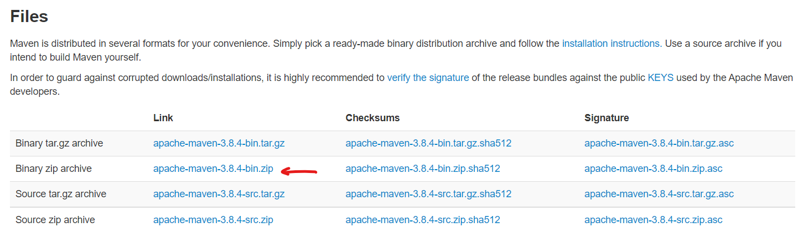
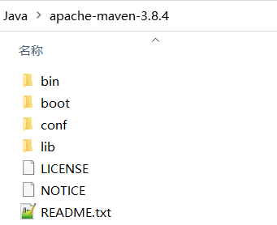
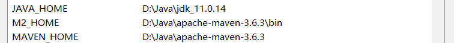
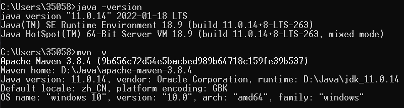
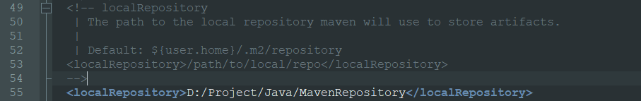
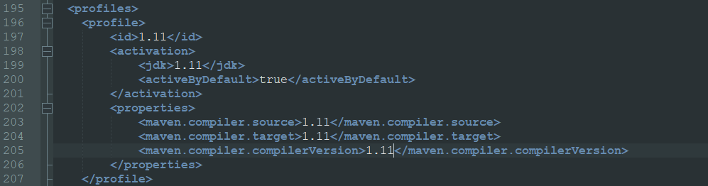
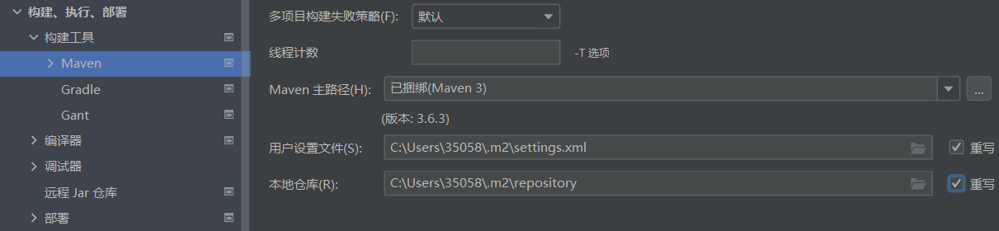
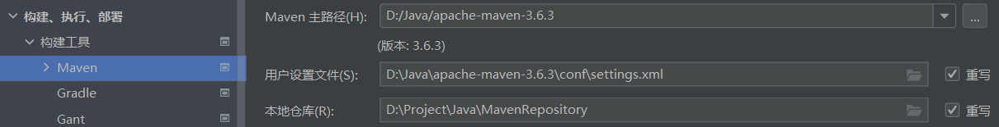
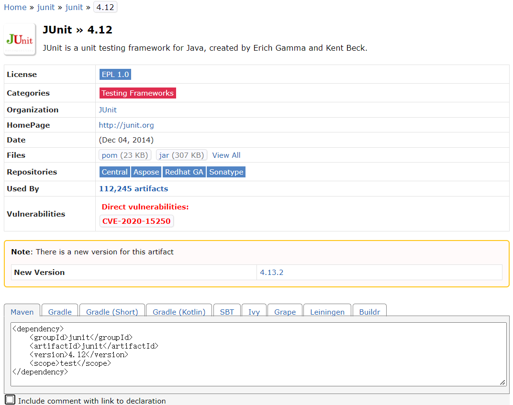

# Mybatis

[toc]

## Portals

[【狂神说Java】 Mybatis](https://www.bilibili.com/video/BV1NE411Q7Nx)

[Maven零基础入门教程 - 尚硅谷](https://www.bilibili.com/video/BV1TW411g7hP)

[Maven基础实战入门](https://www.bilibili.com/video/BV1x5411P7Hh)

# 安装与配置

最好不要下载太高版本的maven否则编译可能不支持（这里使用3.6.3）

[IDEA各版本对Maven版本兼容问题汇总](https://libin9ioak.blog.csdn.net/article/details/117571120)

先确认JAVA_HOME环境变量（安装java jdk的时候对环境变量进行的配置）

去Maven官网下载压缩包即可

[Apache Maven 官网](https://maven.apache.org/)



解压后的目录结构如下
1. bin：maven可执行命令
2. conf：maven工具配置文件



**环境变量配置如下**



**PATH**中配置的环境变量：


在命令行中输入
```
java -version

mvn -v
```



**配置本地仓库**

在conf目录中的setting.xml



以后可以直接放在apache-maven中。

**配置阿里云镜像加速**

[阿里云云效 maven](https://developer.aliyun.com/mvn/guide)

可以查看相关配置指南


```xml
<mirror>
  <id>aliyunmaven</id>
  <mirrorOf>*</mirrorOf>
  <name>阿里云公共仓库</name>
  <url>https://maven.aliyun.com/repository/public</url>
</mirror>
```

**配置jdk版本**



可能需要根据自身jdk版本进行调整

```xml
<profile>
    <id>1.11</id>
    <activation>
        <jdk>1.11</jdk>
        <activeByDefault>true</activeByDefault>
    </activation>
    <properties>
        <maven.compiler.source>1.11</maven.compiler.source>
        <maven.compiler.target>1.11</maven.compiler.target>
        <maven.compiler.compilerVersion>1.11</maven.compiler.compilerVersion>
    </properties>
</profile>
```

开发工具配置Maven插件

IDEA默认内容



修改后内容



[MVN Repository](https://mvnrepository.com/)

可以查看相关依赖，查找相关依赖，选择版本，将配置文件复制到pom.xml中（需要自己写dependencies）

```xml
<!-- https://mvnrepository.com/artifact/junit/junit -->
<dependency>
    <groupId>junit</groupId>
    <artifactId>junit</artifactId>
    <version>4.12</version>
    <scope>test</scope>
</dependency>
```



# Maven

JavaWeb开发中，需要使用大量的jar包需要导入。需要一个方法自动导入和配置。

**Maven项目架构管理工具**

**核心思想：约定大于配置**（有约束，不能违反）

maven规定如何编写java代码，必须按照规范。

