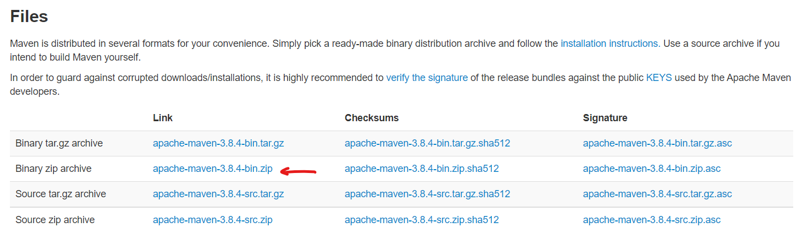
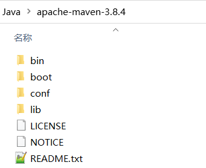
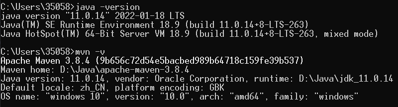

# Mybatis

[toc]

## Portals

[【狂神说Java】 Mybatis](https://www.bilibili.com/video/BV1NE411Q7Nx)

[Maven零基础入门教程 - 尚硅谷](https://www.bilibili.com/video/BV1TW411g7hP)

[Maven基础实战入门](https://www.bilibili.com/video/BV1x5411P7Hh)

# 安装与配置

先确认JAVA_HOME环境变量（安装java jdk的时候对环境变量进行的配置）

去Maven官网下载压缩包即可

[Apache Maven 官网](https://maven.apache.org/)



解压后的目录结构如下
1. bin：maven可执行命令
2. conf：maven工具配置文件



添加bin目录到环境变量中

在命令行中输入
```
java -version

mvn -v
```



也可以创建一个MAVEN_HOME的环境变量。


# Maven零基础入门

自动化构建工具


