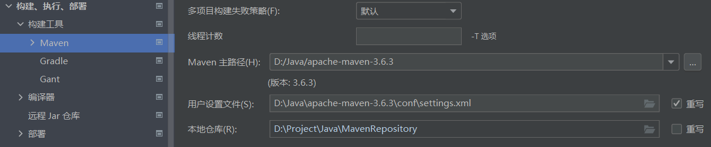
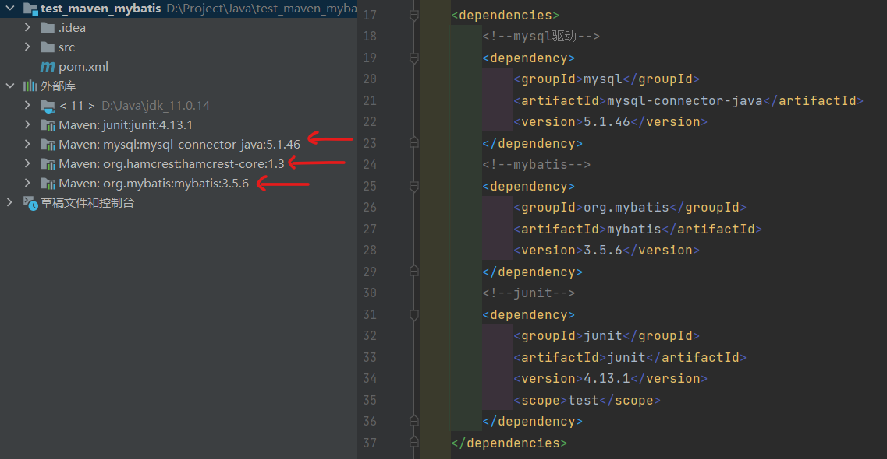
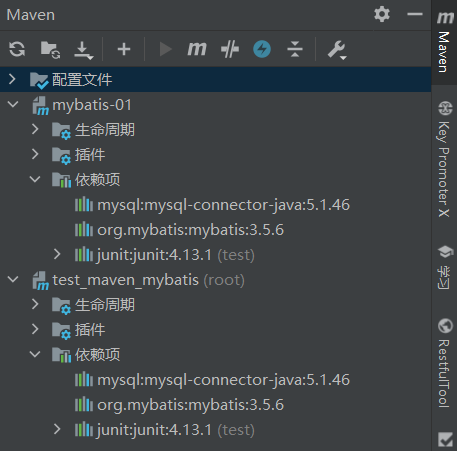
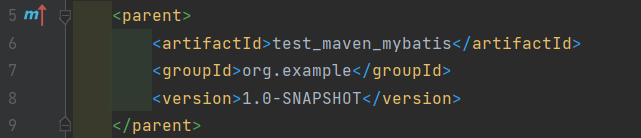
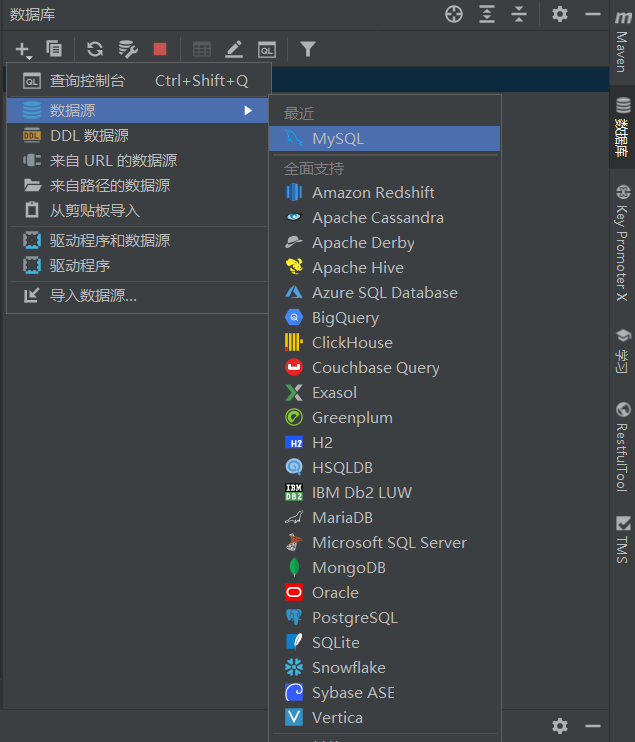
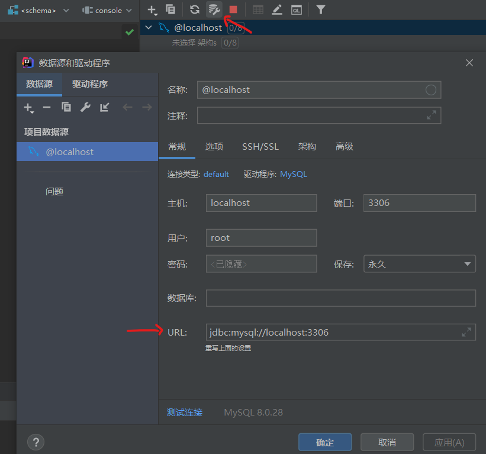

# Mybatis

[toc]

## Portals

[Mybatis 3 官方文档](https://mybatis.org/mybatis-3/)

[Mybatis 3 Github仓库](https://github.com/mybatis/mybatis-3)

[【狂神说Java】 Mybatis](https://www.bilibili.com/video/BV1NE411Q7Nx)

[MVN Repository](https://mvnrepository.com/)

# 安装与配置

[Apache Maven 官网](https://maven.apache.org/)


# 狂神说 Mybatis

1. JDBC
2. MySQL
3. Maven
4. Junit

## 什么是Mybatis

MyBatis 是一款优秀的**持久层框架**，它支持自定义 SQL、存储过程以及高级映射。MyBatis **免除了几乎所有的 JDBC 代码**以及设置参数和获取结果集的工作。MyBatis 可以通过简单的 XML 或注解来配置和映射原始类型、接口和 Java POJO（Plain Old Java Objects，普通老式 Java 对象）为数据库中的记录。

**持久化**

数据持久化（数据库、io文件系统）

内存：断电即失

**持久层**

完成持久化工作的代码块

层界限十分明显

**为什么需要Mybatis**

帮助程序员将数据存入数据库

方便（自动化）

传统的JDBC代码太复杂

解除SQL和程序代码的耦合

提供xml标签，支持编写动态sql

## 第一个Mybatis程序

**①搭建数据库**

```sql
CREATE DATABASE `Mybatis`;
USE `Mybatis`;

CREATE TABLE `user`(
	`id` int NOT NULL PRIMARY KEY,
	`name` varchar(30) DEFAULT NULL,
	`pwd` varchar(30) DEFAULT NULL
)ENGINE=INNODB DEFAULT CHARSET=utf8;


INSERT INTO `user` (`id`,`name`,`pwd`)  VALUES 
(190501, 'lzy', 'lzy190501'),
(190502, 'qyc', 'qyc190502'),
(190505, 'yyr', 'yyr190505');
```

**②新建项目**

记得将maven改为自己的maven而非IntelliJ自己绑定的。可以在新项目设置中进行修改



如果右红色报错可以点击刷新键


导入依赖后如图所示



```xml
<!--导入依赖-->
<dependencies>
	<!--mysql驱动-->
	<dependency>
		<groupId>mysql</groupId>
		<artifactId>mysql-connector-java</artifactId>
		<version>5.1.46</version>
	</dependency>
	<!--mybatis-->
	<dependency>
		<groupId>org.mybatis</groupId>
		<artifactId>mybatis</artifactId>
		<version>3.5.6</version>
	</dependency>
	<!--junit-->
	<dependency>
		<groupId>junit</groupId>
		<artifactId>junit</artifactId>
		<version>4.13.1</version>
		<scope>test</scope>
	</dependency>
</dependencies>
```

**③创建模块**

1. 删除原先项目中自带的src文件夹，自己新创建一个模块，maven项目。（**好处在于这些新创建的子项目，无需一个个导入依赖，父项目有的子项目都有**）

	

	

2. 编写mybatis的核心配置文件，用于连接数据库
   ```xml
   <?xml version="1.0" encoding="UTF-8" ?>
		<!DOCTYPE configuration
				PUBLIC "-//mybatis.org//DTD Config 3.0//EN"
				"http://mybatis.org/dtd/mybatis-3-config.dtd">

		<!--核心配置文件-->
		<configuration>
			<environments default="development">
				<environment id="development">
					<transactionManager type="JDBC"/>
		<!--            事务管理  参数自己进行修改 -->
					<dataSource type="POOLED">
						<property name="driver" value="${driver}"/>
						<property name="url" value="${url}"/>
						<property name="username" value="${username}"/>
						<property name="password" value="${password}"/>
					</dataSource>
				</environment>
			</environments>
		<!--    <mappers>-->
		<!--        <mapper resource="org/mybatis/example/BlogMapper.xml"/>-->
		<!--    </mappers>-->
		</configuration>
   ```

3. 编写mybatis工具类

可以使用intellij连接数据库



可以查看相关URL




