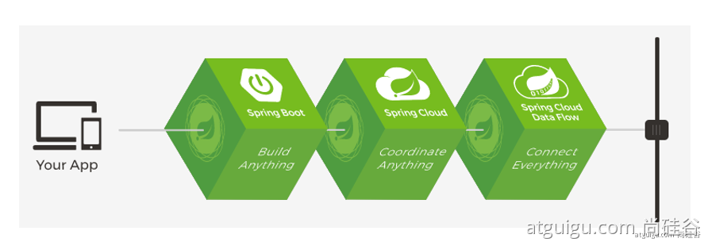
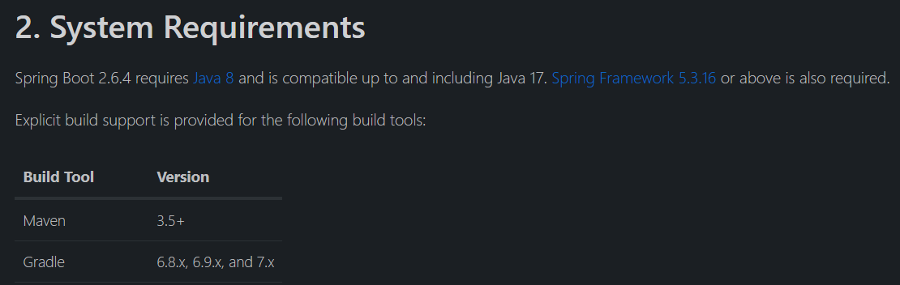
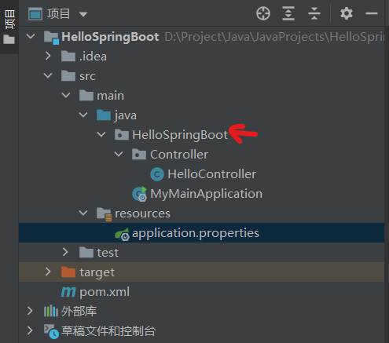
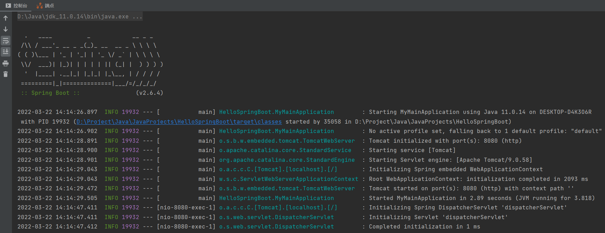
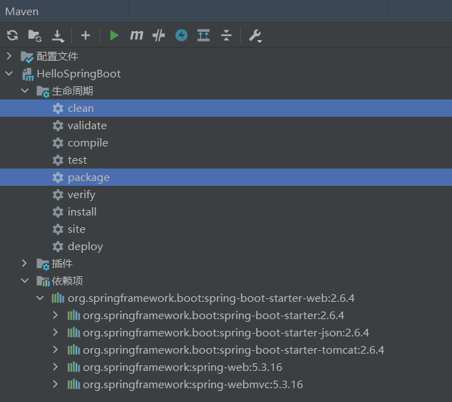
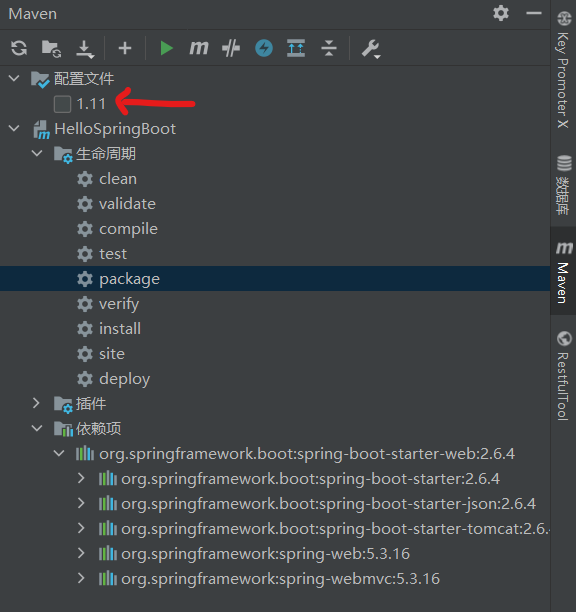
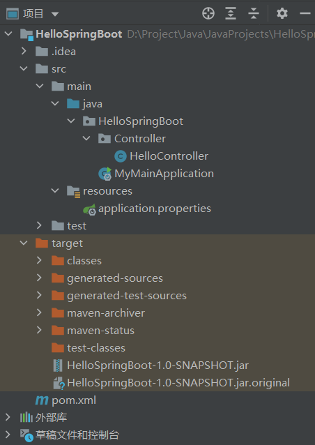
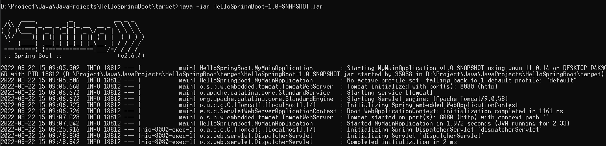
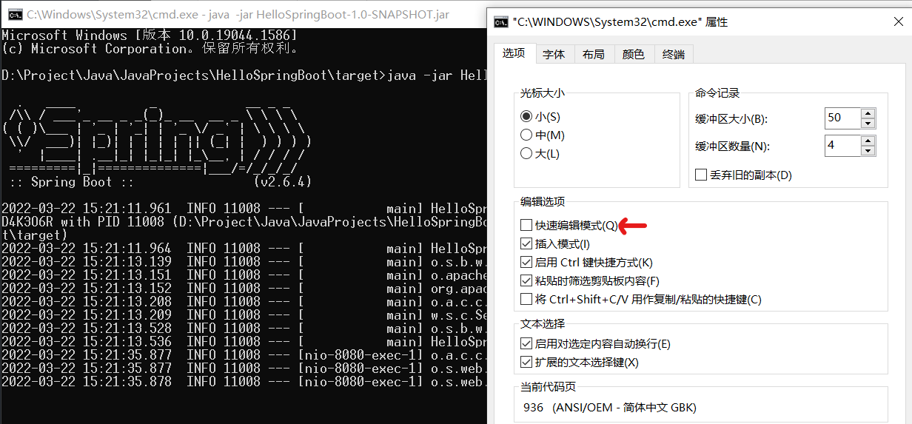

# SpringBoot

[toc]

## Portals

[SpringBoot Reference Documentation](https://docs.spring.io/spring-boot/docs/2.6.4/reference/htmlsingle/)

[SpringBoot 官方API文档](https://docs.spring.io/spring-boot/docs/current/api/)

[狂神说 SpringBoot](https://www.bilibili.com/video/BV1PE411i7CV)

[尚硅谷 SpringBoot2](https://www.bilibili.com/video/BV19K4y1L7MT)

UNKNOWN

# 尚硅谷 SpringBoot2

## SpringBoot2核心技术

### 基础入门

#### Spring生态圈


**Spring生态圈**
1. 微服务开发 microservices
2. 响应式开发 Reactive
3. Web开发
4. 批处理
5. ......

SpringBoot简化Spring配置繁杂的问题。

SpringBoot高层框架，底层是Spring，可用于整合技术栈。

SpringBoot整合Spring生态圈的一站式框架。

**两套技术路线**

左边为响应式开发，右边为传统Servlet。


异步数据流进行响应式开发。

Java8新特性，接口的默认实现，无需适配器。

**SpringBoot优点**
1. 快速创建生产级别的Spring应用
2. 创建独立的Spring应用
3. 内嵌web服务器
4. 自动starter依赖，简化构建配置
5. 自动配置Spring以及第三方功能
6. 无代码生成、无需编写XML
7. 提供生产级别的监控
   
**SpringBoot缺点**
1. 迭代太快、需要时刻关注变化
2. 封装太深、内部原理辅助、不容易精通

#### 时代背景

**微服务**
1. 是一种架构风格
2. 一个应用拆分为一组小型服务
3. 每个服务运行在自己的进程内（可以独立部署和升级）
4. 服务之间使用==轻量级HTTP交互==
5. 服务围绕业务功能拆分
6. 可以由全自动部署机制独立部署
7. 去中心化，服务自治。**服务可以使用不同的语言、不同的存储技术**（百家争鸣）

**分布式**
1. 远程调用（http）
2. 服务发现
3. 负载均衡
4. 服务容错（调用失败）
5. 配置管理（配置中心，服务自动获取配置）
6. 服务监控
7. 链路追踪（查找问题源头）
8. 日志管理
9. 任务调度

**分布式解决**
SpringBoot+SpringCloud



**云原生**

部署和应用，cloud native

1. 服务自愈
2. 弹性伸缩（流量高峰期）
3. 服务隔离（服务器中某一个服务失效后不影响其他服务）
4. 自动化部署
5. 灰度发布（新版本逐步替换旧版本）
6. 流量治理（性能不高的服务器减少服务量）

#### SpringBoot Helloworld

**系统要求**



查看版本
```bash
java -version
mvn -v
tomcat需要到安装目录的bin中的version.bat查看
```

maven配置（详见LearnMaven文件夹，就是阿里云镜像配置和jdk配置）

**实操**

需求浏览器发送 "hello" 请求，响应 "hello,spring boot 2" (web开发)

仍然使用IDEA的Maven项目

pom.xml，额外多一个父工程
```xml
    <parent>
        <groupId>org.springframework.boot</groupId>
        <artifactId>spring-boot-starter-parent</artifactId>
        <version>2.6.4</version>
    </parent>
```

添加依赖
```xml
<dependencies>
    <dependency>
        <groupId>org.springframework.boot</groupId>
        <artifactId>spring-boot-starter-web</artifactId>
    </dependency>
</dependencies>
```

**代码部分**

似乎一定要创建一个软件包，否则会报错



MyMainApplication.java **主程序算是固定写法**
```java
package HelloSpringBoot;

import org.springframework.boot.SpringApplication;
import org.springframework.boot.autoconfigure.SpringBootApplication;

/**
 * 主程序类
 * 标注注解@SpringBootApplication
 * 告诉SpringBoot，这是一个SpringBoot应用
 */
@SpringBootApplication
public class MyMainApplication
{
    public static void main(String[] args)
    {
        SpringApplication.run(MyMainApplication.class, args);
    }
}
```

HelloController.java
```java
package HelloSpringBoot.Controller;

import org.springframework.web.bind.annotation.RequestMapping;
import org.springframework.web.bind.annotation.RestController;

//@Controller
//@ResponseBody//类的每一个方法都是返回给浏览器
@RestController//可以用于替代上面两个注解
public class HelloController
{

    @RequestMapping("/hello")//映射请求
    public String handle01()
    {
        return "hello springboot2";
    }
}
```
运行主程序类的main，看着他输出


浏览器中查看结果


**配置文件**

整合所有内容的总框架，将所有配置综合到了一个配置文件中（==application.properties==）（在resources文件夹里添加）

Tomcat、SpringMVC的设置等等

所有的配置都可以在其中（eg:server.port 服务器配置）

简化部署：可以将运行环境和程序打包为jar包，无需先转为war包。

```java
<build>
    <plugins>
        <plugin>
            <groupId>org.springframework.boot</groupId>
            <artifactId>spring-boot-maven-plugin</artifactId>
            <version>2.6.4</version>
        </plugin>
    </plugins>
</build>
```

==最好写上version==，否则IDEA可能会报错*找不到插件 'org.springframework.boot:spring-boot-maven-plugin:'*



clean可以清除target中的内容，package则用于打包。

package时出现问题

*Failed to execute goal org.apache.maven.plugins:maven-compiler-plugin:3.8.1:compile (default-compile) on project HelloSpringBoot: Fatal error compiling*



UNKNOWN:似乎需要取消勾选配置文件才行。





==problem== :在命令行运行jar包（SOLVED:需要多摁一次ctrl+C才能正常访问/hello）
==solution==:**关闭快速编辑模式**（实际上：倒数三行是访问后才会出现的）



**测试仅需运行main方法**

**简化配置application.properties**

**简化部署，使用插件即可打包**

### 核心功能

#### 配置文件

#### web开发

#### 数据访问

#### JUnit5单元测试

#### Actutor生产指标监控

#### SpringBoot核心原理解析

### 场景整合

#### 虚拟化技术

#### 安全控制

#### 缓存技术

#### 消息中间件

#### 分布式入门

## SpringBoot2响应式编程

### 响应式编程基础

### Webflux开发web应用

### 响应式访问持久化层

### 响应式安全开发

### 响应式原理


