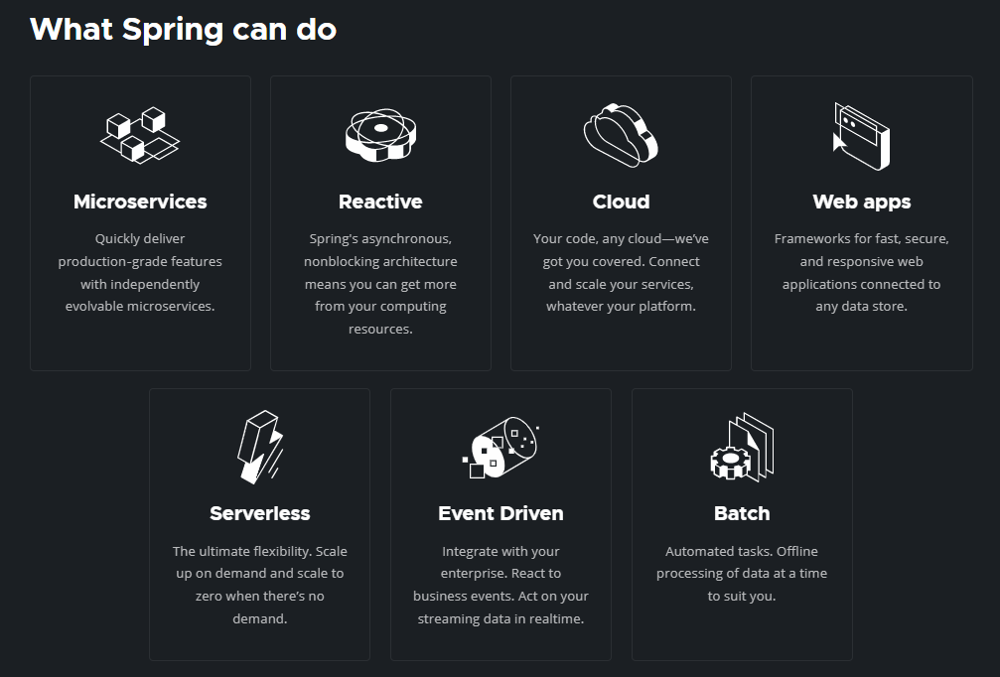

# SpringBoot

[toc]

## Portals

[狂神说 SpringBoot](https://www.bilibili.com/video/BV1PE411i7CV)

[尚硅谷 SpringBoot2](https://www.bilibili.com/video/BV19K4y1L7MT)

# 尚硅谷 SpringBoot2

## SpringBoot2核心技术

### 基础入门

#### Spring生态圈

**Spring生态圈**
1. 微服务开发 microservices
2. 响应式开发 Reactive
3. Web开发
4. 批处理
5. ......

SpringBoot简化Spring配置繁杂的问题。

SpringBoot高层框架，底层是Spring，可用于整合技术栈。

SpringBoot整合Spring生态圈的一站式框架。

**两套技术路线**

左边为响应式开发，右边为传统Servlet。

异步数据流进行响应式开发。

Java8新特性，接口的默认实现，无需适配器。

**SpringBoot优点**
1. 快速创建生产级别的Spring应用
2. 创建独立的Spring应用
3. 内嵌web服务器
4. 自动starter依赖，简化构建配置
5. 自动配置Spring以及第三方功能
6. 无代码生成、无需编写XML
7. 提供生产级别的监控
   
**SpringBoot缺点**
1. 迭代太快、需要时刻关注变化
2. 封装太深、内部原理辅助、不容易精通

#### 时代背景

微服务

### 核心功能

#### 配置文件

#### web开发

#### 数据访问

#### JUnit5单元测试

#### Actutor生产指标监控

#### SpringBoot核心原理解析

### 场景整合

#### 虚拟化技术

#### 安全控制

#### 缓存技术

#### 消息中间件

#### 分布式入门

## SpringBoot2响应式编程

### 响应式编程基础

### Webflux开发web应用

### 响应式访问持久化层

### 响应式安全开发

### 响应式原理

