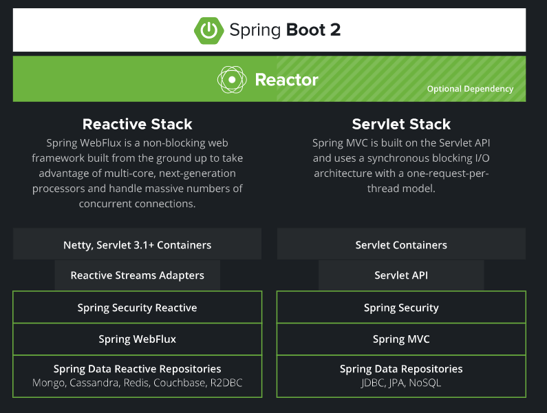
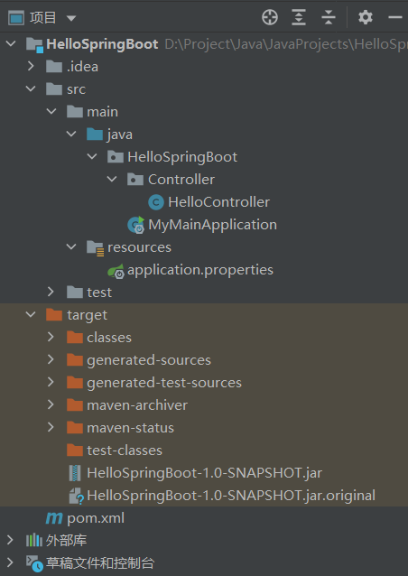

# SpringBoot

[toc]

## Portals

[SpringBoot Reference Documentation](https://docs.spring.io/spring-boot/docs/2.6.4/reference/htmlsingle/)

[SpringBoot 官方API文档](https://docs.spring.io/spring-boot/docs/current/api/)

[狂神说 SpringBoot](https://www.bilibili.com/video/BV1PE411i7CV)

[尚硅谷 SpringBoot2](https://www.bilibili.com/video/BV19K4y1L7MT)

UNKNOWN

# 尚硅谷 SpringBoot2

## SpringBoot2核心技术

### 基础入门

#### Spring生态圈


**Spring生态圈**
1. 微服务开发 microservices
2. 响应式开发 Reactive
3. Web开发
4. 批处理
5. ......

SpringBoot简化Spring配置繁杂的问题。

SpringBoot高层框架，底层是Spring，可用于整合技术栈。

SpringBoot整合Spring生态圈的一站式框架。

**两套技术路线**

左边为响应式开发，右边为传统Servlet。



异步数据流进行响应式开发。

Java8新特性，接口的默认实现，无需适配器。

**SpringBoot优点**
1. 快速创建生产级别的Spring应用
2. 创建独立的Spring应用
3. 内嵌web服务器
4. 自动starter依赖，简化构建配置
5. 自动配置Spring以及第三方功能
6. 无代码生成、无需编写XML
7. 提供生产级别的监控
   
**SpringBoot缺点**
1. 迭代太快、需要时刻关注变化
2. 封装太深、内部原理辅助、不容易精通

#### 时代背景

**微服务**
1. 是一种架构风格
2. 一个应用拆分为一组小型服务
3. 每个服务运行在自己的进程内（可以独立部署和升级）
4. 服务之间使用==轻量级HTTP交互==
5. 服务围绕业务功能拆分
6. 可以由全自动部署机制独立部署
7. 去中心化，服务自治。**服务可以使用不同的语言、不同的存储技术**（百家争鸣）

**分布式**
1. 远程调用（http）
2. 服务发现
3. 负载均衡
4. 服务容错（调用失败）
5. 配置管理（配置中心，服务自动获取配置）
6. 服务监控
7. 链路追踪（查找问题源头）
8. 日志管理
9. 任务调度

**分布式解决**
SpringBoot+SpringCloud


**云原生**

部署和应用，cloud native

1. 服务自愈
2. 弹性伸缩（流量高峰期）
3. 服务隔离（服务器中某一个服务失效后不影响其他服务）
4. 自动化部署
5. 灰度发布（新版本逐步替换旧版本）
6. 流量治理（性能不高的服务器减少服务量）

#### SpringBoot Helloworld

**系统要求**


查看版本
```bash
java -version
mvn -v
tomcat需要到安装目录的bin中的version.bat查看
```

maven配置（详见LearnMaven文件夹，就是阿里云镜像配置和jdk配置）

**实操**

需求浏览器发送 "hello" 请求，响应 "hello,spring boot 2" (web开发)

仍然使用IDEA的Maven项目

pom.xml，额外多一个父工程
```xml
    <parent>
        <groupId>org.springframework.boot</groupId>
        <artifactId>spring-boot-starter-parent</artifactId>
        <version>2.6.4</version>
    </parent>
```

添加依赖
```xml
<dependencies>
    <dependency>
        <groupId>org.springframework.boot</groupId>
        <artifactId>spring-boot-starter-web</artifactId>
    </dependency>
</dependencies>
```

文件下载位置


全部的依赖


**代码部分**

似乎一定要创建一个软件包，否则会报错


MyMainApplication.java **主程序算是固定写法**
```java
package HelloSpringBoot;

import org.springframework.boot.SpringApplication;
import org.springframework.boot.autoconfigure.SpringBootApplication;

/**
 * 主程序类
 * 标注注解@SpringBootApplication
 * 告诉SpringBoot，这是一个SpringBoot应用
 */
@SpringBootApplication
public class MyMainApplication
{
    public static void main(String[] args)
    {
        SpringApplication.run(MyMainApplication.class, args);
    }
}
```

HelloController.java
```java
package HelloSpringBoot.Controller;

import org.springframework.web.bind.annotation.RequestMapping;
import org.springframework.web.bind.annotation.RestController;

//@Controller
//@ResponseBody//类的每一个方法都是返回给浏览器
@RestController//可以用于替代上面两个注解
public class HelloController
{

    @RequestMapping("/hello")//映射请求
    public String handle01()
    {
        return "hello springboot2";
    }
}
```
运行主程序类的main，看着他输出


浏览器中查看结果


**配置文件**

整合所有内容的总框架，将所有配置综合到了一个配置文件中（==application.properties==）（在resources文件夹里添加）

Tomcat、SpringMVC的设置等等

所有的配置都可以在其中（eg:server.port 服务器配置）

简化部署：可以将运行环境和程序打包为jar包，无需先转为war包。

```java
<build>
    <plugins>
        <plugin>
            <groupId>org.springframework.boot</groupId>
            <artifactId>spring-boot-maven-plugin</artifactId>
            <version>2.6.4</version>
        </plugin>
    </plugins>
</build>
```

==最好写上version==，否则IDEA可能会报错*找不到插件 'org.springframework.boot:spring-boot-maven-plugin:'*


clean可以清除target中的内容，package则用于打包。

package时出现问题

*Failed to execute goal org.apache.maven.plugins:maven-compiler-plugin:3.8.1:compile (default-compile) on project HelloSpringBoot: Fatal error compiling*


UNKNOWN:似乎需要取消勾选配置文件才行。




==problem== :在命令行运行jar包（SOLVED:需要多摁一次ctrl+C才能正常访问/hello）
==solution==:**关闭快速编辑模式**（实际上：倒数三行是访问后才会出现的）


**流程总结：**
1. 创建maven项目
2. 引入依赖
3. 编写主程序引导SpringBoot（MainApplication）固定写法
4. 编写业务逻辑（无需过多配置）
5. 测试仅需运行main方法
6. 简化配置，编写application.properties
7. 简化部署，使用插件即可打包无需安装其他环境。将项目打成jar包，直接在目标服务器运行即可。


#### SpringBoot2依赖管理机制

**自动版本仲裁**

导入一个\<parent\>父项，一个starter-web \<dependency\>。其他导包问题无需关心。

父项进行依赖管理，子项只需继承即可。

*按住CTRL+鼠标左键，点击artifactId即可查看相关依赖*

两层父项目


spring-boot-dependencies-2.6.4.pom文件中声明了很多常用的jar包的依赖（控制了，一般就是当前springboot支持的版本）。里面写明了版本号，所以子项中添加依赖dependency可以不用写版本号。**自动版本仲裁**

如果开发中，需要使用其他版本的依赖，需要在pom.xml写一个properties，里面写明依赖的版本（即先查看spring-boot-dependencies底层规定版本，如果要修改则在当前项目重写配置）。（利用**maven的就近优先原则**）

```xml
<properties>
    <mysql.version>5.1.43</mysql.version>
</properties>
```

如果引入的jar包不在声明的范围内，无法进行版本仲裁，需要自己写版本号。


**Starter 场景启动器**

[Spring 官方Starters说明](https://docs.spring.io/spring-boot/docs/2.6.4/reference/htmlsingle/#using.build-systems.starters)

Starters are a set of convenient dependency descriptors(描述符) that you can include in your application.

引入一个starter就把一个完整的开发场景引入，包括所有的依赖。

All official starters follow a similar naming pattern; ==spring-boot-starter-*==, where * is a particular type of application. 

要引入starter，这个场景的所有常规需要的依赖我们都自动引入。**maven的依赖传递原则**。

也有第三方场景，可以自己创建

a third-party starter project called thirdpartyproject would typically be named thirdpartyproject-spring-boot-starter


**全部的依赖**


其中最基本的就是spring-boot-starter，每一个其他场景都依赖它\<dependency\>（核心依赖）


#### SpringBoot2自动配置机制

自动配置Tomcat
1. 引入Tomcat依赖（starter中引入）
2. 配置Tomcat

自动配置SpringMVC
1. 引入SpringMVC全套组件（starter-web中引入）
2. 配置SpringMVC常用组件、功能

配置好Web常用功能
1. DispatcherServlet
2. 字符编码拦截器(characterEncodingFilter，解决中文乱码问题)
3. viewResolver(视图解析器)）
4. 。。。。。

配置默认包结构
1. **主程序所在的包及其下面所有的子包里面的组件都会被默认扫描**
2. 无需自己配置包扫描
3. 若想改变包扫描：@SpringBootApplication(scanBasePackages="[package]")
   1. 如果重新指定记得Controller需要放在[package]中，不能并列
      
      图中Controller文件夹和MyMainApplication文件是并列的，指定[package]时，最多写到Controller文件夹，如果写其子文件夹则无法扫描到。
   2. @SpringBootApplication相当于一个合成注解，可以将其展开为其他注解，并修改ComponentScan即可。**SpringBootApplication默认扫描到主程序所在的包**
      ```java
      @SpringBootConfiguration
      @EnableAutoConfiguration
      @ComponentScan([可以进行修改])
      ```

各种配置拥有默认值
1. 默认配置最终都是**映射到某个类上**
2. 配置文件的值最终会**绑定每个类上**，这个类会在容器中创建对象
3. 在application.properties中进行配置
   

按需加载所有的自动配置项
1. 非常多的场景（starter），不会将所有场景都引入
2. 引入了哪些场景这个场景的自动配置才会开启
3. SpringBoot所有的自动配置功能都在 spring-boot-autoconfigure 包里面（**==自动配置也是按需加载==**）
   1. spring-boot-starter-web依赖spring-boot-starter
   2. spring-boot-starter中包含了spring-boot-autoconfigure（自动配置不一定全部生效，导入相应的场景才会生效）
      


P08


### 核心功能

#### 配置文件

#### web开发

#### 数据访问

#### JUnit5单元测试

#### Actutor生产指标监控

#### SpringBoot核心原理解析

### 场景整合

#### 虚拟化技术

#### 安全控制

#### 缓存技术

#### 消息中间件

#### 分布式入门

## SpringBoot2响应式编程

### 响应式编程基础

### Webflux开发web应用

### 响应式访问持久化层

### 响应式安全开发

### 响应式原理


