# Java Web

[toc]

## Portals

[狂神说 JavaWeb](https://www.bilibili.com/video/BV12J411M7Sj)


# 狂神说 JavaWeb

## 背景知识

**web开发**
1. 静态web：html，css。提供给所有人看的数据始终不会变换。
2. 动态web：几乎所有的网站。提供给人看的数据是在会发生变化。
   1. 技术栈：Servlet/JSP,ASP,php

**web应用程序**
可以提供浏览器访问的程序
URL：统一资源定位器
组成
1. html css js
2. jsp servlet
3. java程序
4. jar包
5. 配置文件

**静态web**
服务器（进行响应response）、客户端（发送请求request）

服务器包含WebService

缺点：
1. web页面无法动态更新
2. 所有用户看到的都是同一个页面（伪动态、轮播图）
3. 无法和数据库交互（无法持久化）

**动态web**
WebService处理动态和静态的资源

缺点：
1. 动态web资源出错，则需要重写后台程序，重新发布
2. 停机维护
优点：
1. 可以动态更新
2. 可以与数据库交互
3. JDBC

## Web服务器

**技术**
ASP（微软）
JSP（Sun公司、B/S架构（浏览器、服务器）、承载高并发）
PHP（代码简单、跨平台、无法承担大访问量）

**服务器**
被动操作，处理用户一些响应信息

Tomcat

## Tomcat

[Tomcat官网](https://tomcat.apache.org/)

下载&解压

启动&配置

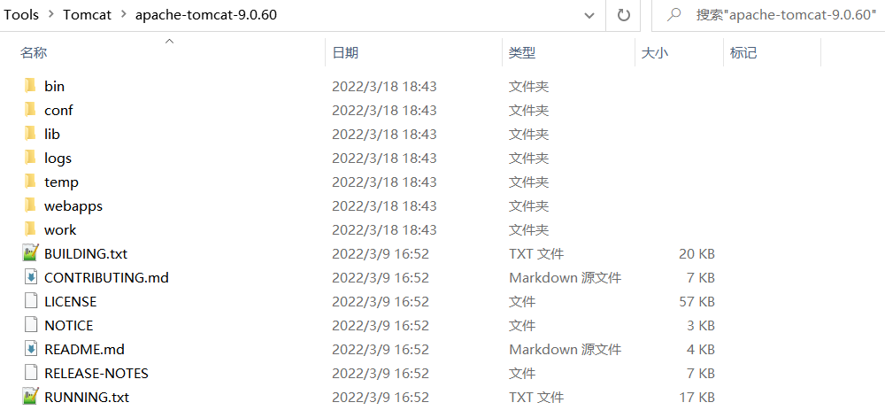

目录解读
1. bin：启动关闭的脚本文件
2. conf：配置
3. lib：依赖的jar包
4. logs：日志
5. webapps：存放网站

启动Tomcat

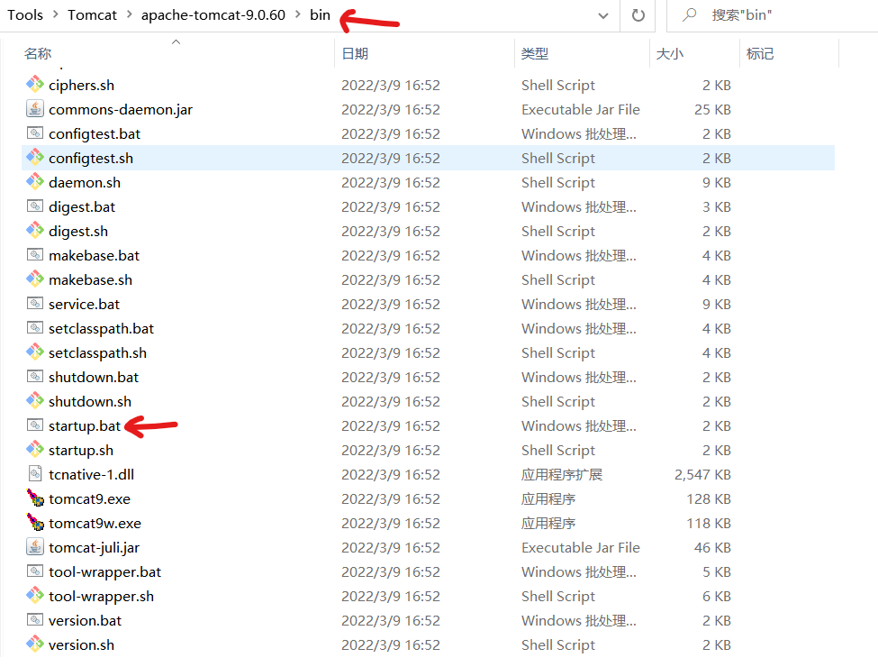

在浏览器中输入： **http://localhost:8080**

后台关闭则无法访问

中文乱码问题

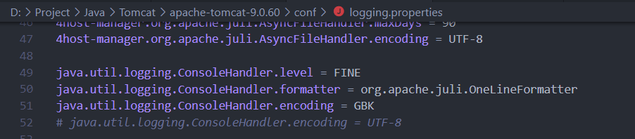

**server.xml解读**

核心配置文件

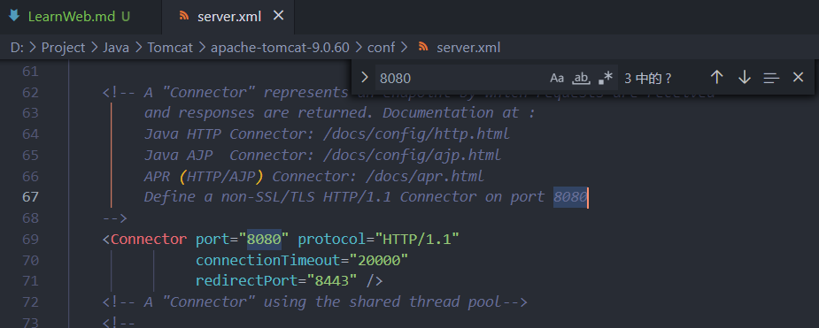

可以修改端口号，浏览器访问时做相应修改即可

也可以修改域名，但是需要自己在host文件添加信息（涉及到域名解析：先找本地再找dns）

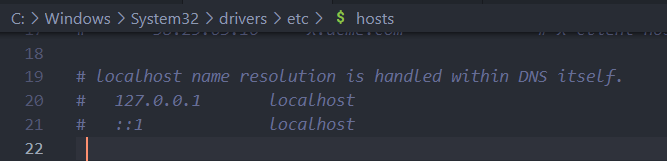

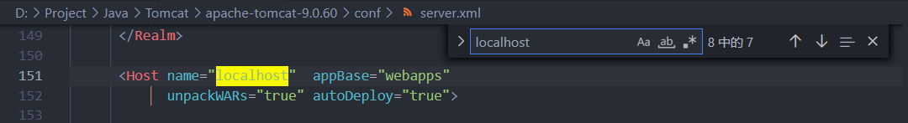

默认主机名为：localhost -> 127.0.0.1
默认网站存放位置为webapps

默认打开index.html（首页）

将网站放在服务器指定的web应用的文件夹下，就可以访问

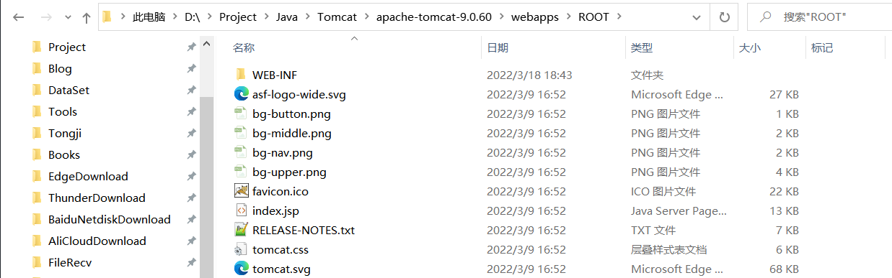

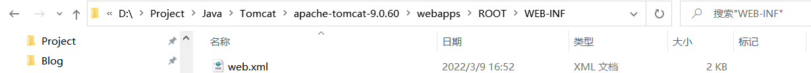

```
-webapps:Tomcat服务器的web目录
    -ROOT:
        -WEB-INF:
            -classes:java程序
            -lib:web应用所依赖的jar包
            -web.xml:网站配置文件
        -index.html:默认的首页
```

一些默认端口号：
1. tomcat：8080
2. mysql：3306
3. http：80
4. https：443

补充知识 网站访问：
1. 输入域名
2. 检查本地的hosts配置文件有无域名映射
   1. 如果有，直接返回对应ip，访问web程序
   2. 如果没有，访问DNS服务器寻找


## Http&Https

**Http**

超文本传输协议 Hyper Text Transfer Protocol。

通常运行在TCP上。简单的请求-响应协议。

默认端口：80


**Https**

超文本传输安全协议 Hyper Text Transfer Protocol over SecureSocket Layer。

HTTPS 在HTTP 的基础下加入SSL，HTTPS 的安全基础是 SSL，因此加密的详细内容就需要 SSL。

HTTPS 存在不同于 HTTP 的默认端口及一个加密/身份验证层（在 HTTP与 TCP 之间）。这个系统提供了身份验证与加密通讯方法。

默认端口：443

**两个时代**

1. http1.0：客户端和web服务器连接后，只能获得一个web资源，断开连接
2. http1.1：客户端和web服务器连接后，只能获得多个web资源（减少请求量）


**Http请求 request**
客户端向服务器发送请求

General:
1. Request URL:请求地址
2. Request Method：请求方法（get、post）
3. Status Code：状态码（200 OK）
4. Remote Address：远程地址（地址+端口）
5. Referrer Policy：

**请求行**
请求方式：get、post、head、delete、put
1. get：一次请求能够携带的参数较少，大小有限，会在浏览器的URL地址栏显示数据内容，不安全，高效
2. post：请求能够携带的参数没有限制，大小没有限制，安全

**消息头**
1. Accept：告诉浏览器支持的数据类型
2. Accept-Encoding：支持的编码格式
3. Accept-Language:语言环境
4. Cache-Control：缓存控制
5. Connection：告诉浏览器请求完成是断开还是保持连接

**Http响应**
服务器返回给客户端响应

Responce Headers:
1. Cache-Control:缓存控制
2. Connection:连接 Keep-Alive（保持 http1.1）
3. Content-Encoding:编码
4. Set-Cookie:
5. Content-Type:类型

**响应体**
1. Accept：告诉浏览器支持的数据类型
2. Accept-Encoding：支持的编码格式
3. Accept-Language:语言环境
4. Cache-Control：缓存控制
5. Connection：告诉浏览器请求完成是断开还是保持连接
6. HOST：主机
7. Refresh：告诉客户端多久刷新一次
8. Location：让网页重新定位

**响应状态码**
200：成功
3xx：请求重定向（输入一个不存在的html重定向到error.html）
404：资源不存在404 -- 403(禁止访问)
5xx：服务器代码错误500 -- 502(网关错误)


## Maven

JavaWeb开发中，需要使用大量的jar包需要导入。需要一个方法自动导入和配置。

**Maven项目架构管理工具**

**核心思想：约定大于配置**（有约束，不能违反）

maven规定如何编写java代码，必须按照规范。

### Maven安装与配置

详见LearnMaven文件夹

### IDEA中使用Maven

#### 使用IDEA中的原型创建

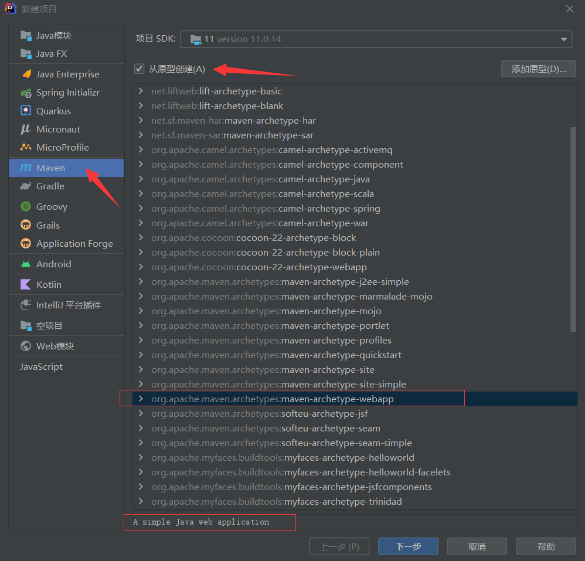

勾选从原型创建可以选择一些模板

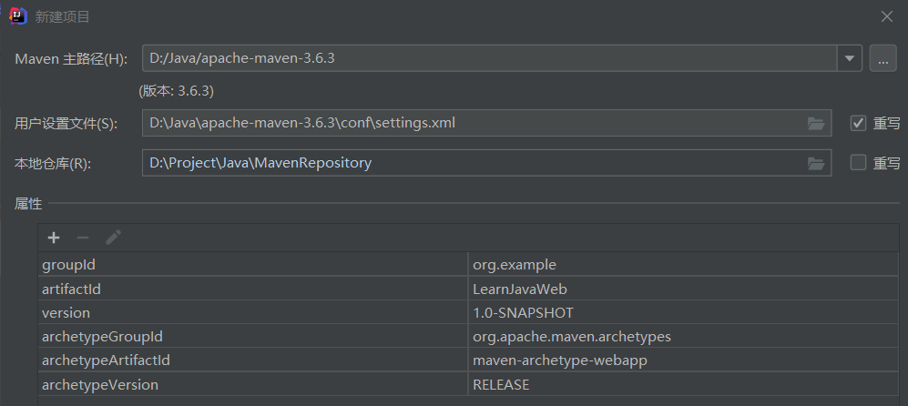

如果是初次构建，IDEA会下载很多文件

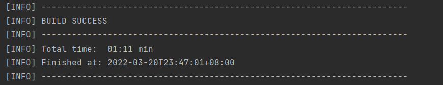

出现上图说明构建成功，可能还是会有报错，可以尝试修改版本号进行解决。（记得检查IDEA中Maven的配置，可能会自动改为IDEA默认的）

#### 不使用原型创建

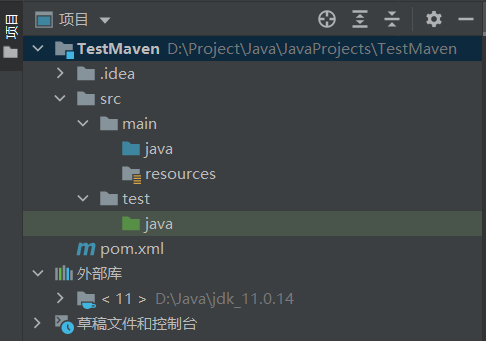

目录结构说明：
1. src
   1. main
      1. java：放置java源代码
      2. resources：放置配置文件
   2. test
      1. java：测试使用


标记文件夹
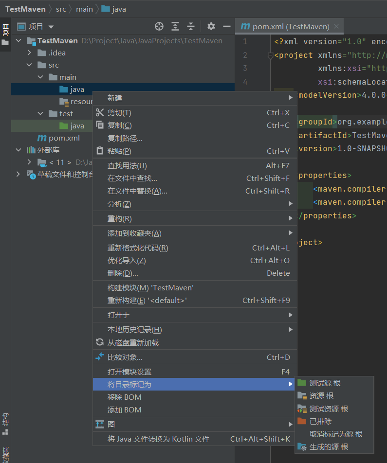


### IDEA中配置Tomcat

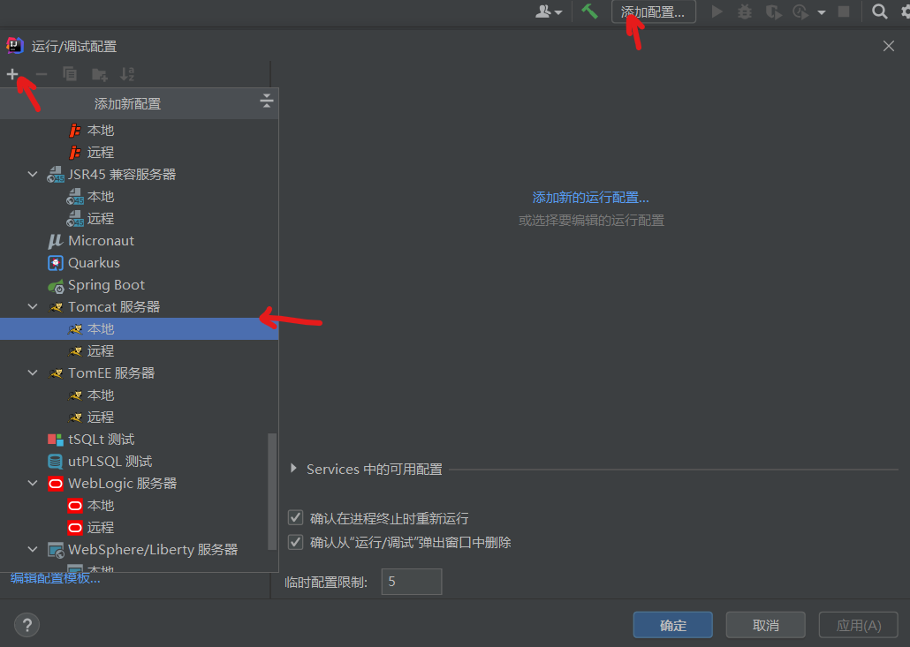

可以修改名称、可能需要配置应用程序服务器（这些端口可能会冲突，后期可能需要修改）。可以配置Tomcat端口、JRE版本、JMX端口（1099可能用不了，需要配置其他端口）。浏览器也可以配置。

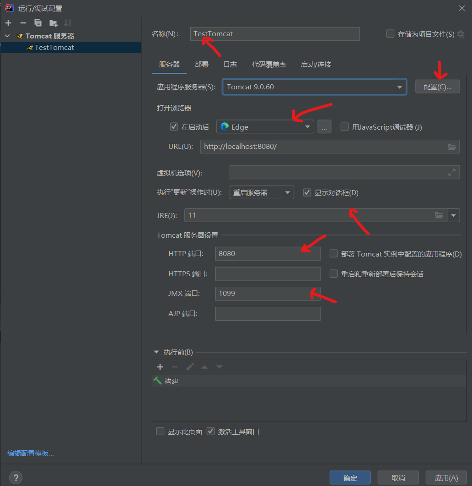


**端口占用问题**
```
# 输入命令查看端口占用
netstat -ano | findstr 8080
# 杀死占用端口的进程
taskkill -PID 3200 -F
```

**配置工件**

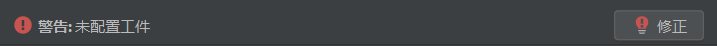

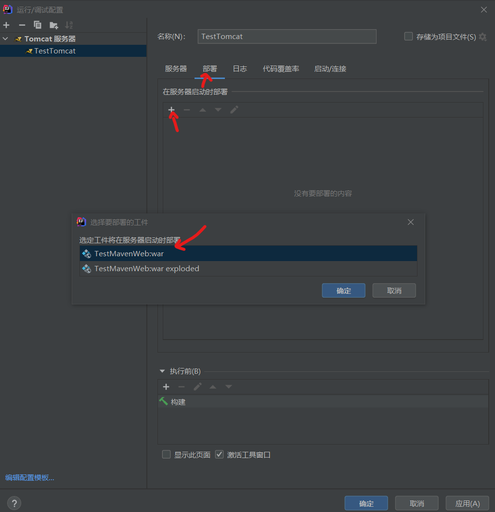

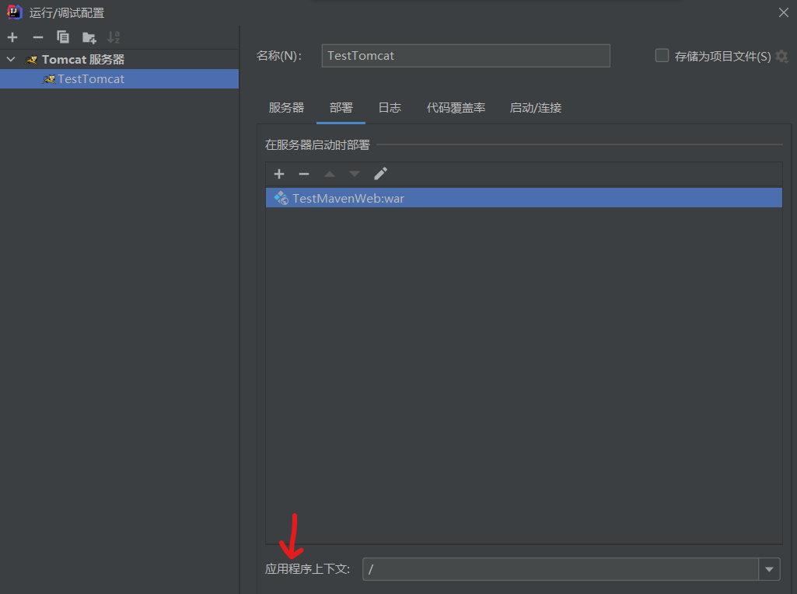

应用程序上下文可写可不写

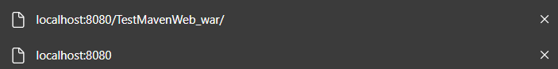

不写：默认访问路径为localhost:8080
写了：默认访问路径要加上后缀（如上图所示）
这个过程为**虚拟路径映射**

配置完成后，点击运行，输出红色的问题不大（有很多提示信息）

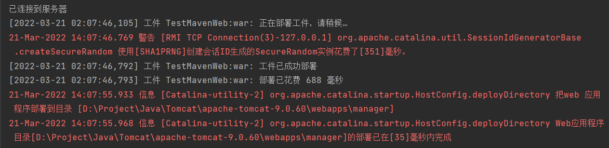

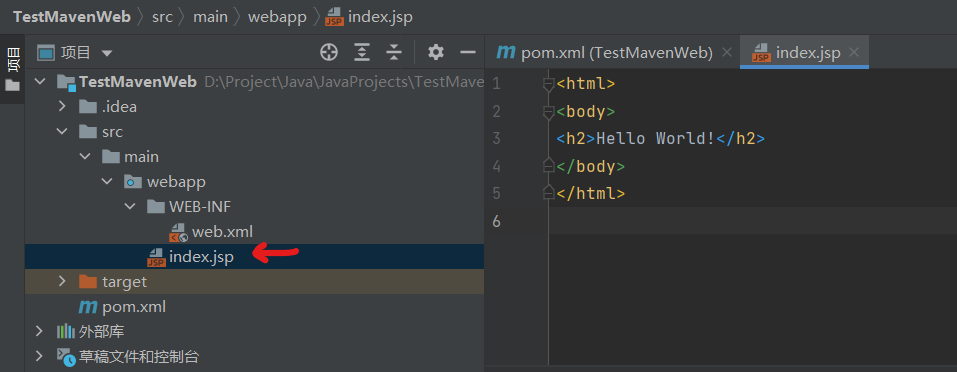

会访问webapps下的index.jsp(由于没有其他的相关组件所以需要虚拟路径映射)

**IDEA侧边栏**

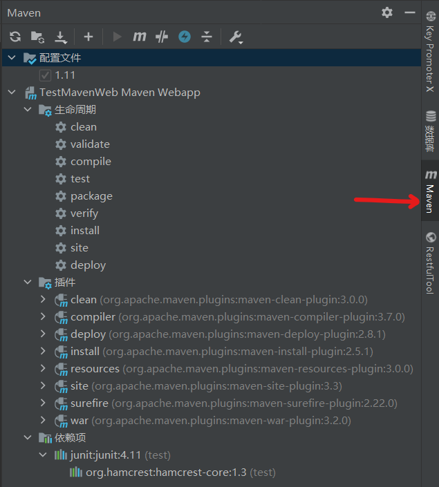

声明周期中存放的其实是一些命令行文件

插件和命令行功能类似

依赖项中存放的是jar包

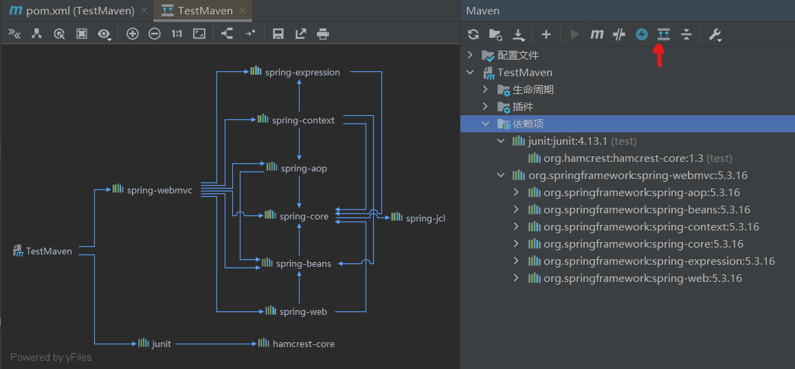

**pom.xml**

是maven的核心配置文件

```xml
<?xml version="1.0" encoding="UTF-8"?>

<!-- maven版本和头文件 -->

<project xmlns="http://maven.apache.org/POM/4.0.0" xmlns:xsi="http://www.w3.org/2001/XMLSchema-instance"
  xsi:schemaLocation="http://maven.apache.org/POM/4.0.0 http://maven.apache.org/xsd/maven-4.0.0.xsd">
  <modelVersion>4.0.0</modelVersion>

  <!-- 配置的GAV -->
  <groupId>org.example</groupId>
  <artifactId>TestMavenWeb</artifactId>
  <version>1.0-SNAPSHOT</version>
  <!-- 
      项目的打包方式
      jar：java应用
      war：web应用
  -->
  <packaging>war</packaging>

  <name>TestMavenWeb Maven Webapp</name>
  <!-- FIXME change it to the project's website -->
  <url>http://www.example.com</url>

  <!-- 项目配置 -->
  <properties>...</properties>
  <!-- 项目依赖：具体依赖的jar包配置文件 -->
  <dependencies>...</dependencies>
  <!-- 项目构建使用内容 -->
  <build>...</build>
</project>
```

maven会帮助导入jar包所依赖的其他jar包

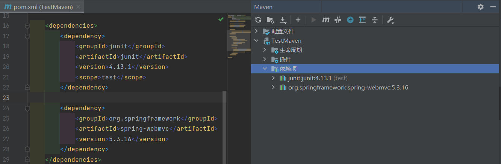

maven由于约定大于配置，可能会出现资源导出问题（无法被到处或者生效）。

在build中配置resources，防止资源导出失败的问题。


