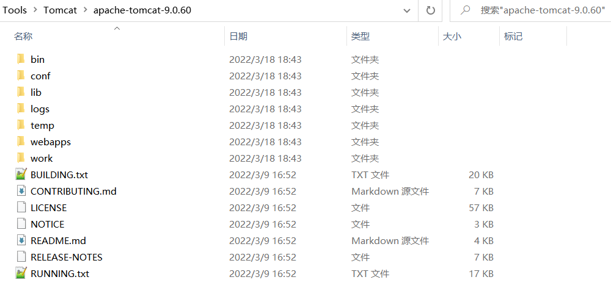
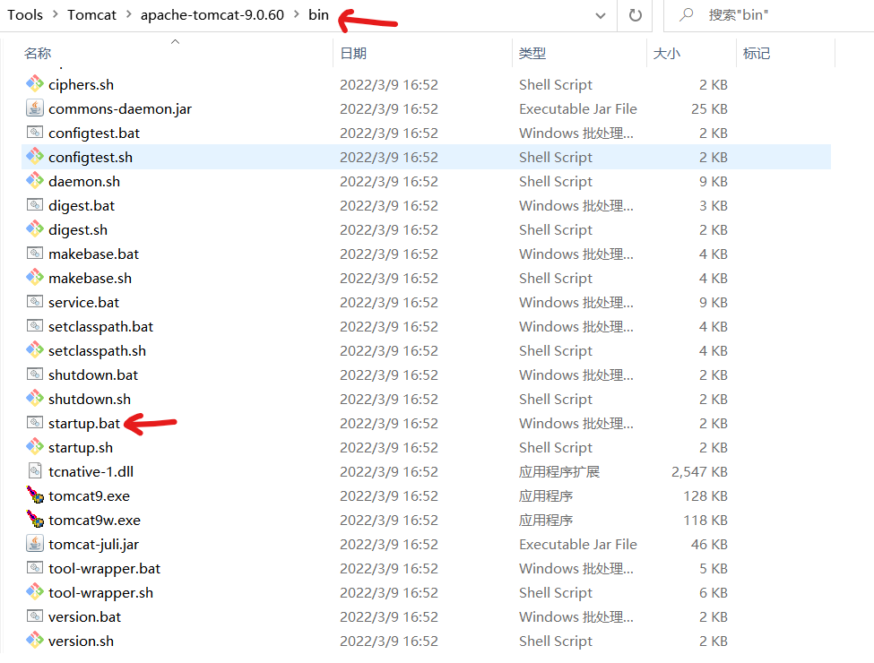
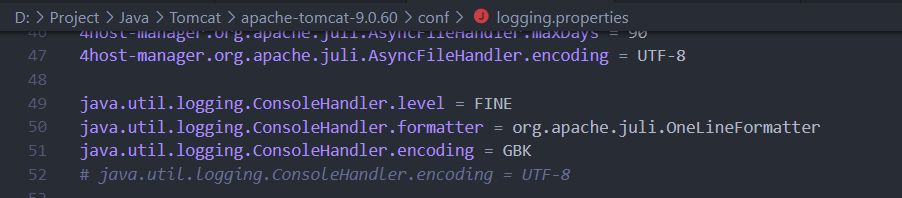
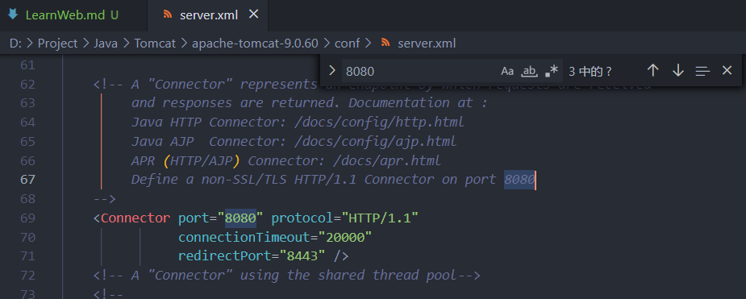
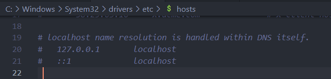
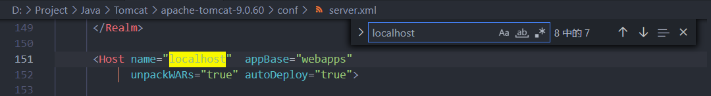
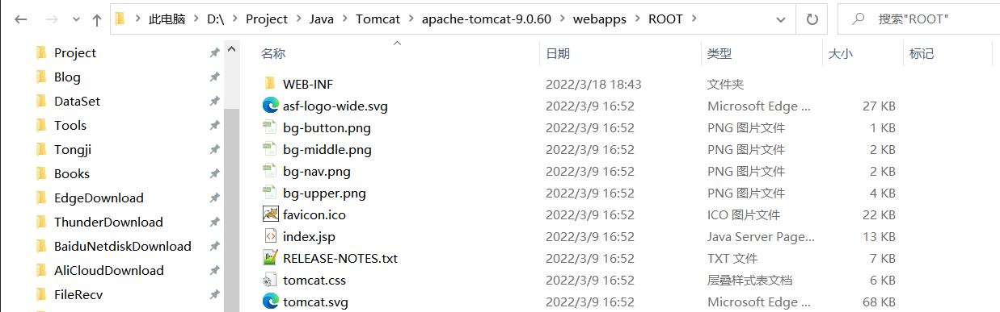
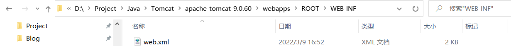

# Java Web

[toc]

## Portals

[狂神说 JavaWeb](https://www.bilibili.com/video/BV12J411M7Sj)


# 狂神说 JavaWeb

## 背景知识

**web开发**
1. 静态web：html，css。提供给所有人看的数据始终不会变换。
2. 动态web：几乎所有的网站。提供给人看的数据是在会发生变化。
   1. 技术栈：Servlet/JSP,ASP,php

**web应用程序**
可以提供浏览器访问的程序
URL：统一资源定位器
组成
1. html css js
2. jsp servlet
3. java程序
4. jar包
5. 配置文件

**静态web**
服务器（进行响应response）、客户端（发送请求request）

服务器包含WebService

缺点：
1. web页面无法动态更新
2. 所有用户看到的都是同一个页面（伪动态、轮播图）
3. 无法和数据库交互（无法持久化）

**动态web**
WebService处理动态和静态的资源

缺点：
1. 动态web资源出错，则需要重写后台程序，重新发布
2. 停机维护
优点：
1. 可以动态更新
2. 可以与数据库交互
3. JDBC

## Web服务器

**技术**
ASP（微软）
JSP（Sun公司、B/S架构（浏览器、服务器）、承载高并发）
PHP（代码简单、跨平台、无法承担大访问量）

**服务器**
被动操作，处理用户一些响应信息

Tomcat

## Tomcat

[Tomcat官网](https://tomcat.apache.org/)

下载&解压

启动&配置



目录解读
1. bin：启动关闭的脚本文件
2. conf：配置
3. lib：依赖的jar包
4. logs：日志
5. webapps：存放网站

启动Tomcat



在浏览器中输入： **http://localhost:8080**

后台关闭则无法访问

中文乱码问题



**server.xml解读**

核心配置文件



可以修改端口号，浏览器访问时做相应修改即可

也可以修改域名，但是需要自己在host文件添加信息（涉及到域名解析：先找本地再找dns）





默认主机名为：localhost -> 127.0.0.1
默认网站存放位置为webapps

默认打开index.html（首页）

将网站放在服务器指定的web应用的文件夹下，就可以访问





```
-webapps:Tomcat服务器的web目录
    -ROOT:
        -WEB-INF:
            -classes:java程序
            -lib:web应用所依赖的jar包
            -web.xml:网站配置文件
        -index.html:默认的首页
```

一些默认端口号：
1. tomcat：8080
2. mysql：3306
3. http：80
4. https：443

补充知识 网站访问：
1. 输入域名
2. 检查本地的hosts配置文件有无域名映射
   1. 如果有，直接返回对应ip，访问web程序
   2. 如果没有，访问DNS服务器寻找


## Http

什么是http


