# Thread

## Portals

[【狂神说Java】多线程详解](https://www.bilibili.com/video/BV1V4411p7EF)


# 【狂神说Java】多线程详解

## 01 线程简介

多任务：

进程Process：一个进程可以有多个线程。一个进程中最少有一个线程。进程是程序的一次执行过程。进程是习题资源分配的单位。

线程Thread：线程是CPU调度和执行的单位。（真正的多线程是指有多个CPU）

多线程：


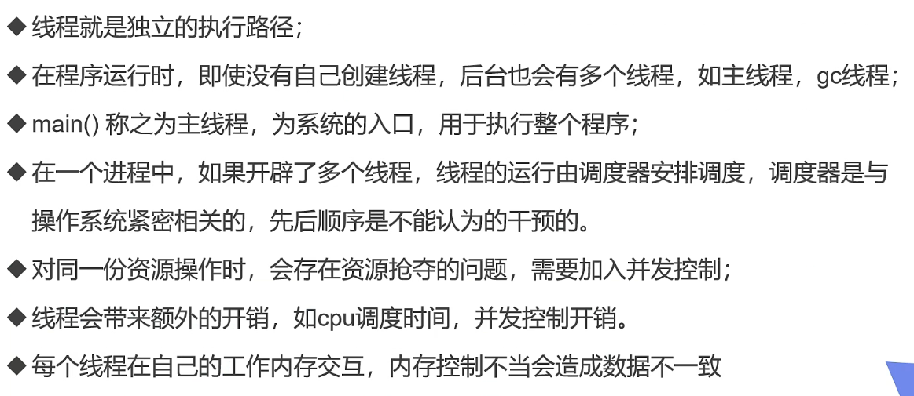


## 02 线程实现（**重点**）

### 继承Thread类（**重点**）

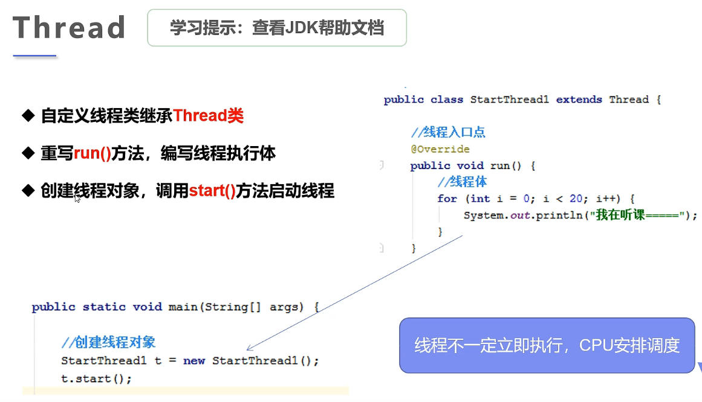

**run和start的区别**

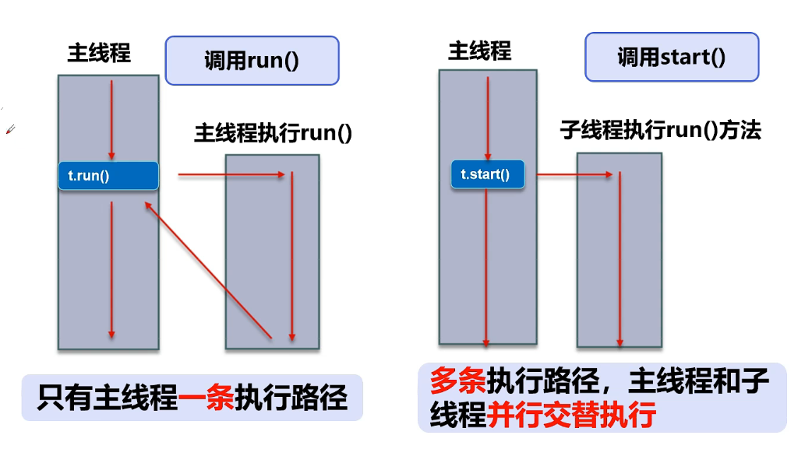

```java
// 继承Thread
public class TestThread extends Thread
{
    // 重写run方法 // 即使调用start也是重写run
    @Override
    public void run()
    {
        for (int i = 0; i < 20; i++)
        {
            System.out.println("sub"+i);
        }
    }

    // 主线程
    public static void main(String[] args)
    {
        TestThread testThread = new TestThread();  // 创建线程对象
        testThread.start();  // 调用start方法开启线程（可以将start修改为run看看结果）

        for (int i = 0; i < 20; i++)
        {
            System.out.println("main"+i);
        }
    }
}

```

### 实现Runnable接口（**重点**）

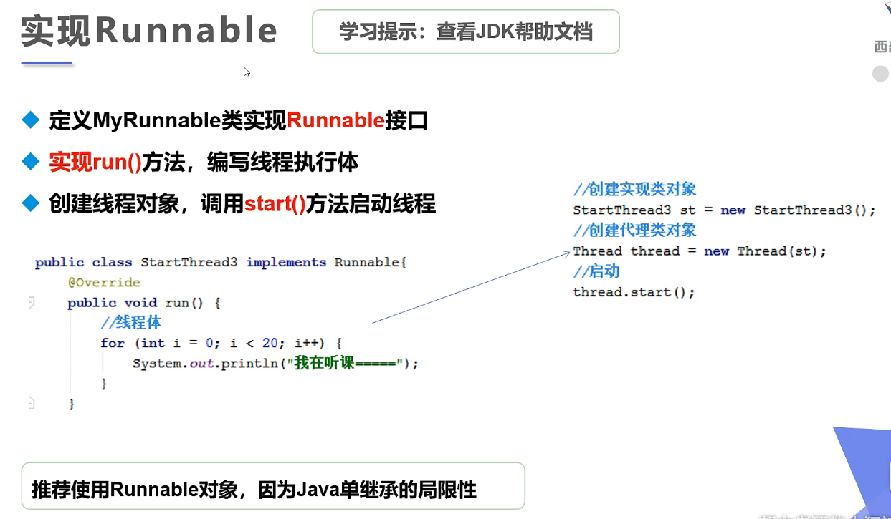

Thread类才有start方法。

需要将Runnable转为Thread再start

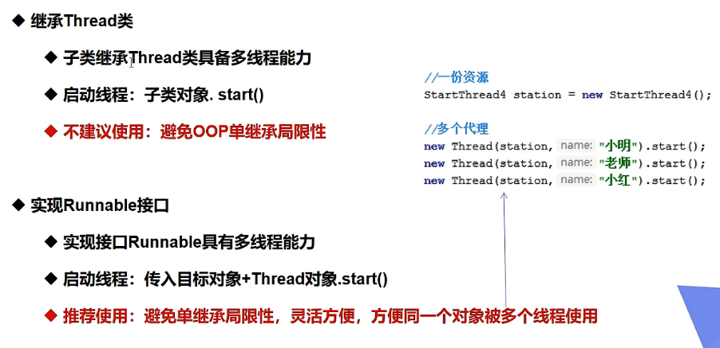


```java
// 实现runnable接口，重写run方法
public class TestRunnable implements Runnable
{
    // 重写run方法
    @Override
    public void run()
    {
        for (int i = 0; i < 20; i++)
        {
            System.out.println("sub"+i);
        }
    }

    // 主线程
    public static void main(String[] args)
    {
        // 创建runnable接口的实现类对象
        TestRunnable testRunnable = new TestRunnable();  // 创建线程对象
        // 创建线程对象，通过线程对象开启线程，代理
        Thread thread = new Thread(testRunnable);

        thread.start();  // 调用start方法开启线程（可以将start修改为run看看结果）

        for (int i = 0; i < 20; i++)
        {
            System.out.println("main"+i);
        }
    }
}
```

通过Thread类代理了TestRunnable类。

他们都实现了Runnable接口（run方法）。

Thread类在此基础上自己实现了start方法。

为了让TestRunnable也能start，需要通过Thread进行代理。

### 实现Callable接口（**了解**）

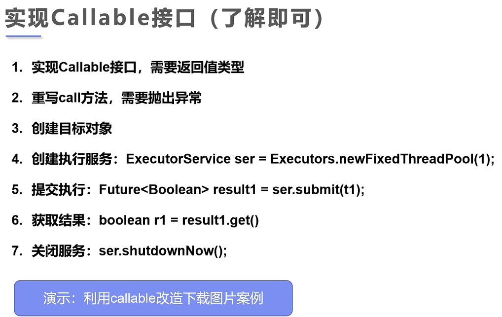


### 静态代理模式

真实对象和代理对象都要实现同一个接口

代理对象要代理真实角色

代理对象可以做真实对象做不了的事情

真实对象专注自己的事情


### Lambda表达式

函数式编程

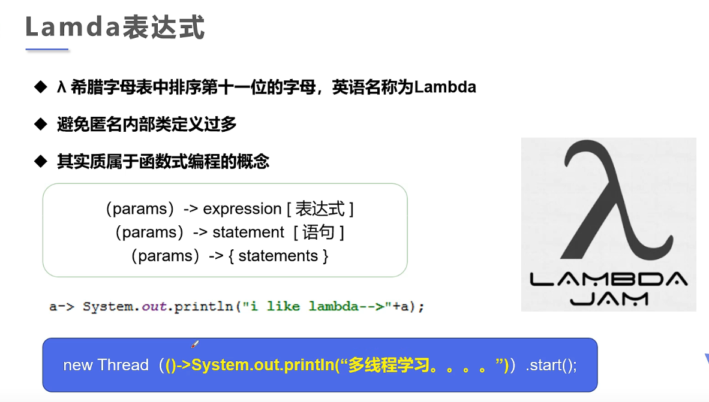

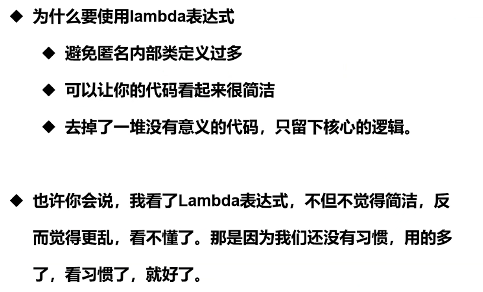


Runnable接口就是一个函数式接口，可以使用lambda表达式

## 03 线程状态

五大状态：


new->创建
start->就绪
sleep->阻塞

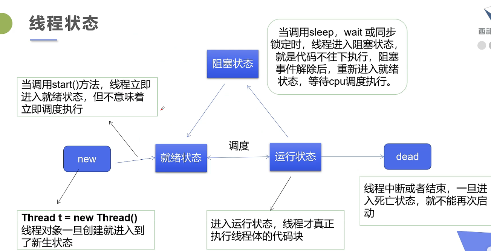

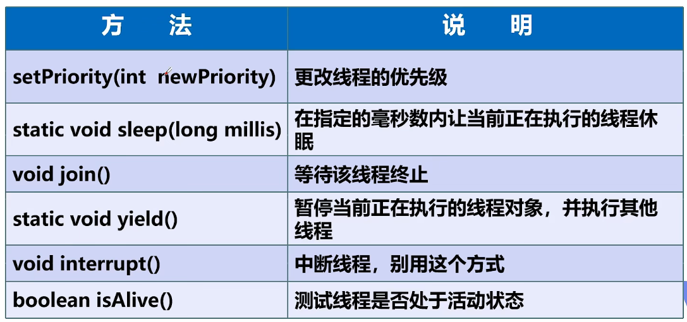

### 线程停止

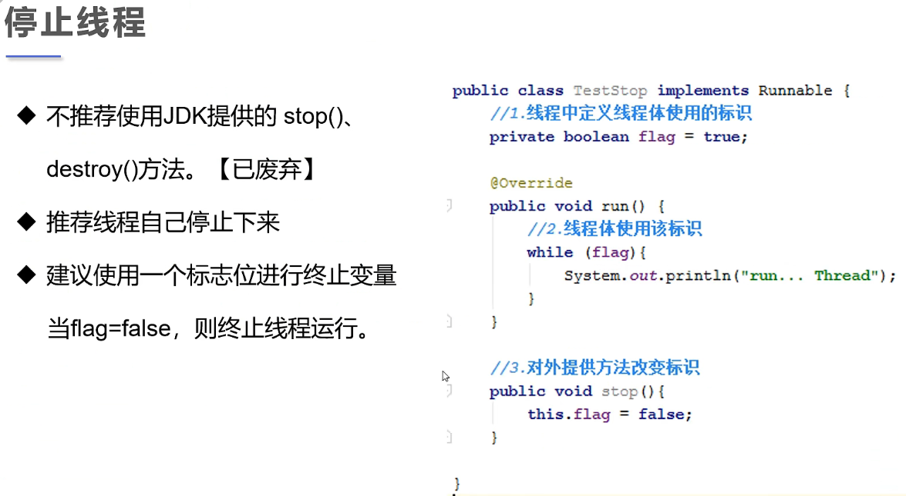

### 线程休眠

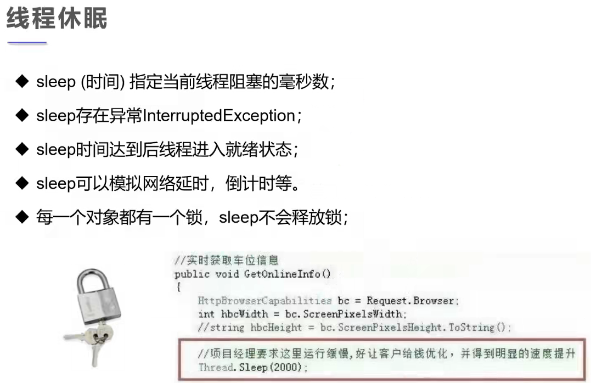

模拟网络延时，暴露问题。

Thread.sleep(1000);  毫秒

### 线程礼让

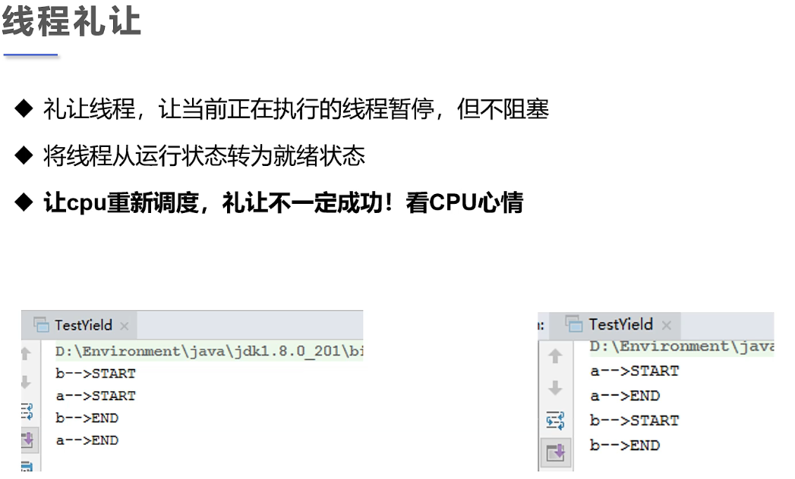

### 线程合并

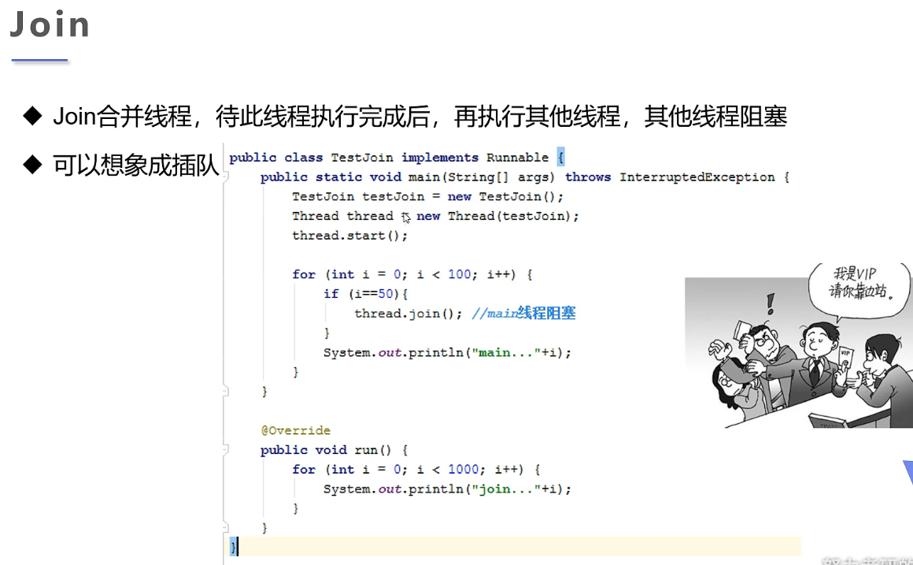

比如在线程B中调用了线程A的Join()方法，直到线程A执行完毕后，才会继续执行线程B。

### 线程状态观测

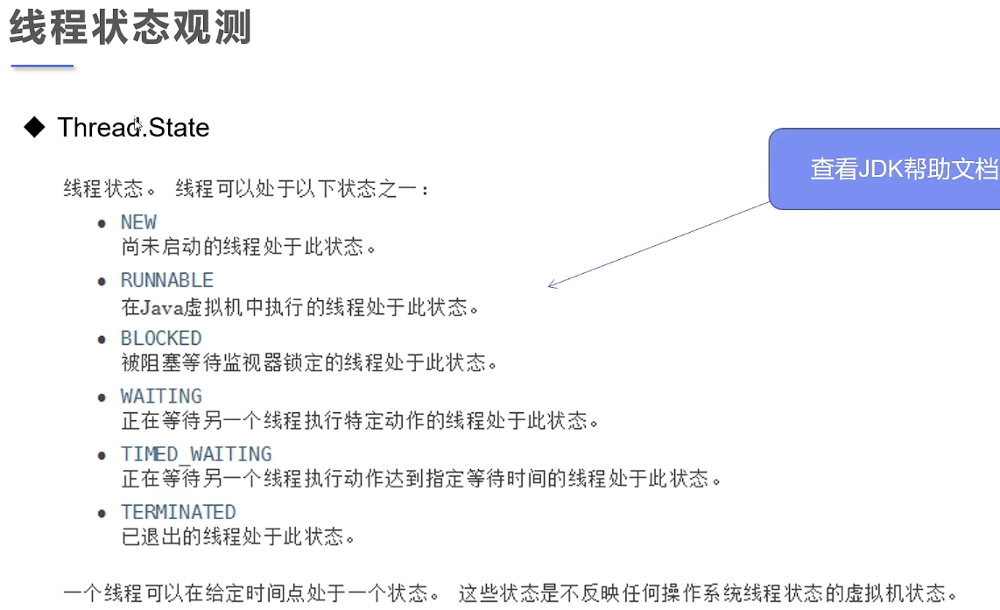

```java

Thread.State state = thread.getState();

if(state!=Thread.State.TERMINATED)
{

}
```

### 线程优先级

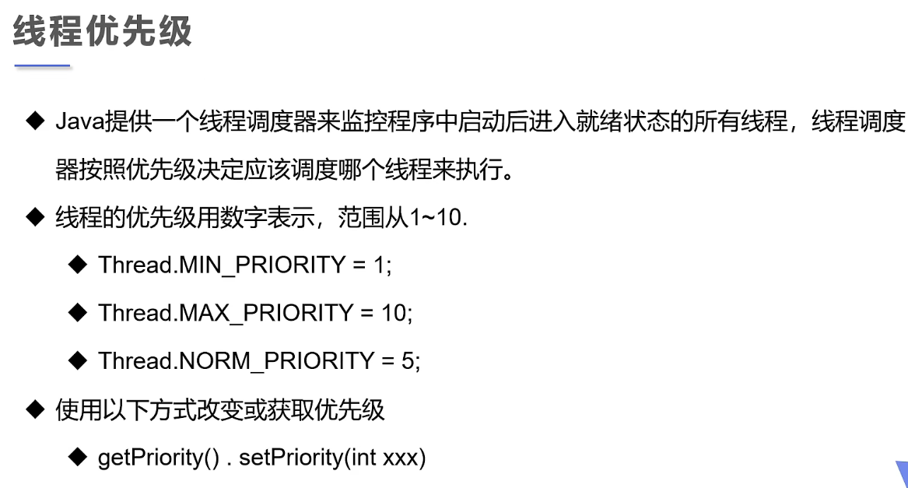

基本上是优先级高的先跑，但也不一定

优先级的设定应该在start前


### 守护线程


```java
threadX.setDaemon(true);
```


## 04 线程同步（**重点**）

**多个线程操作一个对象**

并发：同一个对象被多个线程同时操作


线程同步需要：**队列+锁**


损失性能，保证安全。

### 同步方法及同步块

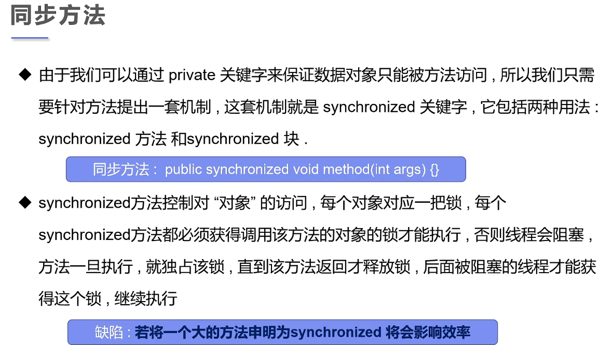

synchronized方法锁的是this对象本身

方法里面需要修改的内容才需要锁，锁太多，浪费资源

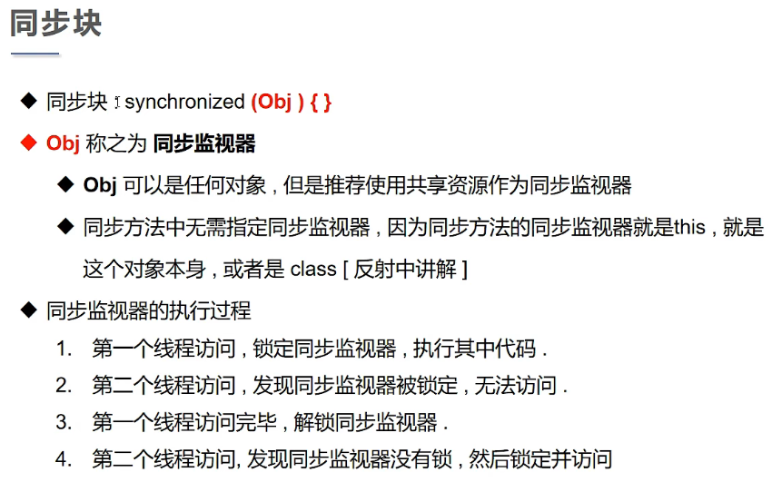

同步块可以锁任何对象

**锁的对象是变化的量，是需要增删改的**

### JUC（java.util.concurrent）

```java
CopyOnWriteArrayList<> list
```

## 05 线程通信问题


## 06 高级主题

