# Kubernetes

[Kubernetes - 官网](https://kubernetes.io/)

[Kubernetes - Github](https://github.com/kubernetes)

[Kubernetes - Docs](https://kubernetes.io/docs/home/)

**Kubernetes** is a portable, extensible, open source platform for **managing containerized workloads and services**, that facilitates both declarative configuration and automation


---

## Table of Contents


- [Kubernetes](#kubernetes)
  - [Table of Contents](#table-of-contents)
- [Kubernetes一小时轻松入门](#kubernetes一小时轻松入门)
  - [Kubernetes 简介](#kubernetes-简介)
  - [Kubernetes 核心组件](#kubernetes-核心组件)
  - [Kubernetes 架构](#kubernetes-架构)
  - [minikube \& kubectl 环境搭建](#minikube--kubectl-环境搭建)
- [Kubernetes (K8S) 3 小时快速上手 + 实践](#kubernetes-k8s-3-小时快速上手--实践)
- [Kubernetes 基础教程](#kubernetes-基础教程)


# Kubernetes一小时轻松入门

[Kubernetes一小时轻松入门](https://www.bilibili.com/video/BV1Se411r7vY/)

开发、测试、运维、架构

## Kubernetes 简介


微服务 & 容器 技术

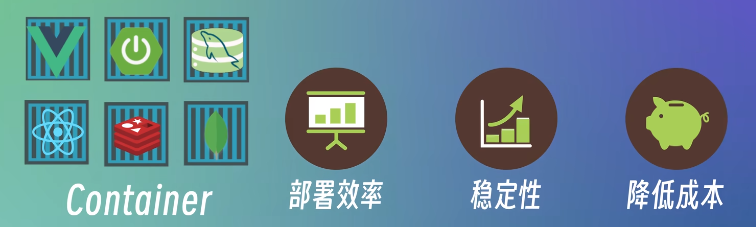

新的问题 - 容器的**管理&维护**

由 Google 开源的 **容器编排引擎** (以API编程的方式管理安排各个容器的引擎)

2014 年 Kubernetes 正式开源，2015 年被作为初创项目贡献给了云原生计算基金会(CNCF)，从此开启了 Kubernetes 及云原生化的大潮


<!--  -->

Kubernetes 帮助管理 容器化的 应用程序&服务 (部署、扩展、管理)


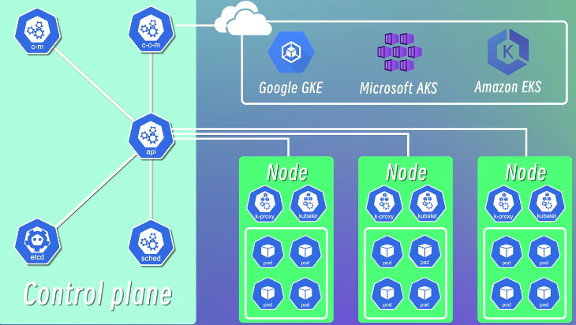

**特性**
1. **容器编排** - 通过 配置文件(yaml) 定义应用程序的部署方式(创建、维护、管理)
2. **高可用** - 系统长时间内连续正常运行，不会因为单个组件、服务的故障导致整个系统不可用 - 提高集群可用性
3. **可扩展性** - 系统根据负载的变化，动态 扩展or缩减 系统资源，提高系统的性能和资源利用率(618, 双11)


## Kubernetes 核心组件

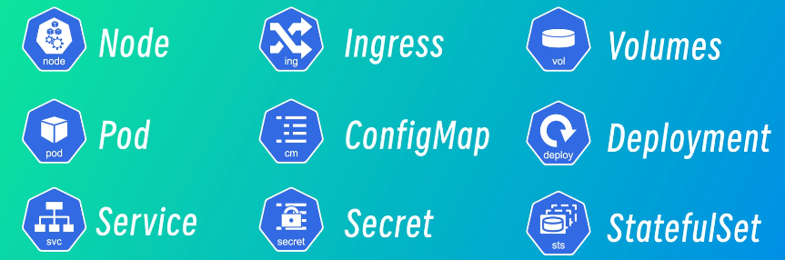

**`Node`**
1. 节点 - 物理机 或 虚拟机
2. 节点上运行 一个或多个 **Pod**

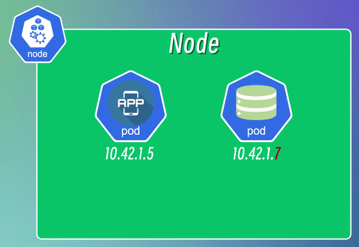

**`Pod`**
1. Kubernetes 的最小调度单元
2. 一个或多个容器的组合
3. Kubernetes 将容器放在 Node 上运行的 Pod 中来执行 工作负载
4. 创建容器的运行环境，容器可共享资源(网络、存储、运行时配置)
5. Best Practice - 一个Pod 运行 一个应用程序(解耦&拓展)
6. Pod 创建时自动分配 IP 地址(集群内部可访问，Pod间利用此通信，集群外部无法访问)
7. 不是稳定的实体，会被创建/销毁
   1. 发生故障时，Kubernetes 自动销毁 Pod，并创建一个新的 Pod 代替(IP地址会变化，可能导致无法连接数据库，使用 **`Service`** 解决)


**`Service(svc)`**
1. 将多个 Pod 封装为一个服务，通过统一的入口访问
2. 可以通过 Service 的 IP地址 访问 Pod (Pod 的 IP地址 变化，但 Service 的 IP地址 不变)
3. 两种
   1. 内部服务 - 数据库、消息队列、缓存 (集群内部访问)
      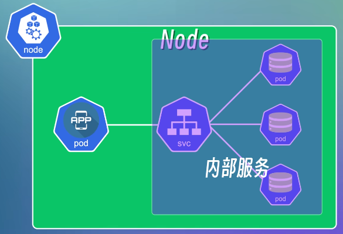
   2. 外部服务 - 微服务后端API、用户前端页面
      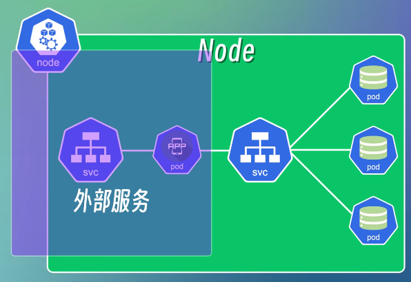
      1. NodePort - 节点上开放端口，将其映射到 Service 的 IP地址和端口 - (**开发&测试** 环境)
         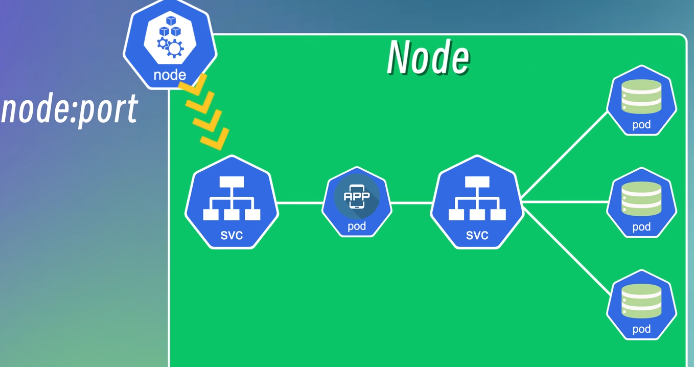
      2. LoadBalancer


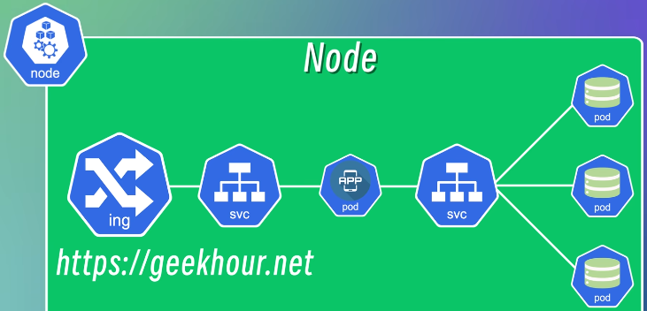

**`Ingress`**
1. 管理 从集群外部访问集群内部的 入口和方式
2. **生产环境** 使用 **域名** 访问 服务
3. 可配置不同转发规则，根据不同规则，访问集群内部不同 Service & Pod
4. 可配置域名、负载均衡、SSL证书


**`ConfigMap`**
1. 封装 **配置信息(URL、username、password)**，防止 配置信息与应用耦合，减少停机时间
2. ConfigMap 中的 配置信息为 明文，敏感信息不建议存储在 ConfigMap 中
3. 当配置信息变化(IP、Port)时，仅需修改 ConfigMap对象 中的 配置信息，实现解耦

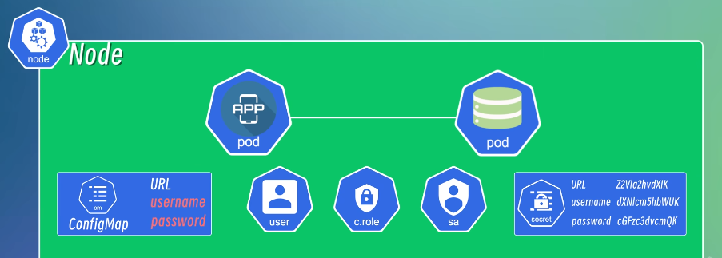

**`Secret`**
1. 与 ConfigMap 类似，但可以将 敏感信息 封装，一层Base64编码(并非加密)
2. 不能保证完全安全，需要配合其他安全机制
   1. 网络安全
   2. 访问控制
   3. 身份认证

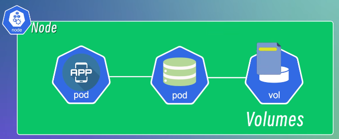

**`Volumes`**
1. 容器被销毁、重启时，容器中数据也会消失。使用 volumes 将需要持久化存储的资源 挂载到 集群本地磁盘 或 集群外部远程存储

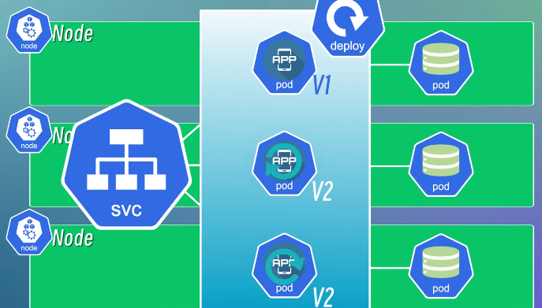

**`Deployment`**
1. 高可用 多复制几个节点，故障时 Service 自动将请求进行转发
2. Deployment 定义&管理 应用程序 **副本数量** 以及 **更新策略**
3. Pod 在 容器 上增加抽象，Deployment 在 Pod 上增加抽象
4. 副本控制(数量)、滚动更新(平滑升级)、自动扩缩容

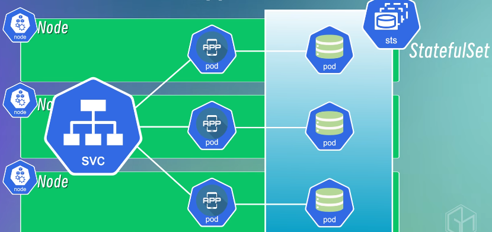

**`StatefulSet`**
1. 与 Deployment 类似，对于有状态的应用 (数据库、缓存、消息队列)
   1. 推荐从 Kubernetes 集群中 剥离，在集群外 单独部署
2. 数据库 多副本，副本之间有状态，需要持久化存储，需要保证一致性
3. 数量控制、动态扩缩容
4. 保证副本有稳定的 网络标识符 & 持久化存储


## Kubernetes 架构

**`Master - Worker`** 架构

Node 为了对外提供服务，有三个组件
1. kubelet
   1. 管理&维护 每个节点上的 Pod
   2. 监控节点运行情况，确保按照预期运行
2. kube-proxy
   1. 为 Pod 对象提供网络代理 & 负载均衡 服务
3. container-runtime
   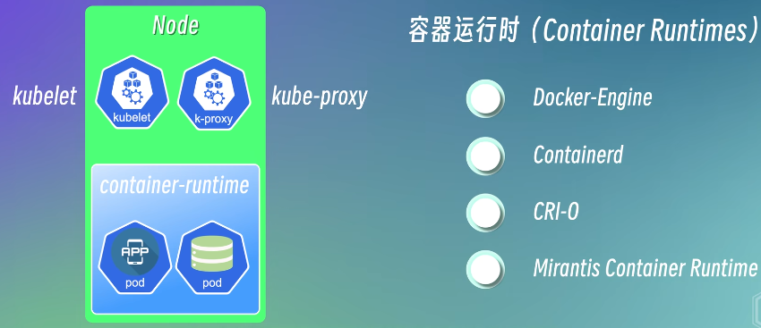
   1. 拉取镜像、创建容器、启停容器
   2. 应用程序需要 container-runtime 运行
   3. 每个工作节点必须安装
   4. Docker-Engine 就是一个容器运行时

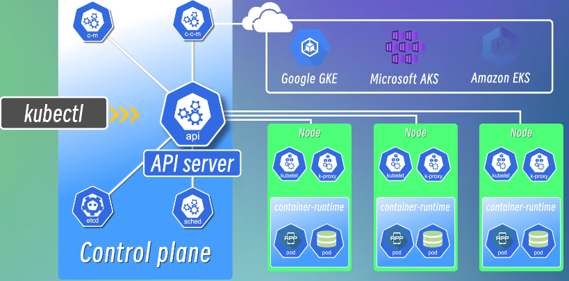

Master 节点 (4个基本组件)
1. kube-apiserver
   1. 提供 集群API接口服务，所有组件通过该接口通信
   2. 类似于集群的 网关，整个系统入口
   3. 请求先经过它，再分发给其他组件
   4. 负责对所有 资源对象的 增、删、改、查 操作 进行认证、授权、访问控制
   5. 在集群部署新应用时，需要与 API Server 交互，可以使用 kubectl 命令行工具
2. etcd
   1. 高可用的 Key-Value 存储系统
   2. 存储集群中所有资源对象的状态信息
   3. 不存储应用程序或数据库中的数据
3. ControllerManager 控制器管理器
   1. 管理集群中各种资源对象的状态，故障检测和处理
4. Scheduler 调度器
   1. 负责监控集群中所有节点的资源使用情况，根据调度策略，将Pod调度到合适的节点
5. CloudControllerManager
   1. 如果使用云服务商(Google/Aws/Microsoft)提供的Kubernetes集群
   2. 云平台相关控制器，负责与云平台API进行交互
   3. 提供一致的管理接口，使用户更方便的在不同云平台中运行和管理应用程序

## minikube & kubectl 环境搭建


[minikube start](https://minikube.sigs.k8s.io/docs/start/)

[Hello Minikube](https://kubernetes.io/docs/tutorials/hello-minikube/)

[Install Tools
](https://kubernetes.io/docs/tasks/tools/)

**minikube 搭建环境** - **需要 系统支持 `虚拟化`**

**kubectl 交互工具**

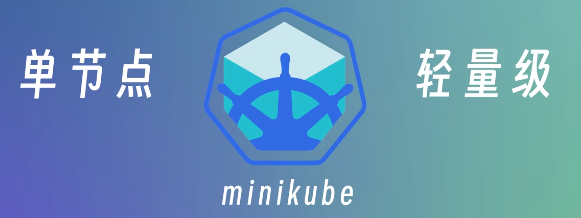

minikube是一个轻量级的Kubernetes实现，可在本地计算机上创建虚拟机，并部署仅包含一个节点的简单集群

kubectl 用于与集群进行交互

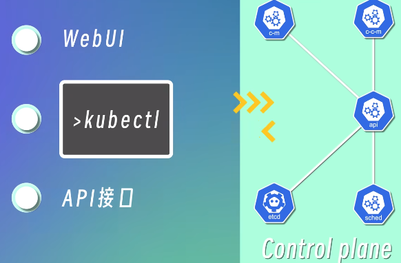

安装 minikube

```bash
curl -LO https://storage.googleapis.com/minikube/releases/latest/minikube_latest_amd64.deb
sudo dpkg -i minikube_latest_amd64.deb

sudo snap install kubectl --classic
```


```bash
minikube version  # 查看版本

minikube  # 查看命令

kubectl  # 查看命令
```

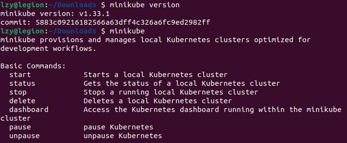

```bash
minikube start
```

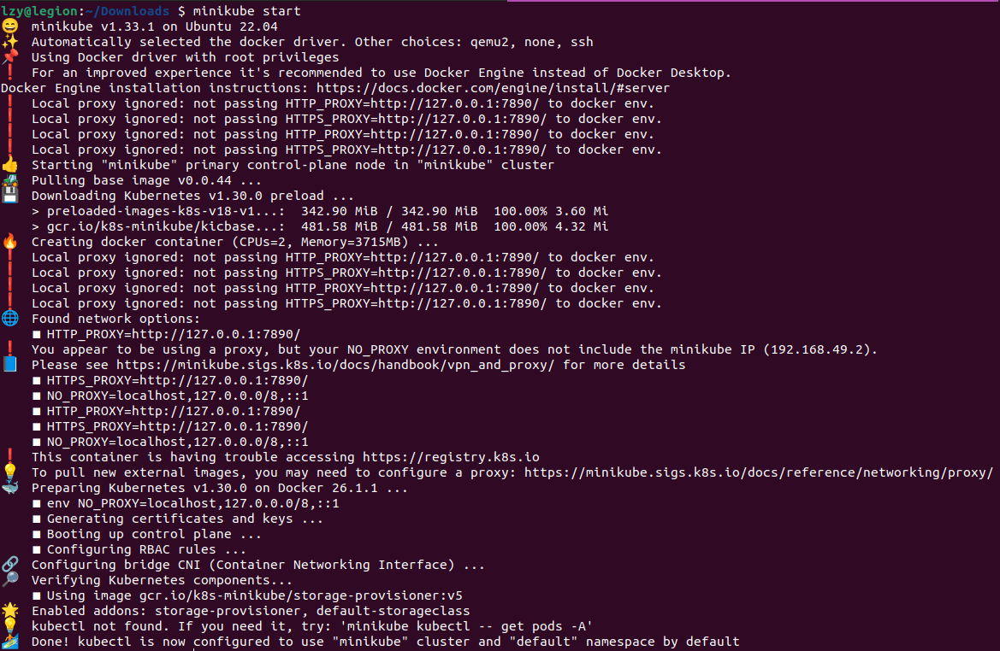

可能需要先启动 Docker 再 启动 minikube (因为需要 docker engine 启动虚拟机)


查看集群中的节点

```bash
kubectl get nodes
```

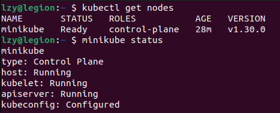

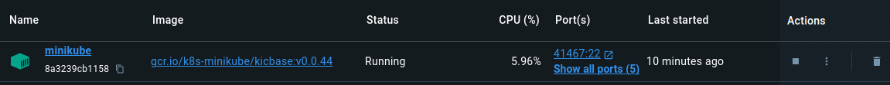

```bash
minikube stop
```

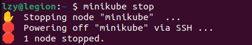


Docker 中也可以开启 minikube

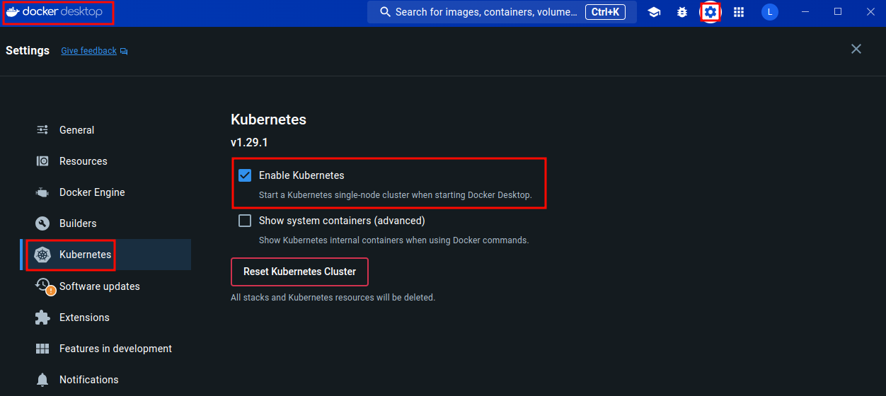


---


# Kubernetes (K8S) 3 小时快速上手 + 实践

[Kubernetes (K8S) 3 小时快速上手 + 实践](https://www.bilibili.com/video/BV1Tg411P7EB/)


# Kubernetes 基础教程

[Kubernetes 基础教程 -Jimmy Song](https://jimmysong.io/book/kubernetes-handbook/architecture/)


sk-qylz8hBVCiUrOqjBxLSP7ZC1PUTDlZakHiYVMVuz7nfGJ9ZS