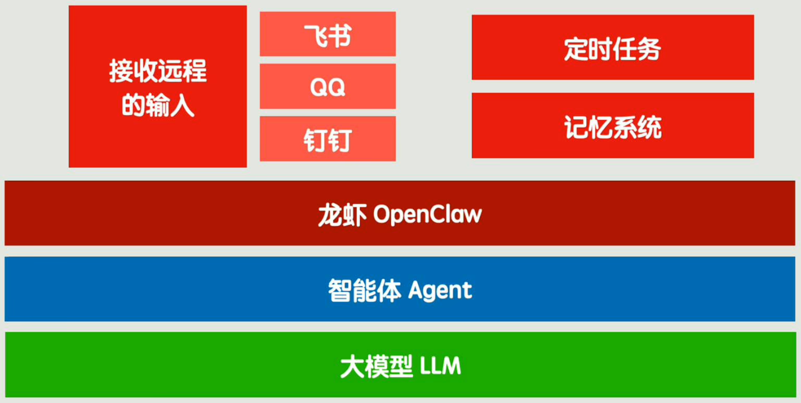

# OpenClaw

大模型厂商(OpenAI, Anthropic) / 中间商(OpenRouter) 提供 https / SDK 形式 的 API 接口

和 LLM 最普通的对话 没有 上下文记忆

可以 接入各种社交软件

OpenClaw 基于 Agent 循环

Agent 智能 依赖于 LLM & Prompt

`AGENT.md`(Agent 在该仓库里 扮演的角色) & `SKILLS.md`(列 agent 能力/技能 & 说明技能怎么用)

OpenClaw的真正本质
真正决定上限的是
1. 什么时候该注入什么上下文
2. 什么时候该拆skill
3. 什么时候该限制权限
4. 什么时候该做检查点和验证回路
5. 什么时候该持久化状态
6. 什么时候该让系统停下来
