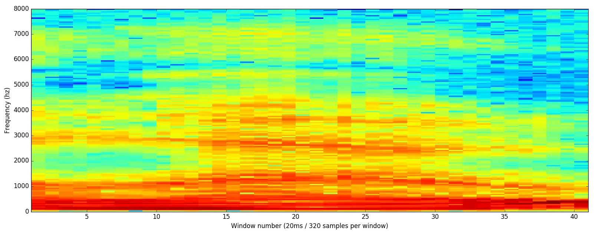

# Audio Background Knowledge

---

# Spectrogram (声谱图)

信号频谱 随时间变化 直观表示

将 声音 听觉信息，转换成 图像

含义
1. 横轴 (X轴) = 时间 (Time)
2. 纵轴 (Y轴) = 频率 (Frequency)
3. 颜色深浅 / 亮度 = 强度 (Intensity / Amplitude)

获取方式
1. Short-Time Fourier Transform(STFT)
2. 即 把信号分成 小片段/Window，分别做 FFT
3. 允许窗口在时间上 overlap，重叠率 25-50%
4. 通常采用 **对数刻度**，eg : 分贝 dB

Nyquist Theorem 采样定理 : 为了不失真地完美还原一个连续信号，采样频率必须严格大于该信号中最高频率的两倍

