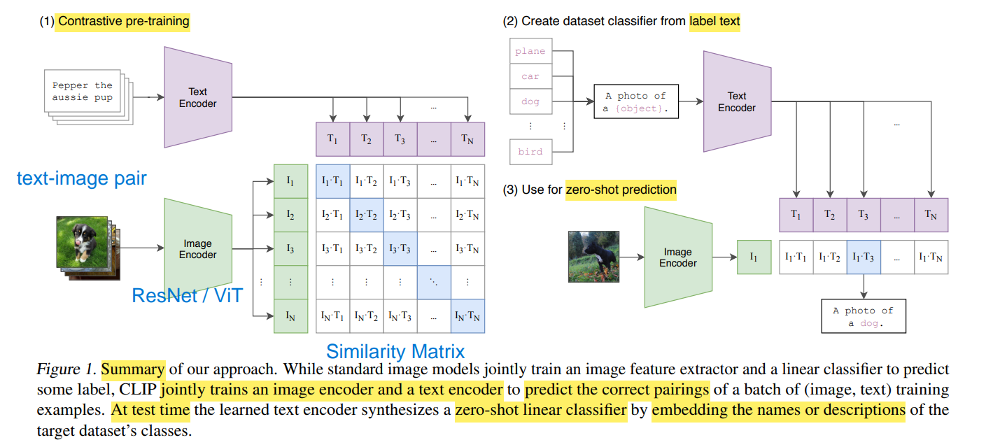
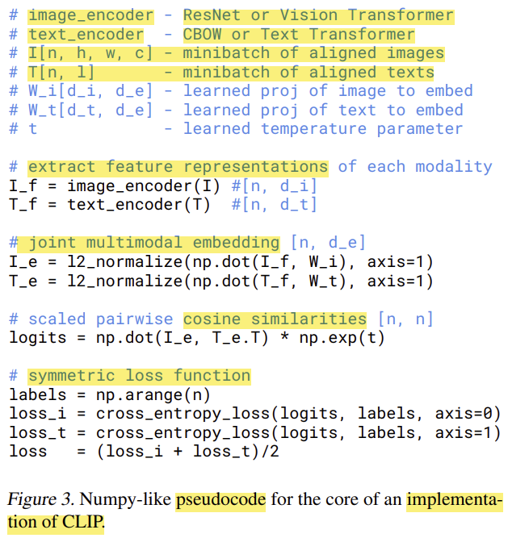

# CLIP - Contrastive Language Image Pre-Training

[CLIP - Github](https://github.com/openai/CLIP)

[CLIP 论文精度 - B站(李沐 & bryanyzhu)](https://www.bilibili.com/video/BV1SL4y1s7LQ)

[CLIP - OpenCV Bootcamp Slide](./OpenCV-Bootcamp_CLIP_Internals_and_Architecture.pdf)

[CLIP - OpenAI MileStone](https://openai.com/index/clip/)

---

**multimodal** : vision + language

核心 : 学习两个encoder的参数，学习到相同的语义表示空间，实现跨模态理解

结构总览
1. 
2. 架构
   1. 图像分支 : ResNet-50 或 ViT (两边都是 Transformer，端到端更统一)
   2. 文本分支 : 12-Layer transformer, 63 million parameters, 8 attention heads
3. embedding vector size 512
4. Pre-Training
   1. $T_1,\dotsm,T_N$ & $I_1, \dotsm, I_N$ 中，每个元素 长度都为 d，代表 N 对 text-image pair 得到的 embedding 结果
      1. 主对角线(蓝色) 代表 正样本，共 $N$ 个
      2. 非对角线(白色) 代表 负样本，共 $N^2 - N$ 个
      3. mini-batch 内对比学习自带 负样本
5. Zero-Shot Prediction
   1. 利用 prompt template 生成文本，**摆脱 categorical label 的限制**(无需定死的标签)
   2. 用 各个{类别}文本 和 图片 计算 cosine similarity
   3. 因为预训练的时候使用的大多数是句子，因此最好推理的时候也用句子
   4. Prompt Engineering (imagenet_templates) : [Prompt_Engineering_for_ImageNet.ipynb](https://github.com/openai/CLIP/blob/main/notebooks/Prompt_Engineering_for_ImageNet.ipynb)

数据集
1. 对比学习 需要 大量数据
2. **internet scale** : image-caption pair, WIT(Web ImageText) Dataset, **not public**, 400M
   1. 或许可以用 [Wikipedia-based Image Text Dataset - Github](https://github.com/google-research-datasets/wit?tab=readme-ov-file#wit--wikipedia-based-image-text-dataset) 代替

**Loss Function**
1. $$
   \mathcal{L}_{\text{CLIP}}
   = \frac{1}{2}\Biggl[
   -\frac{1}{N}\sum_{i=1}^{N}
      \log\frac{\exp\!\bigl(\operatorname{sim}(I_i,T_i)/\tau\bigr)}
               {\sum_{t=1}^{N}\exp\!\bigl(\operatorname{sim}(I_i,T_t)/\tau\bigr)}
   \;+\;
   -\frac{1}{N}\sum_{t=1}^{N}
      \log\frac{\exp\!\bigl(\operatorname{sim}(T_t,I_t)/\tau\bigr)}
               {\sum_{i=1}^{N}\exp\!\bigl(\operatorname{sim}(T_t,I_i)/\tau\bigr)}
   \Biggr]
   $$
2. 左边部分为 **Image-to-Text** loss，外层遍历 image，以 image 为 anchor 轮询所有 text
3. 有半部分为 **Text-to-Image** loss，外层遍历 text，以 text 为 anchor 轮询所有 image
4. create a distribution of similarities, allowing the model to distinguish correct pairs from incorrect pairs
5. 伪代码
   1. 
   2. 通过 可学习的 参数 $W_i$ & $W_t$，将 两种特征 对齐维度，对齐到同一个坐标系，翻成共同语言，否则图向量和文向量无法比较
   3. `l2_normalize` 把向量投到单位超球面，对比学习里 关心 角度(余弦) 差异，数值/梯度更稳定，另外 使得 点积＝余弦
   4. `np.dot(I_e, T_e.T)` 相当于 `I_e @ T_e.T`
   5. logits 为 $n × n$ 维矩阵 (行代表不同 image，列代表不同 text)，并且已经都 乘以 $e^t$，t 是可学习参数，和 上方 公式 的 $\tau$ 的关系为 $\tau = e^{-t}$
   6. pair 正好在对角线，因此 label 就为 `np.arrange`
   7. `cross_entropy_loss` 内部
      1. 逐行(axis=0) / 逐列(axis=1) 做 **softmax**
      2. $\frac{\exp(\operatorname{sim/\tau})}{\sum \exp(\operatorname{sim/\tau})}$ 就是 在 softmax
      3. axis=0 对应 同一个 image 去匹配 不同 text
      4. axis=1 对应 同一个 text 去匹配 不同 image
      5. 通过 label 选中 correct 概率，并进行 负对数，均值

Training 训练
1. 没有使用 pre-trained weights
2. 使用 **大batchsize**(32768)

Limitations and Challenges
1. 不能做 精细任务(fine-grained tasks)，zero-shot 下不能区分 similar subcategories
2. 不能做 out-of-distribution generalization
3. internet data 数据质量问题

[openai/clip-vit-base-patch32 - HuggingFace](https://huggingface.co/openai/clip-vit-base-patch32)
1. CLIP 官方权重默认把图像先缩放/裁剪到 224 × 224
2. **Patchify**
   1. 用一个卷积核大小和步幅都为 32 的线性层 (非重叠卷积)
   2. 把整张图像划分成 7 × 7 = 49 个 patch (224 / 32 = 7)
   3. 每个 patch (32 × 32 × 3 像素)
   4. 展平成向量，再映射到 768维(ViT-Base 的标准宽度) 并加上 **位置编码**
3. 49 个 patch token + 1 个 CLS token 进入 12 层 Transformer，输出 512维 图像 embedding

total parameters ≈ 151 M

HuggingFace Transformers
1. `from transformers import CLIPTokenizer, CLIPProcessor, CLIPModel`
   1. `CLIPTokenizer` : converts text into tokens，分词器，转换成模型可以处理的 token 序列
      1. padding 可以使得 长度相同
      2. 给每条文本加上 `开始符(BOS)` 和 `结束符(EOS)` tokens
   2. `CLIPProcessor` : handles image/text preprocessing
      1. 将传入的数据 全部 做同样的预处理，包括 text & image
      2. 内部调用 `CLIPTokenizer` + `CLIPImageProcessor`
      3. Image Process
         1. Resizing : shape : 224 * 224
         2. Center Cropping
         3. Data Type Conversion : to `torch.tensor`
         4. Normalization
      4. Text Process
         1. Tokenization
         2. Padding and Truncation
         3. Data Type Conversion
   3. `CLIPModel`     : image-text embedding and similarity tasks
      1. `get_text_features()` - embedding/feature vector
      2. `get_image_features()`

Contrastive Learning
1. encode image/text as same sized vector (represent semantic meaning)
   1. vision encoder
   2. text encoder
2. **shared embedding space**
3. 余弦相似度 **cosine similarity** $(a, b) = \frac{a b}{|a| |b|}$
   1. 训练时，CLIP 会在视觉/文本编码器 输出后做 L2-norm
      1. 模型仍在 完整空间 里 输出向量，仅仅是在训练时进行归一化
   2. 向量的模长全部固定为 1，点积就正好等价于余弦值
   3. 模型无法 靠增大模长 来作弊，只能通过改变方向来表达语义差异，从而使学习过程更稳定

[softmax with temperature - 个人笔记](../../../DeepLearning/3B1B/3B1B.md#softmax-with-temperature)

图片数据增强
1. 随机 Resize-Crop (RandomResizedCrop → 224 × 224)
   1. 先 resize(non-uniform) 再 crop
2. 随机水平翻转 (Horizontal Flip)

相关应用
1. [StyleCLIP: Text-Driven Manipulation of StyleGAN Imagery (ICCV 2021 Oral) - Github](https://github.com/orpatashnik/StyleCLIP)
2. [CLIPDraw: Synthesize drawings to match a text prompt! - Github](https://github.com/kvfrans/clipdraw)
3. [Open-Vocabulary Detection via Vision and Language Knowledge Distillation - Github](https://github.com/tensorflow/tpu/tree/master/models/official/detection/projects/vild)
   1. [YouTube](https://www.youtube.com/watch?v=aA0r1M_NWhs)
4. [Contrastive Language-Image Forensic Search - Github](https://github.com/johanmodin/clifs)

