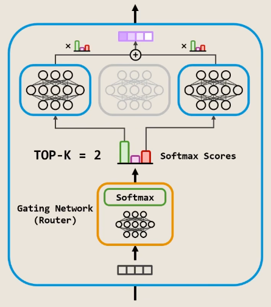
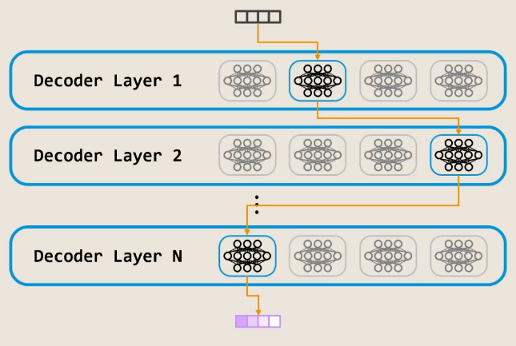
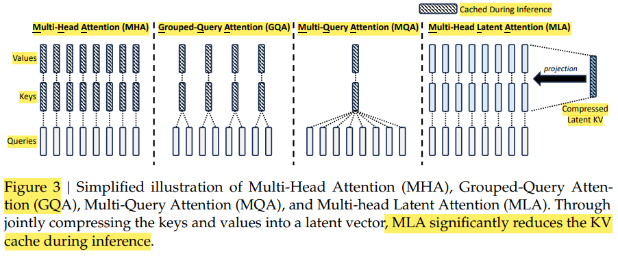
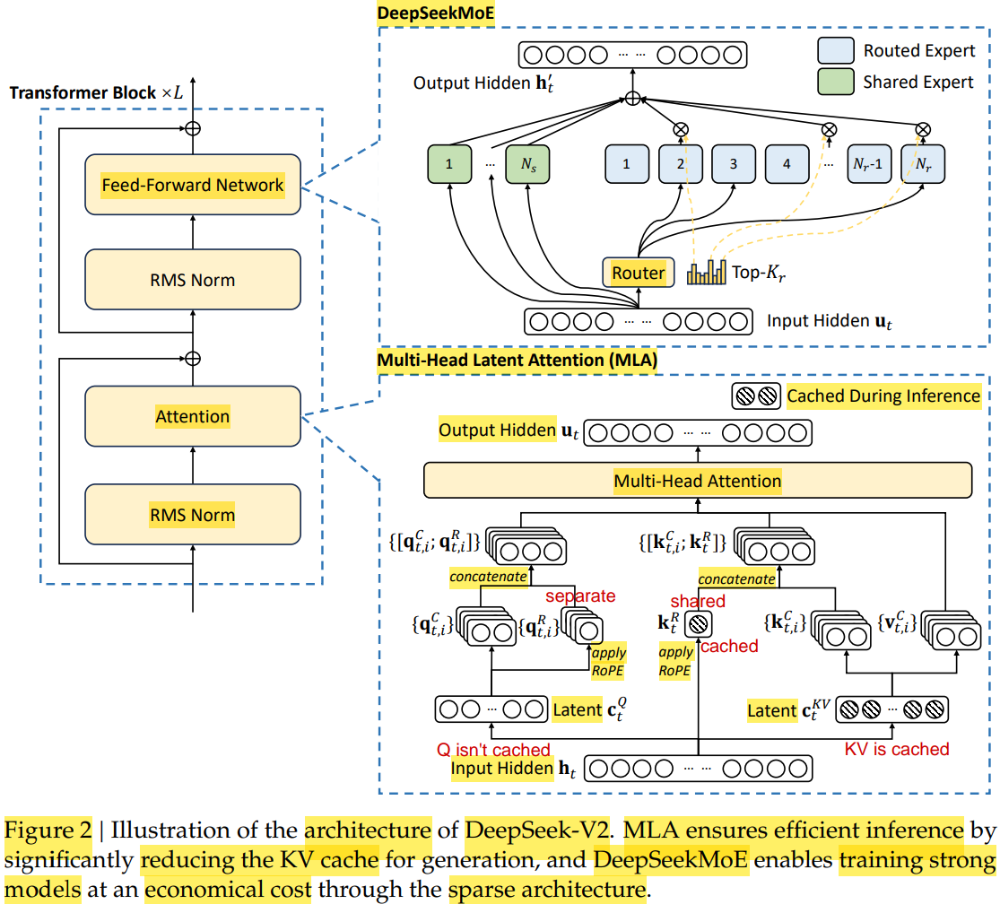

# DeepSeek

[DeepSeek - B站视频(RethinkFun)](https://space.bilibili.com/18235884/lists/4906445?type=season)

## Table of Contents

- [DeepSeek](#deepseek)
  - [Table of Contents](#table-of-contents)
- [DeepSeek-MoE](#deepseek-moe)
  - [经典 MoE](#经典-moe)
  - [DeepSeek-MoE 改进](#deepseek-moe-改进)
- [DeepSeek-V2 MLA](#deepseek-v2-mla)
- [DeepSeek-V3 多token预测 MTP](#deepseek-v3-多token预测-mtp)
- [DeepSeek-GRPO](#deepseek-grpo)

---

# DeepSeek-MoE

2024/01 提出

## 经典 MoE

**Mixture-of-Experts**
1. 将 前馈网络(FFN) 稀疏化，改造 为 Router + 多个 expert FFNs
2. 模型权重 绝大部分集中在 FFN，而非 Attention 的 QKV 等
3. 
4. 

Router 用于选择 expert
1. 通常只是简单的 线性层
2. 输入维度 $D_{\text{model}}$，输出维度 $N_{\text{expert}}$
3. 一般是 **Top-K Routing**，方便做 Tensor 并行和 Buffer 预分配，硬件利用率最高，对分布式集群更友好

**==P.S.==**
1. experts 的选择是 ==token-wise==，而不是 sequence-wise
2. 每个 layer 都可以选择 不同的 experts

MoE 稀疏性(Sparsity) 带来的 特点
1. 计算量(FLOPs)
   1. 总参数量 接近 Dense-Large，但 FLOPs 远小于 Dense-Large Model
   2. 训练 & 推理 都接近 Dense-Small(实际激活的专家数量) Model
2. 硬件效率(Throughput)
   1. 由于 Router & Communication(All-to-All) Overhead
   2. 利用率 不如 Dense Model
3. 收敛速度
   1. 总参数大，样本效率(Sample Efficiency) 比 Dense-Small 高，收敛到目标 Loss 所需的 Token 数更少
   2. 即使 处理每个 Token 的时间比同规模 Dense-Small 慢，但 所需步数 少，成本更低
   3. Loss 曲线 更贴近 Dense-Large，因为 取决于 总参数量(知识容量)
4. 知识解耦
   1. MoE，理论上 不同的专家 会演化出 对不同领域的能力

技术挑战
1. **负载均衡(Load Balancing)**
   1. 马太效应 : 路由模块 偏心(Bias) 使得 能力弱的专家 能力越来越差 (难被 路由模块 选中，没有被激活 因此 停止学习)，训练过程不稳定
   2. 解决方案
      1. Noisy Top-K Routing，增加探索(Exploration)
      2. 设置 Token 容量(Token Capacity)
         1. 限制每个专家 处理的 Token 数量
         2. Top-K 中 跳过超过容量的(再重新归一化)，如果都 超过就跳过，信息 由 残差链接 传到下一层
         3. 由 GShard 和 Switch Transformer(ST-MoE) 引入
      3. 引入 辅助损失(auxiliary loss)，强制路由器均匀分配任务
         1. **理想** : $Loss_\text{balance} = \sum_{i=1}^{N_{\text{expert}}} (f_i)^2$
            1. $f_i$(实际负载频率) : 一个 batch 中，真实发送给专家 $i$ 的 Token 比例
            2. 如果 某个 expert 有很高的 frequency，则 Loss 很大，最优情况 就是 freq 一样，平分负载
            3. 问题
               1. top-k 或 argmax是 **不可导(Non-differentiable)**，无法 反向传播 & 梯度下降优化
         2. **实际** : $Loss_\text{balance} = \sum_{i=1}^{N_{\text{expert}}} f_i P_i$
            1. $P_i$(路由概率均值) : 一个 batch 中，Router 对专家 $i$ 分配概率的平均值
            2. $P_i = \frac{1}{T} \sum_{j=1}^{T} \text{Softmax}(\text{Router}(x_j))_i$ (T 是 token 数量)
            3. GShard 提出的
2. 通信开销(Communication Overhead)
   1. 分布式训练中，不同的 专家通常分布在不同的 GPU 上
3. 显存占用
   1. 为了能随时调用，所有专家都必须驻留在显存中
   2. 对硬件的 内存容量 要求 依然是 **参数总量**

## DeepSeek-MoE 改进

标题中 Towards Ultimate Expert Specialization in Mixture-of-Experts Language Models - 让专家更专精

DeepSeekMoE 架构
1. 
2. **观点** : 传统 MoE 专家数 太少，每个 专家还不够专精
3. **改进** : **细粒度专家(Fine-grained Experts)** + **共享专家(Shared Experts)**
   1. 细粒度专家 : 总专家数 翻倍，每个专家 参数量 减半，激活的专家数 也翻倍，总参数量不变
   2. 共享专家 : 每次都被激活，负责 基础通用能力

[如何系统的入门大模型？](https://www.zhihu.com/question/621550974/answer/3472996606)

[transformer的细节到底是怎么样的？](https://www.zhihu.com/question/362131975/answer/3369782613)

[MoE(Mixture-of-Experts)大模型架构的优势是什么？为什么？](https://www.zhihu.com/question/634844209/answer/3364787819)

[Mixture-of-Experts (MoE) 经典论文一览](https://zhuanlan.zhihu.com/p/542465517)

---

# DeepSeek-V2 MLA

2024/05 提出

FFN 上，继续保留 MoE 架构

Attention 上，提出 MLA (Multi-head Latent Attention)

**Low-Rank Compression** (注 : 下面的公式 使用 ==column vector==，和平时 row vector 不同)
1. KV Joint 压缩
   1. attention input (hidden state) $\mathbf{h}_t$ 通过 **降维矩阵**(Down-Projection) 压缩成 latent vector $\mathbf{c}_t^{KV}$
      1. $\mathbf{c}_t^{KV} = W^{DKV} \mathbf{h}_t$
      2. 压缩后维度 $d_c \ll d_h*n_h$
   2. 用 2个 **升维矩阵**(Up-Projection) **分别** 解压出 Key & Value
      1. $\mathbf{k}_t^C = W^{UK} \mathbf{c}_t^{KV}$
      2. $\mathbf{v}_t^C = W^{UV} \mathbf{c}_t^{KV}$
   3. **升维矩阵 可以被 权重吸收(Weight Absorption)**
      1. 分别 融合到 权重矩阵 $W^{Q}$ & $W^{O}$ 中
      2. 有了 融合后的 矩阵的权重，不需要 显式 计算出 keys & values
   4. 推理时，只 cache latent vector $\mathbf{c}_t^{KV}$，共 $d_c * n_\text{layer}$ 个 elements
2. Q 压缩 (呼应)
   1. 训练时，减少 activation memory
      1. 其实 Q & KV-Joint 压缩 都有该优势，只是 Q 压缩 对于 inference 减少 KV Cache 没有帮助
      2. 必须 结合 **激活重计算** 才能减少，否则是僧伽
      3. 只保留 latent，反向传播 用矩阵 重新算一下
   2. 呼应 KV Joint 压缩，先 降维再升维
      1. $\mathbf{c}_t^Q = W^{DQ} \mathbf{h}_t$
      2. $\mathbf{q}_t^C = W^{UQ} \mathbf{c}_t^Q$
3. KV 的 Joint 压缩维度 $d_c$ 和 Q 的压缩维度 $d_c^\prime$ **可以不同**
   1. KV 压缩 为了减少 KV Cache，必须 极限压缩
   2. Q 压缩 可以适当放松，给 Representation 留更多空间

**Decoupled RoPE(Rotary Position Embedding)**
1. [RoPE - 个人笔记](../Llama/RoPE.md)
2. RoPE 和 Low-Rank Compression 不兼容，无法进行 权重吸收
   1. $q_i R_i (k_j R_j)^T = h_i W^Q R_i (c_j^{KV} W^{UK} R_j)^T = h_i W^Q R_i R_j^T {W^{UK}}^T {c_j^{KV}}^T $
3. 解决方案 : 给 Q & K 额外增加维度，表示 位置信息
   1. Query
      1. $\mathbf{q}_t^R = \text{RoPE}(W^{QR} \mathbf{c}_t^Q)$
      2. 生成带有位置信息的向量，$W^{QR}$ 把 $\mathbf{c}_t^Q$ 映射出狭窄的维度，然后 应用 RoPE
      3. ==不同 head 间 不共享==
      4. **再和 $\mathbf{q}_t^C$ 拼接起来**，组成完整的 Query
   2. Key
      1. $\mathbf{k}_t^R = \text{RoPE}(W^{KR} \mathbf{h}_t)$
         1. **==不同 head 间 shared(共享的)==**
         2. **==注意用的 不是 latent $\mathbf{c}_t^{KV}$，而是 未被压缩的 hidden state $\mathbf{h}_t$==**
            1. KV 的 latent 被 极致压缩了
   3. Trade-Off
      1. 内容通道(大部队) 可以被 权重融合(KV Cache 变小，只保存 latent)
      2. 位置通道 无法权重融合，只需要 Cache 少量 key 的 位置信息
4. 关于 共享/不共享 & 基于hidden/基于latent
   1. 最好的方法 肯定是 基于 Hidden State 向量直接计算 并且 不共享，但是 增加显存 & 降低计算效率
   2. Query
      1. 基于 latent : 每次都要计算，需要 减少参数量 & 增加计算效率
      2. 不共享 : 保证 representation 能力
   3. Key
      1. 基于 hidden : 会被缓存，不用每次计算
      2. 共享 : 减少显存占用
         1. 只要 Q 是 不共享的，即使 K 是 共享的，算出来的点积(匹配分数) 依然是 多头的
         2. 之前的 绝对正余弦位置编码 不需要考虑 是因为 input hidden 本身就包含了 位置信息

降维方式，不同于 AE，必须是 纯线性，不能加 非线性激活函数

MLA 流程
1. 降维压缩(Down-Projection)
2. 存入缓存(KV Cache)
3. 升维解压(Up-Projection)

**权重吸收 (Weight Absorption)**

$K$ 是由压缩包 $c_t$ 乘以解压矩阵 $W_{UK}$ 得到的，即 $K = c_t × W_{UK}$

$$\text{分数} = Q × (c_t × W_{UK})^T = Q × W_{UK}^T × c_t^T$$

矩阵乘法满足结合律，让 $(Q × W_{UK}^T)$ 先算

$Q$ 是当前正在生成的 Token，无需 Cache

$W_{UK}^T$ 是一个静态的模型权重(训练完成后就固定)

旋转位置编码(RoPE) 无法压缩 : 位置信息很敏感，

---

# DeepSeek-V3 多token预测 MTP

2025/02 提出

提升推理效率 (工程层面)
1. 通信 & 计算 并行 (DBO, dual batch overlap)
   1. 把一个 Batch 拆成两个小 Batch
   2. 第一个 Batch 做 通信(All-to-All) 时，第二个 Batch 做 计算(Attention/FFN)
2. 大规模专家并行 (WideEP, wide-expert parallel)
   1. 当专家数量非常多且分布在很多卡上时，传统的专家并行(EP)导致单次通信的数据包太小，无法填满网络带宽
   2. 针对大规模集群重新设计的并行策略
   3. 优化 跨节点专家 排布方案，减少了跨节点(Inter-node)的通信量，优先在 NVLink 覆盖的机柜内完成数据交换

# DeepSeek-GRPO

