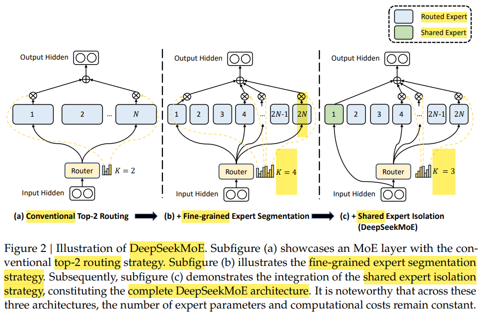
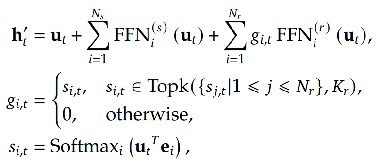
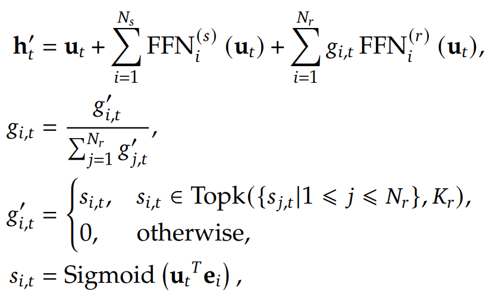
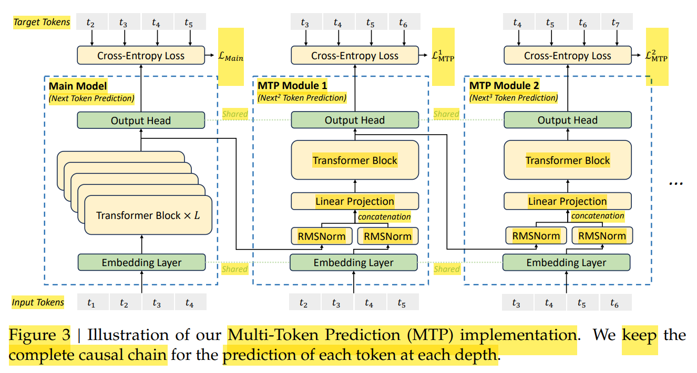
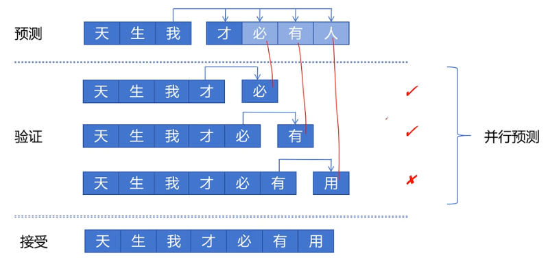
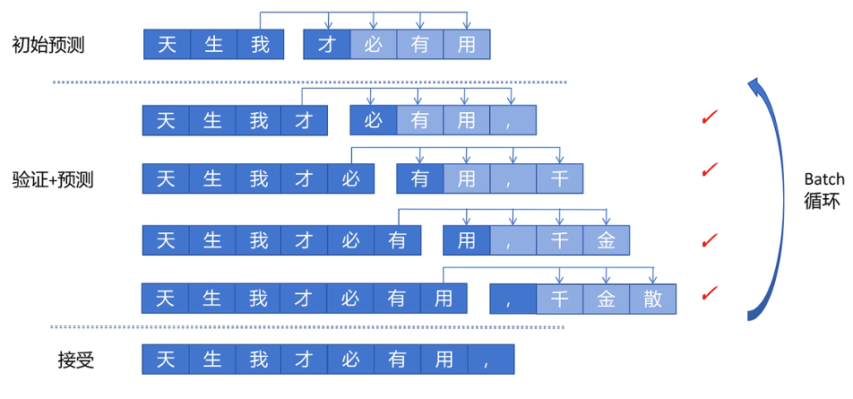

# DeepSeek

[DeepSeek - B站视频(RethinkFun)](https://space.bilibili.com/18235884/lists/4906445?type=season)

## Table of Contents

- [DeepSeek](#deepseek)
  - [Table of Contents](#table-of-contents)
- [DeepSeek-MoE](#deepseek-moe)
  - [经典 MoE](#经典-moe)
  - [DeepSeek-MoE 改进](#deepseek-moe-改进)
- [DeepSeek-V2 : MLA](#deepseek-v2--mla)
- [DeepSeek-V3 : Multi-Token Prediction](#deepseek-v3--multi-token-prediction)
  - [MoE + MLA 方案改进](#moe--mla-方案改进)
  - [Multi-Token Prediction (MTP)](#multi-token-prediction-mtp)
- [DeepSeek-GRPO](#deepseek-grpo)

---

# DeepSeek-MoE

2024/01 提出

## 经典 MoE

**Mixture-of-Experts**
1. 将 前馈网络(FFN) 稀疏化，改造 为 Router + 多个 expert FFNs
2. 模型权重 绝大部分集中在 FFN，而非 Attention 的 QKV 等
3. 
4. 

Router 用于选择 expert
1. 通常只是简单的 线性层
2. 输入维度 $D_{\text{model}}$，输出维度 $N_{\text{expert}}$
3. 一般是 **Top-K Routing**，方便做 Tensor 并行和 Buffer 预分配，硬件利用率最高，对分布式集群更友好

**==P.S.==**
1. experts 的选择是 ==token-wise==，而不是 sequence-wise
2. 每个 layer 都可以选择 不同的 experts

MoE 稀疏性(Sparsity) 带来的 特点
1. 计算量(FLOPs)
   1. 总参数量 接近 Dense-Large，但 FLOPs 远小于 Dense-Large Model
   2. 训练 & 推理 都接近 Dense-Small(实际激活的专家数量) Model
2. 硬件效率(Throughput)
   1. 由于 Router & Communication(All-to-All) Overhead
   2. 利用率 不如 Dense Model
3. 收敛速度
   1. 总参数大，样本效率(Sample Efficiency) 比 Dense-Small 高，收敛到目标 Loss 所需的 Token 数更少
   2. 即使 处理每个 Token 的时间比同规模 Dense-Small 慢，但 所需步数 少，成本更低
   3. Loss 曲线 更贴近 Dense-Large，因为 取决于 总参数量(知识容量)
4. 知识解耦
   1. MoE，理论上 不同的专家 会演化出 对不同领域的能力

技术挑战
1. **负载均衡(Load Balancing)**
   1. 马太效应 : 路由模块 偏心(Bias) 使得 能力弱的专家 能力越来越差 (难被 路由模块 选中，没有被激活 因此 停止学习)，训练过程不稳定
   2. 解决方案
      1. Noisy Top-K Routing，增加探索(Exploration)
      2. 设置 Token 容量(Token Capacity)
         1. 限制每个专家 处理的 Token 数量
         2. Top-K 中 跳过超过容量的(再重新归一化)，如果都 超过就跳过，信息 由 残差链接 传到下一层
         3. 由 GShard 和 Switch Transformer(ST-MoE) 引入
      3. 引入 **==Expert-Level Auxiliary Loss==**，强制路由器均匀分配任务
2. 通信开销(Communication Overhead)
   1. 分布式训练中，不同的 专家通常分布在不同的 GPU 上
3. 显存占用
   1. 为了能随时调用，所有专家都必须驻留在显存中
   2. 对硬件的 内存容量 要求 依然是 **参数总量**

## DeepSeek-MoE 改进

标题中 Towards Ultimate Expert Specialization in Mixture-of-Experts Language Models - 让专家更专精

DeepSeekMoE 架构
1. 
2. **观点** : 传统 MoE 专家数 太少，每个 专家还不够专精
3. **改进** : **细粒度专家(Fine-grained Experts)** + **共享专家(Shared Experts)**
   1. 细粒度专家 : 总专家数 翻倍，每个专家 参数量 减半，激活的专家数 也翻倍，总参数量不变
   2. 共享专家 : 每次都被激活，负责 基础通用能力

Shared Experts 数量 比 Routed Expert 数量 少很多

Device Limited Routing : Top-K 两步走
1. 选 Device
   1. 全量 experts 算分，得到 devices 得分(device 上 experts 的最高分)
   2. 选出 Top-M 个 devices
2. 选 Experts
   1. 从 Top-M 个 devices 的 experts 中，再选出 Top-K

5. 并行策略
   1. Routed Experts : Expert Parallelism，被切割分发 到不同 devices
   2. Shared Experts : Data Parallelism，不会被切割分发，而是每个 device 中都保存一份完整的 权重

**DeepSeek MoE 的 Auxiliary Loss** (for Routed Expert)
1. **==Expert-Level==**
   1. **理想** : $Loss_\text{balance} = \sum_{i=1}^{N_{\text{expert}}} (f_i)^2$
      1. $f_i$(实际负载频率) : 真实发送给专家 $i$ 的 Token 比例，**Top-K 路由后的实际结果**
      2. 如果 某个 expert 有很高的 frequency，则 Loss 很大，**最优情况 就是 freq 一样，平分负载**
      3. 问题
         1. top-k 或 argmax是 **不可导(Non-differentiable)**，无法 反向传播 & 梯度下降优化
   2. **实际** : $Loss_\text{balance} = \sum_{i=1}^{N_{\text{expert}}} f_i P_i$
      1. $P_i$(路由概率均值) : **Router 对专家 $i$ 分配概率的平均值**，还没做 Top-K 选择之前
      2. $P_i = \frac{1}{T} \sum_{j=1}^{T} \text{Softmax}(\text{Router}(x_j))_i$ (T 是 token 数量)
      3. **GShard 提出的**
   3. 先在单个 sequence 上计算 expert-level loss，然后 在 batch 上求和
2. 还有 `Device-Level` / `Communication` Balance Loss
   1. 纯粹 为解决 训练阶段的 硬件物理瓶颈，不会增加 Inference(推理) 过程中的任何计算负担
3. **==Device-Level==**
   1. routed experts 分为 groups，每个 group 部署在一个 device 上
   2. 防止 Batch 的 Token 全都分给 少数 devices 上的专家
   3. 强迫 Router 保证 各个显卡 计算量一致
   4. $P'_i = \sum_{j \in \mathcal{E}_i} P_j$ : Device上 Experts 的 Router分配概率 总和
   5. $f'_i = \frac{1}{|\mathcal{E}_i|} \sum_{j \in \mathcal{E}_i} f_j$ : Device上 Experts 实际 Top-K 被选中的 平均频率
      1. $\frac{1}{|\mathcal{E}_i|}$ 只是为了进行 梯度缩放
      2. experts 会被平均分配
4. **==Communication==** :
   1. MoE 训练时，Token 要 `All-to-All` 通信，通过网络(eg : NVLink/InfiniBand) 发送到别的显卡 找专家
   2. $MT$ : Tokens * Max_Devices
   3. 数据包总量最大是 $MT$ 个 Hidden States
   4. $f''_i = \frac{D}{MT} \sum_{t=1}^T \mathbb{1}(\text{Token } t \text{ is sent to Device } i)$
   5. $P''_i$ 和之前 Device-Level 的 $P'_i$ 完全一致

提升推理效率 (工程层面)
1. 通信 & 计算 并行 (DBO, dual batch overlap) - TODO
   1. 把一个 Batch 拆成两个小 Batch
   2. 第一个 Batch 做 通信(All-to-All) 时，第二个 Batch 做 计算(Attention/FFN)
2. 大规模专家并行 (WideEP, wide expert parallel)
   1. 当专家数量非常多且分布在很多卡上时，传统的专家并行(EP)导致单次通信的数据包太小，无法填满网络带宽
   2. 针对大规模集群重新设计的并行策略
   3. 优化 跨节点专家 排布方案，减少了跨节点(Inter-node)的通信量，优先在 NVLink 覆盖的机柜内完成数据交换

[如何系统的入门大模型？](https://www.zhihu.com/question/621550974/answer/3472996606)

[transformer的细节到底是怎么样的？](https://www.zhihu.com/question/362131975/answer/3369782613)

[MoE(Mixture-of-Experts)大模型架构的优势是什么？为什么？](https://www.zhihu.com/question/634844209/answer/3364787819)

[Mixture-of-Experts (MoE) 经典论文一览](https://zhuanlan.zhihu.com/p/542465517)

---

# DeepSeek-V2 : MLA

2024/05 提出

FFN 上，继续保留 MoE 架构

Attention 上，提出 MLA (Multi-head Latent Attention)

**Low-Rank Compression** (注 : 下面的公式 使用 ==column vector==，和平时 row vector 不同)
1. KV Joint 压缩
   1. attention input (hidden state) $\mathbf{h}_t$ 通过 **降维矩阵**(Down-Projection) 压缩成 latent vector $\mathbf{c}_t^{KV}$
      1. $\mathbf{c}_t^{KV} = W^{DKV} \mathbf{h}_t$
      2. 压缩后维度 $d_c \ll d_h*n_h$
   2. 用 2个 **升维矩阵**(Up-Projection) **分别** 解压出 Key & Value
      1. $\mathbf{k}_t^C = W^{UK} \mathbf{c}_t^{KV}$
      2. $\mathbf{v}_t^C = W^{UV} \mathbf{c}_t^{KV}$
   3. **升维矩阵 可以被 权重吸收(Weight Absorption)**
      1. 分别 融合到 权重矩阵 $W^{Q}$ & $W^{O}$ 中
      2. 有了 融合后的 矩阵的权重，不需要 显式 计算出 keys & values
   4. 推理时，只 cache latent vector $\mathbf{c}_t^{KV}$，共 $d_c * n_\text{layer}$ 个 elements
2. Q 压缩 (呼应)
   1. 训练时，减少 activation memory
      1. 其实 Q & KV-Joint 压缩 都有该优势，只是 Q 压缩 对于 inference 减少 KV Cache 没有帮助
      2. 必须 结合 **激活重计算** 才能减少，否则是僧伽
      3. 只保留 latent，反向传播 用矩阵 重新算一下
   2. 呼应 KV Joint 压缩，先 降维再升维
      1. $\mathbf{c}_t^Q = W^{DQ} \mathbf{h}_t$
      2. $\mathbf{q}_t^C = W^{UQ} \mathbf{c}_t^Q$
3. **不同于 AE，必须是 纯线性，不能加 非线性激活函数**
4. KV 的 Joint 压缩维度 $d_c$ 和 Q 的压缩维度 $d_c^\prime$ **可以不同**
   1. KV 压缩 为了减少 KV Cache，必须 极限压缩
   2. Q 压缩 可以适当放松，给 Representation 留更多空间

**Decoupled RoPE(Rotary Position Embedding)**
1. [RoPE - 个人笔记](../Llama/RoPE.md)
2. RoPE 和 Low-Rank Compression 不兼容，无法进行 权重吸收
   1. $q_i R_i (k_j R_j)^T = h_i W^Q R_i (c_j^{KV} W^{UK} R_j)^T = h_i W^Q R_i R_j^T {W^{UK}}^T {c_j^{KV}}^T $
3. 解决方案 : 给 Q & K 额外增加维度，表示 位置信息
   1. Query
      1. $\mathbf{q}_t^R = \text{RoPE}(W^{QR} \mathbf{c}_t^Q)$
      2. 生成带有位置信息的向量，$W^{QR}$ 把 $\mathbf{c}_t^Q$ 映射出狭窄的维度，然后 应用 RoPE
      3. ==不同 head 间 不共享==
      4. **再和 $\mathbf{q}_t^C$ 拼接起来**，组成完整的 Query
   2. Key
      1. $\mathbf{k}_t^R = \text{RoPE}(W^{KR} \mathbf{h}_t)$
         1. **==不同 head 间 shared(共享的)==**
         2. **==注意用的 不是 latent $\mathbf{c}_t^{KV}$，而是 未被压缩的 hidden state $\mathbf{h}_t$==**
            1. KV 的 latent 被 极致压缩了
   3. Trade-Off
      1. 内容通道(大部队) 可以被 权重融合(KV Cache 变小，只保存 latent)
      2. 位置通道 无法权重融合，只需要 Cache 少量 key 的 位置信息
4. 关于 **共享/不共享** & **基于hidden/基于latent**
   1. 最好的方法 肯定是 基于 Hidden State 向量直接计算 并且 不共享，但是 增加显存 & 降低计算效率
   2. Query
      1. 基于 latent : 每次都要计算，需要 减少参数量 & 增加计算效率
      2. 不共享 : 保证 representation 能力
   3. Key
      1. 基于 hidden : 会被缓存，不用每次计算
      2. 共享 : 减少显存占用
         1. 只要 Q 是 不共享的，即使 K 是 共享的，算出来的点积(匹配分数) 依然是 多头的
         2. 之前的 绝对正余弦位置编码 不需要考虑 是因为 input hidden 本身就包含了 位置信息

---

# DeepSeek-V3 : Multi-Token Prediction

2025/02 提出

## MoE + MLA 方案改进

同样是 DeepSeekMoE + MLA 方案，但实现细节不同

|DeepSeek-V2                          |DeepSeek-V3                          |
|-------------------------------------|-------------------------------------|
|||

计算公式形式 **==一致==**
1. $$\mathbf{h}'_t = \mathbf{u}_t + \sum_{i=1}^{N_s} \text{FFN}_i^{(s)}(\mathbf{u}_t) + \sum_{i=1}^{N_r} g_{i,t} \text{FFN}_i^{(r)}(\mathbf{u}_t)$$
2. $\mathbf{u}_t$  : 第$t$个Token 输入FFN的 向量 (既是输入，也是残差链接)
3. $\mathbf{h}'_t$ : 对应的 FFN 输出
4. $N_s$ & $\text{FFN}_i^{(s)}$ : $N_s$ 个 Shared Experts
   1. 不用乘权重 $g_{i,t}$，是 常驻的，每个 Token 都会经过这些专家处理，捕捉通用的知识
5. $N_r$ & $\text{FFN}_i^{(r)}$ : $N_r$ 个 Routed Experts
   1. $g_{i,t}$: 门控权重(Gating Weight)

Routing 模块 **==一致==**
1. $\mathbf{u}_t$ : 第$t$个 Token 输入FFN的 向量
2. $\mathbf{e}_i$ : 第$i$个 路由专家 的 质心向量/特征向量(该专家最擅长处理的特征方向)
3. $\mathbf{u}_t^T \mathbf{e}_i$ : 计算 输入向量 & 专家向量的内积，越大说明当前 Token 的特征与该专家的专长越匹配

routed experts 的 Gating Weight 计算 **==不同==**
1. DeepSeek-V2
   1. $$s_{i,t} = \text{Softmax}_i(\mathbf{u}_t^T \mathbf{e}_i)$$
      1. `softmax` 使得 routed experts 之间 **全局竞争**，分数之和为 1
   2. Top-K 截断 一致
2. DeepSeek-V3
   1. $$s_{i,t} = \text{Sigmoid}(\mathbf{u}_t^T \mathbf{e}_i)$$
      1. `sigmoid` 给 routed experts 独立打分
   2. Top-K 截断 一致
   3. 权重重归一化(Renormalization)
      1. $g_{i,t} = \frac{g'_{i,t}}{\sum_{j=1}^{N_r} g'_{j,t}}$
      2. **作用 & 必要性**
         1. softmax : 全局考虑，绝对数值相对稳定，不会 Top-K 都是很小的值
         2. sigmoid : 独立打分，会出现 某些 Token 跟 所有专家的特征 都不太匹配，得分都很小，直接乘到专家的输出上会使得 训练信号幅度不稳定

负载均衡(Load Balance)策略 **==不同==**
1. DeepSeek V2
   1. 计算 Loss 时，额外加上 辅助损失(Auxiliary-Loss)
   2. Expert-Level / Device-Level / Communication
2. DeepSeek V3
   1. **无 辅助损失 的 负载均衡 (Auxiliary-Loss-Free)** (主 strategy)
      1. 每个专家 增加 动态的 **`bias`** (**==仅在 routing 的 Top-K 截断起作用，不参与 后续 加权求和==**)
         1. 纯净实力 $s_{i,t}$ : 由 输入特征 & 专家特征 内积，再过 `sigmoid` 得到，代表真实的匹配度
         2. 竞选分数 $s_{i,t} + b_i$ : 拿着 纯净实力 加上系统的 偏心分 bias，去参加 Top-K 的排名
         3. 为了让 bias 能独立地调节 某个专家的 被选中概率，而不挤压其他专家，必须放弃 全局竞争性质的 `softmax`
         4. bias 是相当于是 **负反馈调节器**，属于 `register_buffer`，拥有 贯穿整个训练生命周期的 长效记忆
         6. **更新逻辑** (每个 batch/step 更新)
            1. $$b_i^{(t)} = b_i^{(t-1)} + \gamma \cdot \text{sign}\left( \frac{K_r}{N_r} - f_i \right)$$
            2. 如果实际频率 $f_i$ 大于配额，括号内为负，$\text{sign}$ 输出 -1，偏置减 $\gamma$；反之则加 $\gamma$
            3. $\gamma$ : bias update speed 是个极小的值
               1. 论文里，开始是 0.001，而 训练最后阶段 调整为 0
               2. 后期，各个专家已经形成了极其稳固的专业特长，关掉 $\gamma$，彻底释放模型的自然路由能力，即使局部稍微有点不平衡，为了最终的 Loss 收益也是值得的
         7. Inference 阶段，保留训练好的 bias，不再用 $\gamma$ 更新
   2. Complementary ==Sequence-Wise== Auxiliary Loss
      1. 之前的 DeepSeekMoE 的 expert-level / device-level / communication 辅助损失都是 ==Batch-Wise==
      2. 为了防止 单条 sequence 内的 极端 imbalance
         1. 大模型会使用 Document Packing，把 不同内容 强行拼接为 sequence
      3. $$\mathcal{L}_{\text{Bal}} = \alpha \sum_{i=1}^{N_r} f_i P_i$$
         1. $$f_i = \frac{N_r}{K_r T} \sum_{t=1}^T \mathbb{1}(s_{i,t} \in \text{Topk}(\dots))$$
            1. 遍历这条 Sequence 里的所有 $T$ 个 Token，数到底有几个 Token 最终被分配给了专家 $i$
            2. $\frac{N_r}{K_r T}$ : 归一化系数
               1. $N_r$ 个 experts，每个 token 选 $K_r$ 个，选 T 次(sequence 长度 T)
               2. 如果绝对公平地平分给 $N_r$ 个 experts，应该分到 $\frac{K_r T}{N_r}$
         2. $$P_i = \frac{1}{T} \sum_{t=1}^T s'_{i,t}$$
            1. router 有多想把这条 Sequence 的工作交给专家 $i$
         3. $$s'_{i,t} = \frac{s_{i,t}}{\sum_{j=1}^{N_r} s_{j,t}}$$
            1. 归一化，router 给 experts 的 原始纯净分数(无 Top-K 截断) $s_{i,t}$ 除以 所有 experts 的总分
         4. 除以 $T$ 能消除 不同长度序列的不平等
      4. 该 Loss 在 DeepSeek-V3 中是个极小的值

## Multi-Token Prediction (MTP)

优势
1. densify 训练信号，增强 数据效率
2. 使模型能够 pre-plan representation，有助于预测未来 tokens

==说明==
1. Main Model 相当于 MTP Module 0
2. 除了 Main Model 还有 $D$ 个 MTP Modules (一次性预测 $D + 1$ 个 token)，D 不宜设置的过大 (后续预测不准，浪费算力)
3. Token 位置索引 **$1, 2, \cdots, T$**

**MTP Modules 实现**
1. ==核心思想 : 保留完整因果链的串联预测(sequential modules)==，后面的 Module 可以利用 前面 Module 输出的 信息
2. $$\mathbf{h}_{i}^{\prime k} = M_k [ \text{RMSNorm}(\mathbf{h}_i^{k-1}) ; \text{RMSNorm}(\text{Emb}(t_{i+k})) ]$$
   1. 前一个模块的 Transformer Block 的结果 & 当前模块的 input 的 Embed 结果，分别 RMSNorm，然后进行 **拼接**，再 线性投射
   2. 作为后续 MTP Model 的 Transformer Block 的 input 一部分
   3. $M_k \in \mathbb{R}^{d \times 2d}$ : projection matrix，把 两倍长度的向量 降维回 原始长度
   4. $\text{Emb}$ : 共享的 Embedding Layer
3. $$\mathbf{h}_{1:T-k}^k = \text{TRM}_k(\mathbf{h}_{1:T-k}^{\prime k})$$
   1. 作为后续 OutHead 的输入
   2. $\text{TRM}_k$ : Transformer Block
4. $$P_{i+k+1}^k = \text{OutHead}(\mathbf{h}_i^k)$$
   1. $\text{OutHead}$ : 共享的 Output Head
   2. 后续再通过 softmax 得到预测概率

**Training**
1. 单个深度的交叉熵 Loss
   1. $$\mathcal{L}_{\text{MTP}}^k = \text{CrossEntropy}(P_{2+k:T+1}^k, t_{2+k:T+1}) = - \frac{1}{T} \sum_{i=2+k}^{T+1} \log P_i^k[t_i]$$
   2. 第 $k$ 个 MTP 模块预测出来的概率分布 $P^k$，和真实的未来 Token 序列 $t$ 做对比
2. 总的 MTP Loss
   1. $$\mathcal{L}_{\text{MTP}} = \frac{\lambda}{D} \sum_{k=1}^D \mathcal{L}_{\text{MTP}}^k$$
      1. **不包含 Main Module**
      2. $D$ : MTP Module 的总个数 (预测深度)
      3. $\lambda$: 权重系数 (早期设为 0.3，后期设为 0.1)
   2. 所有 MTP 模块(Main Model & MTP Model) 产生的 Loss 求和平均，再打个折扣 $\lambda$
3. $$\mathcal{L}_{\text{Total}} = \mathcal{L}_{\text{Main}} + \mathcal{L}_{\text{MTP}}$$
4. 训练时，无需因为 保留完整因果链的串联预测 而等待，因为有 标准答案，直接用 **==causal mask==** 即可

**Inference**
1. **投机解码(Speculative Decoding)**
   1. **前提** : ==只适用于 整个集群 生成 单个sequence(不同 GPU 用于验证)==
   2. 可以增加 推理速度，代价是 增加 GPU 计算量
   3. **简化版**
      1. 
      2. 先进行一次 预测，Main Model 预测的最准，后续 MTP Module x 不确信
      1. 根据 MTP 结果，构造 batch，并行验证 先只得到 Main Model 的结果
      2. 并行验证的耗时 基本上等于再生成一个 token
      3. 接受 最长的正确序列，如果 验证 和 预测 结果不同，相信/接受 验证的 Main Model 的推理结果
   1. **预测 & 验证 可以合并**
      1. 
      2. 并行验证 同时得到 Main Model & MTP Modules 的结果
1. 因此 DeepSeek ==核心目的== 是希望通过 MTP 在训练阶段 提升模型性能，实际 在推理部署阶段 只使用 Main Model 独立工作

---

# DeepSeek-GRPO

