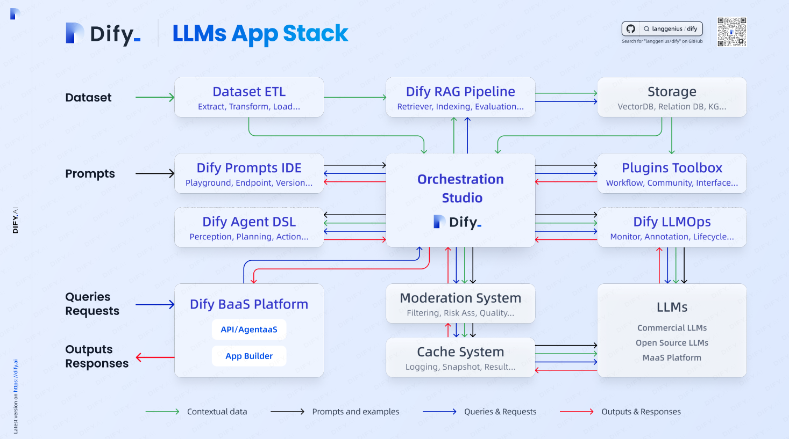
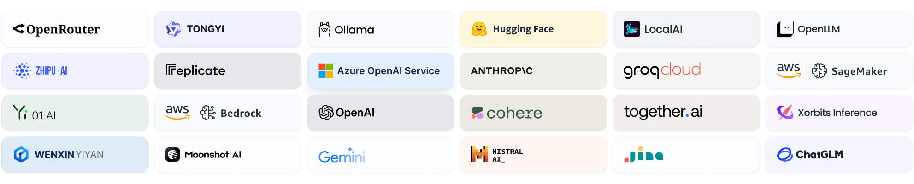
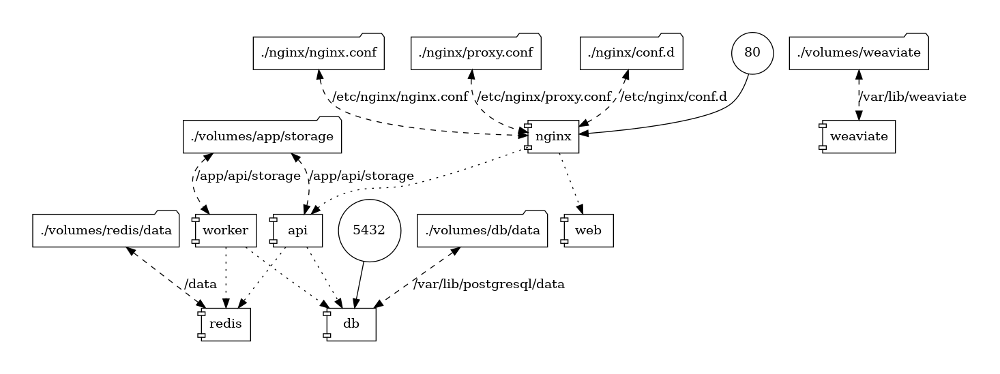
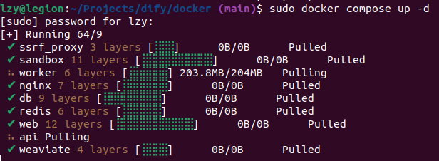
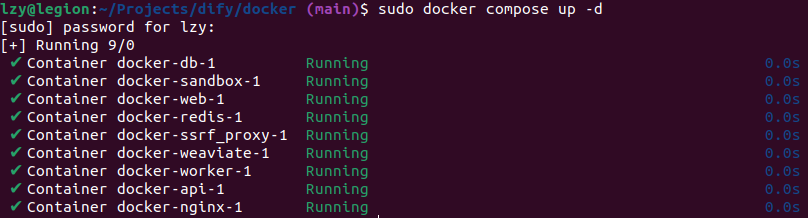
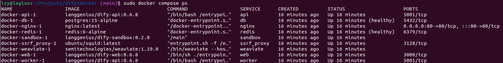

# Dify

**[Dify - Github](https://github.com/langgenius/dify)**

**[Dify.ai - zh/cn](https://dify.ai/zh)**

**[Dify.ai - en/us](https://dify.ai/)**

**[Dify Docs](https://docs.dify.ai/v/zh-hans)**

**[Dify LLMs App Stack](https://assets.dify.ai/files/dify_llms_app_stack_cn.pdf)**



---

## Table of Contents

- [Dify](#dify)
  - [Table of Contents](#table-of-contents)
- [Dify Docs 文档](#dify-docs-文档)
  - [Introduction](#introduction)
  - [Dify Deployment](#dify-deployment)
    - [Docker Compose 部署](#docker-compose-部署)
  - [模型](#模型)
- [Trouble Shooting](#trouble-shooting)
  - [address already in use](#address-already-in-use)


---

# Dify Docs 文档

**[Dify Docs](https://docs.dify.ai/v/zh-hans)**

## Introduction

**[项目特性 & 技术规格](https://docs.dify.ai/v/zh-hans/getting-started/readme/features-and-specifications)**
1. 开源
2. 后端技术 - Python/Flask/PostgreSQL
3. 前端技术 - Next.js
4. LLM 推理引擎 - Dify Runtime ( 自 v0.4 起移除了 LangChain)
5. API 规格 - RESTful
6. 部署方式 - Docker, Helm(Kubernetes)
7. 向量数据库支持 - Qdrant(推荐)，Weaviate，Zilliz
8. RAG(知识库)、ETL、Prompt、AgentWorkflow、MaaS



**[模型供应商列表(原生支持)](https://docs.dify.ai/v/zh-hans/getting-started/readme/model-providers)**
1. LLM
   1. 国外 - OpenAI, Anthropic, Ollama, HuggingFace, Replicate
   2. 国内 - 智谱, 百川, 星火, Minimax, 通义千问, 文心一言
2. Embedding - OpenAI, Cohere, HuggingFace, 智谱, 百川, Minimax
3. ReRank - Cohere, Jina, Xinference


**理念**
1. **Backend-as-a-Service** : 后端即服务，不再编写或管理所有服务端组件，可以使用领域通用的远程组件(而不是进程内的库)来提供服务
2. **LLMOps**(Large Language Model Operations) - 涵盖了大型语言模型 **训练、开发、部署、监控、维护、优化、安全**
   1. 数据准备 - 数据收集、预处理工具，简化数据清洗和标注
   2. Prompt Engineering - Prompt 编辑和调试
   3. Embedding & LongContext - 自动处理长上下文的嵌入、存储和管理
   4. 应用监控 & 维护 - 监控性能 + 日志记录
   5. Fine Tuning - 提供一键微调功能
   6. DevOps - 支持多人协同、易用的界面

**内置 构建 LLM 应用所需的关键技术栈**
1. 对数百个模型的支持
2. 直观的 Prompt 编排界面
3. 高质量的 RAG 引擎
4. 稳健的 Agent 框架
5. 灵活的流程编排
6. 易用的界面和 API


## Dify Deployment

[Dify CE - Github](https://github.com/langgenius/dify)



### Docker Compose 部署

查看 **`docker`** & **`docker compose`** 版本

```bash
lzy@legion:~ $ docker --version
Docker version 26.1.2, build 211e74b

lzy@legion:~ $ docker compose version
Docker Compose version v2.24.6-desktop.1
```

**Clone**

```bash
git clone https://github.com/langgenius/dify.git
```

**Start**

```bash
cd dify/docker
sudo docker compose up -d
# -d = --detach 以后台模式运行容器。命令执行后，容器将继续运行，而终端会立即返回提示符，允许用户执行其他命令
# sudo docker compose down  # Stop
```

deployment procedure



deployment result



```bash
docker compose ps
```



**Upgrade**

```bash
cd dify/docker
git pull origin main
docker compose down
docker compose pull
docker compose up -d
```

**Access**

访问 Dify 在浏览器中输入 [http://localhost](http://localhost)


## 模型


# Trouble Shooting

## address already in use

```bash
Error response from daemon: driver failed programming external connectivity on endpoint docker-nginx-1 (518a38b260347b1acfa47e8217c71874c44ba04354cedbd3f3f3303929528e20): Error starting userland proxy: listen tcp4 0.0.0.0:80: bind: address already in use
```

solution

```bash
# Linux
sudo lsof -i :80
sudo kill -9 <PID>


# Windows
netstat -ano | findstr :80
taskkill /PID <PID> /F
```


