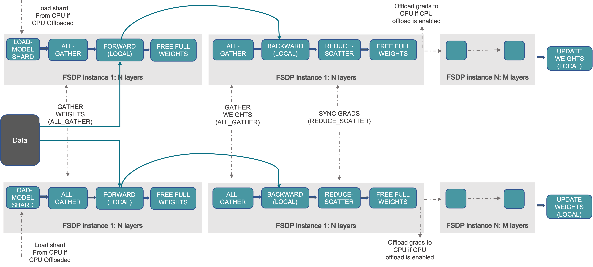

# Fully Sharded Data Parallel (FSDP)

[Getting Started with Fully Sharded Data Parallel (FSDP2) - PyTorch Docs](https://docs.pytorch.org/tutorials/intermediate/FSDP_tutorial.html)

FSDP & DDP
1. DDP  思路 : 切分数据，复制 完整模型(参数、梯度、优化器状态)
   1. 内存冗余 : N个 模型副本
   2. 总显存需求 : N × ModelSize
   3. **通信内容** : 完整 梯度(backward)
      1. 前向传播 : 每个 GPU 都有完整模型，无需通信
      2. 反向传播 : 在每层梯度计算完成后，Ring All-Reduce(Reduce-Scatter + All-Gather) 同步完整的梯度
      3. 优化器更新 : 每个 GPU 使用同步后的完整梯度独立更新模型，无需通信
   4. 解决问题 : **加速训练**，**不能训练** 超过单卡限制的模型
2. FSDP 思路 : 切分数据，同时 **将 模型(参数、梯度、优化器状态) 也完全切分(分片)**，达到极高的显存效率
   1. 内存冗余 : 1个 模型分片 ($\frac{1}{N}$)
   2. 总显存需求 : 1 × ModelSize
   3. **通信内容** : 参数分片(前向/反向时 All-Gather) & 梯度分片(反向时 Reduce-Scatter)
      1. 前向传播 (Forward)
         1. **按层** All-Gather : 在计算某一层之前，将全部 GPUs 上的 该层参数分片收集起来，临时恢复出(**一层的**)完整的参数用于计算
         2. **计算后释放** : 立即释放 刚使用的 完整参数的显存
      2. 反向传播 (Backward)
         1. **按层** All-Gather : 为计算该层梯度，重复前向的 All-Gather 过程，临时恢复 完整参数
         2. **梯度同步** : Reduce-Scatter，同步(归约) 完整的梯度后，只保留属于自己的梯度分片(不执行 冗余的 All-Reduce)
         3. **计算后释放** : 释放临时完整的参数和梯度显存
      3. 优化器更新 : 每个 GPU 使用自己的梯度分片和优化器状态分片进行本地更新
   4. 解决问题 : **装下巨型模型**
   5. P.S.
      1. **按层 All-Gather**，在前向传播(Forward) 或 反向传播(Backward) 过程中，**任何一个 GPU 都不会保存整个模型的所有参数**，只会 临时保存 当前正在处理的 **那一层(Layer)** 的 完整参数
      2. 显存管理遵循 用完即弃(Use-and-Discard)
3. 场景
   1. 模型尺寸 小/中等
      1. DDP 是更优的选择，前向传播时无需进行任何通信，只在反向传播结束时进行一次 All-Reduce 来同步梯度
      2. FSDP 反而会引入额外的、不必要的通信开销，在 前向传播 和 反向传播 的每层计算之前，执行一次 All-Gather 操作，将该层所需的参数分片收集完整
   2. 模型尺寸 巨大
      1. 必须使用 FSDP，虽然通信开销大，但它是唯一能将模型装进内存的方案

FSDP 可以被认为是 DDP 的 `All-Reduce` 分解成了 `Reduce-Scatter` 和 `All-Gather` 操作
1. 

