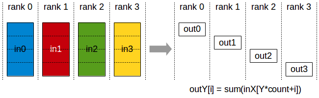

# NCCL

[NCCL Website - NVIDIA](https://developer.nvidia.com/nccl)

[NCCL Docs - NVIDIA](https://docs.nvidia.com/deeplearning/nccl/user-guide/docs/)

NCCL(NVIDIA Collective Communications Library，NVIDIA 集合通信库)，本质是 通信后端(Communication Backend)

PyTorch 会调用 底层配置的集合通信后端，在 GPU 环境下，这个后端通常是 NCCL

不是简单地使用标准网络协议，针对 NVIDIA 的硬件架构和连接拓扑进行了深度优化
1. 拓扑感知 (Topology Awareness) : 自动检测 GPU 之间的连接方式，无论是 **节点内** 单个 node (eg : 高速的 NVLink 和 PCIe) 还是 **节点间** 跨 nodes(eg : InfiniBand 或 高速以太网)，并据此选择最高效的通信路径和算法
2. 直接访问 (Direct Access) : 利用 CUDA 和 GPU 硬件特性，允许 GPU 之间直接进行数据传输，减少 CPU 介入，从而显著降低延迟

[Collective Operations - NVIDIA Docs](https://docs.nvidia.com/deeplearning/nccl/user-guide/docs/usage/collectives.html) - 通信操作合集 (下面的公式类似 **指针**，内存地址偏移量)
1. **Broadcast (广播)**
   1. 
   2. 将一个 GPU 上的数据 发送给所有其他 GPU，只有一个进程提供数据，每个进程都收到完整、相同的数据副本
   3. 用于初始化，确保所有 GPU 上的 模型副本 拥有 完全相同的**初始权重**
2. **Reduce**
   1. 
3. **All-Reduce (全局归约)**
   1. 
   2. 所有参与者(GPU) 贡献一个数据(梯度)，经过一个运算(eg : 求和、求平均)后，所有参与者都获得 最终的、统一的结果
   3. 分布式数据并行(eg : PyTorch DDP) 中最常用的操作，用于同步所有 GPU 计算出的梯度，求平均后返回给所有 GPU
4. **Scatter**
   1. 
5. **Reduce-Scatter (分散归约)**
   1. 
   2. 所有参与者都贡献一个数据，对这些数据进行归约(eg : 求和)，最终的结果会被分割成片段，分散到各个参与者手中，每个参与者 **只收到结果的部分**
   3. 需要区分 [`torch.Tensor.scatter_reduce`](https://docs.pytorch.org/docs/stable/generated/torch.Tensor.scatter_reduce_.html#torch.Tensor.scatter_reduce_)，是 张量操作函数，用于单 GPU/单个张量内部的数据处理和聚合
6. **Gather**
   1. 
7. **All-Gather (全收集)**
   1. 
   2. 每个参与者 贡献一个片段数据，所有参与者都收到 **完整的张量**(由所有参与者贡献的片段拼接而成)
8. **AlltoAll**
   1. 

---

# Ring All-Reduce

`Ring All-Reduce` (N张 GPUs 组成一个 ring，通信次数 2(N-1))
1. 可以被分解为 `Reduce-Scatter` 和 `All-Gather` 两个高效的步骤来执行
2. 
3. 阶段 1 - `Reduce-Scatter` (通信次数 (N-1)，非标准 NCCL)
   1. 结果是 每个设备保存一部分 reduce 之后的结果
   2. GPUs 形成一个环(去中心化)，每个 GPU 将自己的数据分块(data chunks)，并不断地向下一个 GPU 发送自己数据的一块 & 收到的上一块数据之和，直到所有 GPUs 都收到 所有分块的总和 中 属于自己的那一部分
   3. 每个设备收到右边设备的数据后，就把收到的数据累加到本地对应位置的数据上去
   4. 
4. 阶段 2 - `All-Gather` (通信次数 (N-1))
   1. GPUs 继续在 环上操作，每个 GPU 将自己持有的那一部分 归约结果分块，并向下一个 GPU 传递这些分块，直到所有 GPUs 都收集到了完整的、全局平均(或求和) 的梯度张量
   2. 

每个 GPU 总传输数据量(发送 & 接收) : $2 × (N - 1) × \text{ChunkSize} = 2 × (N - 1) × \frac{\text{TotalDataSize}}{N}$

优势
1. 高效的带宽利用率 (Efficient Bandwidth Utilization)
   1. 分块传输
   2. 流水线效应 : 通信(发送/接收) 可以与 计算(Reduce eg : 累加) 同时进行
   3. 点对点通信 : 只与直接邻居通信，能够充分利用 NVLink 或集群中的直连网络，避免了对远端节点的频繁访问
2. 均衡的通信负载 (Balanced Communication Load)
   1. 每个 GPU 发送和接收的数据量大致相同，计算负载(Reduce 操作) 也相对均衡地分布在各个步骤中
   2. Tree-Based 可能出现 根节点 通信瓶颈
3. 避免中心瓶颈 (Avoid Central BottleNeck) : 去中心化的，不存在单点故障或中心节点成为性能上限的问题
4. 可扩展性 (Scalability) : 恒定带宽需求，每个 GPU 发送&接收 总数据量 只与 原始数据大小有关，与 GPU 数量 无关

改进 : [Double-Binary-Tree All-Reduce - Nvidia Blog](https://developer.nvidia.com/blog/massively-scale-deep-learning-training-nccl-2-4/)，通过牺牲微小的带宽损失来换取巨大的延迟优势，两棵互补的二叉树 - TODO

