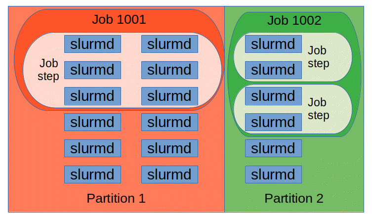

# SLURM (Simple Linux Utility for Resource Management)

[SLURM - Docs](https://slurm.schedmd.com/)

## Table of Contents

- [SLURM (Simple Linux Utility for Resource Management)](#slurm-simple-linux-utility-for-resource-management)
  - [Table of Contents](#table-of-contents)
- [Official Docs](#official-docs)

---

# Official Docs

[SLURM - Docs](https://slurm.schedmd.com/)

**Overview**
1. **open source, fault-tolerant, highly scalable** ==cluster management and job scheduling system== for large and small Linux clusters
2. requires **no kernel modifications** for its operation and is relatively **self-contained**(相对独立/自成体系)
3. **==3 key functions==**
   1. 资源分配(allocate) : 在指定的时间内，为用户分配计算资源(计算节点)的 独占/非独占 访问权
   2. 作业执行框架 : 提供一个框架，用于在分配的节点上 启动、执行、监控 用户的工作(通常是并行作业)
   3. 资源仲裁(arbitrate) : 通过管理一个 待处理工作队列 来解决 资源争用问题(contention for resources)

**Architecture**
1. 
2. **架构** 是 **主从式(Master-Slave)** 结构
   1. `slurmctld` 中央控制器守护进程 (Master)
      1. 运行在 管理节点
      2. 核心管理程序，负责集群的整体管理、资源分配和作业调度
      3. 支持可选的 热备 secondary slurmctld 实现故障转移 (optional fail-over(故障转移) twin)，达到 **高可用性**(High Availability)
   2. `slurmd` 计算节点守护进程
      1. 运行在 每个 计算节点
      2. 负责 管理该节点上的资源，接收 slurmctld 的指令，执行、监控作业
      3. 提供 容错的(fault-tolerant) 分层通信(hierarchical communications)
   3. `slurmdbd` 数据库守护进程 (optional, recommended)
      1. 运行在 管理节点
      2. 负责 与数据库(Database) 交互，存储和管理历史作业记录、计费信息等数据，支持多集群管理
3. 用户不需要 登录到某个特定的管理节点 才能 提交/查询 作业，只要能够访问集群中的 任何一台机器，就可以使用 SLURM 命令 管理在集群上的计算工作
4. **Entity 实体**
   1. 
   2. `Node` (节点)
      1. SLURM 中的计算资源，集群中的单台服务器或计算机
      2. 行用户任务的实际硬件，拥有 CPU、内存等资源
   3. `Partition` (分区)
      1. 将 Nodes 分组到 逻辑集合(logical sets)中，可以重叠
      2. 每个分区都有 一系列 **约束条件**
         1. 作业规模限制 (Job size limit)
         2. 作业运行时间限制 (Job time limit)
         3. 允许使用它的用户 (Permitted User)
      3. 具有优先级的 Job 会被分配到 Partition 内的 Node，直到该 Partition 内的资源(节点、处理器、内存等)被用尽
   4. `Job` (作业)
      1. **资源分配的单位**
      2. 为用户分配的 一定数量的资源(节点、核心)，并持续一段指定的时间
      3. 是用户提交给 SLURM 的 基本工作单元
      4. 一旦 Job 被调度，就获得了对一组节点的 独占/共享 使用权
   5. `Job Step` (作业步)
      1. **任务执行的单位**
      2. Job 内部的 一组(可能是并行)任务
      3. 作业步 是在 已分配资源内 实际执行并行工作 的方式
      4. 一个作业可以根据需要以任何配置启动多个作业步
      5. 一个单独的作业步可以使用分配给该作业的所有节点 (left)
      6. 几个作业步可以独立地使用分配资源的一部分 (right)

**Commands** - TODO

**Best Practices** : Large Job Counts
1. 使用 多 Job Steps(作业步) (但 Singke Job) 管理 相关联的工作(related work)
2. 使用 Job Arrays(作业数组) 管理 具有相同资源要求的 一系列批处理作业

**MPI** (Message Passing Interface，消息传递接口)
1. SLURM 不仅是一个 资源调度器，它还必须 以不同的方式 **集成** 到 并行程序的执行流程中
   1. 集成 : 深入参与到 MPI 进程的 启动 & 信息传递过程中，不是简单地启动一个程序就不管
2. 关系
   1. `SLURM` : 调度管理者，负责 启动、定位、监控这些 MPI 进程
   2. `MPI 库` : 通信系统，负责 连接和通信这些进程
   3. `MPI 进程` : 计算执行者
3. Implementations
   1. **高性能/现代方式** : SLURM 直接作为 MPI 任务的 **启动器** & **通信环境设置者**
   2. **兼容方式** : 对于 不支持直接集成的 旧版或特殊 MPI，SLURM 退一步，只负责分配资源，而将任务启动工作交给传统的 `mpirun` 命令，代价是 需要更复杂的 配置 & 监控

在高性能计算(HPC) 领域被广泛使用

与 Linux 系统和生态的良好兼容性

**SLURM 的主要功能**
1. **资源分配** : 为用户分配计算节点(CPU、GPU、内存等资源)，可以是 专享 或 非专享 的方式
2. **作业调度** : **管理 任务队列**，并根据预设的策略(如优先级、资源需求等) 合理地将用户的 计算任务(作业) 分配到 可用的计算节点上执行
3. **作业监控** : 监控正在运行的作业 直到它们完成

