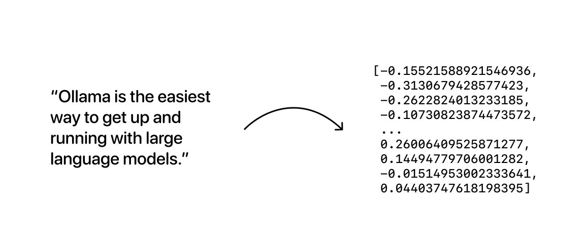

# Embedding Model

---

## Table of Contents

- [Embedding Model](#embedding-model)
  - [Table of Contents](#table-of-contents)
- [Embedding 模型 选择 \& 微调 - AI花果山](#embedding-模型-选择--微调---ai花果山)
- [Embedding 排行榜](#embedding-排行榜)
- [Nomic Embed](#nomic-embed)
- [FlagEmbedding (BAAI)](#flagembedding-baai)
- [word2vec](#word2vec)

---

**Embedding models** are trained to generate **vector embeddings** - (*arrays of numbers represent semantic meaning for text*)

embedding 将 数据(文本、图片) 转化为 高维向量

相关的数据在向量空间中彼此接近，而不相关的数据则相距较远

够捕捉词语和句子之间的语义关系，数据能够有效用于聚类、分类、信息搜索、知识库检索等应用场景

---

# Embedding 模型 选择 & 微调 - AI花果山

[RAG 高效应用指南 02：Embedding 模型的选择和微调](https://mp.weixin.qq.com/s/UiU-NdoqlZzWxyS6fwsl4A)

Embedding 的本质是一种将 **高维稀疏数据(文本)** 转换为 **低维稠密向量** 的技术，捕捉数据中的语义或特征关系
1. 文本中的每一个不同的单词都可以看作是一个维度，其维度高
2. 单词可以用几十到几百个维度的向量来表示，相较文本维度低

<!--  -->

Embedding
1. 提高计算效率
2. 捕捉到数据中的潜在关系 - 相似单词在低维空间接近

基于 文本相似性 的 文本处理任务
1. 内容审核
2. 意图分析
3. 情感分析
4. 推荐系统

Embedding 是文本的固定长度数值表示

索引(同时使用)
1. **倒排索引** - 基于关键词的**精确性检索**，语义理解能力弱
2. **向量索引** - 基于文本向量的**语义检索**，捕捉语义信息

# Embedding 排行榜

[HuggingFace - MTEB(Massive Text Embedding Benchmark)](https://huggingface.co/spaces/mteb/leaderboard)

# Nomic Embed

[Nomic Embed - 开源 Embedding Model](https://blog.nomic.ai/posts/nomic-embed-text-v1)

[HuggingFace - nomic-embed-text-v1: A Reproducible Long Context (8192) Text Embedder](https://huggingface.co/nomic-ai/nomic-embed-text-v1)

特点
1. Open source
2. Open data
3. Open training code
4. Fully reproducible and auditable

# FlagEmbedding (BAAI)

BAAI - Beijing Academy of Artificial Intelligence

RAG 开发时 会涉及到向量数据库，需要使用 Embedding 模型对文本进行 向量化 处理

大模型如 OpenAI,Gemini 的模型都提供可供调用的 Embedding 模型，但是根据 token 数量来收费

[FlagOpen - BAAI(北京智源人工智能研究院)](https://flagopen.baai.ac.cn/#/home)

[FlagEmbedding(BAAI) - Github](https://github.com/FlagOpen/FlagEmbedding)，中国人自己开发的，同时支持中文和英文

# word2vec

