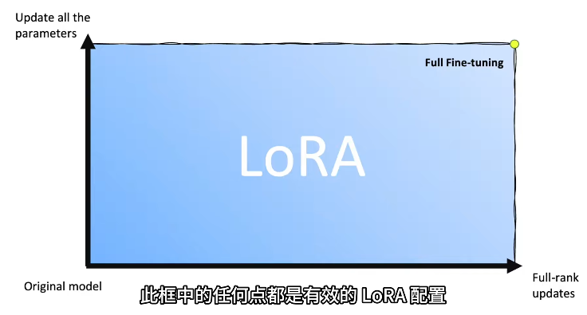
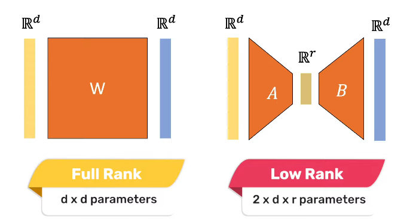
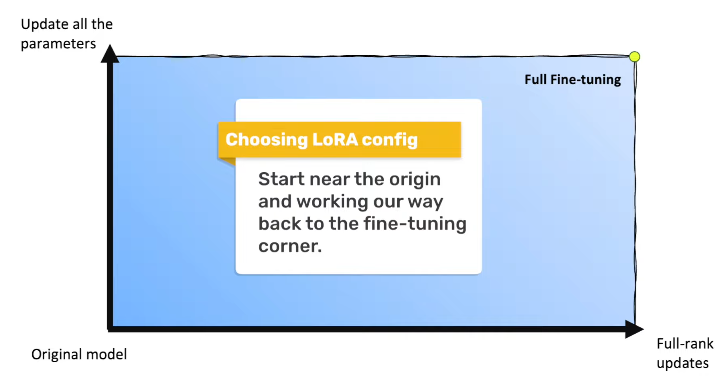
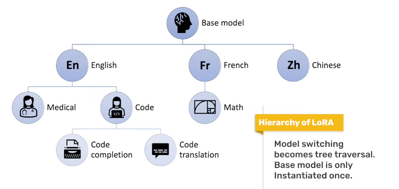

# 微调 Fine-Tuning

## Table of Contents

- [微调 Fine-Tuning](#微调-fine-tuning)
  - [Table of Contents](#table-of-contents)
- [微调](#微调)
- [灾难性遗忘 Catastrophic Forgetting](#灾难性遗忘-catastrophic-forgetting)
- [全量微调](#全量微调)
- [LoRA微调](#lora微调)
- [成本分析](#成本分析)

---

# 微调

模型训练 2个 阶段
1. **pre-trained** 预训练 的 通用大模型
   1. 使用 大规模 **通用数据集**
   2. 目标是开发 具备广泛知识基础的模型，能够 在多种任务和领域中 表现出基本的有效性
   3. 模型通常是高容量的，有大量的参数，可以从大数据中学习复杂的模式
2. **fine-tuning** 使用 私有化/domain-specific 数据 - 更好地适应特定应用的需求和特点
   1. SFT 模型 - supervised fine-tuning
      1. 数据格式 两个字段 `<input, output>`， `input` 为用户问题，`output` 由专家标注的标准答案
      2. 输入输出 仅确定用户想要的答案，没有告诉模型不想要什么答案
   2. Align 对齐 - 确系统在实际应用中 可靠、稳定、公正
      1. 数据格式 `<input, accept, reject>`
      2. 在模型上线后(`A/B Test`) 点赞点踩 可以获得
      3. PPO (Proximal Policy Optimization) - 强化学习方法，由 OpenAI 开发，用于训练深度学习模型在复杂环境中做出决策
      4. DPO (Dynamic Policy Optimization)

# 灾难性遗忘 Catastrophic Forgetting

模型再次训练(持续预训练、微调)后，目的专有能力增强，但 原有的预训练模型的通用能力减弱

灾难性遗忘不可避免，只能尽可能降低

处理方式
1. 不用管 - 对于只考虑专业性
2. 结合通用数据、通用指令 - 减缓通用能力的减弱
3. Adapter - 轻量级调整，在保持预训练模型大部分权重不变的情况下，引入少量可训练的参数来适应新任务
4. 只改变模型的某些部分 - eg : LoRA
5. Regularization 正则 - 限制模型参数变化不过大

# 全量微调

复杂度高，所有参数都需要学习，大部分参数冗余，价值有限

# LoRA微调

[HuggingFace - 🤗 PEFT: Parameter-Efficient Fine-Tuning of Billion-Scale Models on Low-Resource Hardware](https://huggingface.co/blog/zh/peft)

[LORA 论文 - LOW-RANK ADAPTATION OF LARGE LANGUAGE MODELS](./Paper/LoRA.pdf)

[Youtube - What is Low-Rank Adaptation (LoRA) | explained by the inventor](https://www.youtube.com/watch?v=DhRoTONcyZE)

PEFT - Parameter-Efficient Fine-Tuning - 参数高效微调，LoRA 是其中的一种

不希望模型改动太多，导致模型能力的遗忘

引入 额外的 低秩矩阵 更新 预训练模型 权重，从而使得只需要对这些较小的矩阵进行优化，而不是整个模型的权重

线性代数，将 大矩阵 拆解为 两个 小矩阵 相乘 (eg: $[100 \times 100] = [100 \times k] ·[k \times 100] $，k 为可变参数)，对于越重要的矩阵，k值越大

控制矩阵更新的秩来控制矩阵更新的能力

全面微调 是 LoRA 的一个特例

Full Rank -> Low Rank

配置 LoRA 时，可以从 原点 逐步往 右上角(全面微调)

LoRA 可以使得 checkpoints 更小

LoRA 不会引入 推理延迟(更新直接合并到原始参数中)，训练时会有 额外的低秩矩阵

可以并行执行多个 LoRA，各司其职

LoRA modules 具有 可加性，可以针对 语言、领域、任务、用户 单独，生成 树结构

# 成本分析

成本
1. GPU
2. 人力
3. 推理
4. 数据(收集、标注) - 不确定性大

