# 微调 Fine-Tuning

## Table of Contents

- [微调 Fine-Tuning](#微调-fine-tuning)
  - [Table of Contents](#table-of-contents)
- [大模型 微调/强化学习 - B站(RethinkFun)](#大模型-微调强化学习---b站rethinkfun)
  - [01 - 大模型预训练](#01---大模型预训练)
  - [02 - 大模型微调](#02---大模型微调)
    - [Chat Template - 对话模板](#chat-template---对话模板)
    - [Completions Only - 只针对回答的微调](#completions-only---只针对回答的微调)
    - [NEFTune - Noisy Embedding Fine-Tuning](#neftune---noisy-embedding-fine-tuning)
  - [03 - PPO 算法原理](#03---ppo-算法原理)
  - [04 - 大模型强化学习 PPO](#04---大模型强化学习-ppo)
    - [Reward Model](#reward-model)
    - [Head](#head)
      - [4个 Models](#4个-models)
    - [LoRA](#lora)
    - [自定义 Reward](#自定义-reward)
    - [优势函数 Advantage](#优势函数-advantage)
    - [训练的 Loss](#训练的-loss)
- [RL4LLM - B站(五道口纳什)](#rl4llm---b站五道口纳什)
- [微调](#微调)
- [灾难性遗忘 Catastrophic Forgetting](#灾难性遗忘-catastrophic-forgetting)
- [全量微调](#全量微调)
- [成本分析](#成本分析)

---

PPO (Actor + Critic + Reward + Ref)
1. GPT-4, Llama2
DPO (Policy + Ref)
1. Llama3, Qwen 1.5/2
GRPO (Policy)
1. DeepSeek-V3/R1


SFT
1. SFT 使用的是 人工(或更强的 AI) 精选的高质量 **指令-回复 pair (Prompt-Response Pairs)**，数据量通常比预训练小得多
2. 和 预训练 几乎一模一样，都是预测下一个字，关键区别：Loss Masking (损失掩码)，只计算 Answer 部分的 Loss (Prompt 是用户提供的)
3. 通常 不 全量微调(Full Fine-Tuning)，配合 PEFT (Parameter-Efficient Fine-Tuning) 技术，最常用的就是 **LoRA**

---

# 大模型 微调/强化学习 - B站(RethinkFun)

[大模型 微调/强化学习 - B站(RethinkFun)](https://space.bilibili.com/18235884/lists/3926642)

## 01 - 大模型预训练

LLM 预训练任务 是 预测下一个token，下一个 token 就是 label

```python
loss.backward()
optimizer.step()
optimizer.zero_grad()
```

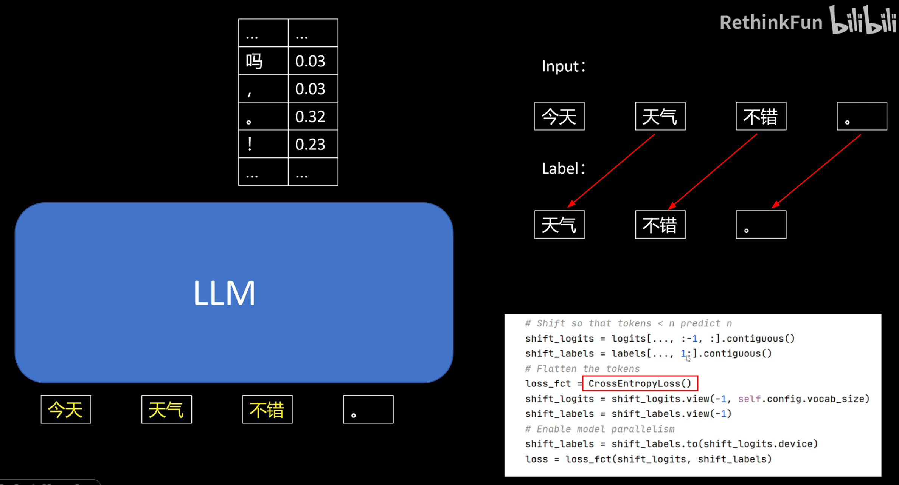

根据输入，不知道最后一个 token 下一位是什么，因此 最后的输出 会被舍弃，不进入 loss 计算`AutoModelForCausalLM` 会在内部 **自动完成** 左移一位(shift-one)的操作，把 labels 与 input_ids 形状保持一致传进去即可预测下一个词，相当于对词表做分类，因此使用 **CrossEntropy**

量化加载 + LoRA，可以在较小的显存下 预训练

数据预处理

`with training_args.main_process_first()`

group_text (常用范式)
1. 把所有文本拼成一条长串再按 max_seq_length 切块，不够 max_seq_length 的舍弃
2. 不会因为语义跨样本、句子在块末 戛然而止 就训练不好，拼接后形成的跨样本边界只占极小比例，不会主导梯度

[分布式训练 - 个人笔记](../Distributed/distributed.md)

`accelerate config` 多gpu分布式训练


## 02 - 大模型微调

SFT(Supervised Fine-Tuning)，在预训练之后

指令微调，专门用于提高模型遵循指令和进行多轮对话的能力

指令数据集，每条数据 包含一个 指令(Instruction/Prompt) & 对应的期望输出(Completion/Response)

### Chat Template - 对话模板

预训练的 大模型 只会根据提供的上文 续写，不一定会直接回答问题

预训练 & 指令微调
1. 网络结构 完全一致
2. 损失函数 基本相同
3. 训练数据 主要区别

预训练大模型 两个版本 : 预训练 & 指令微调(Chat Template)

Chat Template
1. 为多轮对话(即聊天) 提供一个 预定义的、结构化的 格式，以便模型能够正确地 解释&响应 对话内容
2. 保持一致的对话结构 : 区分用户的输入、模型的回复，以及系统级别的指令
3. 确保正确的角色识别 : 使用 特殊的标记或前缀(user, assistant, system) 来清晰地定义对话中不同角色的消息
4. 管理多轮对话的上下文 : 完整的对话历史，按照特定的格式，传递给模型
5. 优化模型性能 : 经过 聊天微调(Chat-Tuned) or 指令微调(Instruction-Tuned) 的模型，期望**特定的模板格式(原厂对话模板) 才能达到 最佳性能**

[Chat Template - HuggingFace Docs](https://huggingface.co/docs/transformers/main/chat_templating)

[Llama 3.1 Prompte Template - Meta Docs](https://www.llama.com/docs/model-cards-and-prompt-formats/llama3_1/#prompt-template)

例子
1. 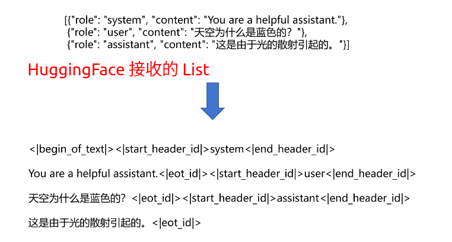
2. 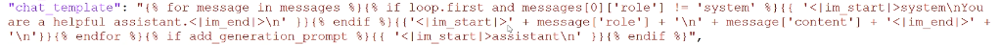


role
1. system : 系统设定
2. user : 用户输入
3. assistant : 大模型回答

**==大模型 和 tokenizer 唯一对应，也和 chat template 唯一对应==**，因此可以把 chat_template 放在 `tokenizer_config.json` 中

`tokenizer.apply_chat_template`，将 HuggingFace 能接收的 str list 转为 模型对应的 chat

推理时，加入 `<|start_header_id|>assistant<|end_header_id|>`，让大模型续写


### Completions Only - 只针对回答的微调

系统提示部分，没有必要计算 Loss

只对 回答部分 计算 Loss

使用 Loss Mask 来实现

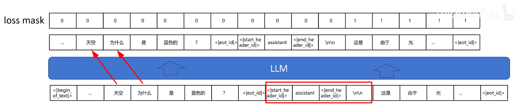

通过 特殊的 token 序列 : response_template `<|start_header_id|>assistant<|end_header_id|>\n\n` 找到回答的起始位置

起始位置之后的 才需要计算 loss，计算出所有 mask 位置的 loss 之后，取均值


### NEFTune - Noisy Embedding Fine-Tuning

对应 CV 领域的 数据增强

对于 NLP，指令微调的数据，通常需要人手动构造，采集代价大，且 模型参数量 更大

Token 进入 Large Model 的第一步是 Embedding

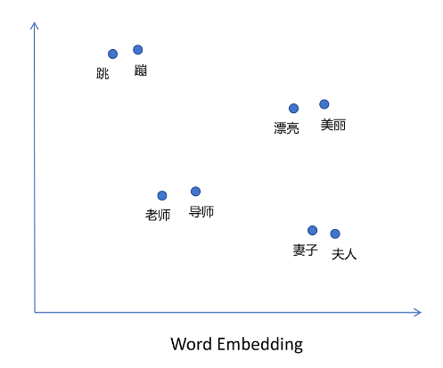

意思相近的词，在向量空间中的距离相近

通过给 token 的 embedding 加入 Noise，让原本 token 变为意义相近的 token，相当于增加样本的丰富度，最终提高模型精度

参数 $\alpha$ 调整增加噪声的强度
1. 对于整个序列 加噪声
2. 要 × $\frac{1}{\sqrt{dims}}$ 得到 magnitude norm，每个元素都添加 ± mag_norm 的噪声
3. dims 是序列总维度(token数 × 向量维度)


## 03 - PPO 算法原理

[PPO - 个人笔记](../../ReinforcementLearning/PPO/PPO.md)


## 04 - 大模型强化学习 PPO

[HuggingFace TRL(Transformer Reinforcement Learning)](https://huggingface.co/docs/trl/index)

在 Pre-train & SFT 之后，并且需要 一个预先训练的 Reward 模型，给模型输出打分，提供奖励信号

### Reward Model

需要 **用户偏好数据**，一个 序列(list 元素) 包含 三个部分
1. question
2. chosen - 好的回答
3. rejected - 差的回答

模型 接收 **问答对序列**，输出 得分

使用和当前大模型能力 差不多 或 更强大 的 大模型 指导 当前大模型改进

评价好坏 比 生成好的回答 简单

大模型的 **能力上限**，基本在 **pre-train** 的时候决定

**Reward 模型 Loss**
1. 将 问答对 进行拼接，作为输入
2. $$\text{Loss} = - \log(\text{sigmoid}(score_{chosen} - score_{rejected})) = -\log(\frac{1}{1 + e^{-x}})$$
   1. $x = score_{chosen} - score_{rejected}$
   2. 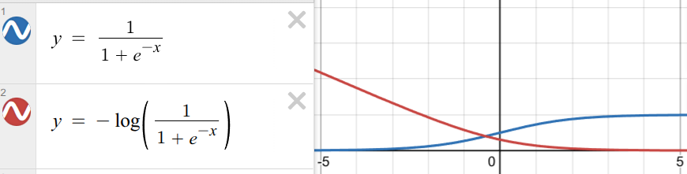
   3. 当 chosen 小于 rejected 分数时候，Loss 函数值快速增长


### Head

**LM Head** (Language Modeling Head)
1. 语言模型最末端的那一层 **输出头**，**参数是 所有 token 共享**
2. shape : hidden_size(input dim) × vocab_size(output dim)
3. 负责把 Transformer 等主干网络产生的 隐向量 转换成词表上每个 token 的得分

**Score Head**
1. 和 LM Head 类似，在隐藏向量上再接一层线性投射，但是对序列的最后一个 token 调用 Score Head，评价完整回答的好坏
2. 在计算 第t个 隐藏向量时，会 self-attention 到 0 ~ t 的全部内容 (最后一个 token 能看到 前面的 全部序列)，包含了对整段文本的 综合表示
3. shape : hidden_size(input dim) × 1(output dim)

#### 4个 Models

**PPO** 模型
1. 涉及 4个 模型
   1. 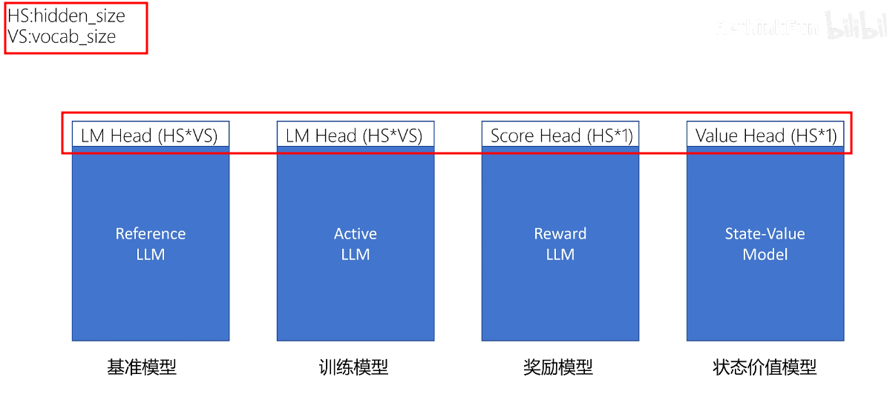
   2. 上方白色代表 shape
      1. hidden_size
      2. vocab_size
2. Reference
   1. **SFT 之后的 LLM**
   2. **权重冻结**，不参与梯度更新
   3. 根据概率抽样，得到 输出 token
3. Actor / Active / Policy
   1. 负责给每一步 生成 token 的概率分布
   2. 唯一需要 **反向传播、不断优化** 的模型
      1. 训练过程中只有 Actor 的参数(主干 + LoRA + LM Head) 被更新
   3. 结构和 Reference 完全一致
   4. 每轮 rollout 采样、获得奖励后，按 PPO 损失(含 KL 惩罚)来优化它的参数
   5. 新输出的模型概率分布 不能和 基准 相差太大
      1. 人为划定一个 安全半径，让策略逐步探索
      2. 维持语言质量与风格
      3. Reference-KL 则是额外加入的 新正则项，限制策略偏移，跟 PPO 的采样一致性并非一回事
4. Reward
   1. 通过 **Score-Head** 对问答序列进行评分
   2. 注意 输出 维度 = 1
   3. **==☆==** 仅仅对 最后一个 token 进行运算，作为整段回答的整体质量分
   4. 类似于传统 PPO 中的 环境即时打分，只是
      1. **只在最后一个 Step(序列终止)，给出单一奖励 $r_{final}$**
      2. **其余 Step 的即时奖励 $r_t$ 设为 0**
5. Critic / State-Value
   1. 对每个状态 评估价值 (Baseline)
   2. 根据 截止到目前的token序列 预测 到序列生成结束后 的期望回报
   3. 自身也要通过最小化 MSE 损失来拟合真实回报
   4. 通过 **Value-Head**
   5. 注意 输出 维度 = 1
   6. **==☆==** 需要对每个 token 都输出，截止到目前 token，期望的回报，**共享 Value-Head 权重**


### LoRA

[LoRA微调 - 个人笔记](./LoRA.md)

**LoRA 训练**
1. 上述模型除了 Head 都是大模型，如果训练时同时加载，显存占用大
2. 不改变原始大模型权重，通过改变少量的 LoRA 参数 实现对模型 微调
3. LoRA 模型 可以称为 原始 大模型的 Adaptor
4. 通过 只加载一份 LLM，使用多个 Adaptor，减少显存占用
5. **Actor、Critic 共享 一份 LoRA Adaptor 参数**，外接不同 Head (LM & Value)
6. 最终可以精简的效果
   1. 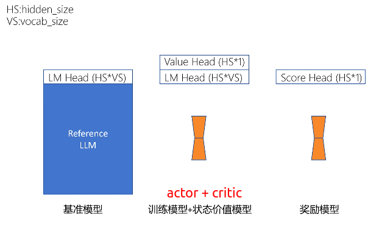


### 自定义 Reward

对于大模型每一个 step
1. state  : 截止到目前的 Token 序列
2. action : 即将输出的 Token

**==reward 模型 针对完整输出，只给出 1个得分==**，因此 Score Head 只作用在 最后一个 Token 上，并不是对 每个 token 都打分

可以给每个 token 增加一个 奖惩项，Actor模型的 output 和 Reference模型的 output，每个 token 可以计算 **KL散度**，约束策略不要偏离 Reference

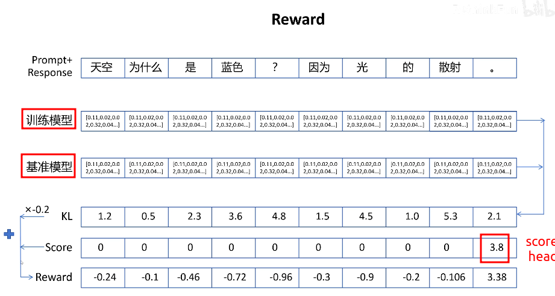

注意，只计算 response 部分，通过 mask 过滤原有文本


### 优势函数 Advantage

使用迭代的方式，从后向前 进行计算(HuggingFace 中 TRL 实现方式)

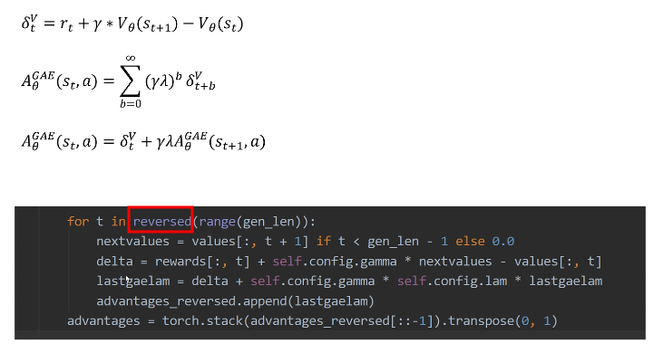


### 训练的 Loss

同时训练两个模型
1. actor-critic 共用的 LoRA adaptor
2. reward 的 LoRA adaptor

**State-Value Loss**
1. label 是 状态价值，是标量
2. 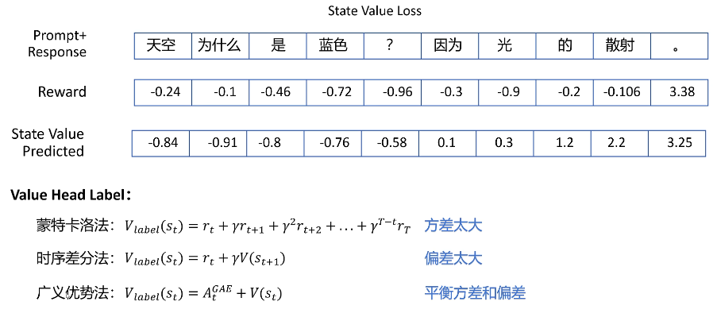
3. label 有以下几种 生成方式
   1. **蒙特卡洛法** : 问答序列是一次随机采样，由于是随机完整采样，因此 **方差大**
   2. **时序差分法** : 只采样一步，依赖当前 State Value Model 的估计，**偏差大，方差小**
   3. **☆广义优势法** : GAE优势函数 + 当前状态价值估计值，相当于是期望回报，GAE 考虑的多步采样和权重，因此平衡了方差&偏差

PPO Loss
1. 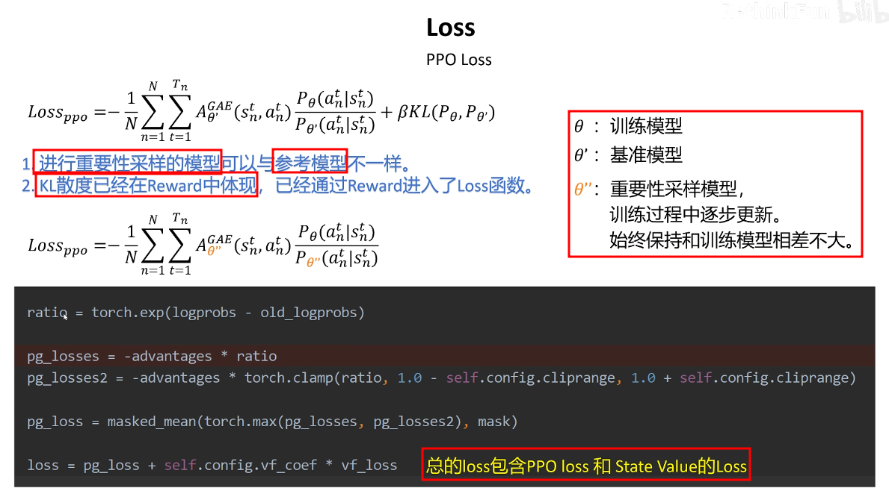
2. old policy = importance-sampling 分母
3. rollout 阶段 用当前 actor 与环境交互，采样完立即把该版本参数 冻结，成为 old-policy
4. old policy 会在 每次 rollout 前 和 actor 同步
5. 重要性采样(importance sampling)模型 就是 old-policy

实际中，并不需要显式的出现 old-policy，用 old-policy 得到 所有 token 概率之后，就可以开始更新了，然后用 new-policy 的概率 和 之前 保存成 old-policy 的概率 计算 loss 即可


---

# RL4LLM - B站(五道口纳什)

[RL4LLM - B站(五道口纳什)](https://space.bilibili.com/59807853/lists/4048984)


# 微调

模型训练 2个 阶段
1. **pre-trained** : 预训练 的 通用大模型
   1. 参数随机初始化，从0开始训练
   2. 使用 大规模 **通用数据集**，开发 具备广泛知识基础的模型，能够 在多种任务和领域中 表现出基本的有效性
   3. 模型是 高容量的，有大量的参数，可以从大数据中学习复杂的模式
2. **fine-tuning** : 使用 私有化/domain-specific 数据，更好地适应特定应用的需求和特点
   1. SFT 模型 - supervised fine-tuning
      1. 数据格式 两个字段 `<input, output>`， `input` 为用户问题，`output` 由专家标注的标准答案
      2. 输入输出 仅确定用户想要的答案，没有告诉模型不想要什么答案
   2. Align 对齐 - 确系统在实际应用中 可靠、稳定、公正
      1. 数据格式 `<input, accept, reject>`
      2. 在模型上线后(`A/B Test`) 点赞点踩 可以获得
      3. PPO (Proximal Policy Optimization) - 强化学习方法，由 OpenAI 开发，用于训练深度学习模型在复杂环境中做出决策
      4. DPO (Dynamic Policy Optimization)


# 灾难性遗忘 Catastrophic Forgetting

模型再次训练(持续预训练、微调)后，目的专有能力增强，但 原有的预训练模型的通用能力减弱

灾难性遗忘不可避免，只能尽可能降低

处理方式
1. 不用管 - 对于只考虑专业性
2. 结合通用数据、通用指令 - 减缓通用能力的减弱
3. Adapter - 轻量级调整，在保持预训练模型大部分权重不变的情况下，引入少量可训练的参数来适应新任务
4. 只改变模型的某些部分 - eg : LoRA
5. Regularization 正则 - 限制模型参数变化不过大


# 全量微调

复杂度高，所有参数都需要学习，大部分参数冗余，价值有限


# 成本分析


成本
1. GPU
2. 人力
3. 推理
4. 数据(收集、标注) - 不确定性大

