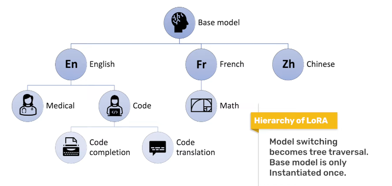

# LoRA 微调

[HuggingFace - 🤗 PEFT: Parameter-Efficient Fine-Tuning of Billion-Scale Models on Low-Resource Hardware](https://huggingface.co/blog/zh/peft)

[LORA 论文 - LOW-RANK ADAPTATION OF LARGE LANGUAGE MODELS](./LoRA.pdf)

**==注意 : LoRA 只是作用在 模型里面的 若干 线性层==**，而不是在输入和输出之间再套一个单独的低秩大矩阵

## 三分钟学会大模型 PEFT 的 LORA 算法 lora_rank， lora_alpha - B站(RethinkFun)

[三分钟学会大模型 PEFT 的 LORA 算法 lora_rank， lora_alpha - B站(RethinkFun)](https://www.bilibili.com/video/BV1wq421w7H8/)

LoRA 通过化简 权重矩阵，达到 参数高效微调

在 原始权重矩阵 旁边，另辟蹊径，重新构建 2个 低秩 权重矩阵 `LoRA A`(降维矩阵) & `LoRA B`(升维矩阵)，两者矩阵乘积 维度和原始矩阵维度一致

Forward 中，输入分别经过 **原始权重** & **2个LoRA权重**，将两者结果相加 得到矩阵更新后的输出，可以理解为 LoRA 分支在对模型进行 微调，锁定原始权重矩阵，只对 LoRA 权重更新

LoRA 可以减少更新权重的数量

最后将 `LoRA A` & `LoRA B` 相乘，加到 原始矩阵 即可

业界把 插入到主干网络里的 这对 (A,B) 低秩分支 称为 **LoRA module** 或 **LoRA adapter**，是 LoRA 方法的具体实现单元

参数
1. **r (rank)**
   1. 原始权重矩阵 M * N
   2. LoRA 权重矩阵
      1. LoRA A : M * r
      2. LoRA B : r * N
   3. r 是 连接两个 LoRA 矩阵的 中间维度，远远小于 M & N，参数量从 M*N 降到 r*(M+N)
   4. r 是 **人为设定的** 低秩维度，用来控制 LoRA 分支的容量，原则上远小于原始权重矩阵的真实秩
   5. r 是 超参数，与你的显存预算、数据规模、任务难度相关
   6. r 越大，越精细，效果逼近全量微调，但显存和训练时间也线性上升
   7. r 越小，参数更省，但可能欠拟合
2. **alpha $\alpha$**
   1. input & 原始权重 乘积 为 $X$
   2. input & LoRA权重 乘积 为 $\Delta X$
   3. **实际实现中**，会进行权重调节，调节因子为 $\frac{\alpha}{r}$
      1. 前向传播 : $$X = X + \frac{\alpha}{r} \Delta X$$
      2. 权重合并 : $$\text{weight} = \text{weight} + \frac{\alpha}{r} \ \text{lora\_weight}$$

初始化
1. LoRA A : 按标准线性层的初始化随机取值，目的是提供可学习方向，但幅度很小
   1. `nn.init.kaiming_uniform_`(何凯明) 或 `nn.init.normal_`
2. LoRA B : 全零初始化，初始时，前向结果与原始模型完全一致，保证 零扰动 地加载预训练权重

LoRA 的优点
1. 大大节省 微调大模型的 参数量
2. 效果和 全量微调 差不多
3. 微调完的 LoRA 模型，权重可以 Merge 回原来的权重，不会改变模型结构，推理时不增加额外计算量
4. 可以通过改变 r 参数，最高情况下实际等同于全量微调

LoRA 减少了什么？
1. 只减小了 需要更新的 权重 & 梯度，而激活(activations) 和 用于反向传播的中间梯度 依旧与原始网络拓扑、隐藏维度、序列长度完全一致
2. 前向 : 必须计算 全尺寸隐藏向量，没有节省，甚至增加了一点额外参数 (LoRA A & B)
3. 反向 : 只对 LoRA A & B 进行反向传播，节省大矩阵乘法，但是 层间激活值 必须存储，需要一层层反向传播 (LoRA 只作用在 某几个线性层)
4. 参数更新量减小
5. 计算图几乎没节省，但也几乎没额外开销
6. 能省掉的显存只是 权重梯度 + 优化器状态

## What is Low-Rank Adaptation (LoRA) | explained by the inventor - Youtube

[What is Low-Rank Adaptation (LoRA) | explained by the inventor - Youtube](https://www.youtube.com/watch?v=DhRoTONcyZE)

PEFT - Parameter-Efficient Fine-Tuning - 参数高效微调，LoRA 是其中的一种

不希望模型改动太多，导致模型能力的遗忘

引入 额外的 低秩矩阵 更新 预训练模型 权重，从而使得只需要对这些较小的矩阵进行优化，而不是整个模型的权重

线性代数，将 大矩阵 拆解为 两个 小矩阵 相乘 (eg: $[100 \times 100] = [100 \times k] ·[k \times 100] $，k 为可变参数)，对于越重要的矩阵，k值越大

控制矩阵更新的秩来控制矩阵更新的能力

全面微调 是 LoRA 的一个特例

Full Rank -> Low Rank

配置 LoRA 时，可以从 原点 逐步往 右上角(全面微调)

LoRA 可以使得 checkpoints 更小

LoRA 不会引入 推理延迟(更新直接合并到原始参数中)，训练时会有 额外的低秩矩阵

可以并行执行多个 LoRA，各司其职

LoRA modules 具有 可加性，可以针对 语言、领域、任务、用户 单独，生成 树结构

