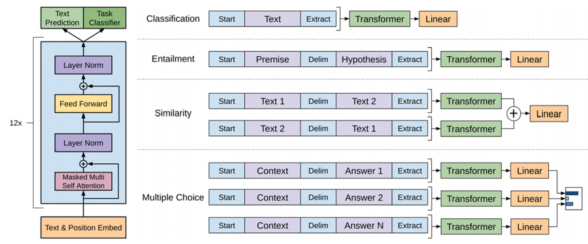
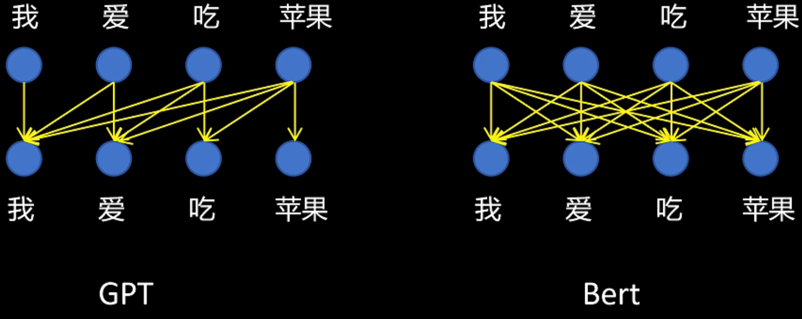
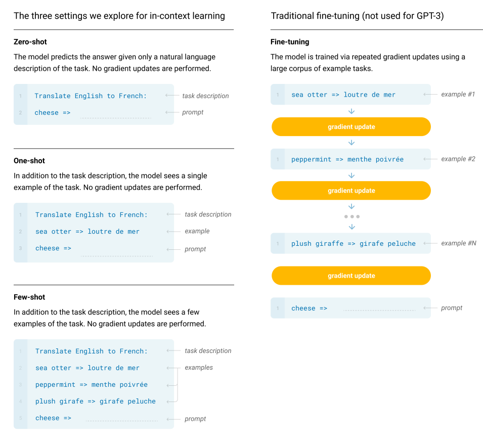

# GPT (Generative Pre-Training)

[大模型修炼之道 : GPT系列 GPT1/GPT2/GPT3/GPT4 - B站视频(RethinkFun)](https://www.bilibili.com/video/BV1ZJ4m1K73s)

# GPT-1 : Improving Language Understanding by Generative Pre-Training

**==GPT-1==**
1. ==Decoder-Only==，目标是学习 好的语言模型，关注如何将句子 从左到右 流畅地生成
2. 动机
   1. NLP 每个任务都 需要大量标注数据，模型 不能 复用(运用到其他任务)
   2. CV 领域得益于 ImageNet 数据集，可以 预训练 模型，**下游 子任务 微调**(使用少量标注数据)
   3. OpenAI 要做 NLP 领域的 **预训练模型**
3. 难点
   1. 没有像 ImageNet 那样大量的标注数据
      1. 解决 没有标注数据 问题 -> 使用 语言模型 **自回归** 训练模型 (Language Modeling 即 next token prediction)
   2. 模型架构设计，方便轻微修改，来应用到下游任务
      1. 架构选择 -> RNN / Transformer (相比 RNN 更好 记住 训练数据中的 模式，更好迁移到下游任务)
4. 模型结构
   1. 
   2. 无需 Cross-Attention (没有 Encoder)
   3. **可学习的** ==Position & Token Embedding==
   4. 2 Outputs
      1. **Text Prediction** : 自回归任务
      2. **Task Classifier** : 用于 下游微调，预训练不使用
5. **预训练**
   1. 语言模型似然函数
      1. $$L_1(u) = \sum_{i} \log P(u_i|u_{i-k}, \dots, u_{i-1}; \Theta)$$
      2. 使用 前面连续 k个 tokens 预测下一个 token
      3. 文本整体概率 : 所有 tokens 概率乘积 等价于 概率$\log$求和
      4. 优化 参数 $\theta$ 最大化 似然函数
   2. 得到下一个词的概率
      1. $$h_0 = U W_e + W_p$$
         1. $h_0$ (Hidden State 0)
         2. $U$ (Input Tokens) : 模型的输入序列(要预测下一个词的上下文)
         3. $W_e$ (Token Embedding Matrix) : 词嵌入矩阵，将输入的词元 $U$ 转换为其向量表示
            1. rows = vocab_size
            2. cols = $d_{model}$，feature size，GPT-1 是 768
         4. $U W_e$ 得到的是词元向量表示，通过 **Lookup** 的方式来完成，并不是矩阵乘法
         5. $W_p$ (Position Embedding Matrix)
      2. $$h_l = \text{decoder\_block}(h_{l-1}) \quad \forall l \in [1, n]$$
         1. $h_l$ (Hidden State $l$)
         2. $\text{decoder\_block}(\cdot)$ : decoder block，GPT-1 模型中的一个 Transformer 解码器层
         3. $n$个 decoder 层，GPT-1 中 $n=12$
      3. $$P(u) = \text{softmax}(h_n W_e^T)$$
         1. $P(u)$ : 最终计算出的下一个词元 $u$ 在整个词汇表上的 **概率分布**
         2. $h_n$ (Final Hidden State)
         3. $W_e^T$ : 词嵌入矩阵 $W_e$ 的转置，**==共享权重==**
            1. input 处的 词元嵌入矩阵 $W_e$ & output 处的 线性层权重矩阵 $W_e^T$ 之间 **共享权重**
            2. 大幅减少模型参数 (后续 模型变大 Embedding 矩阵 参数占比小，也会独立训练 输出侧 权重矩阵)
            3. 更好的泛化能力，两个任务相互约束和辅助
            4. 平衡输入和输出，确保了输入和输出表示空间的一致性
         4. $\text{softmax}(\cdot)$ : 将最终的线性输出(logits) 转换为 概率分布
6. **微调**
   1. 
   2. 不改变 预训练的模型 结构，改变 input 数据格式，将所有任务转化为 ordered token 序列
   3. OpenAI 给文本 加入 特殊 token，让模型知道 任务 不是 预测 下一 token
      1. `<Delim>`(分割 delimiter), `<Start>`, `<Extract>`
      2. 预训练 时 没有 这些 token
      3. 微调 时 人为修改词表，随机初始化，训练时更新
   4. 绿色 Transformer 块，就是 pre-trained GPT-1
   5. **Tasks**
      1. Classification (分类) : 预测文本的类别
      2. Entailment (蕴含判断) : 预测 假设(hypothesis) 是否 被 前提(premise) 蕴含，三分类(支持/反对/不相关)
      3. Similarity (相似度) : 预测两个文本的 相似度得分，对称的(A $\sim$ B, B $\sim$ A)
      4. Multiple Choice (多选题) : 从 N 个选项中选择最正确的答案，最后接 softmax
   6. 兼顾 语言模型自回归 & 下游任务，给2个 任务的 Loss 分配不同权重
   7. GPT-1 的微调是 **全参数微调**
7. 训练数据
   1. BooksCorpus Dataset，7000本 未发表的书，800M Words
   2. Context Window : 512
   3. Batch Size : 32

---

# BERT : Pre-training of Deep Bidirectional Transformers for Language Understanding

GPT-1 类似 作家(生成)，BERT 类似 读者(理解)

**==BERT==**
1. ==Encoder-Only==，目标是学习 好的上下文表示，通过 预测 被掩盖的词 & 句子关系 增强语义理解能力
2. encoder 可以看到 前&后的 token，更适合 **语义提取**
3. 可以在一个序列中同时看到当前词之前和之后的所有信息，通过 **MLM**(Masked Language Modeling，随机掩盖一些词) & 标准的自注意力机制 实现

---

# GPT-2 : Language Models are Unsupervised Multitask Learners

**==GPT-2==**
1. 动机
   1. GPT-1 & BERT 将 pre-train 引入 NLP，但下游任务 仍需要收集数据 再微调
   2. GPT-2 希望 预训练 解决所有下游任务，不再需要 微调
2. 解决方法
   1. GPT-1 : 微调阶段 引入 `<Delim>`, `<Start>`, `<Extract>` 让模型进行下游任务，$p(output|input)$
   2. GPT-2 : 不进行微调，只能用 pre-train 时候见过的 token，引入 **Prompt**，$p(output|input, task)$，主要是 Zero-Shot
3. 模型修改
   1. Post-Norm -> Pre-Norm
      1. post-norm : `self.layer_norm(x + self.dropout(sub_layer(x)))`
      2. pre-norm  : `x + self.dropout(sub_layer(self.layer_norm(x)))`
   2. 在整个模型的最后一个 Self-Attention 块之后(输出层之前) 额外加了一个 Layer Norm 层
   3. 权重的初始化策略调整
      1. **初始化模型参数时**，对于 **残差层 residual layers**的权重，乘以了一个缩放系数 $\frac{1}{\sqrt{N}}$，其中 $N$ 是残差层的总数
      2. 防止随着深度增加，信号幅度过大导致的不稳定，从而允许模型做得更深
   4. 词表(Vocabulary) 扩大到 50257
   5. 上下文长度(Context Size) 翻倍 : 512 -> 1024
   6. Batch Size 增大到 512
   7. 使用 Reddit 网页，800万 文本，40GB 文字
4. OpenAI 发现，随着模型增大，性能还有提升空间

---

# GPT-3 : Language Models are Few-Shot Learners

[OpenAI MileStone - Language models are few-shot learners](https://openai.com/index/language-models-are-few-shot-learners/)

**==GPT-3==**
1. 动机
   1. 人类在做语言任务，只需要几个例子即可，传统 GPT-1 / BERT 需要 成千上万 下游任务例子
   2. 希望 通过 在 Prompt 中 给模型提供一些例子，不通过 微调，提升模型性能 (==Few-Shot==)
   3. 延续 GPT-2，模型做大
   4. 把 GPT-2 的 Zero-Shot Prompt 转为 GPT-3 的 In-Context Learning 的 Few-Shot(在 Prompt 里塞几个例子)
2. Zero-Shot / One-Shot / Few-Shot / Fine-Tuning
   1. 
   2. Fine-Tuning
      1. Pros : 在 benchmark 上面表现好
      2. Cons : 对每个不同的任务都需要新的数据集，泛化能力差，可能会学到 spurious 特征(虚假特征)
   3. Few-Shot 还是需要移动到 的 task-specific data
3. 模型修改
   1. 引入 **Sparse Transformer**，降低计算量、让模型能处理更长文本的注意力机制改进
      1. 标准 Transformer 使用 Dense Attention，关注 sequence 里面全部的 token
      2. 让每个 token 只关注特定的几个位置 (eg : 往前看 50 个词，GPT 系列都是 decoder-only，严格遵守 causality)
   2. GPT-3 并没有把所有层全变成 Sparse，而是交替使用 Dense/Sparse Layer
   3. 上下文长度(Context Window) 进一步增大为 2048
   4. BatchSize 320 万

---

# GPT-4

**==GPT-4==**
1. 使用 RLHF(Reinforcement Learning from Human Feedback) 微调
2. 模型的能力是在 pre-train 获得的，RLHF 只是和 人类意识 对齐，不能提高模型表现
3. 通过训练更小的模型，推断完整模型的表现

