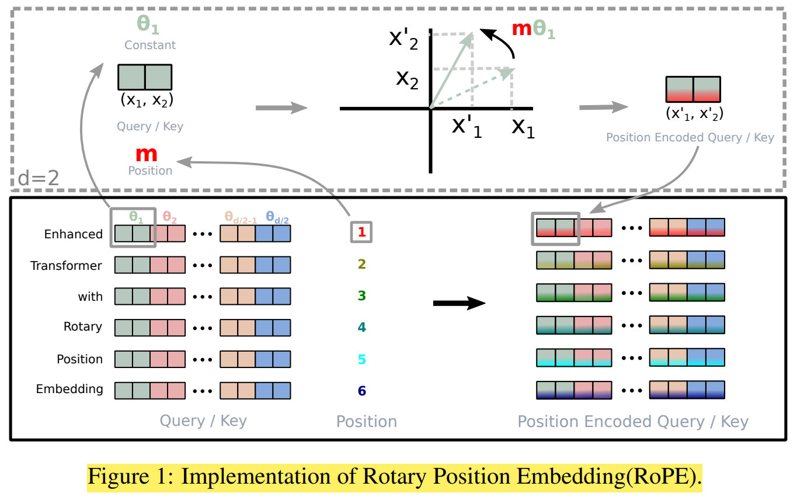
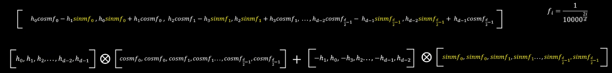
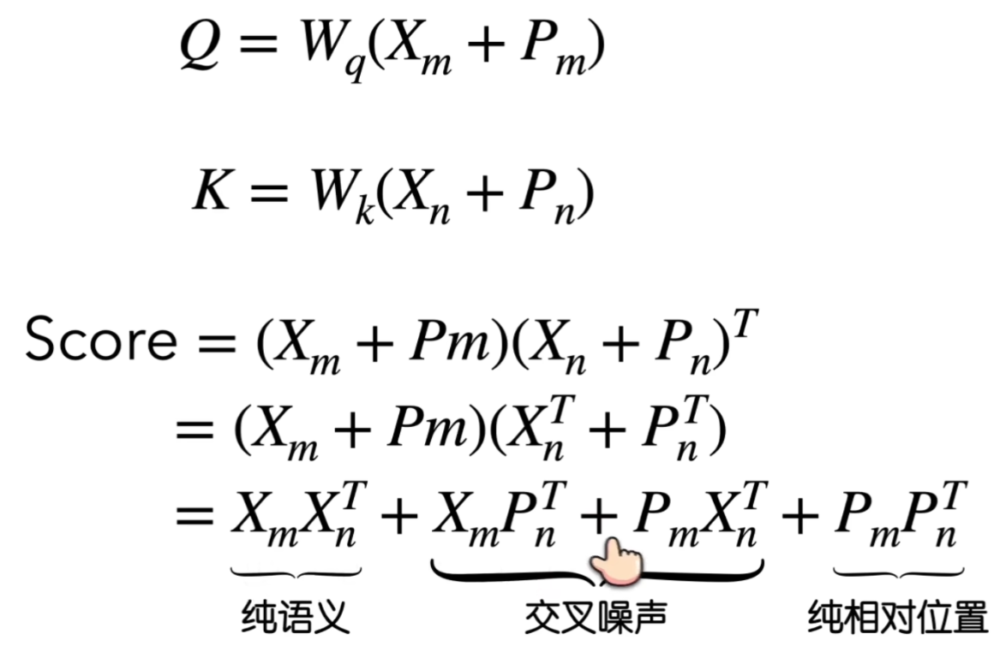
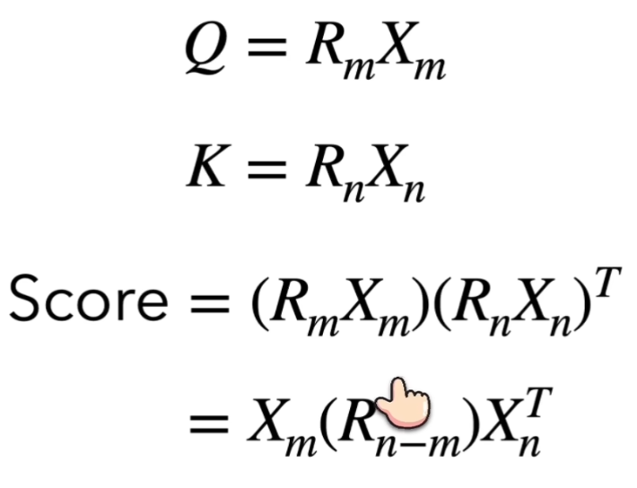

# RoPE(Rotary Positional Embedding) - 旋转位置编码

[旋转位置编码 (RoPE) - B站视频(RethinkFun)](https://www.bilibili.com/video/BV1F1421B7iv/)

Rotation Matrix
1. [Rotation Matrix - Wikipedia](https://en.wikipedia.org/wiki/Rotation_matrix)
2. $$\begin{bmatrix}
     \cos\theta & -\sin\theta \\
     \sin\theta &  \cos\theta
     \end{bmatrix}$$
3. 性质
   1. 连续旋转两次(先转 $\theta_2$ 再转 $\theta_1$)，等同于一次性旋转两个角度之和
      1. $R(\theta_1) R(\theta_2) = R(\theta_1 + \theta_2)$
   2. 旋转矩阵是正交矩阵(Orthogonal Matrix)
      1. $R(\theta)^T = R(-\theta) = R(\theta)^{-1}$

RoPE 的数学设计确保了两个向量之间的内积，只取决于它们的相对距离，而不是它们的绝对位置

Rotary Embedding
1. 本身的 $Q K^T$ 计算的 $V$ 的加权求和 **没有位置信息**
2. 
3. **先旋转 后点乘**，由于 转置，所以两个绝对旋转矩阵就抵消了，只保留了相对旋转矩阵
4. 对于 高维向量，维度 **两两一组** 进行旋转，每组应用一个 2×2 的旋转矩阵(在 2维 子空间中 旋转)，每组旋转的角度 $\theta$ 不同
   1. ==注意 : 特征 只需要 两两一组，不需要 相邻两个一组==
   2. 两种流派
      1. 相邻配对 (Adjacent) : 对应 公式推导
      2. 远端配对 (Half-Split) : 对应 Llama/HuggingFace 实现，为了计算效率，即 $(d_0, d_{d/2}), (d_1, d_{d/2+1}) \dots$
   3. ==**不用担心重叠，因为 不同维度 有 不同的频率**==
5. RoPE 借鉴了 Sinusoidal Positional Encoding (Transformer 原版位置编码) 的思想
   1. $$R_{total} = \begin{pmatrix}
        \cos m\theta_1 & -\sin m\theta_1 & 0 & 0 \\
        \sin m\theta_1 &  \cos m\theta_1 & 0 & 0 \\
        0 & 0 & \cos m\theta_2 & -\sin m\theta_2 \\
        0 & 0 & \sin m\theta_2 &  \cos m\theta_2
        \end{pmatrix}$$
   2. 位置 : $m$，Token 在 Sequence 中的 绝对位置索引(Absolute Position Index)，类似于 $\sin \omega t$ 和 $\cos \omega t$ 中的 $t$
   3. 频率 : $\theta_i = 10000^{-2(i-1)/d}, i \in [1,2, \cdots, d/2]$
      1. $i$大，$\theta$小
      2. 约定俗成
         1. 低维度 : 频率高，转的快
         2. 高维度 : 频率低，转的慢
   4. 实际计算的时候，不需要做大矩阵乘法，找规律写公式即可
      1. 
6. **相对位置信息**
   1. 以向量为例，不是矩阵，最终结果为标量
   2. 利用 旋转矩阵 的性质
   3. $$\mathbf{q}_m^T \mathbf{k}_n = (\mathbf{R}_{\Theta, m}^d \mathbf{W}_q \mathbf{x}_m)^T (\mathbf{R}_{\Theta, n}^d \mathbf{W}_k \mathbf{x}_n) = \mathbf{x}_m^T \mathbf{W}_q^T \mathbf{R}_{\Theta, n-m}^d \mathbf{W}_k \mathbf{x}_n$$
7. **加入 Positional Embedding 的时机**
   1. 普通 Transformer PE : 在输入层，将 token embedding 和 position encoding 相加，**一次性 QKV 都包含了 位置信息**
   2. RoPE : **逐层动态应用**，在每一层的 Attention 计算中间，==只作用于 $Q$ & $K$==，**在 Attention 内部 线性映射 算出 $Q$ & $K$ 之后，在做点积之前**，分别应用旋转矩阵
      1. 实际上 V 的使命是 提供纯粹的内容，不应该被选择，只要 Q & K 在计算 注意力分数的时候 考虑到 位置信息 即可
8. 其实 **特征维度本身没有固定的顺序**，未必一定要 低维度变化快 高维度变化慢 (纯粹是 convention)，Q / K 的 维度语义 是在 Linear 投影的权重里决定的 (隐式 重排/置换 permute)，RoPE 在 HuggingFace 的具体实现是 前半 real 后半 image，使得 RoPE 旋转可以高效地通过 切片 而非 跳跃索引 完成
   1. **线性投影** 在 训练中 被学成与 RoPE 的 real / image 旋转规则一致

RoPE & Absolute Sinusoidal PE
1. 正余弦绝对位置编码
   1. 位置向量 & 词嵌入向量 直接相加，影响 实际语义
   2. **隐式** 让 模型 通过 多层注意力机制，学习到 相对位置(正弦 & 余弦 交替编码)
      1. 有 交叉噪声
      2. 
   3. 模型训练时候，见过的 绝对位置 是有限的，推理时 遇到长句子 虽然可以 计算 位置编码，但属于 OOD(Out of Distribution)
2. RoPE
   1. **显式** 让 位置信息 对注意力分数的影响，只取决于 相对距离
      1. 无 交叉噪声
      2. 
   2. RoPE 的旋转逻辑在所有 Attention Heads 之间是共享的
   3. 具有 平移不变性
   4. 没有 长度限制

