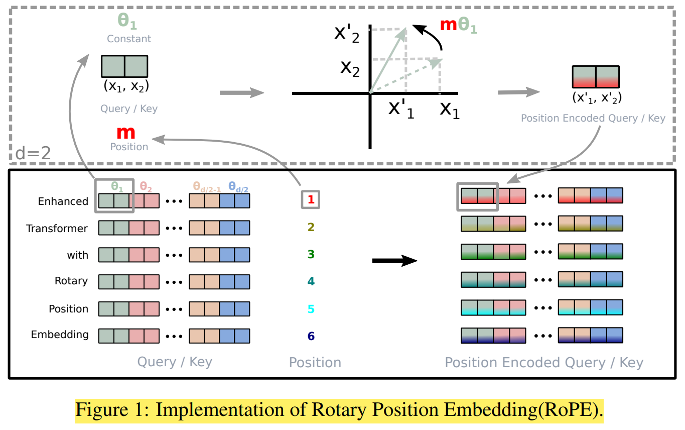
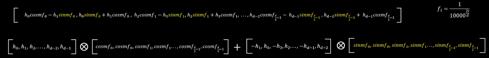
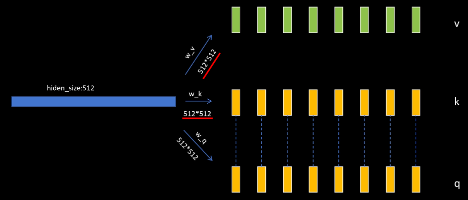
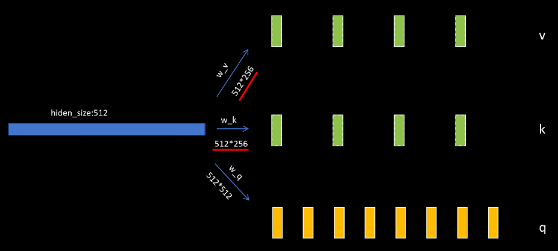
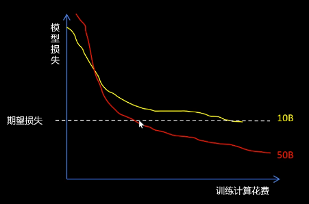
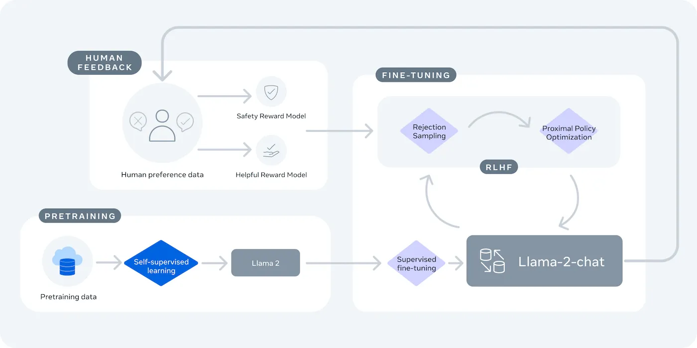
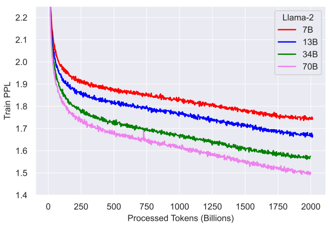

# Meta Llama

[大模型修炼之道 : Llama系列讲解 Llama1/Llama2/Llama3 - B站视频(RethinkFun)](https://www.bilibili.com/video/BV1Ds421c7JP/)

---

# 旋转位置编码 RoPE

[旋转位置编码 (RoPE) - B站视频(RethinkFun)](https://www.bilibili.com/video/BV1F1421B7iv/)

Rotation Matrix
1. [Rotation Matrix - Wikipedia](https://en.wikipedia.org/wiki/Rotation_matrix)
2. $$\begin{bmatrix}
     \cos\theta & -\sin\theta \\
     \sin\theta &  \cos\theta
     \end{bmatrix}$$
3. 性质
   1. 连续旋转两次(先转 $\theta_2$ 再转 $\theta_1$)，等同于一次性旋转两个角度之和
      1. $R(\theta_1) R(\theta_2) = R(\theta_1 + \theta_2)$
   2. 旋转矩阵是正交矩阵(Orthogonal Matrix)
      1. $R(\theta)^T = R(-\theta) = R(\theta)^{-1}$

Rotary Embedding
1. 本身的 $Q K^T$ 计算的 $V$ 的加权求和 **没有位置信息**
2. 
3. 先旋转 后点乘
4. 高维向量 切成 两两一组，每一组应用一个 2×2 的旋转矩阵，每一组旋转的角度 $\theta$ 不同
5. RoPE 借鉴了 Sinusoidal Positional Encoding (Transformer 原版位置编码) 的思想
   1. $$R_{total} = \begin{pmatrix}
        \cos m\theta_1 & -\sin m\theta_1 & 0 & 0 \\
        \sin m\theta_1 &  \cos m\theta_1 & 0 & 0 \\
        0 & 0 & \cos m\theta_2 & -\sin m\theta_2 \\
        0 & 0 & \sin m\theta_2 &  \cos m\theta_2
        \end{pmatrix}$$
   2. $m$ : Token 在 Sequence(序列) 中的 绝对位置索引(Absolute Position Index)，类似于 $\sin \omega t$ 和 $\cos \omega t$ 中的 $t$
   3. $\theta_i = 10000^{-2(i-1)/d}, i \in [1,2, \cdots, d/2]$
      1. $i$大 $\theta$小
      2. Low  Dim : 频率高，转的快
      3. High Dim : 频率低，转的慢
   4. 实际计算的时候，不需要做大矩阵乘法，找规律写公式即可
      1. 
6. **相对位置信息**
   1. 以向量为例，不是矩阵，最终结果为标量
   2. 利用 旋转矩阵 的性质
   3. $$\mathbf{q}_m^T \mathbf{k}_n = (\mathbf{R}_{\Theta, m}^d \mathbf{W}_q \mathbf{x}_m)^T (\mathbf{R}_{\Theta, n}^d \mathbf{W}_k \mathbf{x}_n) = \mathbf{x}_m^T \mathbf{W}_q^T \mathbf{R}_{\Theta, n-m}^d \mathbf{W}_k \mathbf{x}_n$$
7. **加入 Positional Embedding 的时机**
   1. 普通 Transformer PE : 在输入层，将 token embedding 和 position encoding 相加，一次性
   2. RoPE : **逐层动态应用**，在每一层的 Attention 计算中间，只作用于 $Q$ & $K$，**在 Attention 内部 线性映射 算出 $Q$ & $K$ 之后，在做点积之前**，分别应用旋转矩阵
8. 其实 **特征维度本身没有固定的顺序**，未必一定要 低维度变化快 高维度变化慢 (纯粹是 convention)，Q / K 的 维度语义 是在 Linear 投影的权重里决定的 (隐式 重排/置换 permute)，RoPE 在 HuggingFace 的具体实现是 前半 real 后半 image，使得 RoPE 旋转可以高效地通过 切片 而非 跳跃索引 完成
   1. **线性投影** 在 训练中 被学成与 RoPE 的 real / image 旋转规则一致

---

# MHA & MQA & GQA

MHA (Multi-Head Attention)
1. Transformer 原作的设计
2. 配置 : 8 Q-head，配 8 K-head + 8 V-head
   1. 每个 Q 都有自己专属的 K 和 V
3. KV Cache 极大
4. 

MQA (Multi-Query Attention)
1. 为了极致省显存搞出来的
2. 配置 : 8 Q-head，配 1 K-head + 1 V-head
   1. 所有 Q **共享同一份** K 和 V
3. KV Cache 极小，只有 MHA 的 1/8
4. 需要 UpTraining，MQA 的压缩率太大了，信息丢失非常严重
5. 即使经过 UpTraining，MQA 的最终效果通常还是不如 MHA 和 GQA

GQA (Grouped Query Attention)
1. Google 在 2023 年提出，Llama-2-70B 带火
2. 把 8 Q-head 分成 4 组(每组 2 个)，每组配 1 K-head + 1 V-head
3. KV Cache 适中，是 MHA 的 1/2
4. 效果几乎不降(接近 MHA)，速度却快很多(接近 MQA)
5. 是否需要 UpTraining
   1. 现在的模型，天生 GQA，模型从第一步训练开始，就是 GQA 架构，不需要 MHA 基础
   2. GQA 原始论文，把现有的 MHA 模型 无缝改成 GQA，需要 UpTraining(顺序分组，参数合并(求平均)，原训练步数的 5%)
6. 
7. 实际实现
   1. 朴素实现 (Naive PyTorch / HuggingFace 旧版) : PyTorch 的 `unsqueeze` + `expand` + `reshape` 返回的是一个 View (视图)，不复制内存，显存没有增加
   2. 硬核优化实现 (FlashAttention / vLLM / Triton) : 利用底层算子的 广播机制 (Broadcasting)，让多个 Query 头 直接读取同一个内存地址中的 Key/Value

---

# Llama 1 : Open and Efficient Foundation Language Models

[Meta Publication - Llama 1 : Open and Efficient Foundation Language Models](https://ai.meta.com/research/publications/llama-open-and-efficient-foundation-language-models/)

**==Llama 1==**
1. Transformer ==Decoder-Only== 架构
2. 动机
   1. open
      1. 完全使用公开数据
      2. 媲美 GPT3
      3. 社区研究开源，不能商用
   2. efficient
      1. ScalingLaw，计算预算下给出token和模型大小的建议
      2. 之前没有考虑 **推理代价**(训练只有一次，推理有很多次)
      3. 之前考虑的是 **训练计算花费**，训练大模型能更快达到期望损失
         1. 
      4. 原来 10B(Parameters) 模型，建议用 200B 的 tokens 训练
      5. Meta 7B 模型，用1T token，发现性能还一直增长
      6. 相同的计算预算，**增加训练数据** 比 扩大模型参数 有效
3. 数据集
   1. 使用完全开源的数据集
   2. CommonCrawl 去除 非英文 & 低质量 数据
   3. 线性模型 进行质量分类，Wikipedia 引用的网页作为 正例，其他作为 反例
4. 模型修改
   1. Post-Norm -> Pre-Norm
      1. 提高训练稳定性
   2. LayerNorm 改为 RMS Norm (Root Mean Square Layer Normalization)
      1. 普通 LayerNorm : 去均值(Re-centering) + 缩放(Re-scaling)
         1. $$LayerNorm = \frac{x - E[x]}{\sqrt{Var[x] + \epsilon}} * \gamma + \beta$$
      2. RMS Norm : 去均值 其实没那么重要(不能改变特征分布)，真正对训练稳定性起关键作用的是 缩放，省去了减去均值 $\mu$ 的步骤，直接算均方根
         1. $$RMSNorm = \frac{x}{\sqrt{Mean(x^2) + \epsilon}} * \gamma$$
   3. 采用 旋转位置 编码 (Rotary Embedding)
   4. 采用 SwiGLU 激活函数 (受到了 PaLM 模型的启发)
      1. $$\text{SwiGLU}(x) = \text{Swish}(xW + b) \otimes (xV + c)$$
         1. 前面是 Gate，后面是 Value
         2. $$\text{Swish}(x) = x \cdot \text{sigmoid}(\beta x) = \frac{x}{1 + e^{-\beta x}}$$
      2. LLaMA 使用 $\frac{2}{3} 4d$，PaLM 使用 $4d$ (FFN 的 Hidden Layer 维度)
         1. 为了在使用 SwiGLU 更复杂的激活函数时，保持模型的 总参数量 & 计算量 与普通 Transformer(使用 ReLU) 基本一致
         2. ReLU 计算量 : $W_1 + W_2 = d × 4d + 4d × d = 8 d^2$
         3. SwiGLU 计算量 : $Gate + Value + Output = d × 4d + d × 4d + 4d × d = 12 d^2$，Output 将 SwiGLU 的输出映射回原维度
   5. Context Window : 2048

---

# Llama 2 : Open Foundation and Fine-Tuned Chat Models

[Meta - Llama 2 : open source, free for research and commercial use](https://www.llama.com/llama2/)

[Meta Publication - Llama 2 : Open Foundation and Fine-Tuned Chat Models](https://ai.meta.com/research/publications/llama-2-open-foundation-and-fine-tuned-chat-models/)

**==Llama 2==**
1. Transformer ==Decoder-Only== 架构
2. 特点
   1. 可商用
   2. 加大数据量
   3. Llama2-Chat 专为对话 fine-tune
3. 训练 & 数据集
   1. 
   2. 
   3. Data
      1. pre-train data : 2 Trillion Tokens
         1. 公开的数据源，去处隐私数据
         2. performance-cost trade-off
         3. increase knowledge
         4. dampen hallucination
      2. fine-tune data
         1. sft data : 100,000 cases
         2. human preference data : 1,000,000 cases
            1. RLHF : 对齐模型行为，方向 是 人类偏好 + 指令跟随
            2. 同一个问题，让模型给出多个回答，人工排序
            3. 训练 Reward Model(能给任何文本打分的奖励模型)，输入是文本，输出是一个标量分数
   4. 即使使用 2T tokens 做 pre-train，仍未见饱和，数据量可以更大
      1. 
4. 模型改进
   1. Context Window : 2048 -> 4096
   2. **==GQA==**(Grouped Query Attention，分组查询注意力)
      1. 为了在大模型推理时 **省显存、提速度**
      2. 在 **MHA**(质量最好) & **MQA**(速度最快) 之间找到的 trade-off
      3. 核心痛点 : KV Cache 太大 (通过 线性投影矩阵 计算得到的结果)
         1. decoder 自回归生成过程中，当前token 只能看到 前面token，所以当生成 新token 时，之前所有token的 K & V 都可以被缓存 重复使用
         2. encoder-decoder 中，decoder 的 cross-attention部分，K & V 来自 encoder 输出，解码时 encoder 的输出是固定的，因此也可以 将 encoder 输出的 K & V 缓存
         3. encoder 不需要 KV Cache，没有增量生成的过程，不需要缓存中间结果，所有计算可以在一次前向传播中完成
      4. GQA 只应用在 70B 模型上

---

# Llama 3 : The Llama 3 Herd of Models

[Meta Publication - Llama 3 : The Llama 3 Herd of Models](https://ai.meta.com/research/publications/the-llama-3-herd-of-models/)

[Meta - Introducing Meta Llama 3](https://ai.meta.com/blog/meta-llama-3/)

[Meta Engineering - Building Meta’s GenAI Infrastructure](https://engineering.fb.com/2024/03/12/data-center-engineering/building-metas-genai-infrastructure/)

**==Llama 3==**
1. **==decoder-only==** transformer
   1. 后续还有 multi-modality
2. 训练
   1. Data
      1. pretrain : 15T tokens，Llama2 的 7倍
         1. 包含更多的 代码，之前的 4倍
         2. 核心还是英语，但加入了 5% 的高质量非英语数据(覆盖30+种语言)
      2. 一系列 data-filtering pipeline
      3. 仍未饱和
   2. 训练技能 Scaling Laws : 在真正开始大规模训练之前，就能预测出模型在关键任务上的最终表现，类似于 OpenAI 的预测(用小模型的表现，去推测大模型)
   3. 24K GPU clusters
3. 模型
   1. tokenizer : vocab_size 达到 128K
      1. 编码效率更高
      2. 意味着同样的文本，用 Llama 3 的 Tokenizer 切分后，Token 数量会更少
         1. 对于小 vocabulary 可能需要 多个 token 才能编码 一个词
      3. 让模型 读 得更快，也变相增加了模型能处理的信息密度
   2. 所有模型 都使用 **GQA**，8B -> 70B
   3. context window : 8192
   4. mask 策略
      1. 训练时，通常会将多篇短文章拼成一个长序列喂给模型
      2. 防止模型 搞混，使用了特殊的 Mask，告诉模型 不要跨越边界(document boundary) 去看不相关的文章
4. Llama3-Instruct 是经过 fine-tune
   1. SFT
   2. Reward Modeling
   3. 拒绝采样(Rejection Sampling, RS)，属于 **数据工程**
      1. 经过初步 SFT 的模型(Model $M$) + 训练好的奖励模型(Reward Model, $RM$)
      2. 出题 + 海选(生成 $N$ 个不同的回答) + 打分(Reward Model 裁判) + 保留最高分，加入到新的 SFT 训练集中
   4. PPO
   5. DPO
   6. Loop

---

# Llama 4

[Meta - Llama4 Docs](https://www.llama.com/docs/model-cards-and-prompt-formats/llama4/)

