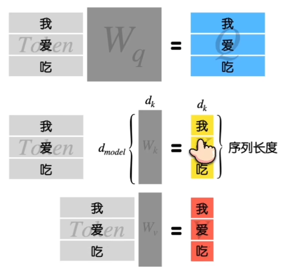

# MHA & MQA & GQA & MLA

---

# MHA (Multi-Head Attention)

Transformer 原作的设计，KV Cache 大

相比 最普通的 Single-Head Attention，没有改变 总参数量，优势是 让模型拥有了 **多个不同的表征子空间(Representation Subspaces)**

single head，模型在计算注意力时，所有的信息(语法、语义、上下文)都挤在同一个表征子空间中，被 暴力平均

multi head，允许 各个 head 关注不同的 信息维度，最后再把各自的结果 拼接起来

MHA 通过 反向传播，会 Encourage/Force Embedding 层，按照多头的 需求 **重新组织特征**

# MQA (Multi-Query Attention)

为了解决 MHA 使用 KV Cache 后带来的问题 : 显存占用 & 显存带宽(显存 → 计算单元)

极致省显存搞出来的

CUDA 算子层面 : 共享读取(Broadcasting / Shared Access)，各个 Q 共享 K & V

MQA 优势
1. 将 **KV Cache 显存占用** 降低到 1/num_head
2. 将 **K & V 的 线性映射层 权重数量** 降低到 1/num_head
   1. 

MQA 代价
1. 算法视角 : 特征表达能力受限，**表征容量下降**(Capacity Degradation)
2. 训练视角 : 梯度冲突(Gradient Conflict)，KV 权重 会被 不同的 Q 拉扯

# GQA (Grouped-Query Attention)

解决 MHA & MQA 的 Trade-off 问题

Google 在 2023 年提出，Llama-2-70B 带火

Group 内的 Q 共享同一份 K & V

实验证明，只要分组数量合理，GQA 的模型效果几乎和 MHA 一模一样

MHA 和 MQA 是 特殊的 GQA
1. group size = 1，则是 MHA
2. group size = num_head，则是 MQA

要求
1. 每个 Group 大小一致
2. Q 的头数必须能被 K & V 的头数完美整除

# MLA (Multi-head Latent Attention)

DeepSeek-V2 中提出

[DeepSeek-V2 MLA - 个人笔记](../DeepSeek/DeepSeek.md#deepseek-v2-mla)

# Up-Training

将 训练好的 MHA 改造为 MQA 或 GQA 的架构，减少 KV Cache 显存占用

步骤
1. Mean Pooling 均值池化，将数个 KV Head 的权重 求平均
2. 性能会先下降，通过 Up-Training 恢复，用小部分的 预训练数据，将改造后的 模型 继续预训练

