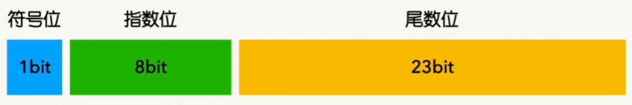
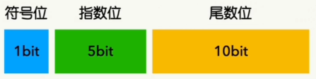
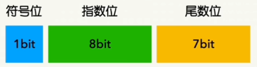
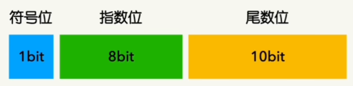

# Tensor DataType

大模型需要 大量参数的 矩阵运算

DataType 决定 Tensor 在 内存中 的 存储方式 & 计算方式

核心取舍
1. 精度
2. 显存占用
3. 计算速度

存储组成
1. 符号位(Sign)
2. 指数位(Exponent) : 管 数值范围
3. 尾数位(Mantissa) : 管 小数点后精度，大模型 对 尾数精度 要求 没有 指数高

浮点型
1. FP32 (单精度)
   1. 32位 = 1sign + 8exp + 23mantissa
   2. 
   3. 数值范围大 : $-3.4028 × 10^{38} \sim 3.4028 × 10^{38}$
   4. 显存占用高
   5. 用于关键位置 : Gradient & Optimizer State
2. FP16 (半精度)
   1. 16位 = 1sign + 5exp + 10mantissa
   2. 
   3. 数值范围小 : $-65,504 \sim 65,504$，容易发生 Overflow & Underflow
3. BF16 (Brain Float)，取代 FP16
   1. 16位 = 1sign + 8exp + 7mantissa
   2. 指数位 和 FP32 相同，因尾数更短，上界略小于 FP32 的最大有限数
   3. 
   4. 数值范围大 : $-3.3895 × 10^{38}  \sim 3.3895 × 10^{38}$
4. TF32 (Tensor Float)，取代 FP32
   1. **NVIDIA** 在 Ampere 架构中 引入的一种专为 Tensor Core 设计的 计算数学模式
   2. **19位** = 1sign + 8exp(FP32/BF16) + 10mantissa(FP16)
   3. 
   4. 数值范围大 : $-3.4028 × 10^{38} \sim 3.4028 × 10^{38}$
   5. 透明
      1. 不需要 改代码，PyTorch 中依然声明你的 Tensor 是标准的 float32
      2. 数据被送进 TensorCore，丢弃 13位尾数
      3. Tensor Core 使用剩下的 19 bit 数据进行矩阵乘法
      4. 原子操作 : **Multiply-Accumulate(MAC 乘累加)**
         1. 乘法阶段(尾数变长) : 10 bit × 10 bit，产生一个完整的 20 bit 的中间结果
         2. 累加阶段
            1. 累加器(Accumulator) 是标准的 FP32 寄存器，最后空出的 3位 尾数 暂时是 0
            2. 二进制小数相加，指数不同，需要先对齐小数点，错位会使得 暂时的末尾的0 被真实的数填上
5. FP8
   1. E4M3 (Exponent 4, Mantissa 3)
   2. E5M2 (Exponent 5, Mantissa 2)

Overflow & Underflow
1. Overflow : 数值超过 计算机能表示的 上下界
2. Underflow : 数字无限接近于 0，计算机的 精度(尾数) 已经无法识别

