# 量化

[模型量化 - B站合集](https://space.bilibili.com/18235884/lists/2887562?type=season)

[YouTube - Umar Jamil - Quantization explained with PyTorch - Post-Training Quantization, Quantization-Aware Training](https://www.youtube.com/watch?v=0VdNflU08yA)

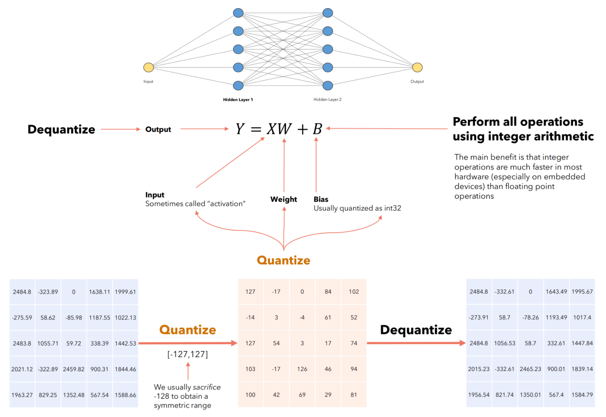

# 量化基础

浮点数存储格式(IEEE-754)
1. 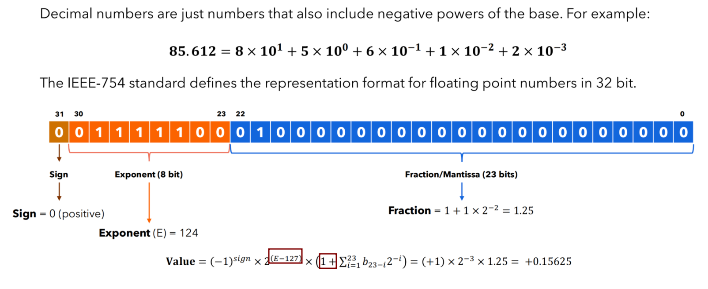
2. 指数 : 偏移量 -127
3. 小数 : +1
   1. 科学计数法的标准形式 : 任何非零数都可以表示为 $1.\text{xxx} × 2^n$ 的形式

Llama 13B = 13,000,000,000
1. FP32 : 52GB
2. FP16 : 26GB
3. Int8 : 13GB
4. Int4 : 6.5GB

把 Float类型(FP32，FP16) 的 模型参数 和 激活值，用 整数(Int8，Int4) 代替的同时，尽可能减少量化后模型推理的误差

优势
1. 减少模型存储大小
2. 减小推理时占用的显存大小，提升模型推理速度
   1. 计算过程中，TensorCore 和 显存之间 频繁的数据 交换，减少数据交换大小，从而提升模型推理速度
   2. 显存带宽固定，制约推理速度
      1. 虽然 浮点数运算 更复杂，但是 位宽还是 主要决定性因素
3. 更低功耗

单位
1. Tera = $10^{12}$ = $2^{40}$
2. TFLOPS(Tera Floating-point Operations Per Second)
3. TOPS(Tera Operations Per Second)

**量化 & 反量化**
1. $x1_f -> 量  化 -> x1_q$
2. $x1_q -> 反量化 -> x2_f$
3. 需要 让 $x1_f$ & $x2_f$ 尽可能接近
4. 推理时
   1. 大部分计算 (卷积、矩阵乘法) 在整形空间，极大提升速度 + 降低内存
   2. 在 Input/Output(概率、坐标)、float-only 算子(Softmax，LayerNorm，Attention 缩放 & 加权和) 做 **量化 ↔ 反量化** 的转换

**对称量化 & 非对称量化**

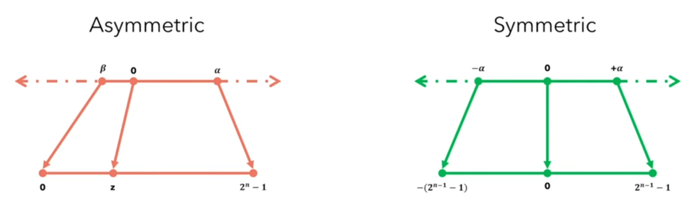

对称量化
1. 
2. 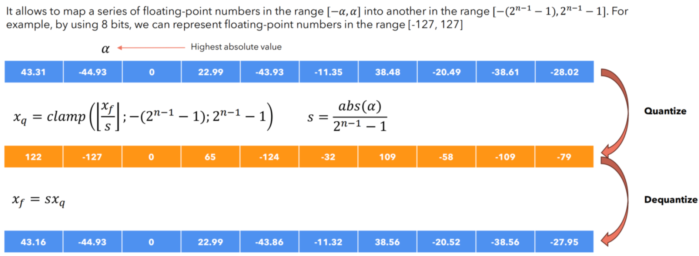
3. 计算简单，精度低
4. 找 绝对值 最大的数
5. 零点固定不变，量化后的值中零点必须对应于原始值中的零
6. 会有一部分整数范围被浪费，除非数据范围对称

非对称量化
1. 
2. 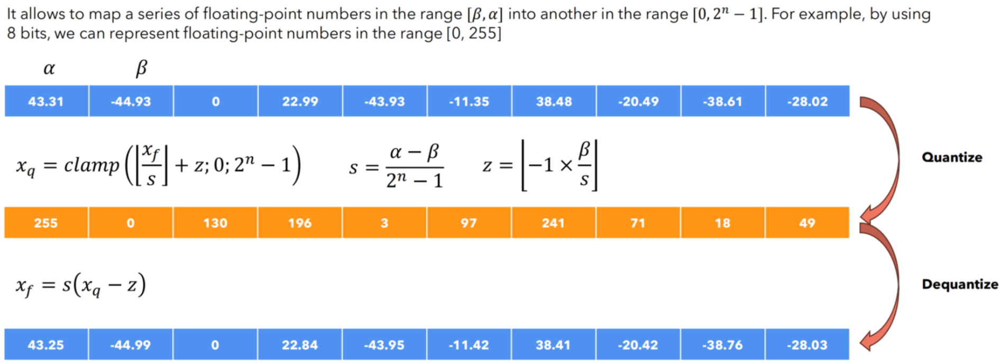
3. 计算复杂，精度高
4. clamp 用于 限制值的范围
5. 不要求量化后的值中零点对应于原始值中的零，具有更好的动态映射范围
6. 保证能将 原最小值 映射到 新0位，即使是正值
7. zero_point 相当于 bias 平移
8. 非对称量化使用三个参数(量化最小值、量化最大值、零点)

量化后数据计算
1. 浮点矩阵乘法 -> 整形矩阵乘法
2. 对称量化
   1. 
3. 非对称量化
   1. 

异常值
1. 会有导致 量化误差 增大
2. 
3. 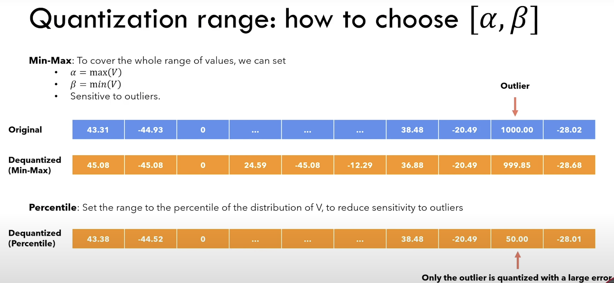
4. 解决方法
   1. 不是直接设为绝对 min/max，而是设为某个 高百分位 (eg : 99.99%)
   2. 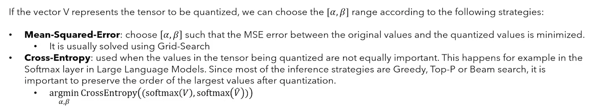

量化力度(granularity)
1. 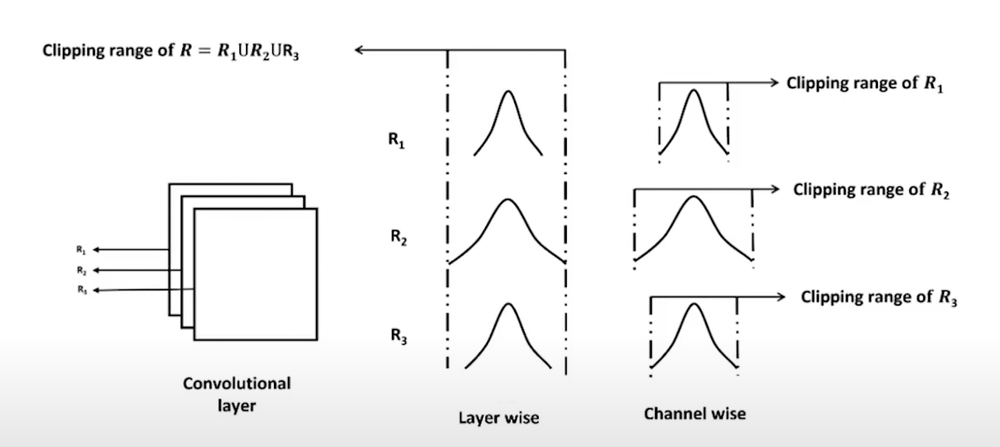
2. tensor
3. channel
4. group : 将权重矩阵分成多个小块，每个块单独进行量化和缩放

# 神经网络量化

神经网络量化 是对 每一层 而言，每一层进行 量化计算，每一层输出时 进行 反量化

下一层 进行 独立的 量化 & 反量化

**PTQ** (Post-training Quantization)  - **训练后量化**
1. Unlabeled Data 不需要是 training 数据，只需要 是 inference 会用到的即可
2. 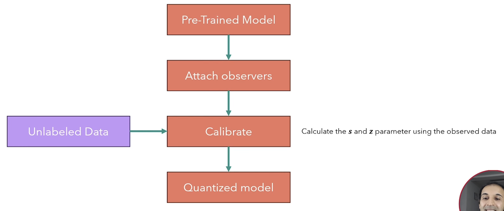

**QAT** (Quantization-Aware Training) - **量化感知训练**
1. 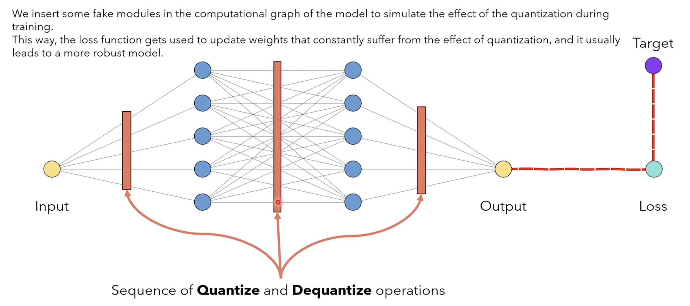
2. 在 **训练阶段** 就把 **量化误差** 模拟进网络，让它学会适应 INT8/INT4 精度，more robust to the quantization effect
3. FakeQuant 把张量 截断/四舍五入到 int8 格点，但仍用 FP32 保存值
4. 难求梯度  `round()`、`clip()` 都是 不可导或梯度几乎处处为 0 的函数
   1. 前向 : 继续用截断 / 四舍五入，真实地模拟量化误差
   2. 反向 : 把量化函数的梯度近似为 1 (和 0)
      1. 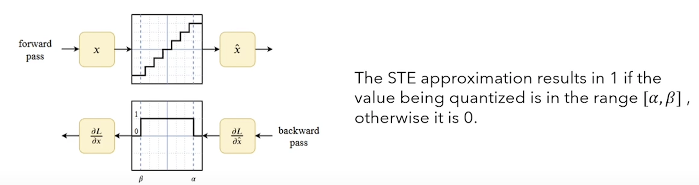
      2. 直观上 : 梯度在 FakeQuant 处当成恒等传递
      3. $$\frac{\partial L}{\partial x} \overset{\text{STE}}{\approx}\ \frac{\partial L}{\partial \hat{x}}$$
      4. STE : straight-through estimator
5. 推理阶段把 FakeQuant 替换为真 QuantizeLinear / DequantizeLinear

**量化对象**
1. 模型权重(weight) : 容易量化，**离线一次性量化**(导出模型时就转 **INT8**，固定值) + 对称量化(权重正负都有) + **per-channel**
2. 输入(input)/激活值(activation) : 推理时才量化(需要依赖实时数据分布) + 非对称量化 + **per-tensor**
   1. 输入 相对容易量化，在预处理阶段固定
      1. 输入像素范围 0-255，或归一化到 0-1
      2. 文本 embedding 可提前归一化
   2. 激活值/输出 最难量化
      1. 静态量化 → 用 校准集(calibration set) 统计 min/max
      2. QAT → 训练时插入 fake-quant，让网络自适应
3. 偏置(bias) : 只做一次，一般 量化到 **int32**

为什么量化对神经网络精度影响不大?
1. 一般 权重 和 输入 都经过 **Normalization**，基本数值范围都不大
2. 激活函数，数值影响会被平滑
3. 绝大部分神经网络都是进行分类，最后都是 概率值，只要最后 某种类别概率 高于 其他类别就可以，不需要绝对数值

神经网络训练后 动态量化
1. 
2. 将训练好的模型权重量化为int8，并保存量化参数
3. 在模型推理时，对每一层输入的fp32激活值，动态进行进行量化为int8
4. 在每一层对量化后的int8权重和int8激活值进行计算
5. 在每一层输出时将结果反量化为fp32
6. 将fp32激活值传入到下一层

**越界问题**
1. int8 × int8 的乘法结果 会先存放到 **32bit(int32) 寄存器** 中
   1. 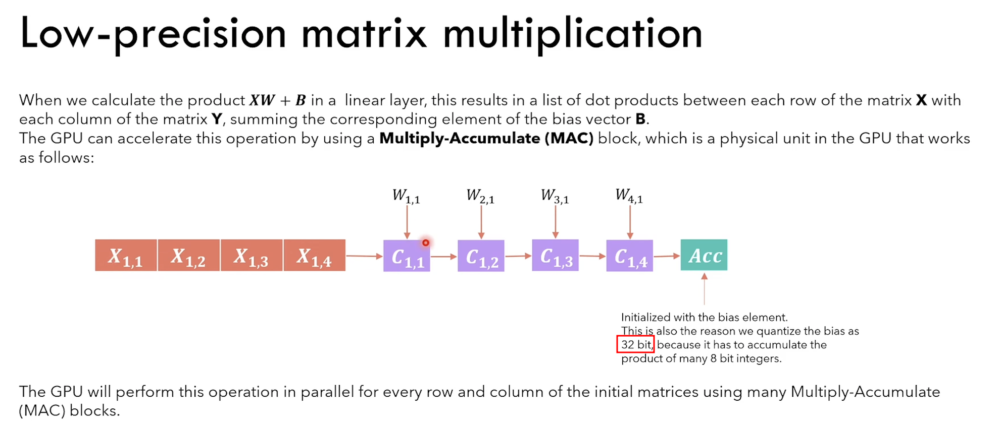
2. 后续可以进行
   1. 若下一层仍走 int8 路径 : **re-quant** : int32 -> int8
   2. 若需要给浮点算子或最终输出 : **dequant** : int32 -> fp32 (开销大)

PyTorch 会把 量化参数 scale 和 zero_point 直接存进张量的元数据里

`torch.qint8`

[Practical Quantization in PyTorch](https://pytorch.org/blog/quantization-in-practice/)

