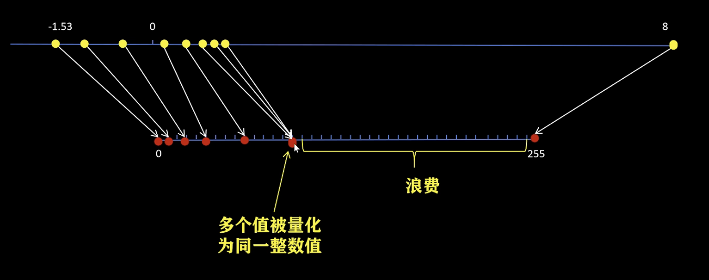

# 量化

[模型量化 - B站合集](https://space.bilibili.com/18235884/lists/2887562?type=season)

# 量化基础

Llama 13B = 13,000,000,000
1. FP32 : 52GB
2. FP16 : 26GB
3. Int8 : 13GB
4. Int4 : 6.5GB

把 Float类型(FP32，FP16) 的 模型参数 和 激活值，用 整数(Int8，Int4) 代替的同时，尽可能减少量化后模型推理的误差

优势
1. 减少模型存储大小
2. 减小推理时占用的显存大小，提升模型推理速度
   1. 计算过程中，TensorCore 和 显存之间 频繁的数据 交换，减少数据交换大小，从而提升模型推理速度
   2. 显存带宽固定，制约推理速度
      1. 虽然 浮点数运算 更复杂，但是 位宽还是 主要决定性因素

单位
1. Tera = $10^{12}$ = $2^{40}$
2. TFLOPS(Tera Floating-point Operations Per Second)
3. TOPS(Tera Operations Per Second)

量化 & 反量化
1. $x1_f -> 量  化 -> x1_q$
2. $x1_q -> 反量化 -> x2_f$
3. 需要 让 $x1_f$ & $x2_f$ 尽可能接近
4. 推理时
   1. 大部分计算 (卷积、矩阵乘法) 在整形空间，极大提升速度 + 降低内存
   2. 在 Input/Output(概率、坐标)、float-only 算子(Softmax，LayerNorm，Attention 缩放 & 加权和) 做 **量化 ↔ 反量化** 的转换

对称量化
1. 计算简单，精度低
2. 找 绝对值 最大的数
3. 
4. 会有一部分整数范围被浪费，除非数据范围对称

非对称量化
1. 计算复杂，精度高
2. clamp 用于 限制值的范围
3. 量化前后零点不同，具有更好的动态映射范围
4. 
5. 保证能将 原最小值 映射到 新0位，即使是正值
6. zero_point 相当于 bias 平移

量化后数据计算
1. 浮点矩阵乘法 -> 整形矩阵乘法
2. 对称量化
   1. 
3. 非对称量化
   1. 

异常值
1. 
2. 可以将 异常值 单独处理

量化力度
1. tensor
2. channel
3. group

# 神经网络量化

神经网络量化 是对 每一层 而言，每一层进行 量化计算，每一层输出时 进行 反量化

下一层 进行 独立的 量化 & 反量化

权重 : 离线一次性量化(导出模型时就转 INT8) + 对称量化 + **per-channel**

输入/激活值 : 推理时才量化(需要依赖实时数据分布) + 非对称量化 + **per-tensor**

为什么量化对神经网络精度影响不大?
1. 一般 权重 和 输入 都经过 **Normalization**，基本数值范围都不大
2. 激活函数，数值影响会被平滑
3. 绝大部分神经网络都是进行分类，最后都是 概率值，只要最后 某种类别概率 高于 其他类别就可以，不需要绝对数值

神经网络训练后 动态量化
1. 
2. 将训练好的模型权重量化为int8，并保存量化参数
3. 在模型推理时，对每一层输入的fp32激活值，动态进行进行量化为int8
4. 在每一层对量化后的int8权重和int8激活值进行计算
5. 在每一层输出时将结果反量化为fp32
6. 将fp32激活值传入到下一层

`torch.qint8`

