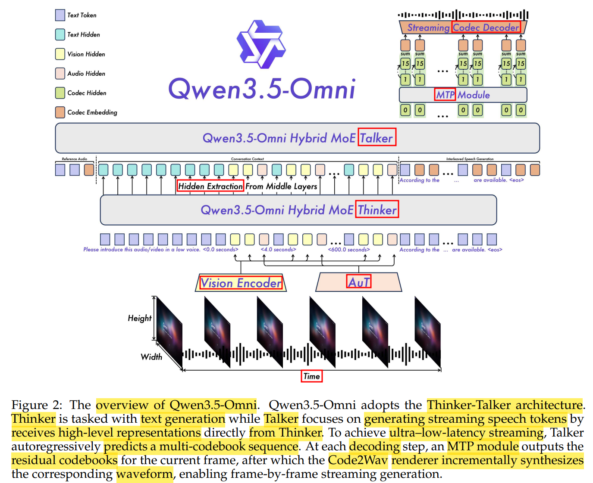

# Qwen3.5-Omni Technical Report

[千问云 简介](https://www.qianwenai.com/models/qwen3.5-omni-plus)

[HuggingFace Online Demo](https://huggingface.co/spaces/Qwen/Qwen3.5-Omni-Online-Demo)

---

# Abstract & Intro

Qwen3.5-Omni

dataset
1. heterogeneous text-vision pairs (异构 文本-视觉 对)
   1. 不仅包含 纯文本 & 图文，还包含 视频-文本 / 音频-文本 / 视频-音频 / 视频-音频-文本的 联合语料
2. 100+ million hours audio-visual content (超 1亿小时 音视频内容)

Thinker + Talker

Audio-Visual Vibe Coding : 涌现 使用 audio-visual 作为 instruction 的 coding 能力

---

# Architecture

Hybrid Attention MoE(Mixture-of-Expert)
1. 解决 千亿参数级别，处理 超长 多模态 上下文(256k Context) 的 计算&存储瓶颈
2. Hybrid : 除了传统 Attention，引入 GDN(Gated Delta Net)等 线性/轻量化 注意力变体
3. 多模态 : token 强行拼接为 single-stream

**Thinker-Talker** 级联/解耦
1. ==Thinker== : 多模态理解 & 高层逻辑生成
   1. Input : 接受所有 modality 的信息，并 全部 tokenize
      1. 文本 : 250k 词表的
      2. 音频 : Audio Transformer 编码器下采样为 6.25Hz 的低频特征(每个 Token 对应 160ms 信号)
      3. 视频 : 动态采样 对齐到 160ms 级别
   2. Output
      1. 文本 Token (**text 预测头**)
      2. Middle Layers 的 Hidden States (高层隐藏表征)
   3. Position Info
      1. 为防止多模态位置冲突，各个 modality 的 Position ID 是 全局全模态连续的 (不是每个 modality 重新编号)
      2. **Temporal Interleave** 排布方式 : 按照时间线或逻辑顺序，将文本、音频、视觉 Token 交织/穿插 在一起
      3. 每个视频或音视频块前面，强行插入一个格式化的文本时间戳(eg : `<4.0 seconds>`)，会转化为 与普通文字相同的 文本词向量(Text Embedding)
2. ==Talker== : 负责 高质量 & 低延迟 流式语音合成(Streaming Speech Generation)
   1. **不关心 token 模态(Modality Agnostic)**，负责把向量翻译成音频 Codec 发声
   2. Input : 不直接处理 原始的 视频/音频
      1. 历史上下文 Context
      2. Thinker 当前步输出的文本流
      3. Thinker Middle Layers 的 Hidden States
   3. Output
      1. 高层语义 作为 conditioning
      2. 自回归(auto-regressive) 预测离散的 RVQ(**Residual** Vector Quantization) tokens
      3. MTP(多Token预测) 一帧帧吐出 残差 CodeBooks (**audio 预测头**)
      4. 由轻量化的 因果卷积网络(Causal ConvNet )重构 波形
3. ==ARIA== (Adaptive Rate Interleave Alignment)
   1. 解决 Streaming Speech Synthesis 的 Instability & Unnaturalness 问题
      1. **归因** : text/speech ==tokenizer== 的 编码效率差异
         1. 文本 Tokenizer : 高压缩率 & 低频，文本流 快
         2. 语音 Tokenizer : 低压缩率 & 高频，语音流 慢
            1. 语音是 **连续的模拟信号**
            2. 除了语义，还包含 音色、情绪、语速 etc.
   2. 文本 & 语音 合并为 一条 单向交织的数据流 (interleaved single-stream)，而不是 双轨
   3. 自适应速率约束
      1. 在生成的任何一个前缀阶段，累计的 **语音Token/文本Token 的比例**，不能超过该项目设定的 全局比例阈值
         1. text token : 由 Thinker 生成
         2. audio token : 由 Talker 生成
         3. $$\text{ARIA Ratio} = \frac{\text{Talker 已生成的 Audio Tokens}}{\text{Thinker 已生成的 Text Tokens}}$$
      2. 模型输出一个 Text Token 后，必须输出对应数量的 Audio Codec Token
      3. 相当于在 while 循环内，不断切换 thinker & talker 的调用

Encoder

**Audio Transformer (AuT)**
1. 把高频的 连续波形(24k Hz) 压成 低频的特征向量

**Speech Generation**

Quantizer

