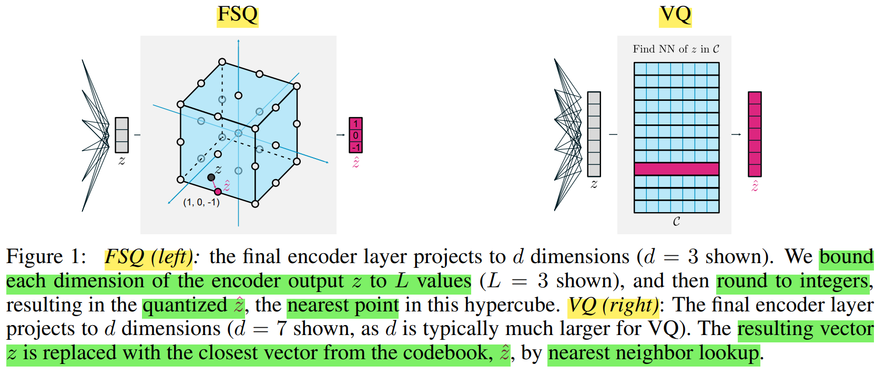
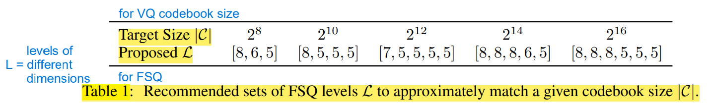
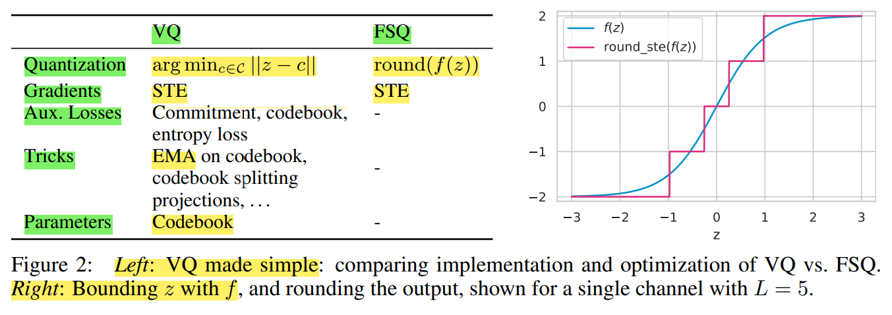

# FSQ - Finite Scalar Quantization

VQ-VAE(encoder + codebook + decoder) 的离散 latent 可以作为压缩表示，供自回归模型生成

FSQ 逐 维度(dim) 做有界映射 & 取整，不需要码本，训练时仍然使用 STE(Straight-Through Estimator)

FSQ
1. **核心** : 把向量投到 **很低的维度** $d$(dim)(eg : 3~6 维)，**每维** 独立量化 到固定的 $L$(level) 个标量档位
2. 
3. 量化公式 & 解释
   1. $$\hat z=\operatorname{round}(\underbrace{\left\lfloor L/2\right\rfloor}_{\text{floor}}\times\tanh(z))$$
      1. P.S. 该简化公式只适用于 ==奇数L==
   2. 每维先用有界函数(如 $\tanh$)压到固定范围
   3. 再**四舍五入**到 $L$ 个档位 (round 用 STE 反传)
4. **隐式codebook** = 各维(dim)档位(level)的笛卡尔积，大小 $=L_1\times L_2\times...\times L_d$
   1. 
   2. 例 : 档位 `[8,5,5,5]` → $8\times5\times5\times5 = 1000 \approx 1024$ 个码字
5. token 索引 = 各维档位组合编码出的整数

优点
1. **不会坍缩** : 网格每个点天然可达，利用率几乎 100%
2. **超简单** : 无码本损失、无 auxiliary loss、无 EMA，只剩 reconstruction loss
3. 大码本下效果追平甚至超过 VQ

VQ-VAE(encoder + codebook + decoder) 的 离散 latent(codebook vector) 可以作为 压缩表示，供自回归模型生成

FSQ & VQ-VAE 对比
1. 

