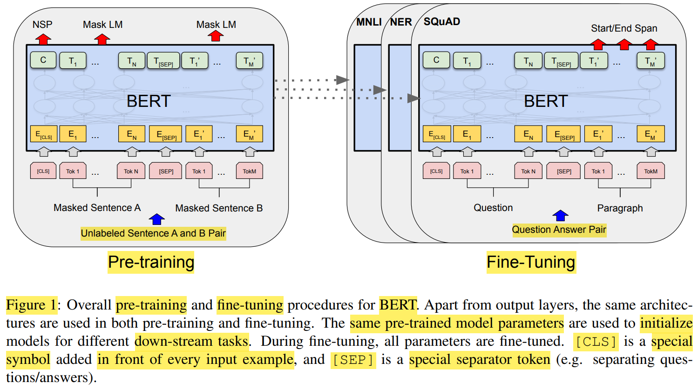
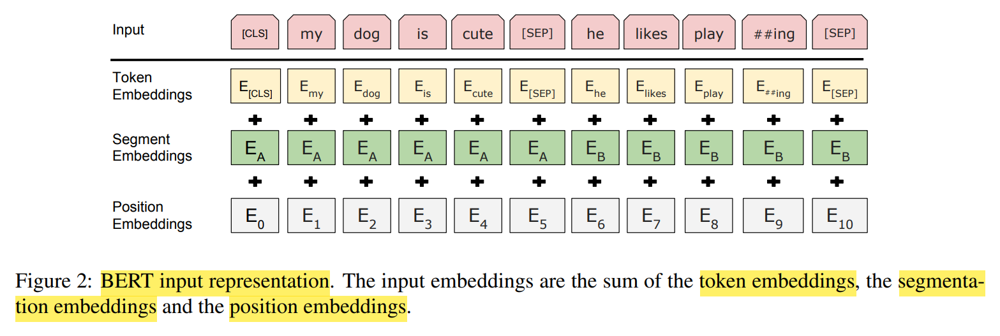

# BERT : Pre-training of Deep Bidirectional Transformers for Language Understanding

BERT(**Bidirectional** Encoder Representations from Transformers)

**Bidirectional & Unidirectional**
1. Bidirectional : 可以同时看到当前词之前和之后的所有信息
2. Unidirectional : 只能看到当前词之前的信息

NLP tasks
1. **sentence-level**(预测句子之间的关系) : 句子分类，情感分析，文本相似度
2. **token-level** : 词性标注，命名实体识别(named entity recognition)，question answering

将预训练 Pre-Training Language Representation 应用到下游任务
1. **feature-based** : pre-trained model，作为 **特征提取器**，结合 task-specific architecture
2. **fine-tuning** : pre-trained model，结合 task-specific parameters，微调参数

预训练目标 : MLM(Masked Language Model) & NSP(Next Sentence Prediction，判断两个句子是否相邻)

BERT 2 个步骤
1. Pre-Training : 使用 **未标注数据** 进行 不同预训练任务
2. Fine-Tuning : 使用 预训练权重，使用 **标注数据** 进行 全参数微调，每个下游任务都有各自的 微调后的模型

Input/Output Representation
1. Transformer，训练的 输入是 **序列pair**，分别 输入给 encoder 和 decoder
2. BERT，只有 encoder
   1. **token sequence**，而非固定的 单个句子 或 句子pair
   2. 为了处理 句子 pair，需要 特殊 token `[CLS]` 和 `[SEP]`
      1. `[CLS]` 整合 sequence representation 给 分类任务
      2. `[SEP]` 区分 两个句子，还有会 learn segment embedding 区分 是 第一个句子 还是 第二个句子
   3. 最终 embedding = token embedding + segment embedding + positional embedding
   4. 

不希望 vocab size 太大，导致 参数都集中在 embedding 层，所以使用 WordPiece 分词方法，将 出现频率低的词 转为 子词(sub-word)，可能是 词根、词缀、词干

Pre-Training Tasks
1. MLM(Masked Language Model)
   1. 15% 的 token 被 随机替换为 `[MASK]`
   2. fine-tuning 时，没有 `[MASK]`，数据分布有差异
   3. mitigate 方法
      1. 80% : 替换为 `[MASK]`
      2. 10% : 替换为 随机 token
      3. 10% : 保持不变
   4. pre-train 结束后，`[MASK]` 对应的 embedding 就固定了
2. NSP(Next Sentence Prediction，判断两个句子是否相邻)

