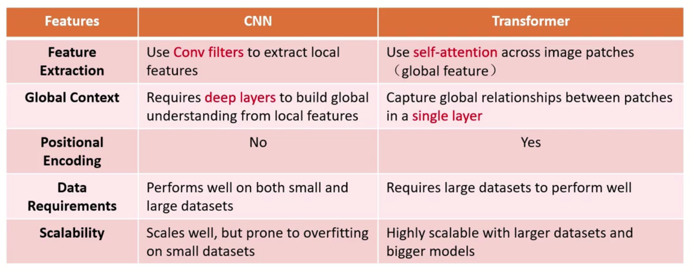

# 视觉 Transformer 理论与实践 - 深蓝学院

[视觉 Transformer 理论与实践 - 深蓝学院](https://www.shenlanxueyuan.com/my/course/775)

## Table of Contents

- [视觉 Transformer 理论与实践 - 深蓝学院](#视觉-transformer-理论与实践---深蓝学院)
  - [Table of Contents](#table-of-contents)
- [01 - CNN \& Attention \& Transformer](#01---cnn--attention--transformer)
  - [02 - Attention Basics](#02---attention-basics)

---

# 01 - CNN & Attention & Transformer

CNN
1. 归纳偏置
2. 局部连接 (local connectivity)，不是 MLP 的 全连接
3. 相同卷积核 (weight sharing)
4. 平移不变性 (transition invariance)

Vision Transformer
1. 基于 self-attention，结合 位置信息
2. patch + position embedding

对比
1. Network Architecture
   1. 
2. 感受野(Receptive Field)
   1. CNN 局部，Transformer 全局
   2. 
3. Others
   1. 

---

## 02 - Attention Basics

Attention is All you Need
1. 
2. 输入 embedding
3. 无 归纳偏置，所以需要 position embedding
4. Multi-Head + Feed-Forward(全连接) + 残差结构
5. Masked Multi-Head

RNN 容易产生遗忘问题，需要加入注意力

结构
1. N-N : 定位内容(每个词一个概率)
2. N-1 : 情感分析(整句话给出一个结果)
3. 1-N : 文本生成
4. N-M : 文本翻译
   1. 先循环过 N 个单词，得到输出 h
   2. h + `<start>`(开始标记) 作为 翻译 RNN 的 输入，直到 `<end>`(结束标记)
   3. 

Transformer 没有使用 RNN(循环神经网络)，只用了注意力机制

---

