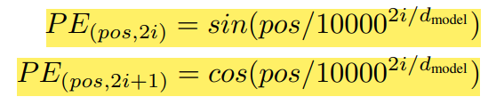
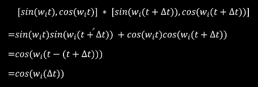

# Transformer

[Transformer论文逐段精读 - 李沐(B站)](https://www.bilibili.com/video/BV1pu411o7BE)

[王树森](https://www.bilibili.com/video/BV1dK411k74q)

[妹子](https://www.bilibili.com/video/BV1xoJwzDESD)

[Transformer 常见问题与回答总结 - 知乎](https://zhuanlan.zhihu.com/p/496012402?)

## Table of Contents

- [Transformer](#transformer)
  - [Table of Contents](#table-of-contents)
- [RethinkFun - B站](#rethinkfun---b站)
- [月来客栈 - B站](#月来客栈---b站)
  - [00 - 传统 注意力机制 \& 归一化](#00---传统-注意力机制--归一化)
  - [01 - 多头注意力机制原理](#01---多头注意力机制原理)
  - [02 - 位置编码 \& 编码解码 过程](#02---位置编码--编码解码-过程)
  - [03 - 网络结构 \& 自注意力 实现](#03---网络结构--自注意力-实现)
  - [04 - Transformer 实现过程](#04---transformer-实现过程)
  - [05 - 基于 Transformer 的 翻译模型](#05---基于-transformer-的-翻译模型)
  - [06 - 基于 Transformer 的 对联生成模型](#06---基于-transformer-的-对联生成模型)
- [DeepBean - YouTube](#deepbean---youtube)

---

# RethinkFun - B站

[大模型修炼之道 : Transformer : Attention is all you need - B站](https://www.bilibili.com/video/BV1FH4y157ZC/)

只使用 attention 机制，解决 seq2seq 问题，最早 Google 用于 翻译问题

Tokenize  : 使用 已有字典 对句子 分词

Embedding : 对每个 token 分配一个 **可学习的 参数向量**(高维空间)
1. 每个维度 代表 某种语义
2. 向量之间的相对关系(向量相减) 也有一定语义
3. 问题
   1. 学习完成后 embedding 固定，不能根据上下文进行调整

Self-Attention
1. 通过 token 之间 彼此的注意力，让 token 根据上下文，更新自己的 embedding
2. 每个 token 有初始的 embedding，通过 3个 线性层的映射，得到 3个 向量
   1. Q : 向其他 token 查询
   2. K : 对查询应答
   3. V : 用于更新其他 token embedding
3. 相似性匹配 Q & K 点积(自己的 Q & K 也会点积)，不同 token 组成 相似度向量，Softmax，加权求和

MultiHead Self-Attention
1. 类似 CNN 每层 可以指定多个 卷积核
2. Self-Attention 可以指定多个 Head，多次线性映射，得到多组 Q & K & V，不同组的向量 拼接起来
3. 通过 矩阵运算，加速计算
4. 要除以 $\sqrt{d_k}$(特征向量维度)，均值不变，调整方差(保证为1)
5. 实际上 总特征数不变，平均分给多个 head (相当于头变小了)，再 concat 得到完整的
6. feature size 必须整除 头的数量

Layer Normalization
1. 统计每个 Token 的 mean & var(对每个 Token 独立计算)，进行标准化
2. 加入 很小 $\epsilon$ 防止 ÷0
3. **每个特征维度** 都有 可学习参数 $\gamma$ & $\beta$
4. `torch.nn.Parameter` 用来把一个 Tensor 注册成 `nn.Module` 的可学习参数
5. Layer Norm 位置
   1. Post-LN(原版) : 先 MHA + Dropout，然后 Residual Add，再 Norm (Add & Norm)
   2. Pre-LN (常用) : 先 Norm，然后 MHA + Dropout，再 Residual Add

Residual Connection : 避免梯度消失

Feed Forward : linear + relu + dropout + linear

Encoder 输入 & 输出维度一致，可以多个 block 叠加，原文是 6个

Position Encoding
1. Attention 机制 没有考虑位置关系，只是 weighted-sum (eg : 我打他 ≠ 他打我)
2. 不能使用 离散的 绝对位置编码，模型没法处理 句子的 token 数 大于 训练时的 句子 token 数
3. 位置编码维度 和 原始编码维度 一致
4. 可以将 离散编码 转为 连续编码，周期变换，低维度变化快，高维度变化慢
   1. 三角函数 sin/cos 可以调整 频率
   2. 频率高 低维度，频率低 高维度
   3. 
   4. 实际上 Transformer 使用的是 sin/cos 交替编码
   5. 
   6. 好处 : 仅和 相对位置 有关，和 绝对位置 无关

Decoder 输入有2部分
1. Decoder 的 embedding
2. Encoder 更新后的 embedding

Mask Attention
1. 一次性 对所有位置进行训练
2. 推理时，还是需要 一个个的 token 进行输出
3. mask为1的位置，表示可以看到 token，可以进行 attention 计算
4. 让每个 token 只关注 自己 & 之前的tokens
5. attention 正常计算，在 softmax 之前，将 mask为0的位置 替换为 **很大的负值**

Cross Attention
1. `Encoder 的 K & V` + `Decoder 的 Q`
2. 经过 Linear 将 输出维度 映射到 字典大小，再 Softmax

[Source Code - Github](https://github.com/hkproj/pytorch-transformer/blob/main/model.py)

---

# 月来客栈 - B站

[月来客栈 - B站合集](https://space.bilibili.com/392219165/lists/4900590?type=season)

## 00 - 传统 注意力机制 & 归一化

硬注意力 : one-hot 编码

软注意力 : 概率分布

BatchNorm 批量归一化
1. 靠近 input  的 layer，对应的 **梯度小**，权重更新慢
2. 靠近 output 的 layer，需要根据 靠近 input 的 layer 的变换，前向传播，重新适应数据分布
3. 解决方法 : 添加一层归一化层，是的每一层 input 的分布都尽可能接近 标准正太分布

## 01 - 多头注意力机制原理

## 02 - 位置编码 & 编码解码 过程

## 03 - 网络结构 & 自注意力 实现

## 04 - Transformer 实现过程

## 05 - 基于 Transformer 的 翻译模型

## 06 - 基于 Transformer 的 对联生成模型

---

# DeepBean - YouTube

[Transformers, Simply Explained | Deep Learning -  - YouTube(DeepBean)](https://www.youtube.com/watch?v=UPhaYex4zZk)

解决 旧架构(eg : RNN) 中的问题
1. Long-Range : information 难以保持 很多步 timestamps
2. Parallel   : 需要类似自回归方式，难以并行(train & inference)
   1. RNN /LSTM /GRU : 训练 & 推理 都无法并行
   2. Transformer
      1. 推理 inference : 无法并行
         1. 要 一个词接一个词 地生成，整体流程是自回归的，无法在时间维度上并行
         2. 使用 因果掩码(causal mask)，保证位置 t 只能看到 ≤ t 的 token
         3. 序列内并行(注意力计算、前馈层 等)，时间步串行(每轮产生一个或一批 新token，再喂回模型)
      2. 训练 training : 可以并行
         1. 采用 teacher forcing，完整目标序列已知
         2. 因果掩码阻断未来信息
         3. 可以并行计算 Loss

Basic Idea : **Self-Attention**
1. 序列中的 每一个单词 都根据一定的 注意力分数 和 另一序列的单词 相连
2. 自注意力机制，两个序列相同
3. 

Operation
1. Inference
   1. 
2. Training
   1. 
3. input  ： 包含 开始token(`<START>`) & 结束token(`<END>`)
4. output :
5. 模型被分为两个部分
   1. Encoder : 利用 self-attention 机制 得到 input 的 abstract representation
   2. Decoder : 利用 representation 一次一个字的输出句子
      1. 开始接收 开始token(`<START>`)
      2. 结合 Encoder 输出 得到 Decoder 输出
      3. 将其最后一个词 append 给 output
      4. output 再传入 decoder
      5. 不断循环直到 结束token(`<END>`)

Architecture
1. 
2. Word/Token Embedding
   1. 语义相近的组成 cluster
   2. String -> Token -> Token ID -> Embedding Vectors
      1. 前两步 不受训练影响
      2. 
      3. Token 不必是单词，可以是 words / sub-words / letters(对于非自然语言用途)
      4. Tokenization 使用 **lookup table** 完成
         1. 
         2. embedding vector 的实际数据是 训练中学习的，不需要 pre-trained embedding
      5. 特殊 Tokens : `<START>`, `<END>`, `<UNK>`(unknown), `<PAD>`(保证相同序列长度)
3. Positional Encoding
   1. 对于 RNN，位置信息 隐式提供，token 按顺序输入模型，但是 **transformer 的 token 是 并行输入**
   2. 
   3. 参数
      1. `pos` : token 在序列中的位置 (Position index)
      2. `i`   : 向量维度索引 (Dimension index)
   4. 位置编码和原始编码 长度一致，直接相加
   5. 生成 位置编码的函数 可以学习，论文中使用硬编码
      1. 
      2. 注意 : 此处的 公式和原文有所出入，以原文为准
      3. 
   6. 
4. Encoder (Multi-Head Attention & FeedForward 多组堆叠)
   1. Self-Attention : Query Sequence = Context Sequence (Query Token -> Context Token)
      1.  
      2. Attention 可以理解为 Query 通过匹配 Key 访问 Value
      3. 
      4. 
   2. 归一化
      1. 
      2. 第2个公式中，常数 $a$ 约掉
      3. 除以 $\sqrt{d_k}$ 的原因
         1. 点积的方差 随着 维度增长 而变大
            1. 以 $\mathcal{N}(0,1)$ 为例，假设 query & key 的每个维度 都服从 标准正态分布
            2. 每一维度乘积 $q_i · k_i$ 的 均值为0，方差为1 (独立正态乘积)
            3. 总点积 $s = q · k = \sum_{i=1}^{d} q_i · k_i$，均值为0 方差为$d_k$
         2. 大数值进入 softmax 会 过度尖锐，反向传播时梯度几乎只流向极少几个位置
         3. 通常不会计算 `<PAD>` token
   3. 矩阵形式
      1. 
      2. 对于 self-attention，**seq_len_q = seq_len_k = seq_len_val**
      3. 
      4. Softmax 是 Per-Query，也就是 按行 softmax
   4. Attention HeatMap & Mask
      1. 
      2. softmax 中 不考虑 `<PAD>` token，在 softmax 前，使用 掩码矩阵，element-wise 乘法，注意 mask 的值 是 1/$-\infty$
      3. 
   5. 整体流程
      1. 
      2. 其中，Q、K、V 矩阵是通过 将 Embedding X 分别通过 线性层/矩阵变换 得到的，所以 只需要 X 作为输入
      3.  
   6. Multi-Head
      1. 多头 对应 不同的 Linear，可以 捕捉不同方面
      2. 使用 `concat` 形成一个大矩阵
      3. 通过 线性层，再和 输入 X 进行 element-wise 相加，得到输出 Y
      4. 
      5. 没有硬性限制 Multi-Head 必须不同，但 参数随机初始化 + 训练动力学(Dropout、LayerNorm、Mini-Batch) + 输出融合层的梯度需求，会自然驱动它们走向差异化
   7. 原文 n_heads = 8，n_encoders = 6
5. Decoder
   1. 整体结构和 Encoder 类似，但有**关键区别**
   2. Causal/Look-Ahead Mask
      1. 确保 Query Token 不能去匹配 Context Sequence 中 更后面的 Token
         1. 
      2. 在训练阶段 模拟 推理时可见的信息范围，防止未来信息泄漏
      3. 同时结合 Padding Mask & Causal Mask
         1. 
      4. 整体流程
         1. 
   3. Cross-Attention
      1. 和 Self-Attention 基本类似，只是 **Q、K、V 来源不同**
         1. Q : Target Sequence，去检索 Encoder Output 中的 有用信息
         2. K、V : Encoder 得到的 abstract representation，长度固定
      2. 注意 K、V、Q 的位置
      3. 
   4. 原文 n_heads = 8，n_decoders = 6
6. Word Selector
   1. 
   2. 从 Decoder 接收 abstract representation，通过 Linear & Softmax(Normalize，可解释为概率)，得到 Score Matrix

Limitation
1. Cross-Entropy 无法得到 错误程度
   1. 
2. Sequence Length 和 Vocab Size 限制

相关 Embedding 补充
1. 在原生 Transformer 训练流程中，词向量默认随机初始化，和模型其他部分一起端到端学习
2. 若你想在一个下游任务上使用通用语料训练好的 GloVe、word2vec、fastText 向量，也可以把 embedding 矩阵初始化为这些值，然后继续 fine-tune
3. LLM(GPT、BERT)本身就是 "预训练模型"，早期阶段也把 词向量随机初始化，经过海量语料训练后才成为 预训练词向量，下游再做微调时，这些 embedding 已经带有丰富的语义

BatchNorm & LayerNorm

