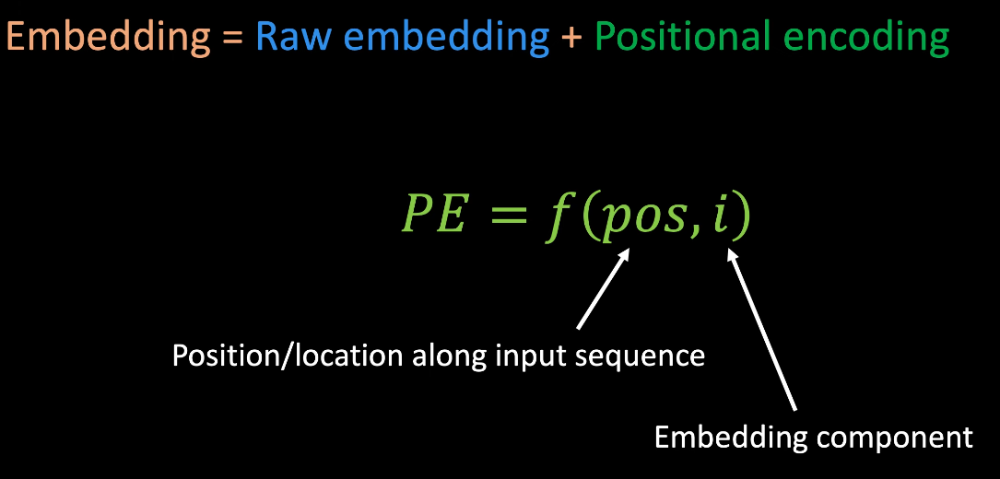

[Transformers, Simply Explained | Deep Learning -  - YouTube(DeepBean)](https://www.youtube.com/watch?v=UPhaYex4zZk)

[李沐](https://www.bilibili.com/video/BV1pu411o7BE)

[王树森](https://www.bilibili.com/video/BV1dK411k74q)

[妹子](https://www.bilibili.com/video/BV1xoJwzDESD)

解决 旧架构(eg : RNN) 中的问题
1. Long-Range : information 难以保持 很多步 timestamps
2. Parallel   : 需要类似自回归方式，难以并行(train & inference)
   1. RNN /LSTM /GRU : 训练 & 推理 都无法并行
   2. Transformer
      1. 推理 inference : 无法并行
         1. 要 一个词接一个词 地生成，整体流程是自回归的，无法在时间维度上并行
         2. 使用 因果掩码(causal mask)，保证位置 t 只能看到 ≤ t 的 token
         3. 序列内并行(注意力计算、前馈层 等)，时间步串行(每轮产生一个或一批 新token，再喂回模型)
      2. 训练 training : 可以并行
         1. 采用 teacher forcing，完整目标序列已知
         2. 因果掩码阻断未来信息
         3. 可以并行计算 Loss

Basic Idea : **Self-Attention**
1. 序列中的 每一个单词 都根据一定的 注意力分数 和 另一序列的单词 相连
2. 自注意力机制，两个序列相同
3. 

Operation
1. Inference
   1. 
2. Training
   1. 
3. input  ： 包含 开始token(`<START>`) & 结束token(`<END>`)
4. output :
5. 模型被分为两个部分
   1. Encoder : 利用 self-attention 机制 得到 input 的 abstract representation
   2. Decoder : 利用 representation 一次一个字的输出句子
      1. 开始接收 开始token(`<START>`)
      2. 结合 Encoder 输出 得到 Decoder 输出
      3. 将其最后一个词 append 给 output
      4. output 再传入 decoder
      5. 不断循环直到 结束token(`<END>`)

Architecture
1. 
2. Word/Token Embedding
   1. 语义相近的组成 cluster
   2. String -> Token -> Token ID -> Embedding Vectors
      1. 前两步 不受训练影响
      2. 
      3. Token 不必是单词，可以是 words / sub-words / letters(对于非自然语言用途)
      4. Tokenization 使用 **lookup table** 完成
         1. 
         2. embeding vector 的实际数据是 训练中学习的，不需要 pre-trained embedding
      5. 特殊 Tokens : `<START>`, `<END>`, `<UNK>`(unknown), `<PAD>`(保证相同序列长度)
3. Positional Encoding
   1. 对于 RNN，位置信息 隐式提供，token 按顺序输入模型，但是 **transformer 的 token 是 并行输入**
   2. 
   3. `pos` : token 在序列中的位置 (Position index)
   4. `i`   : 向量维度索引 (Dimension index)
   5. 位置编码和原始编码 长度一致，直接相加
   6. 生成 位置编码的函数 可以学习，论文中使用硬编码
   7. 
   8. 
   9. 
4. Encoder (Multi-Head Attention & FeedForward 多组堆叠)
   1. Self-Attention : Query Sequence = Context Sequence (Query Toekn -> Context Token)
      1.  
      2. Attention 可以理解为 Query 通过匹配 Key 访问 Value
      3. 
      4. 
   2. 归一化
      1. 
      2. 第2个公式中，常数 $a$ 约掉
      3. 除以 $\sqrt{d_k}$ 的原因
         1. 点积的方差 随着 维度增长 而变大
            1. 以 $\mathcal{N}(0,1)$ 为例，假设 query & key 的每个维度 都服从 标准正态分布
            2. 每一维度乘积 $q_i · k_i$ 的 均值为0，方差为1 (独立正态乘积)
            3. 总点积 $s = q · k = \sum_{i=1}^{d} q_i · k_i$，均值为0 方差为$d_k$
         2. 大数值进入 softmax 会 过度尖锐，反向传播时梯度几乎只流向极少几个位置
         3. 通常不会计算 `<PAD>` token
   3. 矩阵形式
      1. 
      2. 对于 self-attention，**seq_len_q = seq_len_k = seq_len_val**
      3. 
      4. Softmax 是 Per-Query，也就是 按行 softmax
   4. Attention HeatMap & Mask
      1. 
      2. softmax 中 不考虑 `<PAD>` token，在 softmax 前，使用 掩码矩阵，element-wise 乘法，注意 mask 的值 是 1/$-\infty$
      3. 
   5. 整体流程
      1. 
      2. 其中，Q、K、V 矩阵是通过 将 Embedding X 分别通过 线性层/矩阵变换 得到的，所以 只需要 X 作为输入
      3.  
   6. Multi-Head
      1. 多头 对应 不同的 Linear，可以 捕捉不同方面
      2. 使用 `concat` 形成一个大矩阵
      3. 通过 线性层，再和 输入 X 进行 element-wise 相加，得到输出 Y
      4. 
   7. 原文 n_heads = 8，n_encoders = 6
5. Decoder
   1. 整体结构和 Encoder 类似，但有**关键区别**
   2. Causal/Look-Ahead Mask
      1. 确保 Query Token 不能去匹配 Context Sequence 中 更后面的 Token
         1. 
      2. 在训练阶段 模拟 推理时可见的信息范围，防止未来信息泄漏
      3. 同时结合 Padding Mask & Causal Mask
         1. 
      4. 整体流程
         1. 
   3. Cross-Attention
      1. 和 Self-Attention 基本类似，只是 **Q、K、V 来源不同**
         1. Q : Target Sequence，去检索 Encoder Output 中的 有用信息
         2. K、V : Encoder 得到的 abstract representation，长度固定
      2. 注意 K、V、Q 的位置
      3. 
   4. 原文 n_heads = 8，n_decoders = 6
6. Word Selector
   1. 
   2. 从 Decoder 接收 abstract representation，通过 Linear & Softmax(Normalize，可解释为概率)，得到 Score Matrix

Limitation
1. Cross-Entropy 无法得到 错误程度
   1. 
2. Sequence Length 和 Vocab Size 限制

相关 Embedding 补充
1. 在原生 Transformer 训练流程中，词向量默认随机初始化，和模型其他部分一起端到端学习
2. 若你想在一个下游任务上使用通用语料训练好的 GloVe、word2vec、fastText 向量，也可以把 embedding 矩阵初始化为这些值，然后继续 fine-tune
3. LLM(GPT、BERT)本身就是 "预训练模型"，早期阶段也把 词向量随机初始化，经过海量语料训练后才成为 预训练词向量，下游再做微调时，这些 embedding 已经带有丰富的语义

BatchNorm & LayerNorm

