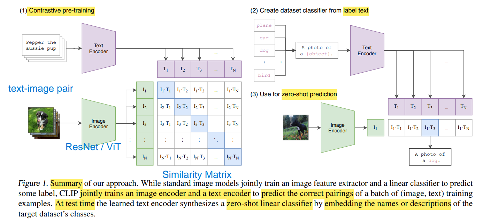

# CLIP - Contrastive Language Image Pre-Training

[CLIP - Github](https://github.com/openai/CLIP)

[CLIP 解读 - B站](https://www.bilibili.com/video/BV1SL4y1s7LQ)

[CLIP - OpenCV Bootcamp Slide](./OpenCV-Bootcamp_CLIP_Internals_and_Architecture.pdf)

---

**multimodal** : vision + language

结构总览
1. 
2. 架构
   1. 最小配置 : 文本分支 Transformer，图像分支 ResNet
   2. 流行配置 : 文本分支 Transformer，图像分支 ViT (两边都是 Transformer，端到端更统一)
3. Pre-Training
   1. $T_1,\dotsm,T_N$ & $I_1, \dotsm, I_N$ 中，每个元素 长度都为 d，代表 N 对 text-image pair 得到的 embedding 结果
      1. 主对角线(蓝色) 代表 正样本，共 $N$ 个
      2. 非对角线(白色) 代表 负样本，共 $N^2 - N$ 个
4. Zero-Shot Prediction
   1. 利用 prompt template 生成文本，**摆脱 categorical label 的限制**(无需定死的标签)
   2. 用 各个{类别}文本 和 图片 计算 cosine similarity

数据集
1. 对比学习 需要 大量数据
2. **internet scale** : image-caption pair, WIT(Web ImageText) Dataset, **not public**, 400M
   1. 或许可以用 [Wikipedia-based Image Text Dataset - Github](https://github.com/google-research-datasets/wit?tab=readme-ov-file#wit--wikipedia-based-image-text-dataset) 代替

**Loss Function**
1. $$
   \mathcal{L}_{\text{CLIP}}
   = \frac{1}{2}\Biggl[
   -\frac{1}{N}\sum_{i=1}^{N}
      \log\frac{\exp\!\bigl(\operatorname{sim}(I_i,T_i)/\tau\bigr)}
               {\sum_{j=1}^{N}\exp\!\bigl(\operatorname{sim}(I_i,T_j)/\tau\bigr)}
   \;+\;
   -\frac{1}{N}\sum_{i=1}^{N}
      \log\frac{\exp\!\bigl(\operatorname{sim}(T_i,I_i)/\tau\bigr)}
               {\sum_{j=1}^{N}\exp\!\bigl(\operatorname{sim}(T_i,I_j)/\tau\bigr)}
   \Biggr]
   $$
2. 左边部分为 **image-to-text** loss
3. 有半部分为 **text-to-image** loss

`from transformers import CLIPTokenizer, CLIPProcessor, CLIPModel`

Contrastive Learning
1. encode image/text as same sized vector (represent semantic meaning)
   1. vision encoder
   2. text encoder
2. **shared embedding space**
3. 余弦相似度 **cosine similarity** $(a, b) = \frac{a b}{|a| |b|}$
   1. 训练时，CLIP 会在视觉/文本编码器 输出后做 L2-norm
      1. 模型仍在 完整空间 里 输出向量，仅仅是在训练时进行归一化
   2. 向量的模长全部固定为 1，点积就正好等价于余弦值
   3. 模型无法 靠增大模长 来作弊，只能通过改变方向来表达语义差异，从而使学习过程更稳定

相关应用
1. [StyleCLIP: Text-Driven Manipulation of StyleGAN Imagery (ICCV 2021 Oral) - Github](https://github.com/orpatashnik/StyleCLIP)
2. [CLIPDraw: Synthesize drawings to match a text prompt! - Github](https://github.com/kvfrans/clipdraw)
