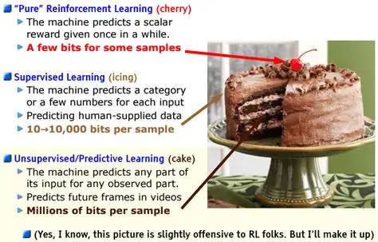
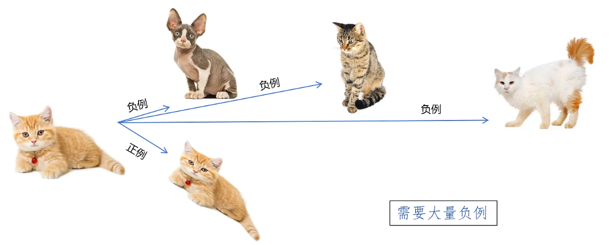
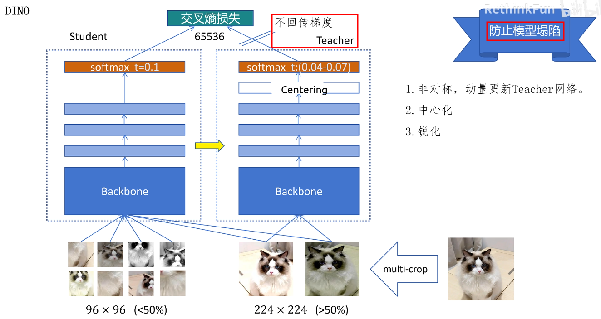
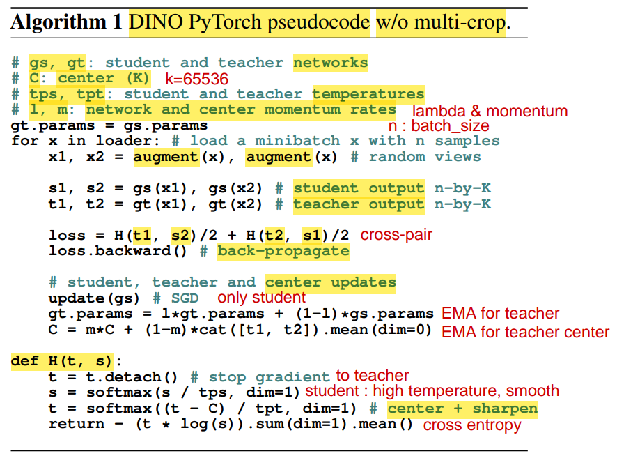

# DINO 系列

self-**DI**stillation with **NO** labels

不需要任何标签信息

不需要对比学习中的大量负样本

视觉特征提取器

训练出的 ViT，可以找出 物体轮廓，分出 前景&背景

## Links

v1
1. [DINOv1 - Blog](https://ai.meta.com/blog/dino-paws-computer-vision-with-self-supervised-transformers-and-10x-more-efficient-training/)
2. [DINOv1 - Github](https://github.com/facebookresearch/dino)

v2
1. [DINOv2 - Blog](https://ai.meta.com/blog/dino-v2-computer-vision-self-supervised-learning/)
2. [DINOv2 - Github](https://github.com/facebookresearch/dinov2)

v3
1. [DINOv3 - Blog](https://ai.meta.com/research/dinov3/)
2. [DINOv3 - Github](https://github.com/facebookresearch/dinov3)

---

# DINO v1 : Emerging Properties in Self-Supervised Vision Transformers

在 CV 领域中，Transformer 相比传统 CNN 的优势不大

作者认为，不是 Transformer 架构的问题，而是 **pre-training 方式的问题**

Yann LeCun 的 蛋糕模型
1. 
2. 强化学习
   1. 监督信息 : reward 奖励值
3. 监督学习
   1. 监督信息 : 有限的 label 信号
4. 无监督学习
   1. 监督信息 : 所有输入信号(大量信息)

Transformer
1. NLP 领域 : 自监督学习，监督信息丰富，数据量大(不需要手动标注，方便 scaling)
   1. BERT
      1. MLM : Masked Language Modeling，随机掩盖一些词，让模型预测被掩盖的词
      2. NSP : Next Sentence Prediction，判断两个句子是否相邻
   2. GPT
      1. Language Modeling / AutoRegressive / Next Token Prediction
2. CV 领域 ： 监督学习，监督信息有限
   1. ViT
      1. Supervised Pre-Training : 在 ImageNet & JFT 数据集上 进行 分类任务

实例判别 (Instance Discrimination) - 之前的尝试
1. 每张图像视为独立类别，通过区分不同图像(在数据增强不变性下)，学习特征
2. 
3. 通过 **数据增强** 得到正例，一个 batch 只有 1 个正例
4. 其他图片作为负例，**需要大量负样本**
5. 强迫模型 理解图片中的 **语义信息**，提取 好的特征
6. 需要 `batch_size` 很大，才能达到好的效果

DINO 希望 不需要 标签 & 构建负例，也能 学习到 好的特征

**模型架构**
1. backbone + 3层 MLP + Softmax
   1. backbone 可以是 ResNet/ViT，提供全局的图像特征
   2. MLP 用于将 **teacher($g_{\theta_t}$)** & **student($g_{\theta_s}$)** 的特征 映射到 同一向量空间 (dim : 65536)
   3. Softmax (with temperature $\tau_s$) 用于 将 logits 转为 概率分布 **$P_s$** & **$P_t$**
      1. $$P_s(x)^{(i)} = \frac{\exp(g_{\theta_s}(x)^{(i)} / \tau_s)}{\sum_{k=1}^K \exp(g_{\theta_s}(x)^{(k)} / \tau_s)}$$
      2. $\tau_s$ : 温度参数，一个大于 0 的 scalar
         1. $\tau = 1$，标准状态
         2. $\tau < 1$，低温，分布更**陡峭**
         3. $\tau > 1$，高温，分布更**平滑**
         4. 极限法，结合指数函数曲线理解
2. teacher & student
   1. 
   2. 
   3. 网络结构一致，最开始初始化 ==让参数完全一致==
   4. 鼓励 local-to-global 的 correspondence(一致性)
      1. 全局图片，尺寸 224x224，占原图面积 `>50%`
      2. 局部图片，尺寸 96x96，占原图面积 `<50%`
      3. teacher 处理 2个 全局图片，生成 整体的语义信息
      4. student 处理 2个 全局图片 & 8个 局部图片 (总共 10 个图片)，根据 局部信息 推断 整体语义信息
   5. $$\min_{\theta_s} \sum_{x \in \{x_1^g, x_2^g\}} \sum_{\substack{x' \in V \\ x' \neq x}} H(P_t(x), P_s(x'))$$
      1. $x^g_1$ & $x^g_2$ : 全局图片
      2. $V$ : 全局图片 + 局部图片 的集合
   6. ==使用不同的 全局图片输出，进行 Cross-Entropy Loss 计算==，即 $\substack{x' \in V \\ x' \neq x}$，计算 2*(10-1)=18个 交叉熵项 之和
   7. softmax 温度不同
      1. teacher 使用 低温，分布更尖锐
      2. student 使用 高温，分布更平缓
   8. 防止 模型坍塌(Model Collapse)
      1. **模型坍塌** : 模型为了减小Loss，走捷径，预测 所有图片 都为 同一个类别，并且概率接近 1
      2. 方法 1 : teacher EMA 更新
         1. 只优化 student 的参数，teacher 不靠梯度更新，而是 动量更新
         2. teacher 使用 student 的 EMA(Exponential Moving Average)
            1. $\lambda$ : 从 0.996 逐步变为 1，主要来源还是 之前的 模型参数权重
            2. 保证 teacher 输出的 特征稳定，student 学到一致的信号
      3. 方法 2 : Center 机制
         1. teacher output 减去 **之前所有 teacher output 的平均值**，防止某一维度长期主导
         2. 只是训练期用来构造 teacher 目标、防坍缩的机制
         3. 如果需要 续训，需要 将 center 作为 `register_buffer` 保存下来
      4. 方法 3 : Sharpen 处理
         1. softmax 中增加 温度系数
         2. teacher 使用 low temperature，分布更尖锐，输出基本上 只有一个位置是1 其他位置是0，输出 高置信度的 硬目标
         3. 迫使 student 也明确的 选择某个特征维度为 主要输出，避免 模糊/均匀的 预测
   8. 推理时
      1. 使用的是 训练好的 student backbone
      2. teacher / center / MLP head 都可以丢掉

**模型评估**
1. 评估方法
   1. Linear Probing      : 冻结 backbone,只在它输出的特征上训一个线性层(全连接)做分类
   2. Full Fine-Tuning    : backbone + 分类头，一起用梯度更新,全部参数都训
   3. K-NN Classification(DINO) : 完全没有训练参数，直接用 backbone 提特征，拿 测试样本 & 训练集特征 进行 最近邻投票，投票结果作为分类结果
2. DINO 自监督训练出的 ViT，其注意力的 不同head 会自动关注 图里 不同的物体/部件，而且全程没用任何标签

DINO 的意义
1. 不需要标签 也能 训练出强大的 视觉预训练模型
2. ViT 在自监督下会 自然学到 物体分割
3. 简单、稳定，不依赖 对比损失 / 负样本 / 大 batch
4. 提取特征纯度高，可以广泛应用于下游任务

---

# DINO v2 : Learning Robust Visual Features without Supervision

GPT-1/2/3 证明了，大规模数据 + 自监督预训练任务 + 大模型，可以取得强大的 通用特征，希望在 CV 领域复刻这种成功

DINO v1 使用 ImageNet 1K 数据集

DINO v2 不仅想要量大，还要质量够高

---

# DINO v3

