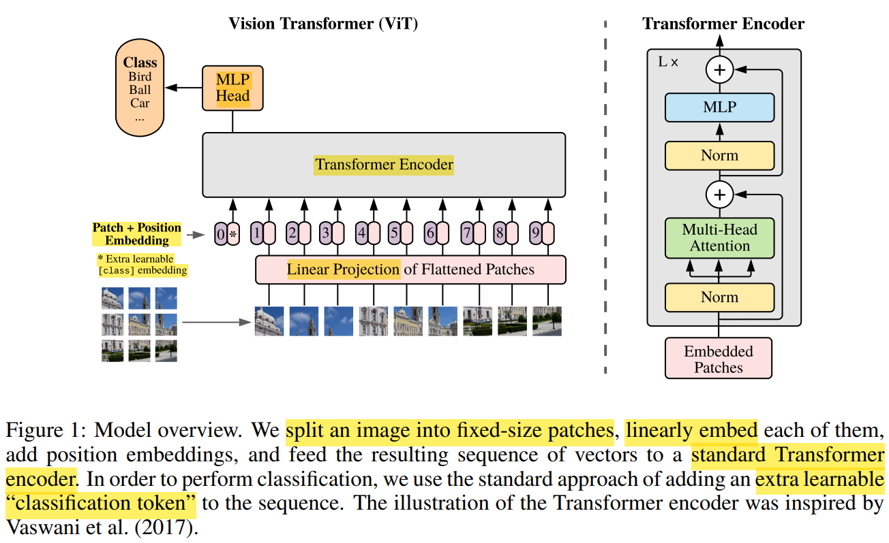

# ViT

---

[ViT论文逐段精读【论文精读】 - B站(bryanyzhu)](https://www.bilibili.com/video/BV15P4y137jb)

[ICLR Oral Presentation](https://iclr.cc/virtual/2021/oral/3458)

[Transformer 个人笔记](../Transformer/Transformer.md)

## Table of Contents

- [ViT](#vit)
  - [Table of Contents](#table-of-contents)

---

挑战 AlexNet 以来，CNN 在 CV 中的 统治地位

在足够多的数据上进行 pre-train，可以不使用 CNN，直接使用 NLP 的 Transformer 解决问题

打破 CV & NLP 在模型方面的壁垒，multi-modality

**Introduction**
1. transformer
   1. computational efficiency
   2. scalability
   3. no sign of saturating performance (性能饱和)
2. NLP 的 transformer 主流方法
   1. 在 大规模 text corpus pre-train
   2. 在 小规模 task-specific 数据集 fine-tuning
3. 在 mid-sized dataset 中，没有 strong regularization
4. CNN 特有的 **inductive bias** 归纳偏置(先验知识)
   1. locality : 相邻位置 特征相似
   2. 2-dimensional neighborhood structure
   3. translation equivariance : 卷积 & 平移 先后顺序 不改变结果
6. CNN 有了这些 先验，可以用相对少的数据来学习，因此 transformer 效果不如 CNN
7. 只要有足够的数据 就可以 抵消 inductive bias，并 迁移

**Related Work**
1. pre-training task
   1. BERT : denoising self-supervised (完形填空)
   2. GPT  : language modeling (next word prediction)
2. 不能 像素层面，图片每个 pixel 都作为一个 元素，否则 sequence 长度 n 过大 (平方复杂度，attention score 尺寸)，BERT 序列长度才 512

**Method**
1. 
2. 将 input 图片 X(224×224×3) 拆分为 大小为 16×16×3=768 的 patches 序列，每个 patch 作为 一个元素(token)，一共 14×14=196 个
   1. 224×224×3 -> 196×768
3. patch 通过 Linear Projection Layer $E$ (Fully Connected Layer) 得到 linear embedding
   1. 尺寸 768×768(D)
   2. linear project 后 输入 变为 一系列 1D tokens
   3. 后续有尝试过 positional embedding 的 ablation test
4. 图片顺序颠倒就不是原来的图片了，因此 需要 **position embedding**
   1. 也是 2D 矩阵，每一行代表 对应位置 的 位置向量(维度 768)
5. 使用 extra learnable class embedding : **CLS** `[class]`，encoder结构 可以看到 全部信息，可以从 其他 embedding 获取信息
   1. 整体 进入 transformer 的 序列长度 : 14×14+1=197
   2. 只用 CLS 的 output 作为 image representation
   3. 除了 CLS token 也可以使用 GAP(global average pooling)
6. transformer encoder 和 BERT 一致
   1. KQV 尺寸都是 197×768
   2. multi-head 768=12×64
   3. MLP 中间会 先把特征放大4倍 再缩回去，197×768 -> 197×3072 -> 197×768
7. classification head
   1. pre-train   : MLP with 1 hidden layer
      1. 预训练时，如果强迫 Backbone 输出的特征必须能被 简单的 线性层直接分类，特征可能会 过拟合 预训练任务的 特定标签，从而丢失一些对其他任务有用的细节信息
      2. 消化了预训练任务的部分特殊性，使得 Backbone 学到的特征 更加通用、鲁棒
   2. fine-tuning : single linear layer
      1. 迁移到下游任务时，我们扔掉这个 MLP 头 ，只保留通用的 Backbone 特征
   3. 使用 cross-entropy 进行模型训练
8. fine-tuning & higher-resolution
   1. 在 higher-resolution fine-tune 有好处
   2. 对于 ViT 如果保持 patch size，那么 sequence 长度则有变化，pre-train 的 position embedding 没有意义
   3. 使用 2D interpolation 插值，但是性能会略有下降
   4. ViT 的 fine-tuning 局限性

**Additional Analyses**
1. Optimizer (Adam / SGD)
2. Transformer Shape
3. Positional Embedding
   1. no PE
   2. 1D PE : 总长度 D
   3. 2D PE : X & Y 两个方向 各 D/2
   4. Relative PE : offset，绝对距离 -> 相对距离

**Conclusion**
1. 除了 patch extraction，没有引入 image-specific 的 inductive bias
2. **Challenges**
   1. 其他 CV 任务 : classification -> detection / segmentation
   2. self-supervised pre-training
   3. further scaling ViT

