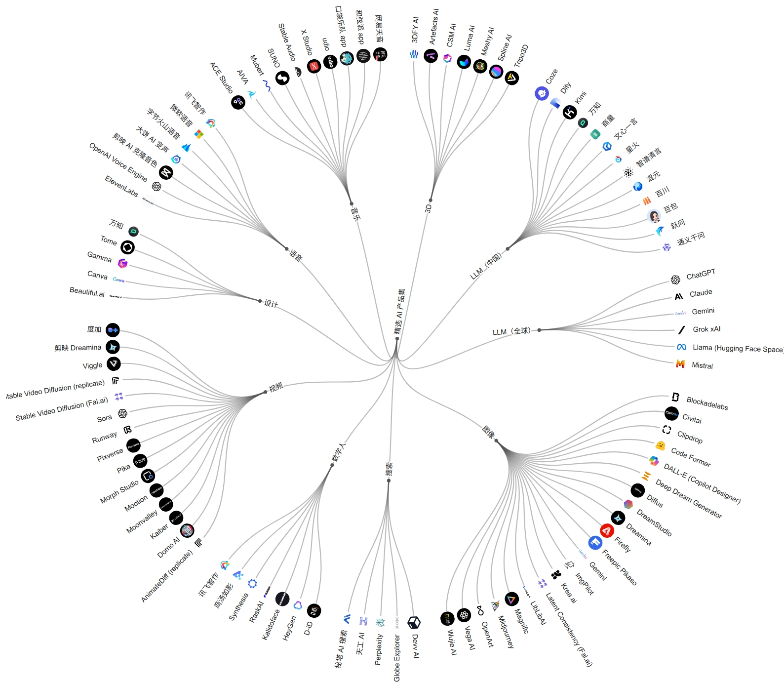
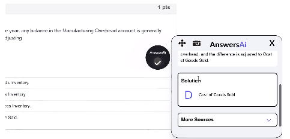
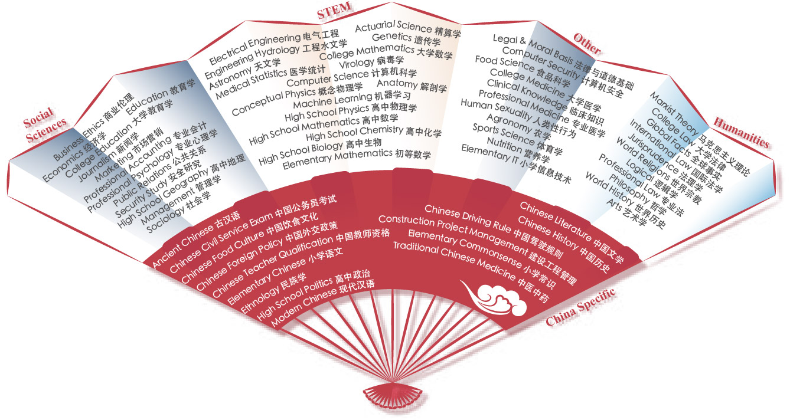

# Useful Apps & Websites

---

## Table of Contents
- [Useful Apps \& Websites](#useful-apps--websites)
  - [Table of Contents](#table-of-contents)
- [Latent Box - AI、创意、艺术 的 精选合集 (论文 工具)](#latent-box---ai创意艺术-的-精选合集-论文-工具)
- [character.ai - 聊天机器人(角色扮演)](#characterai---聊天机器人角色扮演)
- [AWS - Amazon Web Services](#aws---amazon-web-services)
- [Answer Questions](#answer-questions)
- [AIHub-发现最新优质AI工具](#aihub-发现最新优质ai工具)
- [OpenXLab 浦源 应用中心](#openxlab-浦源-应用中心)
- [主流大模型深度评测](#主流大模型深度评测)
  - [MMLU](#mmlu)
  - [CMMLU](#cmmlu)
  - [C-Eval](#c-eval)
  - [SuperCLUE](#superclue)
- [中文 LLM](#中文-llm)
  - [BlueLM](#bluelm)
- [Github 库](#github-库)

---

# Latent Box - AI、创意、艺术 的 精选合集 (论文 工具)

[Latent Box](https://latentbox.com/zh)

[Latent Box - Github](https://github.com/latentcat/latentbox)

# character.ai - 聊天机器人(角色扮演)

[character.ai](https://character.ai/)

# AWS - Amazon Web Services

[AWS](https://aws.amazon.com/cn/)

[Amazon Bedrock - 使用基础模型（FM）构建和扩展生成式人工智能应用程序的最简单方法](https://us-west-2.console.aws.amazon.com/bedrock/home?region=us-west-2#/)

# Answer Questions

[Answer.AI](https://answerai.pro/)

支持
1. 对话
2. 截图
3. PDF

[AnswersAi](https://answersai.com/#)

# AIHub-发现最新优质AI工具

[AIHub-发现最新优质AI工具](https://www.aihub.cn/)

# OpenXLab 浦源 应用中心

[OpenXLab 浦源 应用中心](https://openxlab.org.cn/apps)

# 主流大模型深度评测

[主流大模型深度评测](https://www.bilibili.com/video/BV1RA4m1V74W/)

[一个简单的场景化大语言模型测评数据集 - Github](https://github.com/Turing-Project/LLMScenarioEval)

参考方向
1. 发散创作
2. 日常创作
3. 基础逻辑
4. 数学与代码能力
5. 时效性问答
6. 多模态

## MMLU

[MMLU - PapersWithCode](https://paperswithcode.com/dataset/mmlu)

[MMLU - Github](https://github.com/hendrycks/test)

[MMLU评比结果 - PapersWithCode](https://paperswithcode.com/sota/multi-task-language-understanding-on-mmlu)

**MMLU 数据集** - Massive Multitask Language Understanding - 由 UC Berkeley 发布的 - 类似于闭卷考试

包括多个不同的任务和主题，例如科学、历史、文学、法律等领域

分为 Zero-Shot 和 Five-Shot

## CMMLU

[CMMLU - Github](https://github.com/haonan-li/CMMLU)

[ACLUE---古汉语语言理解评估基准](https://github.com/isen-zhang/ACLUE)

**CMMLU 数据集** - Comprehensive Multitask Mandarin Language Understanding - 针对中文

## C-Eval

[C-Eval 数据集](https://cevalbenchmark.com/) - 全面的中文基础模型评估套件

[C-Eval 数据集 - HuggingFace](https://huggingface.co/datasets/ceval/ceval-exam)

[C-Eval 数据集 - Github](https://github.com/hkust-nlp/ceval/blob/main/README_zh.md)

涵盖了 52 个不同学科的 13948 个多项选择题，分为 4 个难度级别

zero-shot和five-shot准确率

## SuperCLUE

[SuperCLUE：中文通用大模型综合性测评基准](https://www.clue.ai/superclue.html)

SuperCLUE

# 中文 LLM

## BlueLM

[BlueLM(vivo) - Github](https://github.com/vivo-ai-lab/BlueLM)

# Github 库

[Awesome Chinese LLM](https://github.com/HqWu-HITCS/Awesome-Chinese-LLM)

