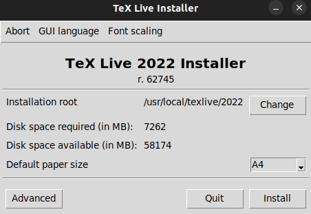
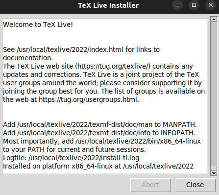
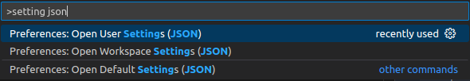
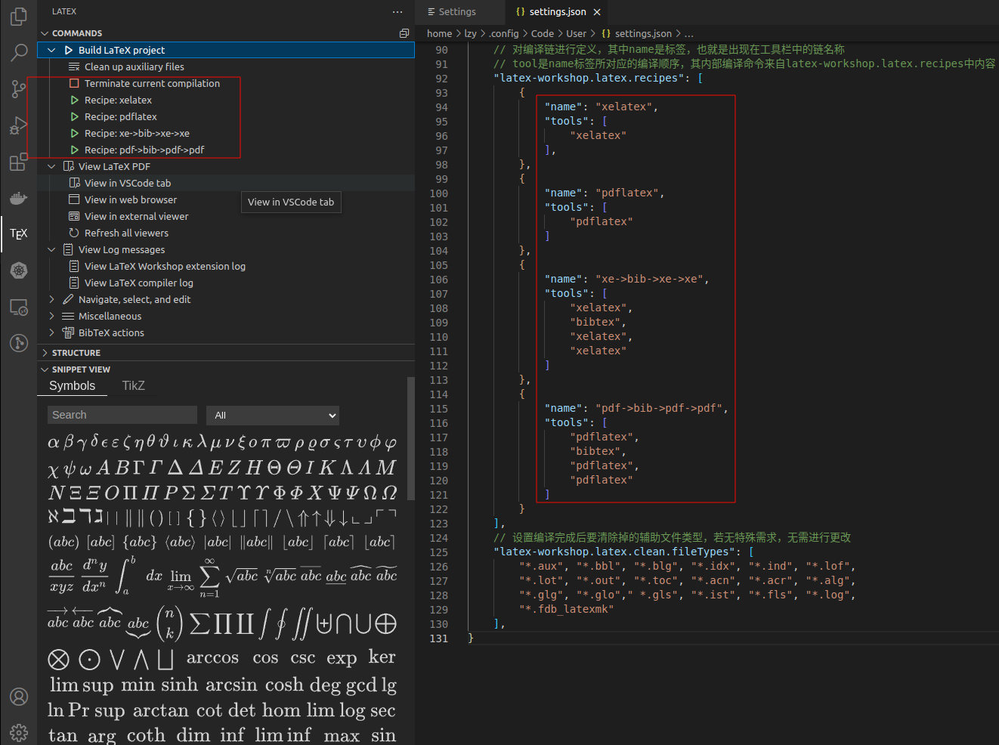

# Latex安装


# Linux(Ubuntu 22.04) + VSCode + Texlive


[Ubuntu(20.04 LTS) OS 下 VS Code + LaTeX 快速配置指南](https://zhuanlan.zhihu.com/p/136209984)

[使用VSCode编写LaTeX](https://zhuanlan.zhihu.com/p/38178015)

[Visual Studio Code (vscode)配置LaTeX](https://zhuanlan.zhihu.com/p/166523064)

[LaTeX 第二课：小试牛刀](https://zhuanlan.zhihu.com/p/24101761)

下**载texlive镜像(推荐清华源)**

[清华镜像站 TeX Live](https://mirrors.tuna.tsinghua.edu.cn/CTAN/systems/texlive/Images/)


镜像下载完成后,为了显示**texlive的图形化安装界面**需要在终端中执行命令:

```shell
sudo apt-get install perl-tk
```

然后在*.iso所在的文件夹 右键打开终端 **加载镜像文件:**

```shell
sudo mount texlive2022-20220321.iso /mnt
```

然后**启动图形界面安装:**

```shell
cd /mnt
sudo ./install-tl -gui
```

弹出如下窗口：



安装位置： **/usr/local/texlive/2022**

点击install即可，耐心等待安装完成，最后会输出如下信息：



**安装完成后卸载镜像文件**(可能提示busy，反正之后会重启，无所谓)

```shell
sudo umount /mnt
```

**添加环境变量**

```shell
lzy@legion:/mnt$ cd /usr/local/texlive/2022/
lzy@legion:/usr/local/texlive/2022$ ls
bin         install-tl.log  readme-html.dir      texmf.cnf     texmf-var
doc.html    LICENSE.CTAN    readme-txt.dir       texmfcnf.lua  tlpkg
index.html  LICENSE.TL      README.usergroups    texmf-config
install-tl  README          release-texlive.txt  texmf-dist
```

```shell
sudo gedit ~/.bashrc

export PATH=/usr/local/texlive/2022/bin/x86_64-linux:$PATH
export PATH=/usr/local/texlive/2022/texmf-dist/scripts/latexindent:$PATH
export MANPATH=/usr/local/texlive/2022/texmf-dist/doc/man:$MANPATH
export INFOPATH=/usr/local/texlive/2022/texmf-dist/doc/info:$INFOPATH
```

随后直接**重启**


**终端输入 xelatex -v 查看输出**，结果如下

```shell
XeTeX 3.141592653-2.6-0.999994 (TeX Live 2022)
kpathsea version 6.3.4
Copyright 2022 SIL International, Jonathan Kew and Khaled Hosny.
There is NO warranty.  Redistribution of this software is
covered by the terms of both the XeTeX copyright and
the Lesser GNU General Public License.
For more information about these matters, see the file
named COPYING and the XeTeX source.
Primary author of XeTeX: Jonathan Kew.
Compiled with ICU version 70.1; using 70.1
Compiled with zlib version 1.2.11; using 1.2.11
Compiled with FreeType2 version 2.11.1; using 2.11.1
Compiled with Graphite2 version 1.3.14; using 1.3.14
Compiled with HarfBuzz version 3.4.0; using 3.4.0
Compiled with libpng version 1.6.37; using 1.6.37
Compiled with pplib version v2.05 less toxic i hope
Compiled with fontconfig version 2.13.0; using 2.13.1
```

**安装 VSCode 插件 LaTeX Workshop**(以及 Chinese (Simplified) (简体中文) Language Pack for Visual Studio Code)

在 **~/.config/Code/User/settings.json** 中加入配置信息（不包含外部 pdf 查看器设置）

也可以 **F1 或 Ctrl+Shift+P** 选择 **User Settings** 打开该文件



```json
    // LaTeX Workshop Settings
    // 什么时候自动进行代码的编译 有三个选项
    // 1. onFileChange：在检测任何依赖项中的文件更改(甚至被其他应用程序修改)时构建项目，即检测到代码被更改时就自动编译tex文件
    // 2. onSave : 当代码被保存时自动编译文件
    // 3. never: 从不自动编译，即需编写者手动编译文档
    "latex-workshop.latex.autoBuild.run": "never",
    // 命令设置是否将编译文档的选项出现在鼠标右键的菜单中
    "latex-workshop.showContextMenu": true,
    // 拓展能够从使用的宏包中自动提取命令和环境，从而补全正在编写的代码
    "latex-workshop.intellisense.package.enabled": true,
    // 后两行设置当文档编译错误时是否弹出显示出错和警告的弹窗
    // 因为这些错误和警告信息能够从终端中获取，且弹窗弹出比较烦人，故而笔者设置均设置为false
    "latex-workshop.message.error.show": false,
    "latex-workshop.message.warning.show": false,
    // 设置什么时候对上文设置的辅助文件进行清除
    // 1. onBuilt : 无论是否编译成功，都选择清除辅助文件
    // 2. onFailed : 当编译失败时，清除辅助文件
    // 3. never : 无论何时，都不清除辅助文件
    // tex文档编译有时需要用到辅助文件，比如编译目录和编译参考文献时，如果使用onBuilt命令，则会导致编译不出完整结果甚至编译失败
    // 有时候将 tex 文件修改后进行编译时，可能会导致 pdf 文件没有正常更新的情况，这个时候可能就是由于辅助文件没有进行及时更新的缘故，需要清除辅助文件，而never命令做不到
    "latex-workshop.latex.autoClean.run": "onFailed",
    // 设置 vscode 编译 tex 文档时的默认编译链，有两个变量
    // 1. first : 使用latex-workshop.latex.recipes中的第一条编译链，故而您可以根据自己的需要更改编译链顺序
    // 2. lastUsed : 使用最近一次编译所用的编译链
    "latex-workshop.latex.recipe.default": "lastUsed",
    // 用于反向同步（即从编译出的 pdf 文件指定位置跳转到 tex 文件中相应代码所在位置）的内部查看器的快捷键绑定。变量有两种：
    // 1. ctrl-click ： 为默认选项，使用Ctrl/cmd+鼠标左键单击
    // 2. double-click : 使用鼠标左键双击
    "latex-workshop.view.pdf.internal.synctex.keybinding": "ctrl-click",
    // 定义在下文 recipes 编译链中被使用的编译命令，此处为默认配置，不需要进行更改
    // 其中的name为这些命令的标签，用作下文 recipes 的引用， 而command为在该拓展中的编译方式
    // 可以更改的代码为，将编译方式: pdflatex 、 xelatex 和 latexmk 中的%DOCFILE更改为%DOC
    // %DOCFILE表明编译器访问没有扩展名的根文件名，而%DOC表明编译器访问的是没有扩展名的根文件完整路径
    // 意味着，使用%DOCFILE可以将文件所在路径设置为中文
    "latex-workshop.latex.tools": [
        {
            "name": "xelatex",
            "command": "xelatex",
            "args": [
                "-synctex=1",
                "-interaction=nonstopmode",
                "-file-line-error",
                "-pdf",
                "%DOCFILE%"
            ]
        },
        {
            "name": "pdflatex",
            "command": "pdflatex",
            "args": [
                "-synctex=1",
                "-interaction=nonstopmode",
                "-file-line-error",
                "%DOCFILE%"
            ]
        },
        {
            "name": "bibtex",
            "command": "bibtex",
            "args": [
                "%DOCFILE%"
            ]
        },
        {
            "name": "biber",
            "command": "biber",
            "args": [
                "%DOCFILE%"
            ]
        }
    ],
    // 对编译链进行定义，其中name是标签，也就是出现在工具栏中的链名称
    // tool是name标签所对应的编译顺序，其内部编译命令来自latex-workshop.latex.recipes中内容
    "latex-workshop.latex.recipes": [
        {
            "name": "xelatex",
            "tools": [
                "xelatex"
            ],
        },
        {
            "name": "pdflatex",
            "tools": [
                "pdflatex"
            ]
        },
        {
            "name": "xe->biber->xe->xe",
            "tools": [
                "xelatex",
                "biber",
                "xelatex",
                "xelatex"
            ]
        },
        {
            "name": "xe->bib->xe->xe",
            "tools": [
                "xelatex",
                "bibtex",
                "xelatex",
                "xelatex"
            ]
        },
        {
            "name": "pdf->bib->pdf->pdf",
            "tools": [
                "pdflatex",
                "bibtex",
                "pdflatex",
                "pdflatex"
            ]
        }
    ],
    // 设置编译完成后要清除掉的辅助文件类型，若无特殊需求，无需进行更改
    "latex-workshop.latex.clean.fileTypes": [
        "*.aux", "*.bbl", "*.blg", "*.idx", "*.ind", "*.lof",
        "*.lot", "*.out", "*.toc", "*.acn", "*.acr", "*.alg",
        "*.glg", "*.glo"," *.gls", "*.ist", "*.fls", "*.log",
        "*.fdb_latexmk"
    ],
```

完成后，能够在 vscode 编译器中能够看到的编译顺序

**试了很久感觉bibtex 不行 所以改用biber**

[Biber工具](https://blog.csdn.net/m0_55746113/article/details/122872210)



