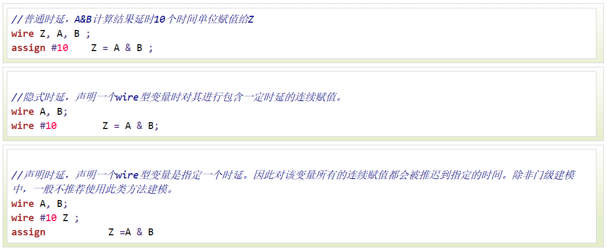
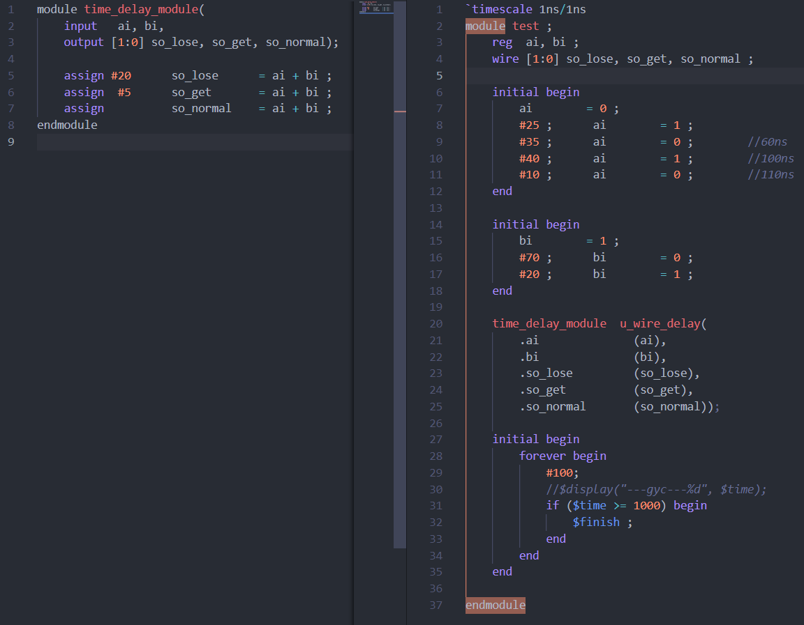
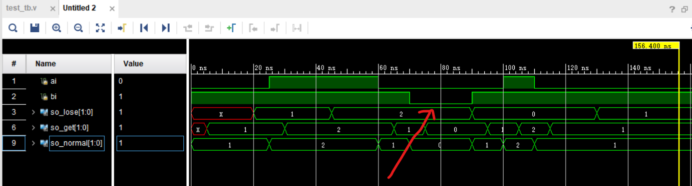
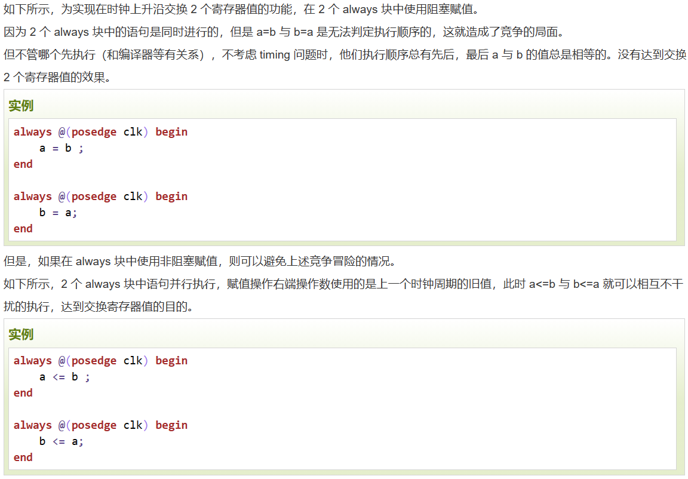
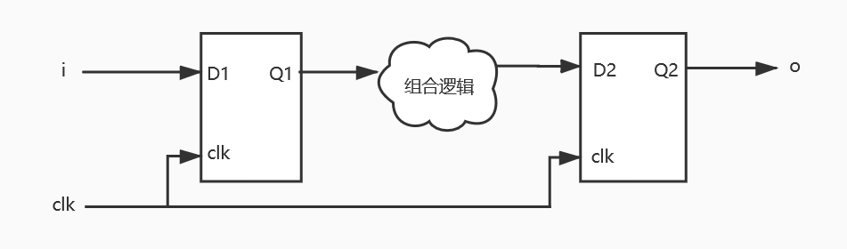

# Verilog教程基础篇

## 1.1 Verilog教程

## 1.2 Verilog简介

### 发展历史

### 主要应用

1. 可编程逻辑器件

    FPGA 和 CPLD 是实现这一途径的主流器件。他们直接面向用户，具有极大的灵活性和通用性，实现快捷，测试方便，开发效率高而成本较低。

2. 半定制或全定制 ASIC

    通俗来讲，就是利用 Verilog 来设计具有某种特殊功能的专用芯片。根据基本单元工艺的差异，又可分为门阵列 ASIC，标准单元 ASIC，全定制 ASIC。

3. 混合 ASIC

    主要指既具有面向用户的 FPGA 可编程逻辑功能和逻辑资源，同时也含有可方便调用和配置的硬件标准单元模块，如CPU，RAM，锁相环，乘法器等。

## 1.4 Verilog设计方法

## 2.1 Verilog基础语法

### 格式

1. Verilog 是区分大小写的。

2. 格式自由，可以在一行内编写，也可跨多行编写。

3. 每个语句必须以分号为结束符。空白符（换行、制表、空格）都没有实际的意义，在编译阶段可忽略。例如下面两中编程方式都是等效的。

### 注释

1. 与C语言相同
   1. 用//单行注释
   2. 用/* */跨行注释

### 标识符与关键字

1. 标识符（identifier）可以是任意一组字母、数字、$ 符号和 _(下划线)符号的合，但**标识符的第一个字符必须是字母或者下划线**，不能以数字或者美元符开始。

2. 另外，标识符是区分大小写的。

3. 关键字是 Verilog 中预留的用于定义语言结构的特殊标识符。

4. Verilog 中关键字全部为**小写**。

## 2.2 Verilog数值表示

### 数值种类

Verilog HDL有下列死者基本的值来表示硬件电路中的电平逻辑：

1. &emsp;0：逻辑 0 或 "假"
2. &emsp;1：逻辑 1 或 "真"
3. &emsp;x 或 X：未知 
    1. 意味着信号数值的不确定，即在实际电路里，信号可能为 1，也可能为 0。
4. &emsp;z 或 Z：高阻
   1. 意味着信号处于高阻状态，常见于信号（input, reg）没有驱动时的逻辑结果。例如一个 pad 的 input 呈现高阻状态时，其逻辑值和上下拉的状态有关系。上拉则逻辑值为 1，下拉则为 0 。

### 整数数值表示

数字声明时，合法的基数格式有 4 中，包括：十进制('d 或 'D)，十六进制('h 或 'H)，二进制（'b 或 'B），八进制（'o 或 'O）。数值可指明位宽，也可不指明位宽。

下划线 _ 可以增强代码的可读性

1. 指明位宽：
    ```verilog
    4'b1011         // 4bit 数值
    32'h3022_c0de   // 32bit 的数值
    ```
2. 不指明位宽:
   1. 一般直接写数字时，默认为十进制表示
3. 负数表示:
   1. 通常在表示位宽的数字前面加一个减号来表示负数
        ```verilog
        -6'd15  
        -15
        ```
   2. **减号放在基数和数字之间是非法的，例如下面的表示方法是错误的**
        ```verilog
        4'd-2 //非法说明
        ```

### 实数表示

1. 十进制（小数点.）

2. 科学计数法（E/e）

### 字符串表示方法

1. 字符串是由双引号包起来的字符队列。字符串不能多行书写，即字符串中不能包含回车符。Verilog 将字符串当做一系列的单字节 ASCII 字符队列。


## 2.3 数据类型

Verilog 最常用的 2 种数据类型就是线网（wire）与寄存器（reg），其余类型可以理解为这两种数据类型的扩展或辅助。

1. 线网 wire
    
    wire 类型表示硬件单元之间的物理连线，由其连接的器件输出端连续驱动。如果没有驱动元件连接到 wire 型变量，缺省值一般为 "Z"。

    线网型还有其他数据类型，包括 wand，wor，wri，triand，trior，trireg 等。

2. 寄存器 reg

    寄存器（reg）用来表示存储单元，它会保持数据原有的值，直到被改写。

    在 always 块中，寄存器可能被综合成边沿触发器，在组合逻辑中可能被综合成 wire 型变量。寄存器不需要驱动源，也不一定需要时钟信号。在仿真时，寄存器的值可在任意时刻通过赋值操作进行改写。

    我们可以指定某一位或若干相邻位，作为其他逻辑使用。

    Verilog 支持可变的向量域选择


3. 向量

    当位宽大于 1 时，wire 或 reg 即可声明为向量的形式。

    ```verilog
    for (j=0; j<=3;j=j+1) begin
        byte1[j] = data1[(j+1)*4-1 : j*4];
        //把data1[7:0]…data1[31:24]依次赋值给byte1[0][7:0]…byte[3][7:0]
    end
    ```

    Verillog 还支持指定 bit 位后固定位宽的向量域选择访问。

    [bit+: width] : 从起始 bit 位开始递增，位宽为 width。

    [bit-: width] : 从起始 bit 位开始递减，位宽为 width。

    ```verilog
    //下面 2 种赋值是等效的
    A = data1[31-: 8] ;
    A = data1[31:24] ;

    //下面 2 种赋值是等效的
    B = data1[0+ : 8] ;
    B = data1[0:7] ;
    ```

    对信号重新进行组合成新的向量时，需要借助大括号。例如：

    ```verilog
    wire [31:0]    temp1, temp2 ;
    assign temp1 = {byte1[0][7:0], data1[31:8]};  //数据拼接
    assign temp2 = {32{1'b0}};  //赋值32位的数值0  
    ```

4. 整数，实数，时间寄存器变量

    整数，实数，时间等数据类型实际也属于寄存器类型。

    1. 整数（integer）
        
        整数类型用关键字 integer 来声明。声明时不用指明位宽，位宽和编译器有关，一般为32 bit。reg 型变量为无符号数，而 integer 型变量为有符号数。

    2. 实数（real）
        
        实数用关键字 real 来声明，可用十进制或科学计数法来表示。实数声明不能带有范围，默认值为 0。如果将一个实数赋值给一个整数，则只有实数的整数部分会赋值给整数。

    3. 时间（time）

        Verilog 使用特殊的时间寄存器 time 型变量，对仿真时间进行保存。其宽度一般为 64 bit，通过调用系统函数 $time 获取当前仿真时间。

    4. 数组

        在 Verilog 中允许声明 reg, wire, integer, time, real 及其向量类型的数组。

        数组维数没有限制。线网数组也可以用于连接实例模块的端口。数组中的每个元素都可以作为一个标量或者向量，以同样的方式来使用，形如：<数组名>[<下标>]。对于多维数组来讲，用户需要说明其每一维的索引。

        ```verilog
        integer          flag [7:0] ; //8个整数组成的数组
        reg  [3:0]       counter [3:0] ; //由4个4bit计数器组成的数组
        wire [7:0]       addr_bus [3:0] ; //由4个8bit wire型变量组成的数组
        wire             data_bit[7:0][5:0] ; //声明1bit wire型变量的二维数组
        reg [31:0]       data_4d[11:0][3:0][3:0][255:0] ; //声明4维的32bit数据变量数组
        ```

        虽然数组与向量的访问方式在一定程度上类似，但不要将向量和数组混淆。向量是一个单独的元件，位宽为 n；数组由多个元件组成，其中每个元件的位宽为 n 或 1。它们在结构的定义上就有所区别。

    5. 存储器

        存储器变量就是一种寄存器数组，可用来描述 RAM 或 ROM 的行为。

    6. 参数

        参数用来表示常量，用关键字 parameter 声明，只能赋值一次。

         localparam 来声明，其作用和用法与 parameter 相同，区别在于它的值不能被改变。所以当参数只在本模块中调用时，可用 localparam 来说明。

    7. 字符串

        字符串保存在 reg 类型的变量中，每个字符占用一个字节（8bit）。因此寄存器变量的宽度应该足够大，以保证不会溢出。

        字符串不能多行书写，即字符串中不能包含回车符。如果寄存器变量的宽度大于字符串的大小，则使用 0 来填充左边的空余位；如果寄存器变量的宽度小于字符串大小，则会截去字符串左边多余的数据。

        ```verilog
        reg [0: 14*8-1]       str ;
        ```

## 2.4 Verilog表达式

表达式由操作符和操作数构成，其目的是根据操作符的意义得到一个计算结果。

## 2.5 编译指令

以反引号\`开始的某些标识符是Verilog系统编译指令

\`define  用于文本替换，类似于C中的#define

一旦\`define 指令被编译，其在整个编译过程中都会有效

\`undef   用于取消之前的宏定义

\`ifdef 
\`ifndef 
\`else 
\`elsif 
\`endif 

\`include  可以将一个Verilog文件内嵌到另一个Verilog文件，可以是相对路径也可以是绝对路径

\`timescale time_unit/time_precision 

在编译过程中\`timescale指令会影响后面所有模块中的延时值，直到遇到另一个\`timescale或者\`resetall指令


<br>

<br>

## 3.1 Verilog连续赋值

### assign

连续赋值语句是 Verilog 数据流建模的基本语句，用于对 wire 型变量进行赋值。

格式：assign  LHS_target = RHS_expression；

LHS（left hand side） 指赋值操作的左侧，RHS（right hand side）指赋值操作的右侧。

assign 为关键词，任何已经声明 wire 变量的连续赋值语句都是以 assign 开头。

1. LHS_target 必须是一个标量或者线型向量，**而不能是寄存器类型**。（不能assign一个reg）

2. RHS_expression 的类型没有要求，可以是标量或线型或存器向量，也可以是函数调用。

3. 只要 RHS_expression 表达式的操作数有事件发生（值的变化）时，RHS_expression 就会立刻重新计算，同时赋值给 LHS_target。

### 全加器


## 3.2 Verilog时延

时延一般是不可综合的

连续赋值时延一般可分为普通赋值时延、隐式时延、声明时延



### 惯性延迟

在上述例子中，A 或 B 任意一个变量发生变化，那么在 Z 得到新的值之前，会有 10 个时间单位的时延。如果在这 10 个时间单位内，即在 Z 获取新的值之前，A 或 B 任意一个值又发生了变化，那么计算 Z 的新值时会取 A 或 B 当前的新值。所以称之为惯性时延，即信号脉冲宽度小于时延时，对输出没有影响。

因此仿真时，时延一定要合理设置，防止某些信号不能进行有效的延迟。





**注意，延时会被打断**

从红箭头哪里我们不难看出，70ns的变化会大端60ns时开始的延时，否则80ns处应该so_lose会变为1。这样就导致so_lose在70ns时，ai+bi得到结果0并延迟20ns在90ns赋值给so_lose


## 4.1 Verilog过程结构

initial，always

一个模块中可以包含多个 initial 和 always 语句，但 2 种语句不能嵌套使用。

这些语句在模块间并行执行，与其在模块的前后顺序没有关系。

但是 initial 语句或 always 语句内部可以理解为是顺序执行的（非阻塞赋值除外）。

每个 initial 语句或 always 语句都会产生一个独立的控制流，执行时间都是从 0 时刻开始。

### initial

initial 语句从 0 时刻开始执行，只执行一次，多个 initial 块之间是相互独立的。

如果 initial 块内包含多个语句，需要使用关键字 begin 和 end 组成一个块语句。

如果 initial 块内只要一条语句，关键字 begin 和 end 可使用也可不使用。

initial 理论上来讲是不可综合的，多用于初始化、信号检测等。

### always

与 initial 语句相反，always 语句是重复执行的。always 语句块从 0 时刻开始执行其中的行为语句；当执行完最后一条语句后，便再次执行语句块中的第一条语句，如此循环反复。

由于循环执行的特点，always 语句多用于仿真时钟的产生，信号行为的检测等。

## 4.2 Verilog过程赋值

过程性赋值是在 initial 或 always 语句块里的赋值，赋值对象是寄存器、整数、实数等类型。

连续性赋值总是处于激活状态，任何操作数的改变都会影响表达式的结果；过程赋值只有在语句执行的时候，才会起作用。这是连续性赋值与过程性赋值的区别。

### 阻塞赋值

阻塞赋值属于顺序执行，即下一条语句执行前，当前语句一定会执行完毕。

阻塞赋值语句使用等号 = 作为赋值符。

### 非阻塞赋值

非阻塞赋值属于并行执行语句，即下一条语句的执行和当前语句的执行是同时进行的，它不会阻塞位于同一个语句块中后面语句的执行。

非阻塞赋值语句使用小于等于号 <= 作为赋值符。

**但是如果非阻塞赋值在阻塞赋值之后，也会被阻塞，只是和之后的非阻塞并行**

### 使用非阻塞赋值避免竞争冒险

实际 Verilog 代码设计时，切记不要在一个过程结构中混合使用阻塞赋值与非阻塞赋值。两种赋值方式混用时，时序不容易控制，很容易得到意外的结果。

更多时候，在设计电路时，always 时序逻辑块中多用非阻塞赋值，always 组合逻辑块中多用阻塞赋值；在仿真电路时，initial 块中一般多用阻塞赋值。

例子：交换寄存器的值



<br>
<br>
<br>

## 4.3 Verilog时序控制

针对寄存器reg，对于wire的控制在前面的的**3.2时延部分**

Verilog 提供了 2 大类时序控制方法：时延控制和事件控制。事件控制主要分为边沿触发事件控制与电平敏感事件控制。

### 时延控制

基于时延的时序控制出现在表达式中，它指定了语句从开始执行到执行完毕之间的时间间隔。

时延可以是数字、标识符或者表达式。

1. 常规时延

    遇到常规延时时，该语句需要等待一定时间，然后将计算结果赋值给目标信号。

    格式： #delay procedural_statement

    该时延方式的另一种写法是直接将井号 # 独立成一个时延执行语句

2. 内嵌时延
   
    遇到内嵌延时时，该语句先将计算结果保存，然后等待一定的时间后赋值给目标信号。

    内嵌时延控制加在赋值号之后。value_embed = #10 value_test ;

3. 说明

    当延时语句的赋值符号右端是常量时，2 种时延控制都能达到相同的延时赋值效果。

    当延时语句的赋值符号右端是变量时，2 种时延控制可能会产生不同的延时赋值效果。

    一般时延赋值方式：遇到延迟语句后先延迟一定的时间，然后将当前操作数赋值给目标信号，并没有"惯性延迟"的特点，不会漏掉相对较窄的脉冲。

    内嵌时延赋值方式：遇到延迟语句后，先计算出表达式右端的结果，然后再延迟一定的时间，赋值给目标信号。


### 边沿触发事件控制

在 Verilog 中，事件是指某一个 reg 或 wire 型变量发生了值的变化。

1. 一般事件控制
    
    事件控制用符号 @ 表示

    语句执行的条件是信号的值发生特定的变化

    关键字 posedge 指信号发生边沿正向跳变，negedge 指信号发生负向边沿跳变，未指明跳变方向时，则 2 种情况的边沿变化都会触发相关事件

2. 命名事件控制

    用户可以声明 event（事件）类型的变量，并触发该变量来识别该事件是否发生。

    ```verilog
    event     start_receiving ;
    always @( posedge clk_samp) begin
            -> start_receiving ;       //采样时钟上升沿作为时间触发时刻
    end
    ```
    
    命名事件用关键字 event 来声明，触发信号用 -> 表示。

3. 敏感列表

    当多个信号或事件中任意一个发生变化都能够触发语句的执行时，Verilog 中使用"或"表达式来描述这种情况，用关键字 or 连接多个事件或信号。这些事件或信号组成的列表称为"敏感列表"。当然，or 也可以用逗号 , 来代替。

    当组合逻辑输入变量很多时，那么编写敏感列表会很繁琐。此时，更为简洁的写法是 @* 或 @(*)，表示对语句块中的所有输入变量的变化都是敏感的。


### 电平敏感事件控制

Verilog 中还支持使用电平作为敏感信号来控制时序，即后面语句的执行需要等待某个条件为真。Verilog 中使用关键字 wait 来表示这种电平敏感情况。


## 6.5 Verilog 避免 Latch

锁存器（Latch），是电平触发的存储单元，数据存储的动作取决于输入时钟（或者使能）信号的电平值。仅当锁存器处于使能状态时，输出才会随着数据输入发生变化。

当电平信号无效时，输出信号随输入信号变化，就像通过了缓冲器；当电平有效时，输出信号被锁存。激励信号的任何变化，都将直接引起锁存器输出状态的改变，很有可能会因为瞬态特性不稳定而产生振荡现象。

Latch 的主要**危害**有：

    1）输入状态可能多次变化，容易产生毛刺，增加了下一级电路的不确定性；

    2）在大部分 FPGA 的资源中，可能需要比触发器更多的资源去实现 Latch 结构；

    3）锁存器的出现使得静态时序分析变得更加复杂。

### if-else

组合逻辑中，不完整的 if - else 结构，会产生 latch

但是在时序逻辑中，不完整的 if - else 结构，不会产生 latch

在组合逻辑中，当条件语句中有很多条赋值语句时，每个分支条件下赋值语句的不完整也是会产生 latch。

### case

case 语句产生 Latch 的原理几乎和 if 语句一致。在组合逻辑中，当 case 选项列表不全且没有加 default 关键字，或有多个赋值语句不完整时，也会产生 Latch。

当然，消除此种 latch 的方法也是 2 种，将 case 选项列表补充完整，或对信号赋初值。

补充完整 case 选项列表时，可以罗列所有的选项结果，也可以用 default 关键字来代替其他选项结果。


# Verilog教程高级篇


# Verilog小知识

## 1. Verilog中wire和reg类型的区别

### 基本概念的差别

wire型数据常用来表示以assign关键字指定的组合逻辑信号，模块的输入输出端口类型都默认为wire型，wire相当于物理连线，默认初始值是z。

reg型表示的寄存器类型，用于always模块内被赋值的信号，必须定义为reg型，代表触发器，常用于时序逻辑电路，reg相当于存储单元，默认初始值是x。

### 赋值语句的差别

**wire对应于连续赋值，如assign**

**reg对应于过程赋值，如always，initial**

**元件例化时候的输出必须用wire，input、output和inout的预设值都是wire**

在连续赋值语句中，表达式右侧的计算结果可以立即更新表达式的左侧。在理解上，相当于一个逻辑之后直接连了一条线，这个逻辑对应于表达式的右侧，而这条线就对应于wire。

在过程赋值语句中，表达式右侧的计算结果在某种条件的触发下放到一个变量当中，而这个变量可以声明成reg类型。根据触发条件的不同，过程赋值语句可以建模不同的硬件结构：如果这个条件是时钟的上升沿或下降沿，那么这个硬件模型就是一个触发器；如果这个条件是某一信号的高电平或低电平，那么这个硬件模型就是一个锁存器；如果这个条件是赋值语句右侧任意操作数的变化，那么这个硬件模型就是一个组合逻辑。

**总而言之，wire只能被assign连续赋值，reg只能在initial和always中赋值**

### 端口信号和内部信号的差别

信号可以分为端口信号和内部信号。出现在端口列表中的信号是端口信号，其它的信号为内部信号。

对于端口信号，一旦定义位input或者output端口，默认就定义成了wire类型。

输入端口只能是net类型（wire/tri）。输出端口可以是net类型，也可以是reg类型。

若输出端口在过程块中赋值则为register类型；若在过程块外赋值(包括实例化语句），则为net类型。

内部信号类型与输出端口相同，可以是net或reg类型。判断方法也与输出端口相同。若在过程块中赋值，则为reg类型；若在过程块外如assign赋值，则为net类型。

**若信号既需要在过程块中赋值，又需要在过程块外赋值。这种情况是有可能出现的，如决断信号。这时需要一个中间信号转换。**


## initial&forever

用于产生时钟信号

```verilog
reg clk;

initial begin
  clk = 1'b0;
  forever #5
  clk = ~clk;
end
```


# 浅谈Verilog

## always&assign

verilog的语法并不难，难的是**什么时候该用wire类型，什么时候该用reg类型，什么时候该用assign来描述电路，什么时候该用always来描述电路**。assign能描述组合逻辑电路，always也能描述组合逻辑电路，两者有什么区别呢？

我们知道数字电路里有**两大类型的电路，一种是组合逻辑电路，另外一种是时序逻辑电路**。组合逻辑电路不需要时钟作为触发条件，因此输入会立即(不考虑延时)反映到输出。时序逻辑电路以时钟作为触发条件，时钟的上升沿到来时输入才会反映到输出。

在verilog中，assign能描述组合逻辑电路，always也能描述组合逻辑电路。对于简单的组合逻辑电路的话两者描述起来都比较好懂、容易理解，但是一旦到了复杂的组合逻辑电路，如果用assign描述的话要么是一大串要么是要用好多个assign，不容易弄明白。但是用always描述起来却是非常容易理解的。

既然这样，那全部组合逻辑电路都用always来描述好了，呵呵，既然assign存在就有它的合理性。

用always描述组合逻辑电路时要注意避免**产生锁存器**，if和case的分支情况要写全。

1. 被assign赋值的信号定义为wire型，被always@(*)结构块下的信号定义为reg型，值得注意的是，这里的reg并不是一个真正的触发器，只有敏感列表为上升沿触发的写法才会综合为触发器，在仿真时才具有触发器的特性。

2. 另外一个区别则是更细微的差别
    ```verilog
    wire a;
    reg b;
    
    assign a = 1'b0;
    
    always@(*)
        b = 1'b0;
    ```
    verilog规定，always@(\*)中的\*是指该always块内的所有输入信号的变化为敏感列表，也就是仿真时只有当always@(\*)块内的输入信号产生变化，该块内描述的信号才会产生变化，而像always@(\*) b = 1'b0;

    这种写法由于1'b0一直没有变化，所以b的信号状态一直没有改变，由于b是组合逻辑输出，所以复位时没有明确的值（不定态），而又因为always@(*)块内没有敏感信号变化，因此b的信号状态一直保持为不定态。

3. pending

   [Verilog中 reg和wire 用法和区别以及always和assign的区别](https://blog.csdn.net/u013025203/article/details/53410715)


## 数字电路设计中的时序问题



其中对时序影响最大的是上图中的组合逻辑电路。所以要避免时序问题，最简单的方法减小组合逻辑电路的延时。组合逻辑电路里的串联级数越多延时就越大，实在没办法减小串联级数时，可以采用流水线的方式将这些级数用触发器隔开。

## 流水线设计

采用流水线设计方式，不但可以提高处理器的工作频率，还可以提高处理器的效率。但是流水线并不是越长越好，流水线越长要使用的资源就越多、面积就越大。

如果一味地追求性能而不考虑资源和功耗的话，那么所设计出来的处理器估计就只能用来玩玩，或者做做学术研究。
