# Learn Vivado
# FPGA 设计思想与验证方法 —— 基于Xilinx Vivado

 [传送门：小梅哥Xilinx FPGA基础入门到项目应用培训教程](https://www.bilibili.com/video/BV1va411c7Dz)

 本文档为该课程学习笔记

<br>

## 01. 课程学习方法与要求说明

1. 在学习过程中，积累开发和调试经验技巧。
2. 学会调试，找问题。不依赖参考代码。
3. Verilog语法，FPGA常用的设计方法。
    1. 状态机、线性序列机
    2. FIFO、RAM、ROM
    3. DDS
4. 学习具有一定综合性的项目课程
5. 学习态度——由浅入深
6. 仿真及对其认识
    1. 检查验证设计功能是否正确
    2. 调试问题，可以看到设计中每一个信号的每一时刻的值
    3. 在设计时占用绝大部分时间

<br>
<br>

## 02A. 通用的FPGA开发流程介绍

1. 目标：写一套硬件描述语言，能够在指定的硬件平台实现相应功能
2. 设计定义（具体功能）
3. 编写逻辑（设计输入）
   1. 使用Verilog代码描述逻辑
   2. 画逻辑图
   3. 使用IP
4. 综合工具
   1. 对所写逻辑描述内容进行分析，得到逻辑门级别的电路内容
   2. 由专业的EDA软件进行，Vivado、Quartus
   3. 没有逻辑错误
5. 功能仿真（逻辑仿真）
   1. 通过仿真工具（eg：modelsim）
   2. 对于数字电路来说，仿真基本接近于实际情况，是可信的
6. 布局布线
   1. 知道线路延迟
   2. 专业EDA软件，与上述综合工具相同
7. 分析性能
   1. 在目标板上正常工作
   2. 功能正常、性能稳定
   3. 时序仿真（输入到输出花费时间等）
   4. 静态时序分析
   5. 性能不满足需优化
8. 板级调试
   1. 下载到目标板上运行，查看结果

<br>
<br>

## 02B. 基于Vivado的FPGA开发流程介绍（mux2为例）

### ①创建工程

1. 选择工程类型，这里选择RTL Project
   
   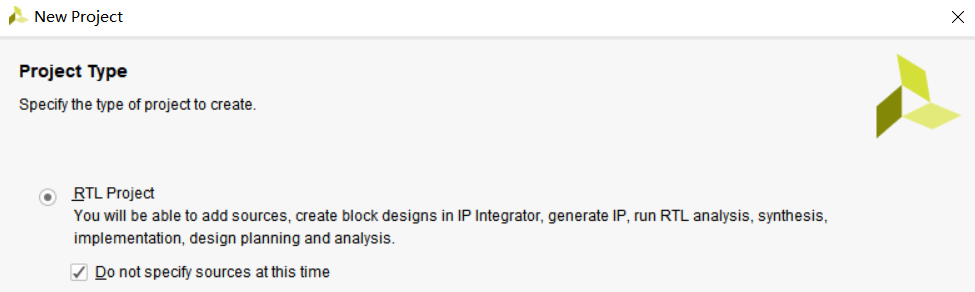

2. 选择Xilinx part/board
   
   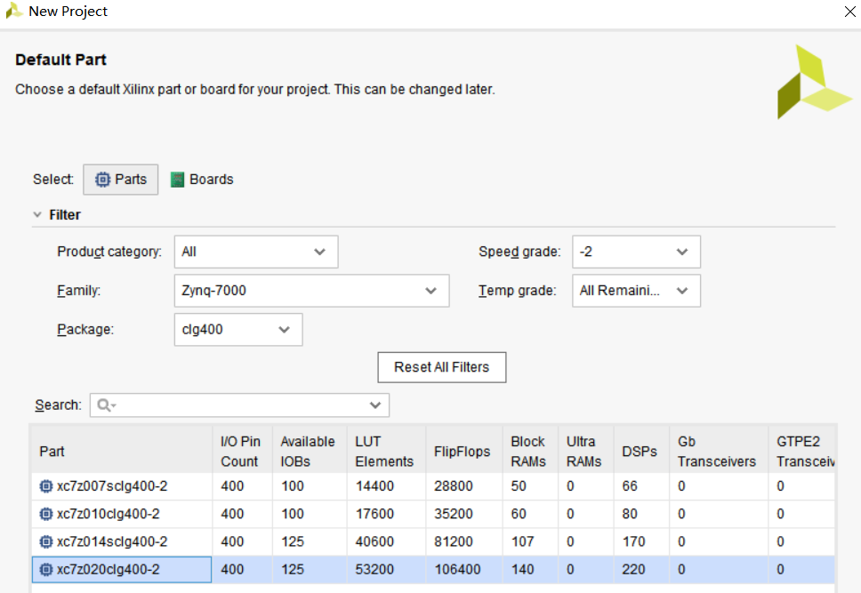

### ②分析Mux2结构图:

   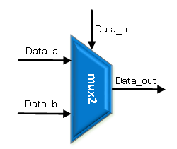

### ③编写Verilog代码

1. 任何Verilog代码以module开始，endmodule结束
2. 具体代码如下

   ```verilog
   //mux2 二选一多路选择器
   module mux2
   (
      a,
      b,
      sel,
      out
   );
      input a;
      input b;
      input sel;
      output out;
      //上述为端口定义

      //下面实现具体逻辑功能
      assign out = (sel==1)?a:b;
      //关键词：assign 表示后续是一段连续赋值语句

   endmodule
   ```

### ④进行Run Synthesis

有多种方式

1. 从FLOW

   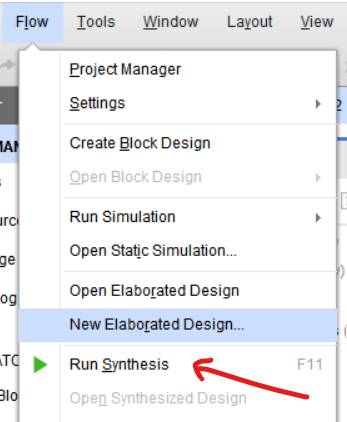

2. 绿色小三角（上面是分析与综合，下面是布局布线）

   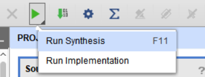

3. 使用快捷键**F11**

可以在右上角查看运行状态

   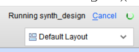

也可以点击∑求和符号,查看过程

   

运行后可查看Report/Messages，如无问题即可进行后续步骤


### ⑤至此为止，设计输入、分析综合部分已经完成，下面进行仿真

1. 首先需要添加simulation sources
   
   

2. 创建文件 mux2_tb (tb代表test bench)

3. 编写testbench文件
   1. testbench开头：\`timescale 1ns/1ps"，注意有个\`，很容易漏掉
   2. 将testbench也当作是一个module，但是测试文件不需要使用端口，它不是一个实际的设计
   3. 具体代码如下
   
      ```verilog
      `timescale 1ns / 1ns
      //前面的1ns代表时间的步进，与延时配合
      //后面代表时间的精度可以是1ns也可以是1ps
      //同时

      module mux2_tb();//测试文件不需要端口
         //reg表示激励信号，wire表示输出信号
         reg s_a;
         reg s_b;
         reg s_sel;
         wire s_out;

         //例化
         mux2 mux2_inst0//将测试文件放入//后面的mux2是“例化名称”//前面的mux2必须与原来的一致
         (
            //将括号外的内容与括号内的相连接
            //模块与测试平台相连
            .a(s_a),
            .b(s_b),
            .sel(s_sel),
            .out(s_out)
         );

         //initial块  begin&end
         initial begin
            //三个输入最多有三种可能
            //#不可能被综合成实际电路，只是仿真方便
            s_a=0;s_b=0;s_sel=0;
            #200;//#表示延迟（仅会出现在testbench中）
            s_a=0;s_b=0;s_sel=1;
            #200;//#表示延迟（仅会出现在testbench中）
            s_a=0;s_b=1;s_sel=0;
            #200;//#表示延迟（仅会出现在testbench中）
            s_a=0;s_b=1;s_sel=1;
            #200;//#表示延迟（仅会出现在testbench中）
            s_a=1;s_b=0;s_sel=0;
            #200;//#表示延迟（仅会出现在testbench中）
            s_a=1;s_b=0;s_sel=1;
            #200;//#表示延迟（仅会出现在testbench中）
            s_a=1;s_b=1;s_sel=0;
            #200;//#表示延迟（仅会出现在testbench中）
            s_a=1;s_b=1;s_sel=1;
            #200;//#表示延迟（仅会出现在testbench中）
            $stop;//停止仿真
         end

      endmodule
      ```
4. 进行仿真

   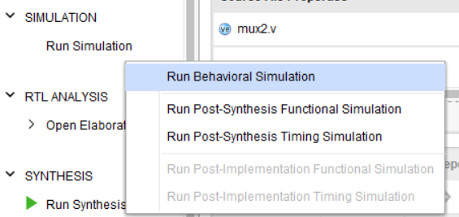

   1. 如果看不清楚可以选择Zoom Fit
   
      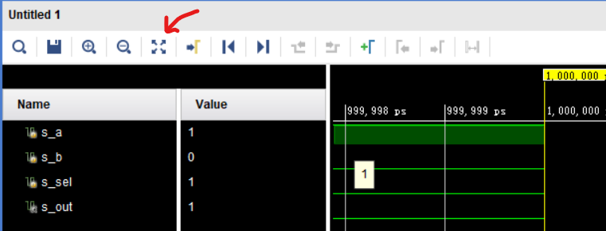

   2. 同时可以使用Run All查看完整（默认跑1000ns）
   
      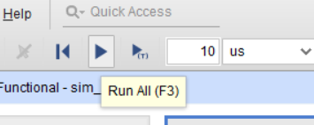

   3. 结果如图
   
      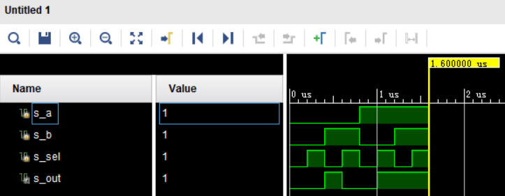

5. 布局布线
   
   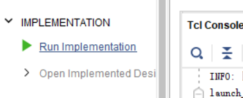

6. 时序仿真
   
   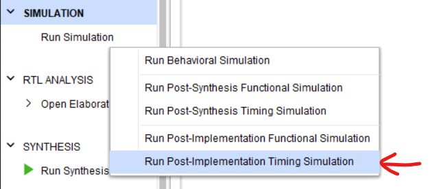

   1. 结果如图

      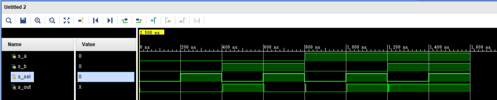

   2. 原因分析：信号有延迟，同时会有毛刺

7. 板级调试
   
   1. 修改标准电平、分配IO引脚，需要结合开发板原理图
   
      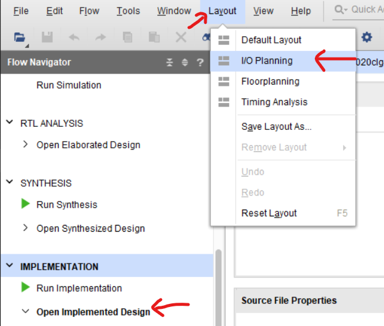

      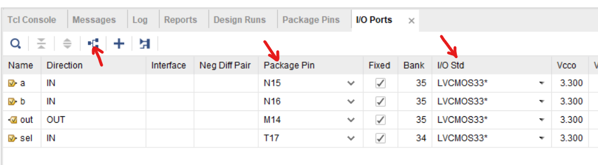
   
   2. 生成Bitstream文件，下载到芯片

      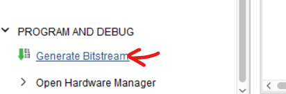

   3. 连接开发板（先要将JTAG与电脑相连，并接上电源线）

      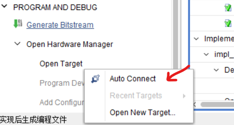

   4. 选中开发板，并点击Program Device即可开始下载

      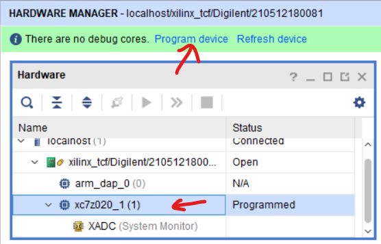

   5. 实物图

      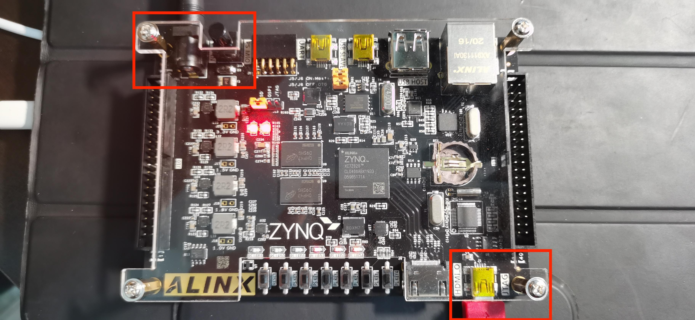

8. 总结

   1. 创建工程、写代码
   2. 写testbench、仿真、分析
   3. 下板验证


<br>
<br>

  ## 02. 通用的FPGA开发流程介绍

<br>
<br>

  ## 02. 通用的FPGA开发流程介绍

<br>
<br>

  ## 02. 通用的FPGA开发流程介绍

<br>
<br>

  ## 02. 通用的FPGA开发流程介绍

<br>
<br>

  ## 02. 通用的FPGA开发流程介绍

<br>
<br>

 

 