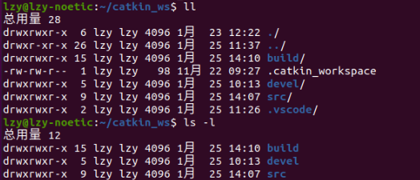
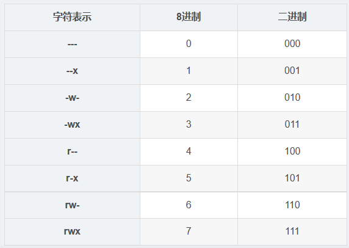

# Linux 文件目录权限

[toc]

## Portals

[Linux 权限相关总结](https://blog.csdn.net/qq_41071068/article/details/102726215)

## 查看权限

输入以下两个命令都可以（似乎ll更加详细一些）
```
ll
ls -l
```



第一个字符如果是d表示是文件夹，如果是-表示文件。

后面每3个字符为一组（-也算）




## 修改权限

```
sudo chmod [1][2][3] file/dir
```

位置[1]可以填入:
1. u:User，代表文件所属用户
2. g:Group，与文件所属用户同组的用户
3. o:Other，代表其他所有用户
4. a:All，代表所有用户

位置[2]可以填入:
1. +:表示附加权限
2. -:表示删除权限
3. =:表示不管以前是什么权限，都进行覆盖

位置[3]可以填入:
1. r:读权限
2. x:执行权限
3. w:写权限
