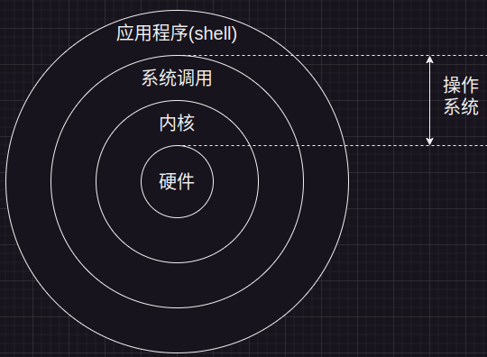

# Bash

[toc]

# Terminal、Bash、Shell

[Scripts(脚本语言)、Shell、Sh、Bash之间的关系](https://zhuanlan.zhihu.com/p/268407319)

## Scripts

脚本（Script），是一种特定的描述性语言，依据一定的格式编写的可执行文件

常见的脚本语言包括python、JavaScript、PHP、SQL、Shell等

## Shell

一般指的是shell脚本（即shell scripts），但shell本身指的却是命令解释器，更具体的来讲，shell就是一个用C语言编写的程序，这个程序提供了一个界面，用户可以通过这个界面访问操作系统内核的服务。就像shell的字面意思那样，shell——壳，它是一个壳，一个能让用户与操作系统内核沟通的壳，一个保护操作系统内核不被用户直接调用的保护壳

## Sh、Bash

shell是提供与内核沟通接口的命令解释器程序，但实际上shell是这种解释器的统称，Linux系统的shell种类很多，包括Bourne shell（简称sh）、Bourne Again shell（简称bash）、C shell（简称csh）、K shell（简称ksh）、Shell for Root等等

各种shell使用路径：
1. Bourne Shell （/usr/bin 或 /bin/sh）
2. Bourne Again Shell （/bin/bash）
3. C Shell （/usr/bin/csh）
4. K Shell （/usr/bin/ksh）
5. Shell for Root （/sbin/sh）

# 【伯乐大典】最实用的Bash脚本知识

## Portal

[【伯乐大典】最实用的Bash脚本知识](https://www.bilibili.com/video/BV1AT411Y7bq/)

[Ryan's Tutorials -- A collection of introductory technology tutorials.](https://ryanstutorials.net/)

[Bash Scripting Tutorial](https://ryanstutorials.net/bash-scripting-tutorial/)

