# Linux指令

[toc]

## Portals

[查看Linux系统架构的命令](https://blog.csdn.net/weixin_41010198/article/details/109166131)

[【HUST Linux】基础讲座——新手必须掌握的 Linux 命令](https://www.bilibili.com/video/BV1Ge4y1W76c)

[【HUST Linux】基础讲座——管道符、重定向与环境变量](https://www.bilibili.com/video/BV1R84y1x7F5)

[Linux重定向（输入输出重定向）详解](http://c.biancheng.net/view/5956.html)

[什么是 .bashrc，为什么要编辑 .bashrc](https://zhuanlan.zhihu.com/p/33546077)

[/etc/profile - 环境变量](https://www.jianshu.com/p/1dd22f5b521a)


## Linux 命令大全 --- 菜鸟教程

[Linux 命令大全 --- 菜鸟教程](https://www.runoob.com/linux/linux-command-manual.html)

### chmod(change mode)

[Linux chmod命令](https://www.runoob.com/linux/linux-comm-chmod.html)

Linux chmod（英文全拼：change mode）命令是控制用户对文件的权限的命令

Linux/Unix 的文件调用权限分为三级 : 文件所有者（Owner）、用户组（Group）、其它用户（Other Users）。

只有文件所有者和超级用户可以修改文件或目录的权限。可以使用绝对模式（八进制数字模式），符号模式指定文件的权限。


## 查看版本

```shell
(base) lzy@legion:~/Project/GraduationProject$ uname -a
Linux legion 5.15.0-56-generic #62~20.04.1-Ubuntu SMP Tue Nov 22 21:24:20 UTC 2022 x86_64 x86_64 x86_64 GNU/Linux

(base) lzy@legion:~/Project/GraduationProject$ cat /proc/version
Linux version 5.15.0-56-generic (buildd@lcy02-amd64-102) (gcc (Ubuntu 9.4.0-1ubuntu1~20.04.1) 9.4.0, GNU ld (GNU Binutils for Ubuntu) 2.34) #62~20.04.1-Ubuntu SMP Tue Nov 22 21:24:20 UTC 2022

(base) lzy@legion:~/Project/GraduationProject$ lsb_release -a
No LSB modules are available.
Distributor ID:	Ubuntu
Description:	Ubuntu 20.04.5 LTS
Release:	20.04
Codename:	focal
```

"lsb" 是 "Linux Standard Base" 的缩写。这是一个由 Linux 基础软件联盟 (Linux Foundation) 制定的标准，旨在定义一个稳定的、可移植的 Linux 操作系统接口，以便软件开发人员可以针对标准接口编写应用程序，而不需要考虑特定 Linux 发行版的差异性。"lsb_release -a" 命令是一个用于显示当前 Linux 发行版符合 LSB 标准的版本信息的命令。

## 查看文件
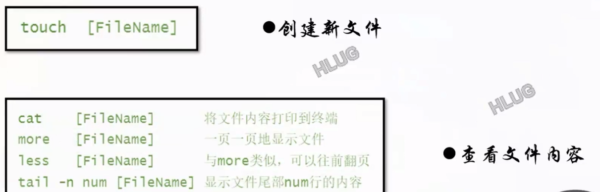


## 复制、删除、移动
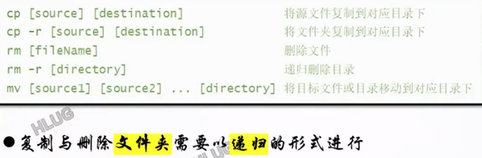


## 别名
简化长命令&防止误删

alias 
unalias

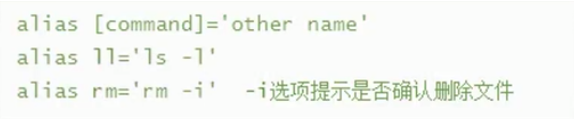

alias fileExplorer="nautilus"

bash文件夹界面

## 文件权限
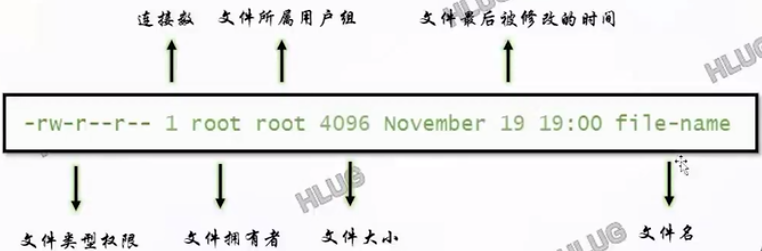

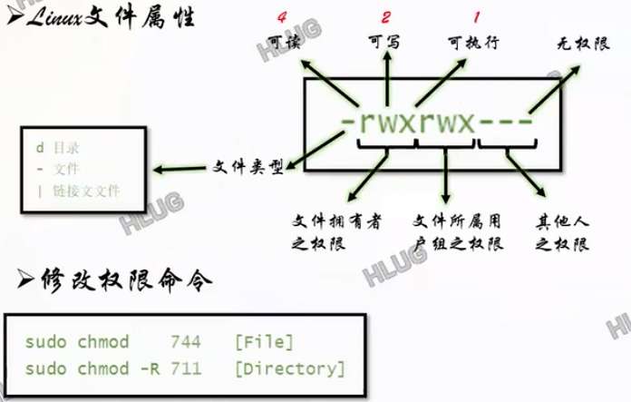

## 查找

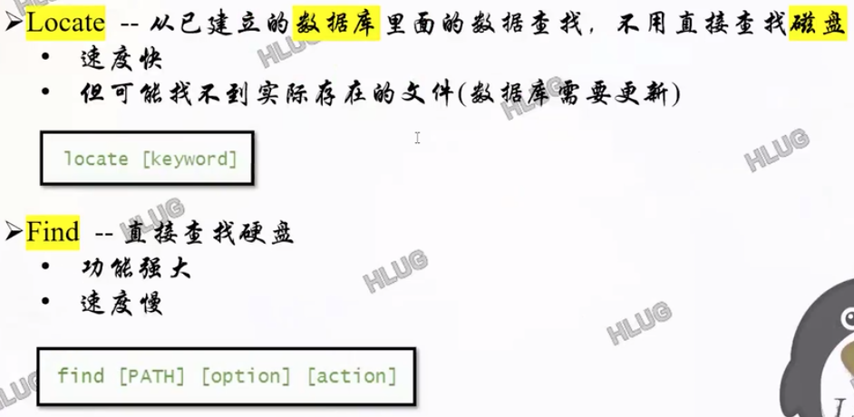

## 管道符

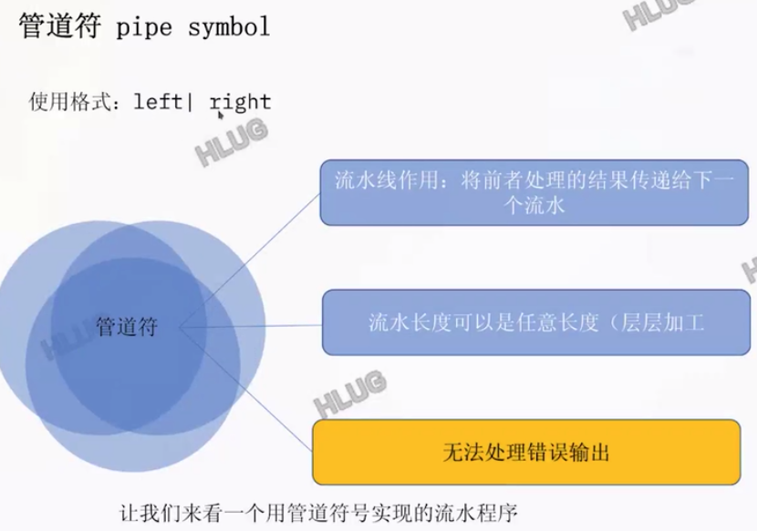

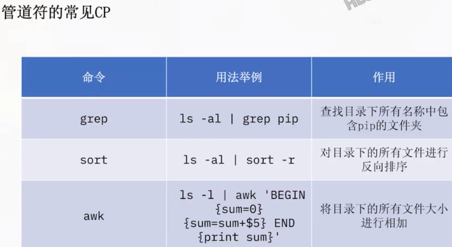

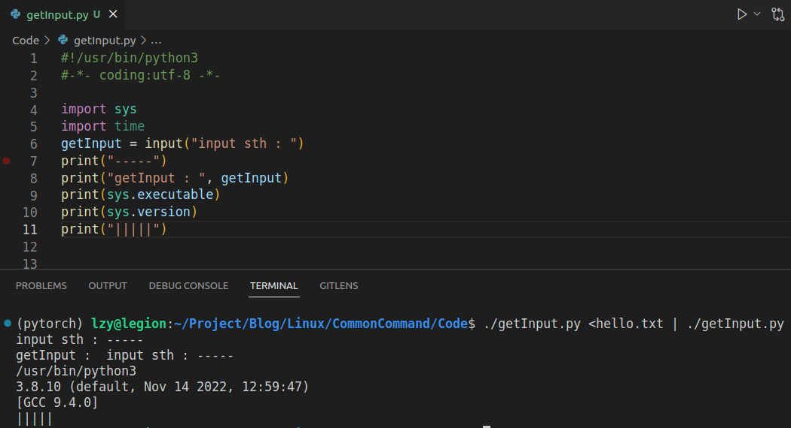

## 重定向
类型:
1. 输入重定向
2. 输出重定向
3. 重定向合并

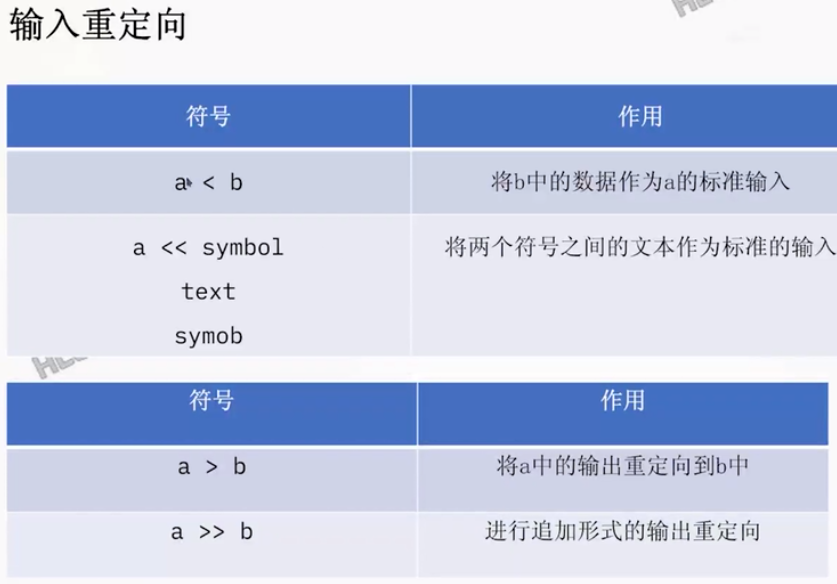

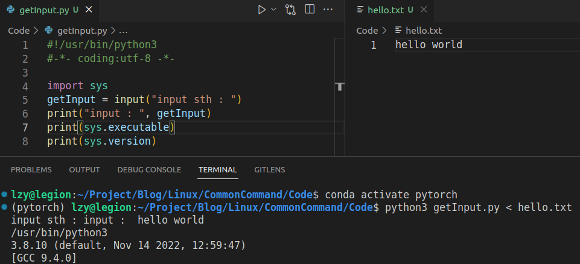

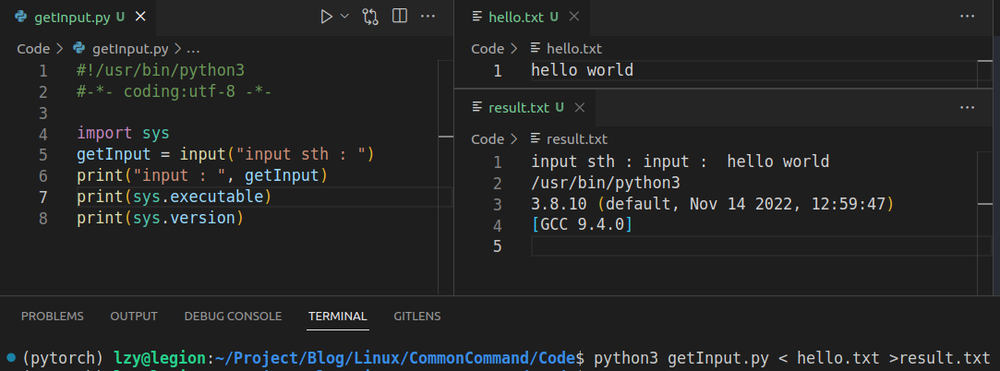

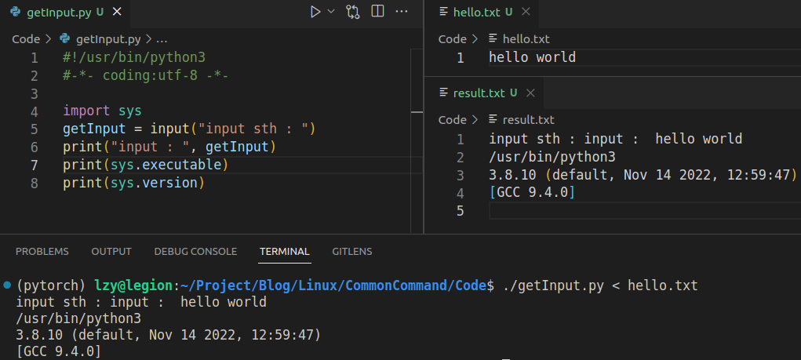

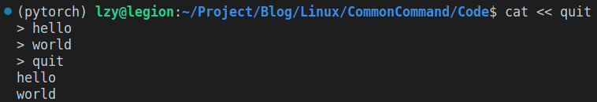

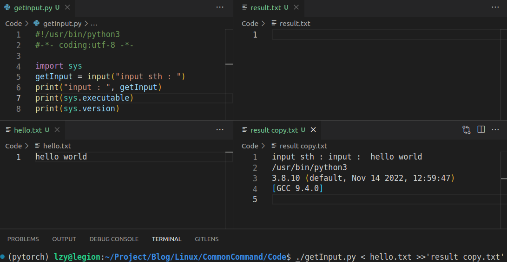

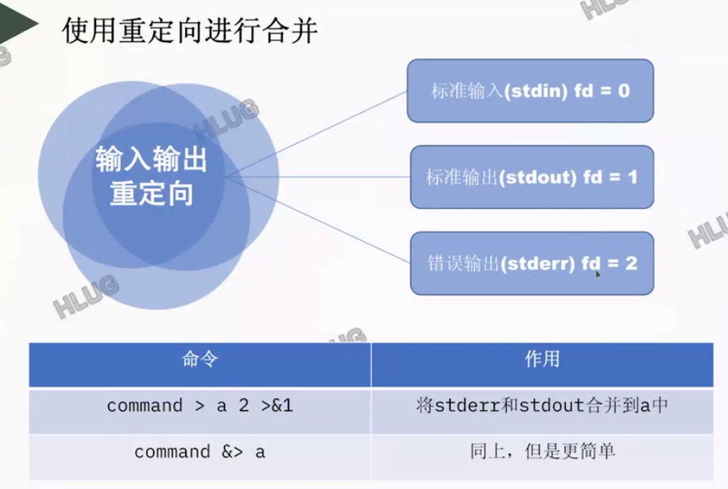

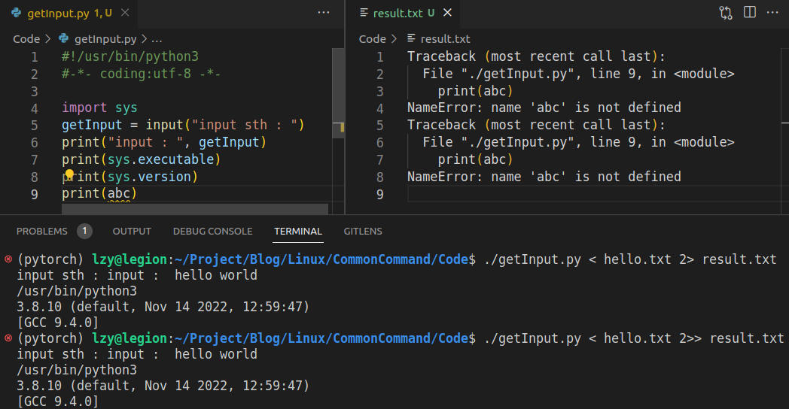

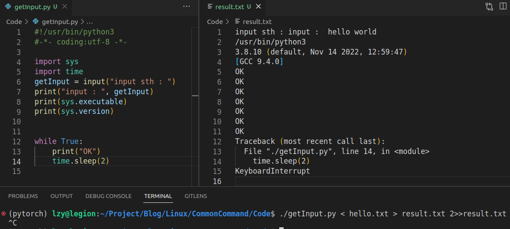


## 环境变量

```
cat /etc/profile
cat ~/.bashrc
```

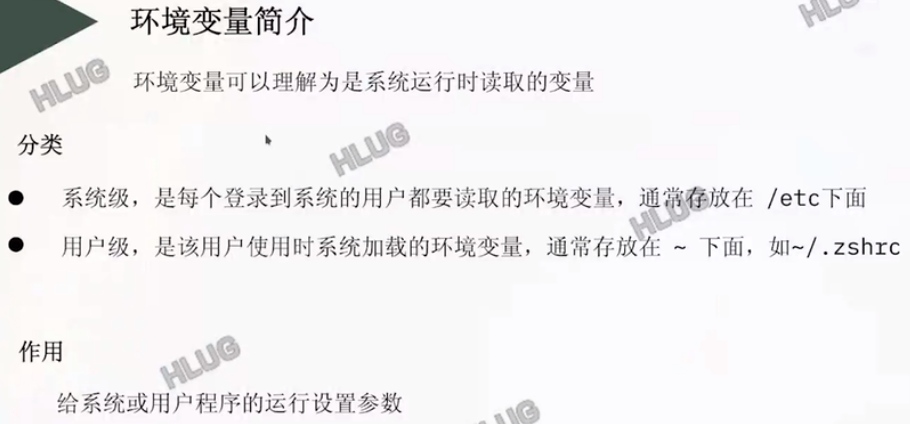

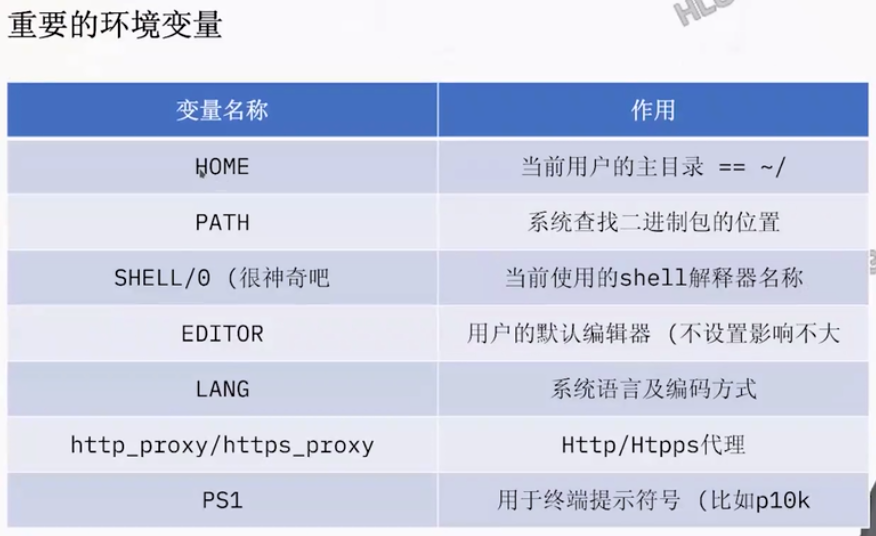

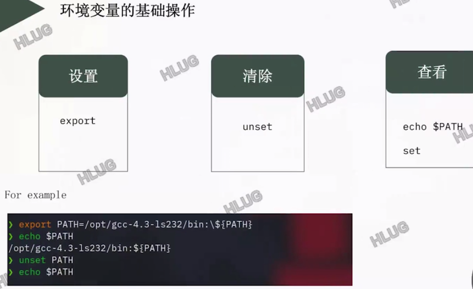

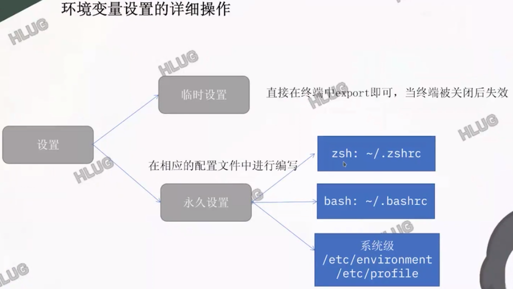

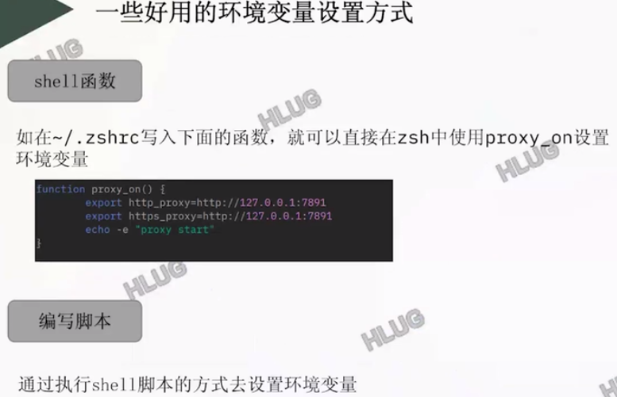


## bash 快捷键

ctrl+w 删除命令行终端某个命令字段

ctrl+shift+N
