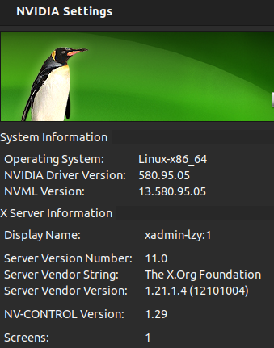

# Linux GUI

---

# Display Protocol

使用 `echo $XDG_SESSION_TYPE` 查看

Stacking  (非合成) : 应用程序 直接 把像素画在 画布的特定坐标上
1. 窗口重叠问题，被挡住时 后面覆盖前面，移走时 需要 Expose Event 补画
2. Cons
   1. 画面撕裂 (Tearing) : 如果没画完，屏幕就刷新，会看到半截画面
   2. 没有特效 : 直接画在画布上，不知道下面层的颜色，很难 数学混合 做半透明
   3. 闪烁 : 移动窗口时，如果重绘速度跟不上，背景会闪烁

Compositing (合成) : 把 不同窗口画面 拼 在一起，最终显示到屏幕上
1. 离屏渲染 (Off-screen Rendering)
2. 每个窗口 有自己的 独立画布 buffer
3. 合成器 (Compositor) 拿到所有窗口画好的 图层，然后决定怎么 叠在一起
   1. 在把图层叠上去之前，可以对图层做 缩放、旋转、加阴影、变半透明
   2. 把处理好的最终画面，一次性发送给显卡显示
4. Pros
   1. 丝滑无撕裂 : 每一帧 算好 再显示，不会出现 画一半的 情况
   2. 特效功能
   3. 程序卡死也不影响其他图层

## X11 (X Window System)

[X.Org - Official Website](https://www.x.org/wiki/)

[X Window System - Wikipedia](https://en.wikipedia.org/wiki/X_Window_System)

X11 诞生于 1984年 (比 Linux 内核还要早)，是 Unix 和 Linux 中几十年来的 标准 图形显示协议

工作原理 : Client-Server
1. X Server (服务端) : 管理硬件 (显卡、屏幕、键盘鼠标)
2. X Client (客户端) : 运行的 应用程序 (浏览器、终端)
3. 用程序告诉 X Server 要画一个窗口，X Server 负责把 窗口显示在屏幕上

核心特点
1. **网络透明性**
   1. 设计之初是 为了在大型机上 运行程序，并 在另一台终端上 显示
   2. 可以轻 通过 ==网络== 远程运行 图形界面程序 (SSH X Forwarding)
2. Pros : 兼容性好
3. Cons :
   1. 架构臃肿 : 包含了很多现代计算机不再需要的功能
   2. 安全性较差 : 任何程序都可以 监听 其他程序的键盘输入
   3. 不支持 HDR(High Dynamic Range， 高动态范围)

安全性漏洞 使得可以使用 强大工具(远程桌面，屏幕共享，录屏)

NVIDIA X Server Settings 软件
1. Linux 版的 NVIDIA 显卡控制面板
   1. 
2. 读取 当前运行的 Xorg Server 的状态
   1. 

---

## Wayland

[Wayland - Official Website](https://wayland.freedesktop.org/)

由 X.Org 的 开发者 发起，旨在取代 X11，2008年 项目启动

工作原理
1. 简化架构(**轻量化**)，让 **合成器(Compositor)** 直接承担 显示**服务器** 的角色 (Compositor is Server)
   1. 强制合成
2. 应用程序(客户端0)自己进行渲染，然后将 渲染好的画面 直接交给 合成器
3. 合成器 负责 将 画面组合 并 发送给显卡显示
4. 省去了 X Server 这个庞大的中间环节
5. Wayland 使用的是 Shared Memory(共享内存) 和 DMABUF 技术，Zero-Copy，把 图在显存里的 **地址(句柄/指针)** 告诉合成器，而 X11 可能需要 内存搬运

核心特点
1. 更注重合成 : 专为 现代图形栈(使用 GPU 加速) 设计，能够实现 无撕裂(Tearing-free)的 平滑显示效果
   1. Wayland 强制开启 V-Sync(垂直同步)，会带来一点显示延迟，但保证 无撕裂
   2. 不过 也引入了 Tearing Protocol (允许撕裂协议)，允许应用程序 绕过合成器的 完美主义
2. **安全性隔离** : 默认情况下，一个窗口 无法读取 另一个窗口 内容/输入，使得开发 **屏幕录制** / **全局截图工具** 变得更复杂
   1. 需要 向 Compositor 提交一个请求，需要用户 在 弹窗 决定 是否授权
3. Pros : 性能更好，代码更精简，更流畅，支持触摸手势，对多显示器和 HiDPI 支持更优秀
4. Cons : 无法原生运行为 X11 编写的老程序，部分专业软件支持尚不完美

Wayland 碎片化问题
1. X11
   1. 中央集权，几乎只用一个实现 **X.Org Server**
   2. API 统一(所有的窗口管理器 都是连接到同一个 X.Org Server 上工作)
   3. 开发者只要对着 X11 标准 写代码，在所有桌面上都能跑
2. Wayland
   1. Wayland 只是一本 协议文档，没有官方的实现
   2. API 差异 : GNOME 写 Server (Mutter)，KDE 写 Server (KWin)
   3. 核心功能统一(画个窗口、处理鼠标点击)，高级功能分裂(截图、屏幕录制) 有自己的私有协议

NVIDIA 与 Wayland 有兼容性问题，Wayland 对 NVIDIA 的支持还不这么完美，在 Ubuntu 22.04，NVIDIA 显卡(尤其是使用专有驱动时) 默认会回退到 X11

## XWayland 兼容层

只支持 X11 协议 的应用 想在 Wayland 运行

流程
1. 假装自己是一个 X Server，接受 X11 绘图指令，让老软件以为 在 X11 环境下运行
2. 转为 Wayland 能懂的 图层 Surface
3. 发送给 Wayland Compositor

无感 : 用户感觉不到这个过程 (多了一层转发，会有轻微的性能损耗)

---

# Desktop Environment

使用 `echo $XDG_CURRENT_DESKTOP` 或 `neofetch` 查看

Mutter 是 GNOME 的 窗口管理器(Window Manager)

## GNOME (GNU Network Object Model Environment)

GNOME 尽量减少干扰，隐藏复杂的设置

交互逻辑 : 活动(Activities) 视图，左上角 / Win键，所有窗口平铺展示

特点
1. Pros : Ubuntu、Fedora 和 Red Hat 的默认桌面
2. Cons : 难以自定义

目前对 Wayland 支持最完善的桌面环境

## KDE (K Desktop Environment)

KDE 提供所有的 开关/旋钮，想把系统改成什么样都行

交互逻辑 : 默认布局非常像 Windows

特点
1. Pros : 可定制性
2. Cons : 选项太多，有时候会让人眼花缭乱

从 Plasma 6 开始，Wayland 支持已经非常成熟

