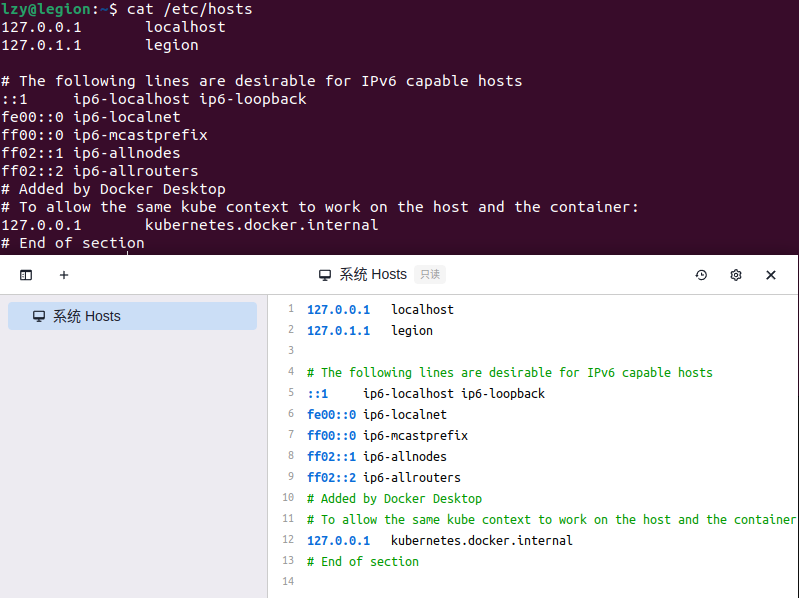
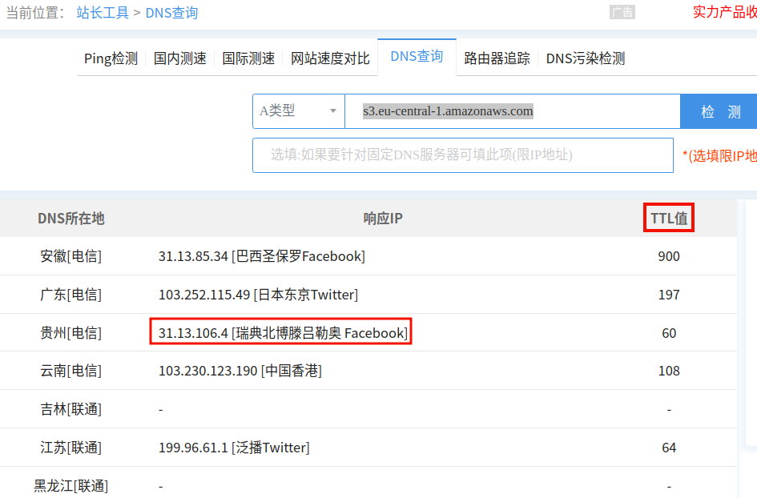
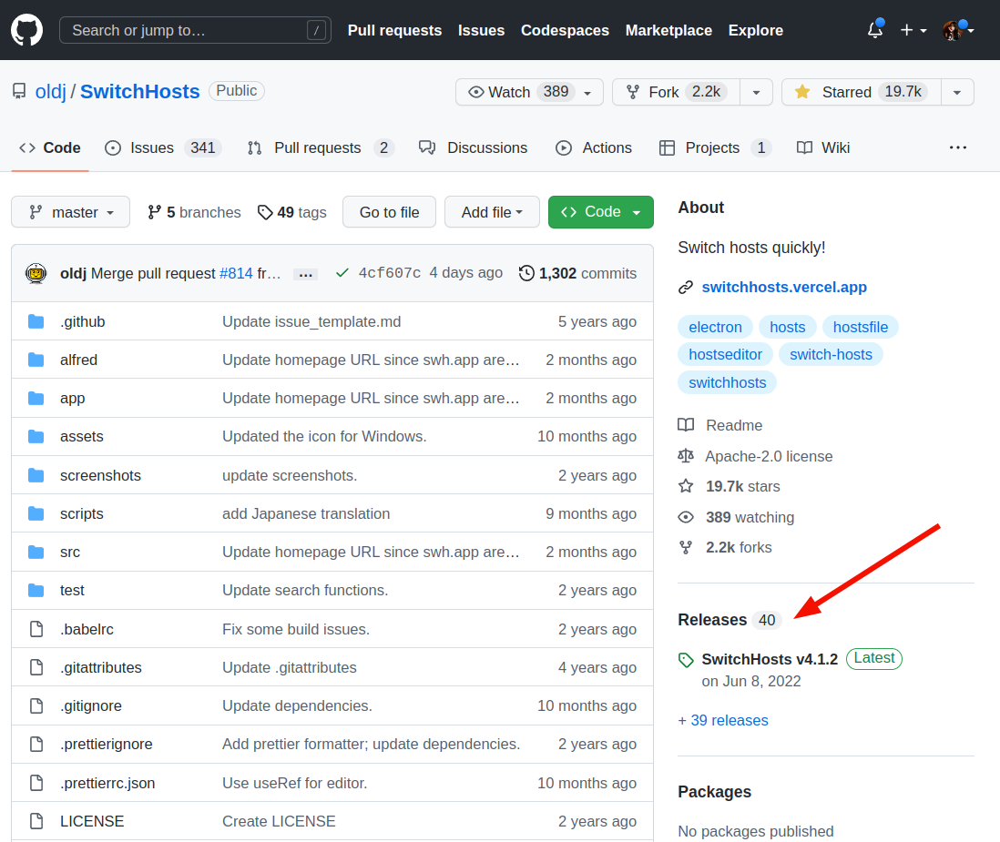
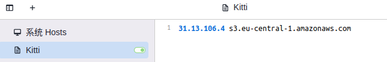
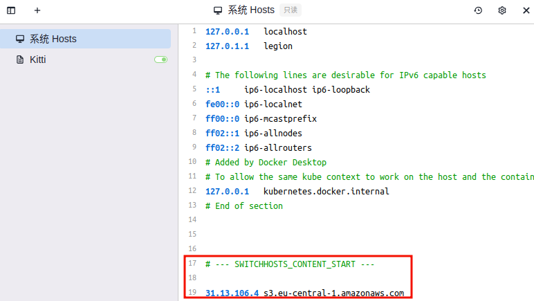

# Hosts

## 系统hosts位置

系统hosts配置位置 : /etc/hosts

## DNS 查询

[站长工具](https://tool.chinaz.com/dns)

## SwitchHosts

[SwitchHosts Github官网](https://github.com/oldj/SwitchHosts)

点击release即可下载deb包

创建一个新的(将上面查到的DNS添加在SwitchHosts中)

在系统hosts也可以看到了

下载kitti数据集的时候似乎还是要挂着Ghelper

