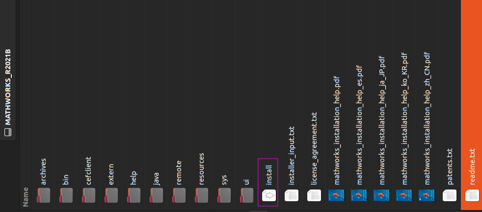
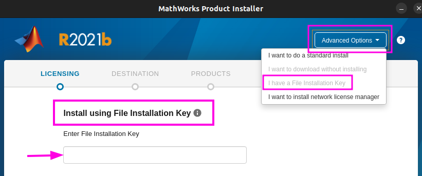
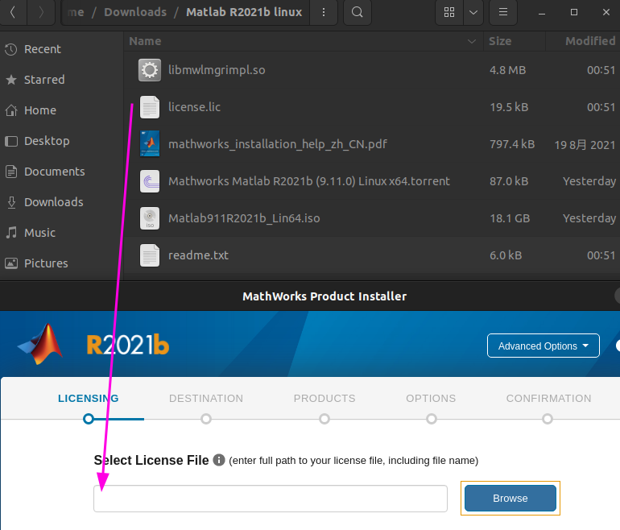
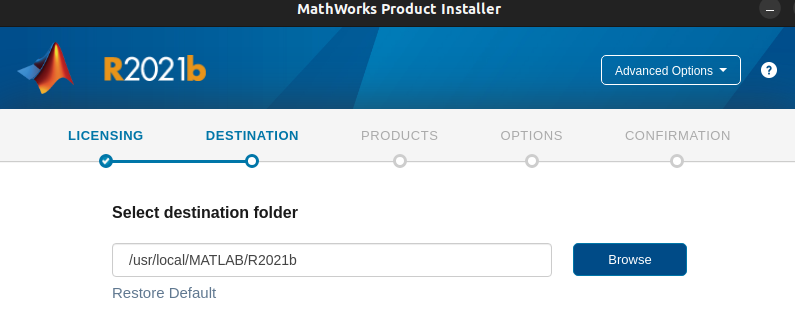
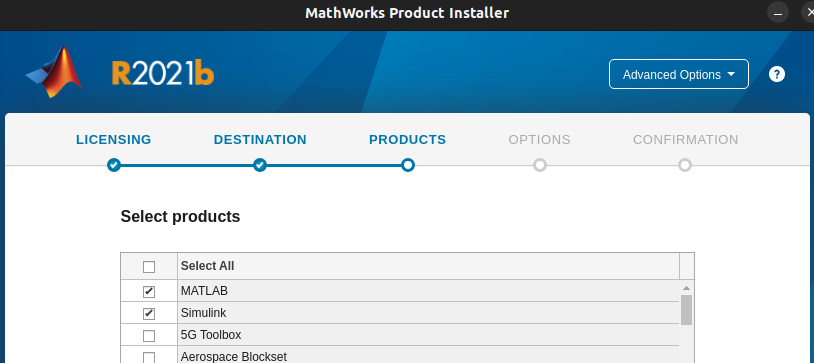
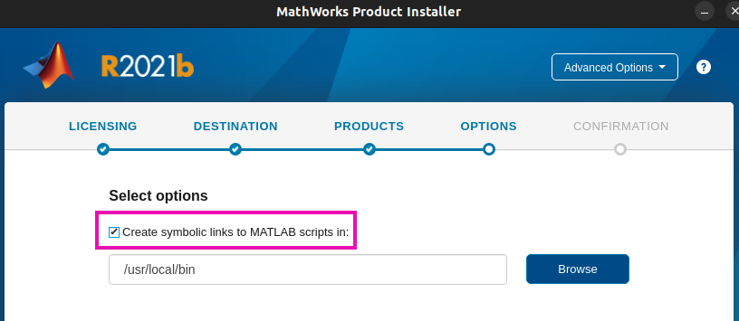
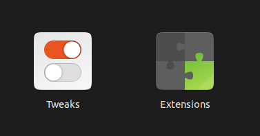
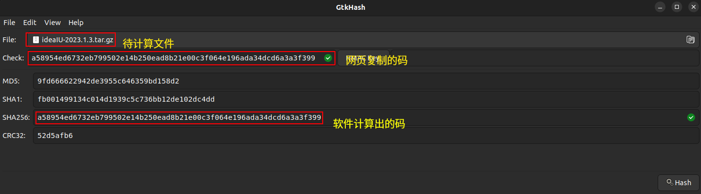
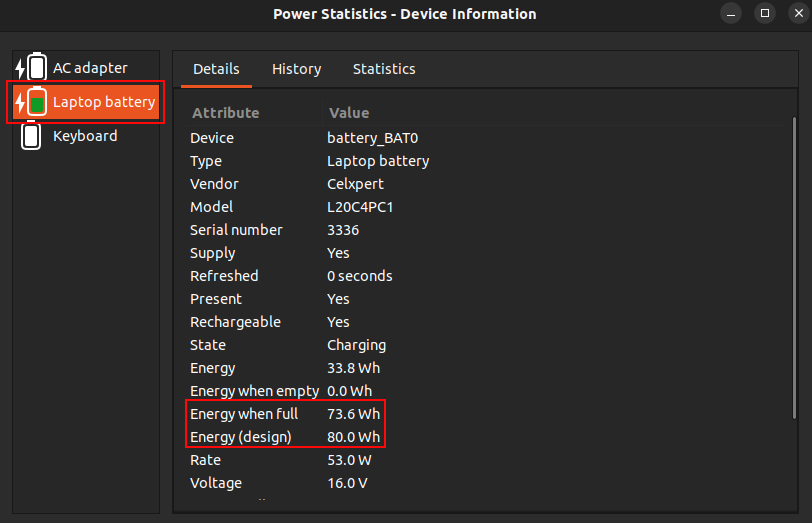

# Install Ubuntu

[toc]

# 基础安装

跟着这个视频做就好，很清楚
[Windows 和 Ubuntu 双系统的安装和卸载 --- 机器人工匠阿杰](https://www.bilibili.com/video/BV1554y1n7zv)

## 雷蛇

### 查看BIOS模式

运行中输入msinfo32用于查看BIOS模式

结果如图所示:UEFI


### 系统配置

CPU

GPU


### secure boot 关闭

开机时按F2进入BIOS


Fn+F2


### 强行关闭 secure boot

[拯救者Y7000P 修改secure boot方法](https://blog.csdn.net/qq_50598558/article/details/119040725)

```bash
sudo apt install mokutil
sudo mokutil --disable-validation

sudo apt install mokutil
sudo mokutil --disable-validation
```
出现蓝屏，选择change secure boot state

Disable Secure Boot，选择yes

## 换源

[ubuntu换源](https://blog.csdn.net/qq_45878098/article/details/126037838)

如果出现　Hash Sum mismatch Hashes of expected file
则删除　
sudo rm -rf /var/lib/apt/lists/*
sudo apt clean

然后换源，我是从中科大换成阿里解决的

## 卸载无用软件

```
sudo apt remove thunderbird*
sudo apt remove firefox*
sudo apt remove libreoffice-common
sudo apt remove libreoffice*
sudo apt remove rhythmbox*
```

感觉22.04的libreoffice还行，就没卸载

卸载相关小游戏

# 后续安装

## 终端补全忽略大小写

```bash
# 在/etc/inputrc中添加使全局所有用户生效
echo 'set completion-ignore-case on' >> /etc/inputrc

# 对于个别用户，则可以在用户home目录下添加
echo 'set completion-ignore-case on' >> ~/.inputrc
```

如果显示权限不够，就直接 sudo gedit 打开文件改

## 输入法

[在Ubuntu20.04中安装中文输入法](https://zhuanlan.zhihu.com/p/529892064)

凑活用ibus也行

对于sougou，需要先安装系统fcitx，按照官网教程一步步来即可

[搜狗输入法linux 官方安装指南](https://shurufa.sogou.com/linux/guide)

sudo apt-get install fcitx-bin
sudo apt-get install fcitx-table

没事多重启就行

## 快捷键设置


## 显卡驱动

[NVIDIA CUDA Toolkit Release Notes　官网](https://docs.nvidia.com/cuda/cuda-toolkit-release-notes/index.html)


[INSTALL PYTORCH 官网](https://pytorch.org/)


因为pytorch我会安装最新的11.7，所以这里选择了470
P.S.本来想选择510但是直接不允许我下载，遂放弃，这个方法不一定行

[NVIDIA显卡的Ubuntu驱动程序安装方法](https://www.bilibili.com/video/BV1wY411p7mU/)

[ubuntu无法添加PPA的解决办法](https://blog.csdn.net/leviopku/article/details/101060133)
[联想拯救者Y7000安装NVIDIA显卡驱动](https://www.freesion.com/article/58521373000/)

[cuda 和 cudnn 库的卸载与安装](https://zhuanlan.zhihu.com/p/102966512)

### cudnn 安装 .tar.xz

下载 Local Installer for Linux x86_64 (Tar)

```bash
tar -xvf cudnn-linux-x86_64-8.x.x.x_cudaX.Y-archive.tar.xz
sudo cp cudnn-*-archive/include/cudnn*.h /usr/local/cuda/include 
sudo cp -P cudnn-*-archive/lib/libcudnn* /usr/local/cuda/lib64 
sudo chmod a+r /usr/local/cuda/include/cudnn*.h /usr/local/cuda/lib64/libcudnn*
```
后续还有验证

```bash
git cline https://github.com/LittleNewton/cudnn-samples-v8.git  # 官网没找到 从 github 下一个

sudo apt-get install libfreeimage3 libfreeimage-dev  # 可能会缺少后续所需的包

cd cudnn_samples_v8/mnistCUDNN
make clean
make  # 生成 mnistCUDNN.o 文件
./mnistCUDNN
```
```text
Executing: mnistCUDNN
cudnnGetVersion() : 8900 , CUDNN_VERSION from cudnn.h : 8900 (8.9.0)
Host compiler version : GCC 11.3.0

There are 1 CUDA capable devices on your machine :
device 0 : sms 16  Capabilities 8.6, SmClock 1500.0 Mhz, MemSize (Mb) 3902, MemClock 6001.0 Mhz, Ecc=0, boardGroupID=0
Using device 0

...

Testing single precision

...

Result of classification: 1 3 5

Test passed!
```

出现 Test passed! 即安装成功

### 个人电脑操作

[NVIDIA 驱动程序下载](https://www.nvidia.cn/Download/index.aspx?lang=cn)

**最终解决方案 driver+cuda+cudnn**

[安装显卡驱动、CUDA、cuDNN及其简单介绍](https://www.bilibili.com/video/BV16Y411M7SC)
[Ubuntu安装CUDA+cuDNN](https://blog.chintsan.com/archives/561)

[cudnn 官方安装指南 ](https://docs.nvidia.com/deeplearning/cudnn/install-guide/index.html)


选用了22.04，对应的ROS2版本为Humble[ROS2官网 查看支持版本](https://www.ros.org/reps/rep-2000.html#rolling-ridley-june-2020-ongoing)

最终方法：命令行直接　sudo apt install nvidia-driver-470 (515也行)，装完后重启，nvidia-smi显示cuda为11.4 (515这里显示cuda为11.7)　　**至此driver安装完成**，电脑应该会出现一个 NVIDIA X Server Settings 的软件

由于需要装pytorch1.13，所以需要更新为11.7

如果要安装11.5使用sudo apt install nvidia-cuda-toolkit

[各个版本CUDA下载地址](https://developer.nvidia.cn/cuda-toolkit-archivehttps://developer.nvidia.cn/cuda-toolkit-archive)
[CUDA Toolkit 11.7 官方Downloads](https://developer.nvidia.com/cuda-11-7-0-download-archive)


可以选择runfile或者deb，==在wget时候记得将.com后缀改为.cn可以大大提高下载速度==(我这里快十倍多)

runfile命令较少，deb命令较多

**runfile方式**，个人感觉类似图形化安装

可能需要赋予可执行权限

```shell
# 原命令
wget https://developer.download.nvidia.com/compute/cuda/11.7.1/local_installers/cuda_11.7.1_515.65.01_linux.run
# com->cn
wget https://developer.download.nvidia.cn/compute/cuda/11.7.1/local_installers/cuda_11.7.1_515.65.01_linux.run
sudo sh cuda_11.7.1_515.65.01_linux.run
```

耐心等待一会儿，一开始会出现这个界面


如果之前安装了驱动，可以在下面的窗口取消勾选


应该是安装到了 /usr/local/cuda-11.7

重启，然后可以 cd /usr/local/cuda-11.7/bin ，随后 ./nvcc -V 即可看到相关输出

**deb方式**

按照官网下面的命令运行即可运行，安装后重启

```
wget https://developer.download.nvidia.com/compute/cuda/repos/ubuntu2204/x86_64/cuda-ubuntu2204.pin
sudo mv cuda-ubuntu2204.pin /etc/apt/preferences.d/cuda-repository-pin-600
wget https://developer.download.nvidia.com/compute/cuda/11.7.0/local_installers/cuda-repo-ubuntu2204-11-7-local_11.7.0-515.43.04-1_amd64.deb
sudo dpkg -i cuda-repo-ubuntu2204-11-7-local_11.7.0-515.43.04-1_amd64.deb
sudo cp /var/cuda-repo-ubuntu2204-11-7-local/cuda-*-keyring.gpg /usr/share/keyrings/
sudo apt-get update
sudo apt-get -y install cuda
```

打开后，nvidia-smi发现把我之前的470更新为515.65.01，看看后续能不能正常使用


进入cuda安装路径中的bin目录，执行./nvcc -V，进行查看，当然也可以nvidia-smi


如果想要在任何路径下的终端使用nvcc -v命令，则需在~/.bashrc中加入两行

```
export PATH=/usr/local/cuda-11.7/bin:${PATH}
export LD_LIBRARY_PATH=/usr/local/cuda-11.7/lib64:${LD_LIBRARY_PATH}
```

然后新开一个终端，输入nvcc -V即可看到相同结果　**至此cuda安装完成**

对于cudnn安装，直接官网下载安装包，随后sudo dpkg -i xxx即可

随后根据命令行提示，可能还需安装加一个 gpg key

**pytorch**

安装pytorch直接pip3安装也行，记得添加豆瓣镜像　-i https://pypi.douban.com/simple/

```python
# 使用 PyTorch 查看 CUDA 和 cuDNN 版本
import torch
print(torch.__version__)  # 1.13.1+cu117
print(torch.version.cuda)  # '11.7'
print(torch.backends.cudnn.version())  # 8801
```


**启动时**
进入启动项时，选中第一行Ubuntu，按[e]，编辑启动项参数

找到linux开头的一行，去到该行末尾(可能该行会被分为两行显示)，输入空格+nomodeset


输入ctrl+x，保存并启动，进入系统后，修改黑名单

sudo gedit /etc/modprobe.d/blacklist.conf

末尾添加
blacklist nouveau

最后命令行输入命令生效黑名单
sudo update-initramfs -u

**安装时**
如果提示没有make gcc等等，可以先安装ROS可能顺便解决，或者自己手动安装即可，然后一路yes即可

## 快捷方式

.desktop文件

记得添加可执行权限 chmod +x

[ubuntu下应用图标的更改](https://blog.csdn.net/thinszx/article/details/107590118)
.png也可以

```
(base) lzy@legion:/tmp$ sudo find /usr/share/ -name "meshlab*.desktop"
/usr/share/applications/meshlab.desktop

(base) lzy@legion:/tmp$ sudo gedit /usr/share/applications/meshlab.desktop
```

## 软件列表

### 软件包

**.deb**
edge浏览器
vscode
drawio
dbeaver
wps
eudic 欧陆词典  (22.04欧路词典暂时打不开，使用goldendict替换，和欧路一样支持第三方词典)
每日英语听力
baidu net disk
linux qq
Feishu
netease cloud music [Ubuntu22.04运行网易云音乐错误](https://blog.csdn.net/qq_35628698/article/details/124815037)

```shell
# 针对 22.04
# Ubuntu 22.04由于更换/升级了一些动态库，系统动态库x86_64-linux-gnu内libgio-2.0.so.0、libpangocairo-1.0.so.0引用库缺少了函数支持， 导致程序无法运行，又因前两个动态库的更换导致依赖动态库libselinux.so.1缺少。故只能使用安装目录库并补齐以上三个动态库，且Ubuntu22.04的库无法使用，只能使用21.10以下的系统库文件。

# 安装软件
sudo dpkg -i netease-cloud-music_1.2.1_amd64_ubuntu_20190428.deb
# 修改启动脚本
vim /opt/netease/netease-cloud-music/netease-cloud-music.bash
# 修改为
------
#!/bin/sh
#HERE="$(dirname "$(readlink -f "${0}")")"
HERE=/opt/netease/netease-cloud-music
export LD_LIBRARY_PATH="${HERE}"/libs
export QT_PLUGIN_PATH="${HERE}"/plugins
export QT_QPA_PLATFORM_PLUGIN_PATH="${HERE}"/plugins/platforms
exec $HERE/netease-cloud-music $@
------
# 将动态连接库复制到网易云音乐依赖包里面 注意不要放全局 因为只有网易云用这个 其他的系统模块还是用原来的 放全局容易会导致系统崩溃
cp libgio-2.0.so.0 libpangocairo-1.0.so.0.4800.10 libselinux.so.1 /opt/netease/netease-cloud-music/libs
# 更改连接库名称
cd /opt/netease/netease-cloud-music/libs
mv libpangocairo-1.0.so.0.4800.10 libpangocairo-1.0.so.0
# 启动
netease-cloud-music
```

tencent meeting
sunlogin client
sougou input method
[Ubuntu搜狗输入法安装指南](https://shurufa.sogou.com/linux/guide)
blender

**apt install**
git
python3-pip
meshlab
gthumb
kirta (P图)
flameshot (截图软件，可以添加快捷键)
timeshift备份
[Timeshift 系统备份和还原](https://blog.csdn.net/zjy1175044232/article/details/124248454)
[Timeshift 官网](https://linuxmasterclub.com/timeshift/)
alien rpm->deb
qt5 : sudo apt install qtbase5-dev qtchooser qt5-qmake qtbase5-dev-tools qtcreator

gnome-sound-recorder

fcitx

1. sudo apt-get install fcitx-bin
2. sudo apt-get install fcitx-table

新立得包管理 sudo apt install -y synaptic
net-tools 用于ifconfig
tree
goldendict
[GoldenDict安装介绍](https://www.bilibili.com/video/BV1L3411j7iP/)
QtScrapy
[QtScrcpy github](https://github.com/barry-ran/QtScrcpy/blob/dev/README_zh.md)
[QtScrcpy ubuntu](https://juejin.cn/post/7069577232984834079)
手机端操作

1. 打开设置，下拉选项，找到最后一个，关于手机
2. 在关于手机选项里，找到版本号，连点7次
3. 之后会提示，已处于开发者模式
   adb设置
4. 设置中搜索adb
5. 打开usb调试

**其他**
VLC
gthumb

clash [Linux科学上网 Ubuntu20.04LTS 配置科学上网环境|Clash客户端](https://www.youtube.com/watch?v=pTlso8m_iRk)


暴力猴+Bilibili插件[强大的哔哩哔哩增强脚本](https://github.com/the1812/Bilibili-Evolved)
beyondcompare
xdm(idm替代)[xdm官网](https://xtremedownloadmanager.com/)[xdm插件安装教程](https://microsoftedge.microsoft.com/addons/search/xdm-browser-monitor)

## ROS

鱼香ROS一键安装指令
wget http://fishros.com/install -O fishros && . fishros

## miniconda

[关于conda环境的配置，看这一篇就够了](https://www.bilibili.com/read/cv8956636)
[使用Miniconda管理隔离虚拟Python环境](https://www.bilibili.com/video/BV1Mv411x775)

输入 conda config 就会自动在用户目录下生成 .condarc 文件，添加清华源，然后conda clean -i

[Anaconda 清华镜像使用帮助](https://mirrors.tuna.tsinghua.edu.cn/help/anaconda/)

[docs.conda.io 官方文档](https://docs.conda.io/en/latest/miniconda.html#system-requirements)

[Installation instructions 官方文档](https://conda.io/projects/conda/en/stable/user-guide/install/index.html)

按 q 跳出协议

yes - yes - yes

```
# 手动激活Anaconda3环境
conda activate
# 手动退出Anaconda3环境
conda deactivate
# 配置打开终端时候默认不激活Anaconda环境：
conda config --set auto_activate_base false
# 配置打开终端时候默认激活Anaconda环境：
conda config --set auto_activate_base true
# 这是简化的命令形式
conda create -n conda-new --clone conda-old
# 然后删除原有的conda环境：
conda remove -n conda-old --all
```

安装labelImg

```
pip install PyQt5 -i https://pypi.tuna.tsinghua.edu.cn/simple/
pip install pyqt5-tools -i https://pypi.tuna.tsinghua.edu.cn/simple/
pip install lxml -i https://pypi.tuna.tsinghua.edu.cn/simple/
pip install labelImg -i https://pypi.tuna.tsinghua.edu.cn/simple/ （直接复制就可）
```

## 微信

[deepin-wine 微信](https://www.bilibili.com/video/BV1Vb4y1r79y)

```
官网：https://deepin-wine.i-m.dev/
首次使用需要添加仓库： wget -O- https://deepin-wine.i-m.dev/setup.sh | sh
而后使用： apt install ... 安装对应软件包
应用图标需要注销重登录后才会出现
```

## linux beyondcompare 的安装和破解

下载安装包：

[官方下载地址](https://www.scootersoftware.com/download.php)

**安装软件**

执行命令安装：sudo dpkg -i xxx.deb

**破解**

执行如下两条命令：

```shell
cd /usr/lib/beyondcompare/

sudo sed -i "s/keexjEP3t4Mue23hrnuPtY4TdcsqNiJL-5174TsUdLmJSIXKfG2NGPwBL6vnRPddT7tH29qpkneX63DO9ECSPE9rzY1zhThHERg8lHM9IBFT+rVuiY823aQJuqzxCKIE1bcDqM4wgW01FH6oCBP1G4ub01xmb4BGSUG6ZrjxWHJyNLyIlGvOhoY2HAYzEtzYGwxFZn2JZ66o4RONkXjX0DF9EzsdUef3UAS+JQ+fCYReLawdjEe6tXCv88GKaaPKWxCeaUL9PejICQgRQOLGOZtZQkLgAelrOtehxz5ANOOqCaJgy2mJLQVLM5SJ9Dli909c5ybvEhVmIC0dc9dWH+/N9KmiLVlKMU7RJqnE+WXEEPI1SgglmfmLc1yVH7dqBb9ehOoKG9UE+HAE1YvH1XX2XVGeEqYUY-Tsk7YBTz0WpSpoYyPgx6Iki5KLtQ5G-aKP9eysnkuOAkrvHU8bLbGtZteGwJarev03PhfCioJL4OSqsmQGEvDbHFEbNl1qJtdwEriR+VNZts9vNNLk7UGfeNwIiqpxjk4Mn09nmSd8FhM4ifvcaIbNCRoMPGl6KU12iseSe+w+1kFsLhX+OhQM8WXcWV10cGqBzQE9OqOLUcg9n0krrR3KrohstS9smTwEx9olyLYppvC0p5i7dAx2deWvM1ZxKNs0BvcXGukR+/g" BCompare
```

打开Beyond Compare 4输入如下指令破解, 在输入Key界面输入即可

```shell
GXN1eh9FbDiX1ACdd7XKMV7hL7x0ClBJLUJ-zFfKofjaj2yxE53xauIfkqZ8FoLpcZ0Ux6McTyNmODDSvSIHLYhg1QkTxjCeSCk6ARz0ABJcnUmd3dZYJNWFyJun14rmGByRnVPL49QH+Rs0kjRGKCB-cb8IT4Gf0Ue9WMQ1A6t31MO9jmjoYUeoUmbeAQSofvuK8GN1rLRv7WXfUJ0uyvYlGLqzq1ZoJAJDyo0Kdr4ThF-IXcv2cxVyWVW1SaMq8GFosDEGThnY7C-SgNXW30jqAOgiRjKKRX9RuNeDMFqgP2cuf0NMvyMrMScnM1ZyiAaJJtzbxqN5hZOMClUTE+++
```

成功后在目录~/.config/bcompare/下会生成文件BC4Key.txt

为所有用户注册bcompare 命令，执行如下指令：

```shell
sudo cp ~/.config/bcompare/BC4Key.txt /etc/
```

## linux Matlab

[Matlab R2021b v9.11 for Linux 中文授权激活版](https://www.jb51.net/softs/792028.html)

[百度网盘 安装包+Crack链接 免解压](https://pan.baidu.com/s/1FW9--qZeE6Pgb-UrzPe9lg?pwd=fdfz)

下载后首先点击 .iso 文件进行挂载，可以查看到如下结果



[Ubuntu: the sudo ./install does not work for Matlab](https://www.mathworks.com/matlabcentral/answers/1459909-installer-hang-when-installing-matlab-r2021b-as-root-on-ubuntu-20-04#comment_1759029)

挂载后在终端输入如下命令，对于 ubuntu 22.04 有效

```shell
xhost +SI:localuser:root
```

安装程序可以访问互联网

最好加上 sudo ，否则后续安装可能选择位置受限

```shell
lzy@legion:/media/lzy/MATHWORKS_R2021B$ sudo ./install 
```

在右上角的**高级选项(Advanced Options)**中选择设置模式**我有文件安装密钥(I have a File Installation Key)**



在输入框中输入

```
62551-02011-26857-57509-64399-54230-13279-37181-62117-65158-40352-64197-45508-24369-45954-39446-39538-16936-10698-58393-44718-32560-10501-40058-34454
```

选择 .lic 文件



如果之前没有sudo，这里就不能使用默认位置



随后的组件选择可以不用都勾选





安装完成后从文件夹中复制文件 **libmwlmgrimpl.so** 文件
到 ALREADY EXISTING FOLDER "xxx\bin\glnxa64\matlab_startup_plugins\lmgrimpl"
覆盖现有文件

可以使用 命令行 + sudo cp 来移动

```shell
sudo cp /home/lzy/Downloads/MatlabR2021bLinux/libmwlmgrimpl.so /usr/local/MATLAB/R2021b/bin/glnxa64/matlab_startup_plugins/lmgrimpl/
```

[Failed to load module &#34;canberra-gtk-module&#34;](https://blog.csdn.net/a970973835/article/details/110422343)

```shell
sudo ln -s /usr/lib/x86_64-linux-gnu/gtk-2.0/modules/libcanberra-gtk-module.so /usr/lib/libcanberra-gtk-module.so
```

创建快捷方式 matlab.desktop


```
[Desktop Entry]
Name=Matlab
Comment=MATLAB R2021b
Type=Application
Icon=/usr/share/pixmaps/matlab.png
Exec=/usr/local/MATLAB/R2021b/bin/matlab -desktop
Terminal=false
StartupNotify=true
Categories=Application;Development;
```

## tmux

[你必须知道的Unix终端神器 - Tmux](https://www.bilibili.com/video/BV1Mj411N7xS/)
[bryant-video/tmux-tutorial Github](https://github.com/bryant-video/tmux-tutorial)
[tmux-plugins/tpm](https://github.com/tmux-plugins/tpm)
[tmux-plugins/tmux-continuum](https://github.com/tmux-plugins/tmux-continuum)
[tmux-plugins/tmux-resurrect](https://github.com/tmux-plugins/tmux-resurrect)
[调教终端神器——tmux 知乎](https://zhuanlan.zhihu.com/p/261207028)

sudo apt install tmux 安装tmux
tmux -V 查看版本

man tmux 查看使用说明

Ctrl+b : Prefix Key 前缀键

原始快捷键(分屏)

Ctrl+b & %(Ctrl+5)
Ctrl+b & "(Ctrl+')

配置自己的快捷键(-r 表示可以连续按多次该键)

```
unbind %
bind | split-window -h -c "#{pane_current_path}"

unbind '"'
bind - split-window -v -c "#{pane_current_path}"

unbind r
bind r source-file ~/.tmux.conf

bind -r j resize-pane -D 5
bind -r k resize-pane -U 5
bind -r l resize-pane -R 5
bind -r h resize-pane -L 5
bind -r m resize-pane -Z

set -g mouse on
set -g mouse-resize-pane on
set -g mouse-select-pane on
set -g mouse-select-window on
set -g mode-keys vi

set -g @plugin 'tmux-plugins/tpm'  # tmux package manager
set -g @plugin 'tmux-plugins/tmux-sensible'
set -g @plugin 'tmux-plugins/tmux-resurrect'  # persist tmux sessions after restart computer 
set -g @plugin 'tmux-plugins/tmux-continuum'  # automatically saves sessions every 15 mins

set -g @resurrect-capture-pane-contents 'on'
set -g @continuum-restore 'on'
run '~/.tmux/plugins/tpm/tpm'
```

ctrl+b + : + source-file ~/.tmux.conf 生效刚才的配置文件(第一次 后续仅需 ctrl+b + r 即可)

ctrl+b + : + list-keys 查看所有快捷键

ctrl+b + : + set-options -g

## 镜像制作

[Ubuntu 22.04 System Backup and Restore](https://linuxconfig.org/ubuntu-22-04-system-backup-and-restore)

[打包自己的ubuntu镜像](https://www.bilibili.com/video/BV1ve411N7fh/)

如何将自己的ubuntu系统打包为ISO镜像，视频中用到的命令：
1、安装systemback
sudo add-apt-repository ppa:nemh/systemback #添加源
sudo apt-get update
sudo apt-get install systemback unionfs-fuse # 安装systenback
2、 制作镜像
mkdir sblive
tar -xf /home/myubuntu.sblive -C sblive

mv sblive/syslinux/syslinux.cfg sblive/syslinux/isolinux.cfg
mv sblive/syslinux sblive/isolinux
wget https://nchc.dl.sourceforge.net/project/cdrtools/alpha/cdrtools-3.02a07.tar.gz

tar -xzvf cdrtools-3.02a07.tar.gz
cd cdrtools-3.02

make
make install

/opt/schily/bin/mkisofs -iso-level 3 -r -V sblive -cache-inodes -J -l -b isolinux/isolinux.bin -no-emul-boot -boot-load-size 4 -boot-info-table -c isolinux/boot.cat -o sblive.iso sblive

## GNOME美化+窗口分屏

[如何使用 GNOME Shell 扩展](https://linux.cn/article-9447-1.html)

sudo apt install gnome-tweaks

重启

gnome-tweaks 打开 或



gnome-shell --version
GNOME Shell 42.5

[GNOME Shell 集成 浏览器 Extensions](https://chrome.google.com/webstore/detail/gnome-shell-integration/gphhapmejobijbbhgpjhcjognlahblep)

安装主机连接器
sudo apt install chrome-gnome-shell

[Ubuntu桌面美化教程（GNOME Tweak Tool安装教程）](https://blog.csdn.net/qq_35395195/article/details/125266461)

[GNOME扩展网站](https://extensions.gnome.org/)

[Netspeed 插件](https://extensions.gnome.org/extension/4478/net-speed/)
[Vitals 插件](https://extensions.gnome.org/extension/1460/vitals/)
[Applications menu 插件](https://extensions.gnome.org/extension/6/applications-menu/)
[Extension List 插件](https://extensions.gnome.org/extension/3088/extension-list/)
[Clipboard Indicator 插件](https://extensions.gnome.org/extension/779/clipboard-indicator/)
[gTile 分屏插件](https://extensions.gnome.org/extension/28/gtile/)
[gTile 分屏插件 Github](https://github.com/gTile/gTile)

[GNOME 桌面必备扩展](https://www.cnblogs.com/keatonlao/p/12686234.html)

[《完全用Linux工作》作者：王垠](https://www.cnblogs.com/skyseraph/archive/2010/10/30/1865280.html)
[谈 Linux，Windows 和 Mac 作者：王垠](http://www.yinwang.org/blog-cn/2013/03/07/linux-windows-mac)
[用 Linux 为主力系统，也能有 Windows 一样的使用体验](https://sspai.com/post/38895#!)

```
WARNING: The candidate selected for download or install is a yanked version: 'opencv-contrib-python' candidate (version 3.4.2.16 at https://files.pythonhosted.org/packages/08/f1/66330f4042c4fb3b2d77a159db8e8916d9cdecc29bc8c1f56bc7f8a9bec9/opencv_contrib_python-3.4.2.16-cp36-cp36m-manylinux1_x86_64.whl#sha256=8de56394a9a3cf8788559032c2139c622ffdc7e37c32215ec865b4e1cd2ca70d (from https://pypi.org/simple/opencv-contrib-python/))
Reason for being yanked: Release deprecated
```

## 添加字体

[jetbrain字体](https://www.jetbrains.com/zh-cn/lp/mono/#how-to-install)

当然也可以从 windows 中打包出来

**要查看系统中已经安装的字体，我们可以使用 fc-list 命令进行查看**，查找可以用 fc-list | grep

下载字体
解压缩存档并安装字体：
macOS
选择文件夹中的所有字体文件，然后双击 “安装字体” 按钮。

Windows
选择文件夹中的所有字体文件，右键单击其中任何一个，然后从菜单中选择 “安装”。

Linux
将字体解压缩到 ~/.local/share/fonts（或 usr/share/fonts，以在系统范围内安装字体）并执行 fc-cache -f -v

重启您使用的 IDE
转到 Preferences/Settings → Editor → Font ，然后从字体下拉列表中选择JetBrains Mono。

似乎 wps 也能自动检测到

## checksum

### 软件

[How to Verify Checksum on Linux [Beginner Guide]](https://itsfoss.com/checksum-tools-guide-linux/)

```bash
sudo apt install gtkhash
```



### 命令行

```bash
lzy@legion:~$ sha256sum /mnt/sda1/Ubuntu/Intellij/ideaIU-2023.1.3.tar.gz 
a58954ed6732eb799502e14b250ead8b21e00c3f064e196ada34dcd6a3a3f399  /mnt/sda1/Ubuntu/Intellij/ideaIU-2023.1.3.tar.gz
```


# 垃圾清理

## 清除 根目录

[Linux / 清理空间的几个方法](https://zhuanlan.zhihu.com/p/347876565)

记得 sudo

## 清除 miniconda

```bash
du -sh *  # 进入miniconda目录，通过命令查看当下目录的所占内存

conda clean -p    # 删除没有用的包（推荐）
```

# 电池查看



[查看笔记本电池损耗情况](https://blog.csdn.net/qq_37623240/article/details/82916864)


# apt

cd /etc/apt/sources.list.d/

