# Install Ubuntu

[toc]

# 基础安装

跟着这个视频做就好，很清楚
[Windows 和 Ubuntu 双系统的安装和卸载 --- 机器人工匠阿杰](https://www.bilibili.com/video/BV1554y1n7zv)

## 雷蛇

### 查看BIOS模式

运行中输入msinfo32用于查看BIOS模式
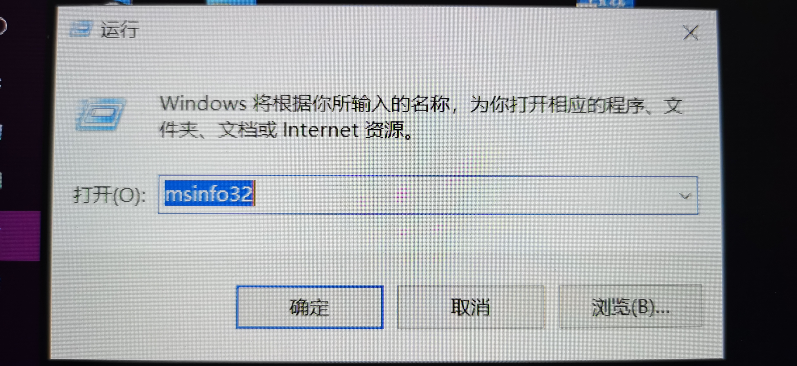
结果如图所示:UEFI
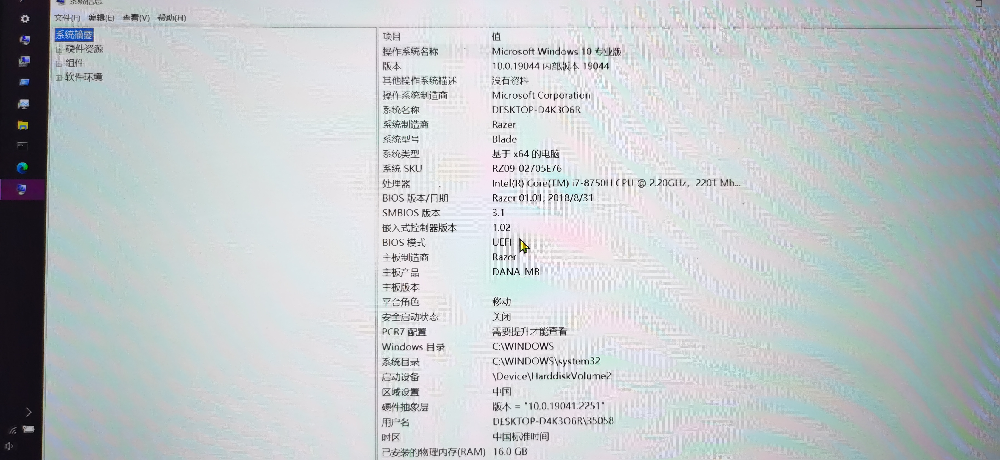

### 系统配置
CPU
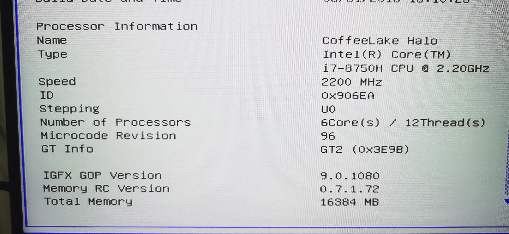
GPU
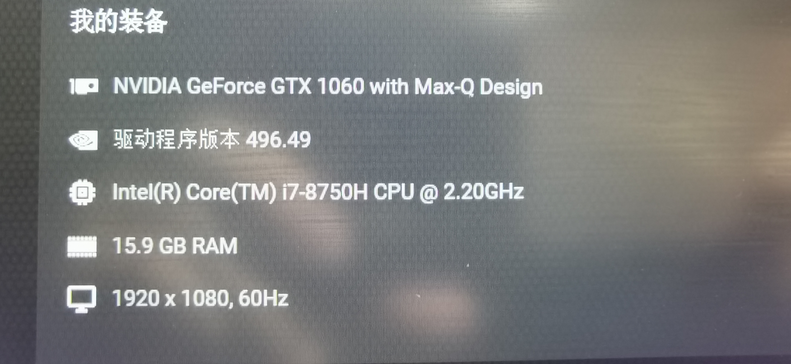

### secure boot 关闭
开机时按F2进入BIOS
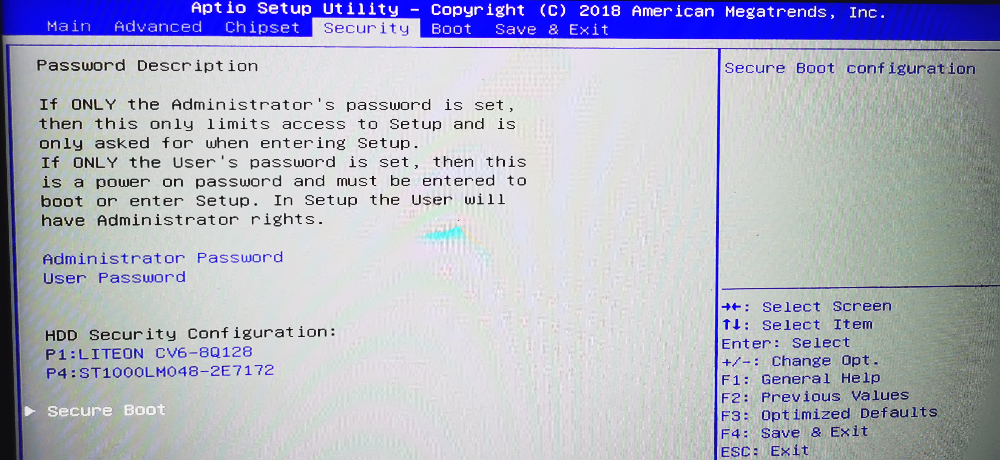
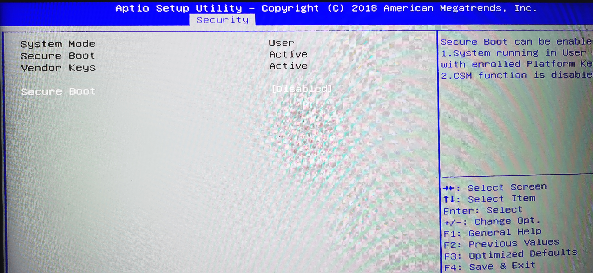


## 换源
[ubuntu换源](https://blog.csdn.net/qq_45878098/article/details/126037838)

如果出现　Hash Sum mismatch Hashes of expected file
则删除　
sudo rm -rf /var/lib/apt/lists/*
sudo apt clean

然后换源，我是从中科大换成阿里解决的

## 卸载无用软件
```
sudo apt remove thunderbird*
sudo apt remove firefox*
sudo apt remove libreoffice-common
sudo apt remove libreoffice*
sudo apt remove rhythmbox*
```
感觉22.04的libreoffice还行，就没卸载

卸载相关小游戏

# 后续安装

## 终端补全忽略大小写
```bash
# 在/etc/inputrc中添加使全局所有用户生效
echo 'set completion-ignore-case on' >> /etc/inputrc

# 对于个别用户，则可以在用户home目录下添加
echo 'set completion-ignore-case on' >> ~/.inputrc
```

如果显示权限不够，就直接 sudo gedit 打开文件改

## 输入法
[在Ubuntu20.04中安装中文输入法](https://zhuanlan.zhihu.com/p/529892064)

凑活用ibus也行

对于sougou，需要先安装系统fcitx，按照官网教程一步步来即可

[搜狗输入法linux 官方安装指南](https://shurufa.sogou.com/linux/guide)

sudo apt-get install fcitx-bin
sudo apt-get install fcitx-table 

没事多重启就行

## 快捷键设置

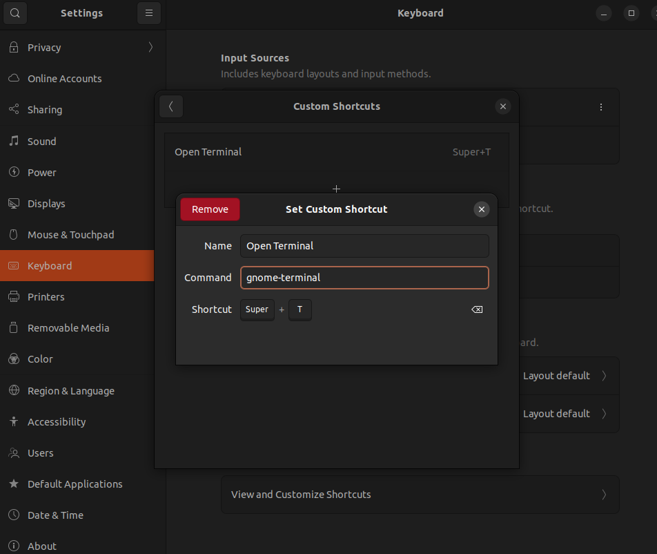
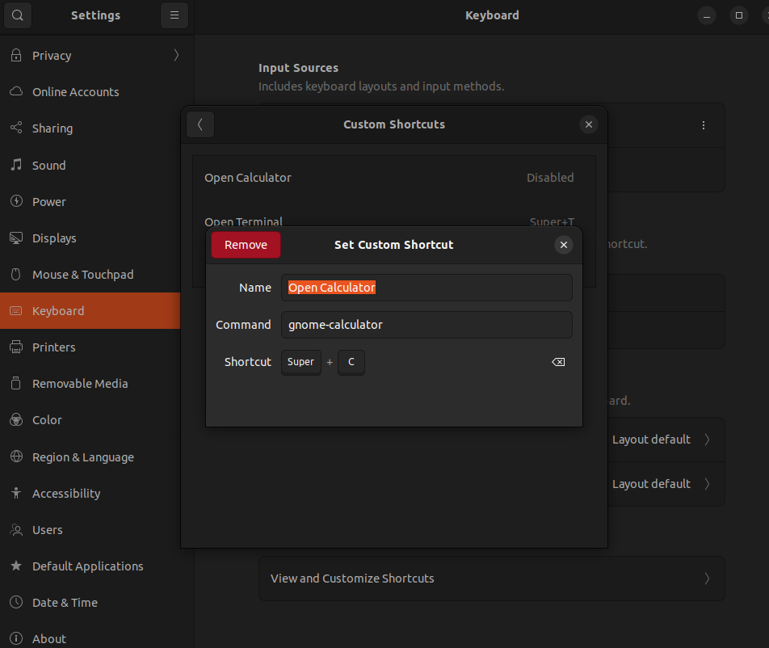
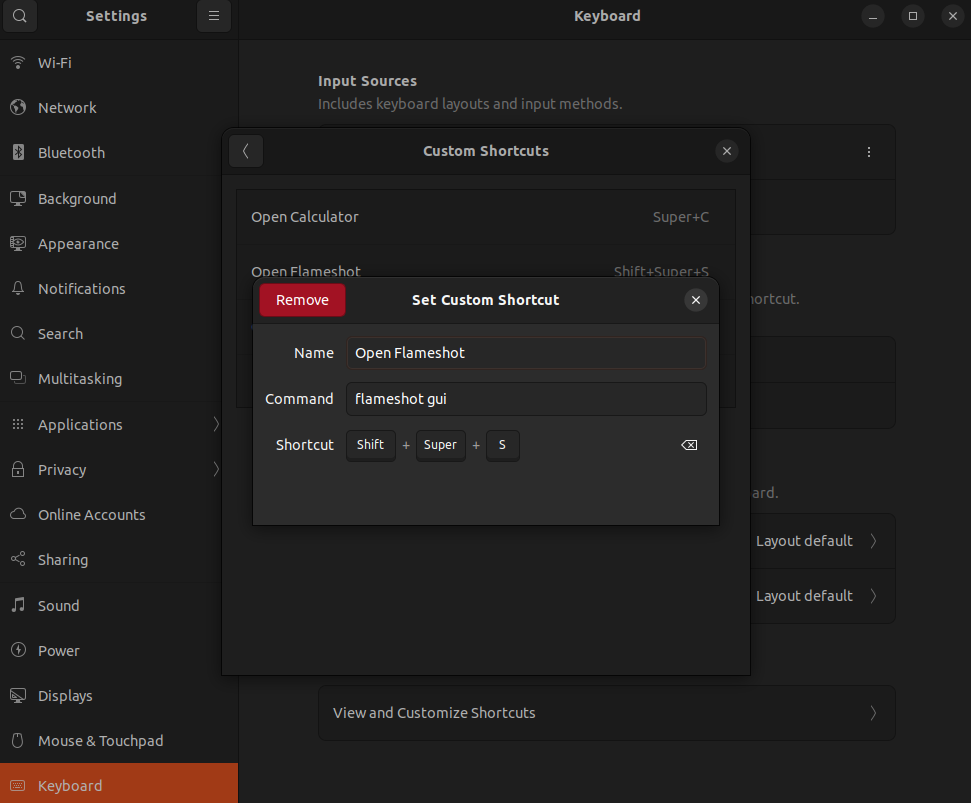


## 显卡驱动
[NVIDIA CUDA Toolkit Release Notes　官网](https://docs.nvidia.com/cuda/cuda-toolkit-release-notes/index.html)

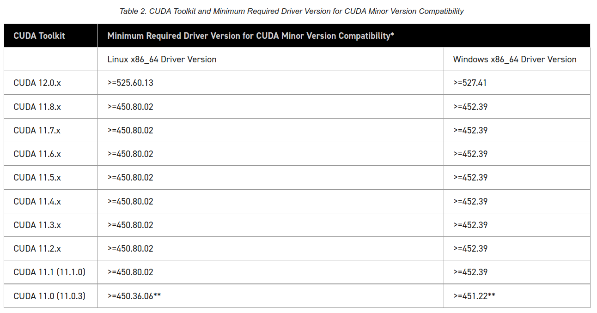

[INSTALL PYTORCH 官网](https://pytorch.org/)

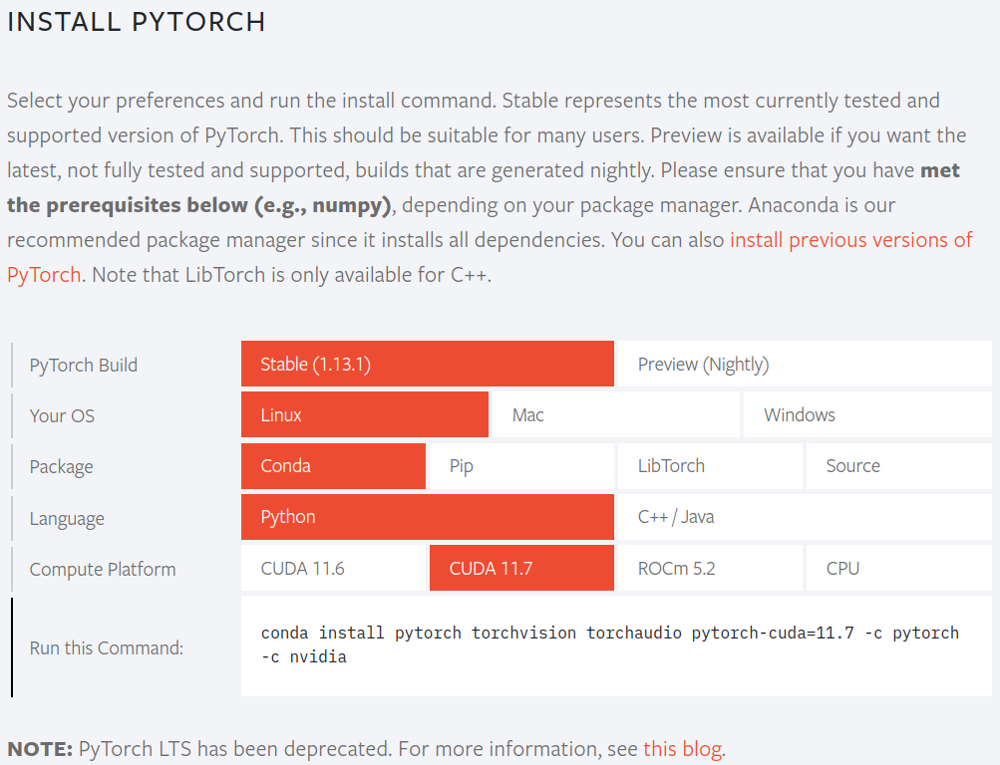

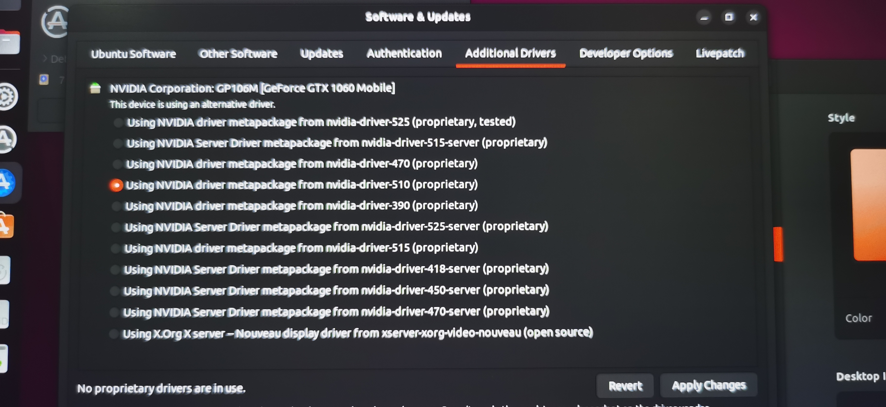

因为pytorch我会安装最新的11.7，所以这里选择了470 
P.S.本来想选择510但是直接不允许我下载，遂放弃，这个方法不一定行

[NVIDIA显卡的Ubuntu驱动程序安装方法](https://www.bilibili.com/video/BV1wY411p7mU/)

[ubuntu无法添加PPA的解决办法](https://blog.csdn.net/leviopku/article/details/101060133)
[联想拯救者Y7000安装NVIDIA显卡驱动](https://www.freesion.com/article/58521373000/)

### 个人电脑操作

**最终解决方案 driver+cuda+cudnn**

[安装显卡驱动、CUDA、cuDNN及其简单介绍](https://www.bilibili.com/video/BV16Y411M7SC)
[Ubuntu安装CUDA+cuDNN](https://blog.chintsan.com/archives/561)

选用了22.04，对应的ROS2版本为Humble[ROS2官网 查看支持版本](https://www.ros.org/reps/rep-2000.html#rolling-ridley-june-2020-ongoing)

最终方法：命令行直接　sudo apt install nvidia-driver-470 (515也行)，装完后重启，nvidia-smi显示cuda为11.4 (515这里显示cuda为11.7)　　**至此driver安装完成**，电脑应该会出现一个 NVIDIA X Server Settings 的软件

由于需要装pytorch1.13，所以需要更新为11.7

如果要安装11.5使用sudo apt install nvidia-cuda-toolkit

[各个版本CUDA下载地址](https://developer.nvidia.cn/cuda-toolkit-archivehttps://developer.nvidia.cn/cuda-toolkit-archive)
[CUDA Toolkit 11.7 官方Downloads](https://developer.nvidia.com/cuda-11-7-0-download-archive)

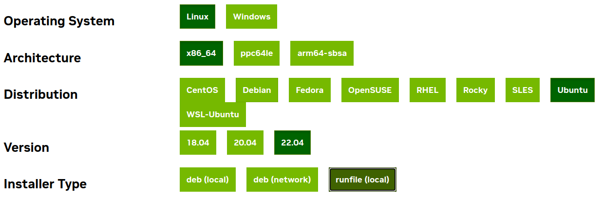

可以选择runfile或者deb，==在wget时候记得将.com后缀改为.cn可以大大提高下载速度==(我这里快十倍多)

runfile命令较少，deb命令较多

**runfile方式**，个人感觉类似图形化安装

可能需要赋予可执行权限

```shell
# 原命令
wget https://developer.download.nvidia.com/compute/cuda/11.7.1/local_installers/cuda_11.7.1_515.65.01_linux.run
# com->cn
wget https://developer.download.nvidia.cn/compute/cuda/11.7.1/local_installers/cuda_11.7.1_515.65.01_linux.run
sudo sh cuda_11.7.1_515.65.01_linux.run
```

耐心等待一会儿，一开始会出现这个界面

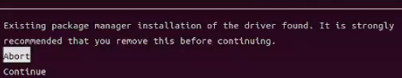

如果之前安装了驱动，可以在下面的窗口取消勾选

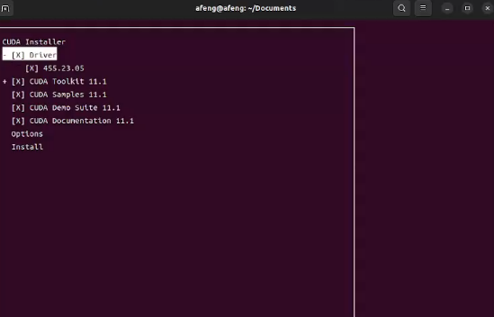

应该是安装到了 /usr/local/cuda-11.7

重启，然后可以 cd /usr/local/cuda-11.7/bin ，随后 ./nvcc -V 即可看到相关输出

**deb方式**

按照官网下面的命令运行即可运行，安装后重启
```
wget https://developer.download.nvidia.com/compute/cuda/repos/ubuntu2204/x86_64/cuda-ubuntu2204.pin
sudo mv cuda-ubuntu2204.pin /etc/apt/preferences.d/cuda-repository-pin-600
wget https://developer.download.nvidia.com/compute/cuda/11.7.0/local_installers/cuda-repo-ubuntu2204-11-7-local_11.7.0-515.43.04-1_amd64.deb
sudo dpkg -i cuda-repo-ubuntu2204-11-7-local_11.7.0-515.43.04-1_amd64.deb
sudo cp /var/cuda-repo-ubuntu2204-11-7-local/cuda-*-keyring.gpg /usr/share/keyrings/
sudo apt-get update
sudo apt-get -y install cuda
```

打开后，nvidia-smi发现把我之前的470更新为515.65.01，看看后续能不能正常使用

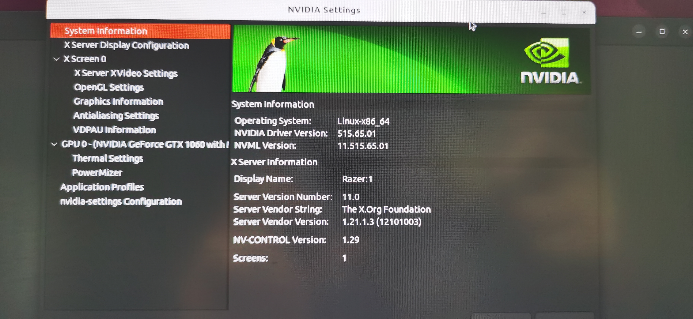

进入cuda安装路径中的bin目录，执行./nvcc -V，进行查看，当然也可以nvidia-smi

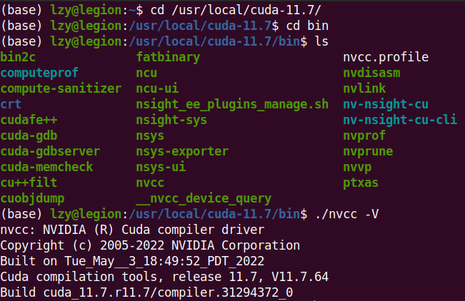

如果想要在任何路径下的终端使用nvcc -v命令，则需在~/.bashrc中加入两行
```
export PATH=/usr/local/cuda-11.7/bin:${PATH}
export LD_LIBRARY_PATH=/usr/local/cuda-11.7/lib64:${LD_LIBRARY_PATH}
```

然后新开一个终端，输入nvcc -V即可看到相同结果　**至此cuda安装完成**

对于cudnn安装，直接官网下载安装包，随后sudo dpkg -i xxx即可

随后根据命令行提示，可能还需安装加一个 gpg key

**pytorch**

安装pytorch直接pip3安装也行，记得添加豆瓣镜像　-i https://pypi.douban.com/simple/

```python
# 使用 PyTorch 查看 CUDA 和 cuDNN 版本
import torch
print(torch.__version__)
print(torch.version.cuda)
print(torch.backends.cudnn.version())
```
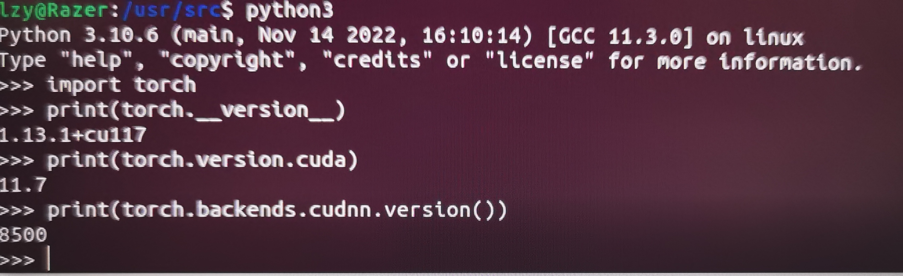


**启动时**
进入启动项时，选中第一行Ubuntu，按[e]，编辑启动项参数

找到linux开头的一行，去到该行末尾(可能该行会被分为两行显示)，输入空格+nomodeset

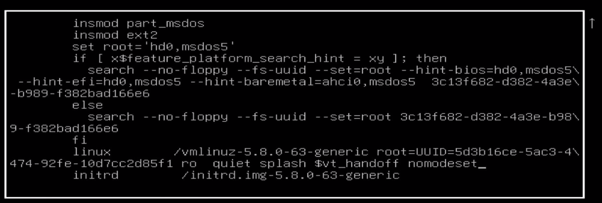

输入ctrl+x，保存并启动，进入系统后，修改黑名单

sudo gedit /etc/modprobe.d/blacklist.conf

末尾添加
blacklist nouveau

最后命令行输入命令生效黑名单
sudo update-initramfs -u

**安装时**
如果提示没有make gcc等等，可以先安装ROS可能顺便解决，或者自己手动安装即可，然后一路yes即可

## 快捷方式
.desktop文件

记得添加可执行权限 chmod +x

[ubuntu下应用图标的更改](https://blog.csdn.net/thinszx/article/details/107590118)
.png也可以

```
(base) lzy@legion:/tmp$ sudo find /usr/share/ -name "meshlab*.desktop"
/usr/share/applications/meshlab.desktop

(base) lzy@legion:/tmp$ sudo gedit /usr/share/applications/meshlab.desktop
```

## 软件列表

### 软件包

**.deb**
edge浏览器
vscode
drawio
dbeaver
wps
eudic 欧陆词典
每日英语听力
baidu net disk
linux qq
Feishu
netease cloud music
tencent meeting
sunlogin client
sougou input method [Ubuntu搜狗输入法安装指南](https://shurufa.sogou.com/linux/guide)

**apt install**
git
python3-pip
meshlab
gthumb
flameshot (截图软件，可以添加快捷键)
timeshift备份 [Timeshift 系统备份和还原](https://blog.csdn.net/zjy1175044232/article/details/124248454)  [Timeshift 官网](https://linuxmasterclub.com/timeshift/)

fcitx
1. sudo apt-get install fcitx-bin
2. sudo apt-get install fcitx-table 

新立得包管理 sudo apt install -y synaptic
net-tools 用于ifconfig
tree

**其他**
VLC
gthumb
clash
暴力猴+Bilibili插件[强大的哔哩哔哩增强脚本](https://github.com/the1812/Bilibili-Evolved)

## ROS
鱼香ROS一键安装指令
wget http://fishros.com/install -O fishros && . fishros


## miniconda
[关于conda环境的配置，看这一篇就够了](https://www.bilibili.com/read/cv8956636)
[使用Miniconda管理隔离虚拟Python环境](https://www.bilibili.com/video/BV1Mv411x775)

输入 conda config 就会自动在用户目录下生成 .condarc 文件


## 微信

[deepin-wine 微信](https://www.bilibili.com/video/BV1Vb4y1r79y)


